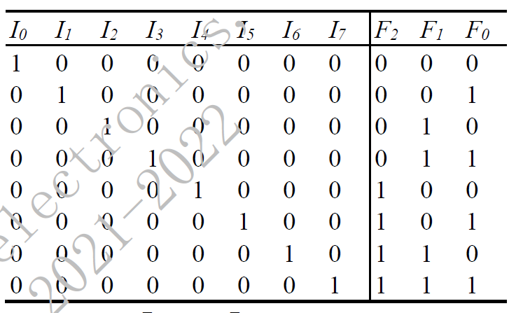
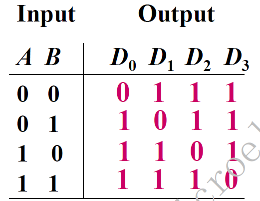
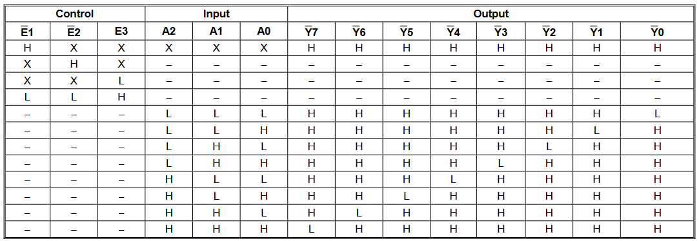
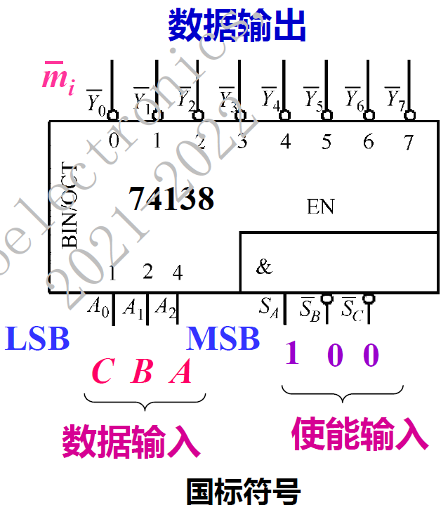
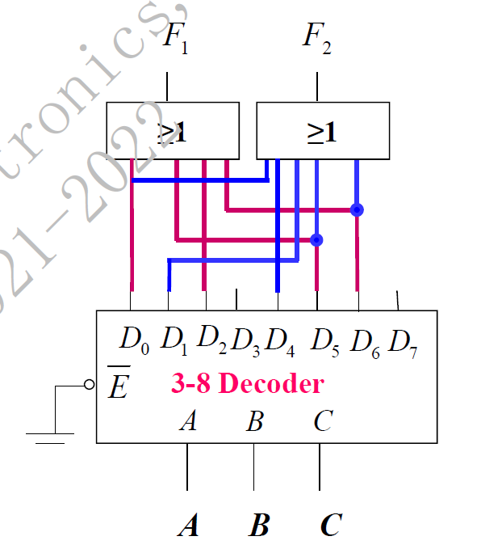
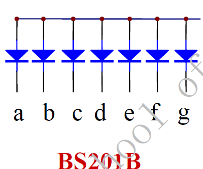

# 电路设计从入门到弃坑22【数字编码与译码电路】

组合逻辑电路的基本应用之一就是数字编码和译码电路

## 编码器

将信号或数据编制、转换为可用于通讯、传输和储存的形式的设备称为**编码器**

编码器可以将输入信号转换为二进制代码

常见的编码器一般都是**二进制编码器**，但是也存在**二-十进制编码器**

如果按照优先权进行分类，可以分出没有优先权级的**普通编码器**和**优先编码器**

一般而言，N个不同的信号，至少需要n位二进制数编码。N和n之间满足
$$
2^n \ge N
$$

### 8-3线二进制普通编码器

**真值表**

将输入的8线$I_0$到$I_7$编码成二进制数$F_2F_1F_0$

使用下面的电路即可实现

## 译码器

将输入的二进制代码转换成对应输出信号或另一种形式代码的器件就是**译码器**

常见的译码器分为二进制译码器、码制变换译码器、显示译码器

**二进制译码器**会将二进制代码转换成一一对应的输出高、低电平信号，n位二进制代码可以输出m（$m \le 2^n$）个信号。对应输入的一组二进制代码有且仅有一个输出端为有效电平，其余输出端为相反电平

二进制译码器可以看作二进制编码器的对偶器件

一个2-4线低电平有效译码器的真值表如下，可以看到输入码实际，第几号输出就是有效电平0，其他输出无效电平1

### 74138译码器

这是74hc138译码器的datasheet

它的国标输入和datasheet上的封装图不完全一样

ABC是它从低位到高位的输入，对应上面的一排输出Yi。除此之外还有三个使能端，只有分别置为1、0、0时才能正常工作（注意到只有Sa是高电平有效的）。*可以利用这三个使能端进行74138功能扩展*

### 使用译码器实现逻辑函数

在使用译码器时常常遇到用译码器实现某个逻辑函数的情况，这时候应该先将要实现的逻辑函数化为**标准与或式（最小项）**，比如我们有
$$
F_1(A,B,C)=\sum(0,2,5,6)
$$

$$
F_2(A,B,C)=\sum(0,1,4,5,6)
$$

于是在**3-8译码器**输出端放置两个或门，分别输出F1和F2

然后对应将0，2，5，6四个输出端引到F1或门，将0，1，4，5，6五个输出端引到F2或门，如下所示

这样就能使用3-8译码器实现逻辑函数了

对于低电平有效的74138，可以选择使用**与门+最大项编号**的方法，也可以使用**与非门+最小项编号**，总体流程都和上面类似

> **高电平有效译码器+或门+最小项编号**（与或式）
>
> **低电平有效译码器+与门+最大项编号**（或与式）
>
> **低电平有效译码器+与非门+最小项编号**（与或式）
>
> 都可以实现任意**3输入**多输出逻辑函数

### 3-8线译码器的使能端扩展

如上图所示，将前级74138的Sa和后一级的Sb相连作为D3输入，将Sb、Sc与后一级Sc相连后使能，把后一级的Sa置位（使能）即可实现级联扩展，得到**4-16线译码器**

### BCD转十进制译码器

顾名思义，这是将BCD码转换成十进制码的译码器

常见型号有4-10线译码器7442（低电平有效）

### 7段数码管（7-seg）

在数字电路调试中非常常见的显示器，根据连接方式不同可分成**共阴极**和**共阳极**两种

> 共阴极：二极管的阴极共地（一般用尾号A表示）
>
> 
>
> 共阳极：二极管的阳极共源（一般用尾号B表示）
>
> 

使用常见的7448译码器即可驱动

7448是4线输入、7线输出的七段数码管驱动IC，高电平有效，可以用来驱动共阴极管

Ai确定的输入是几（二进制），对应的数码管显示就是几（十进制）

