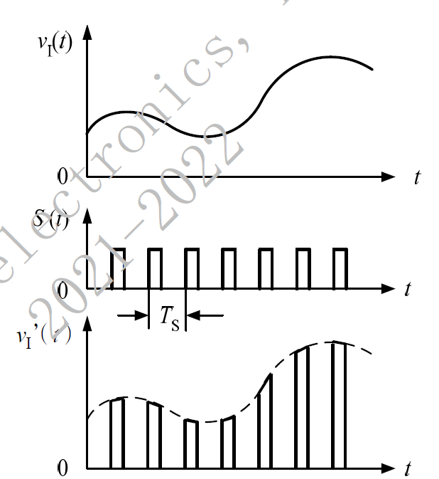
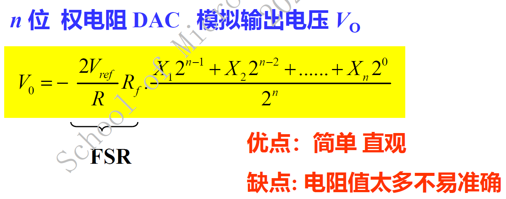

# 电路设计从入门到弃坑26【数模混合电路基础】

## ADC

A/D转换器的**分辨率**用输出二进制数的位数表示，位数越多，误差越小，转换精度越高。

**转换速度**是指完成一次转换所需的时间

在理想情况下，所有的转换点应当在一条直线上。**相对精度**是指实际的各个转换点偏离理想特性的误差。

ADC工作的四个步骤

1. 采样
2. 保持
3. 量化将采样—保持后的信号幅值转化成某个最小数量单位（量化阶梯/间隔）的整数倍
4. 编码：将量化后的数值用代码表示出来

确保满足香农采样定理$f_s \ge 2 f_m$

## DAC

将数字量转化成与其成正比的模拟量

最小分辨率电压$V_{LSB}$：两个相邻数码转换输出的电压差，可用最低有效位1LSB表示
$$
V_{LSB}=\frac{1}{2^n}FSR
$$
最大输出电压$(2^n-1)V_{LSB}$

### 权电阻型DAC

又称为电阻网络DAC

### R-2R梯形DAC

