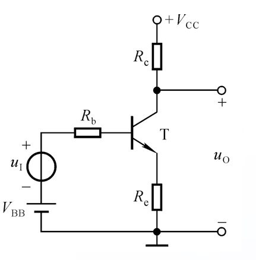
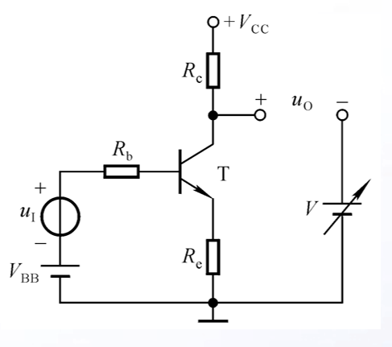
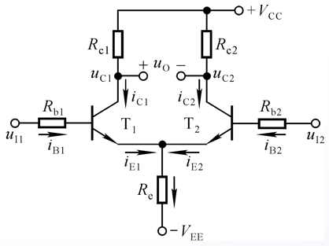
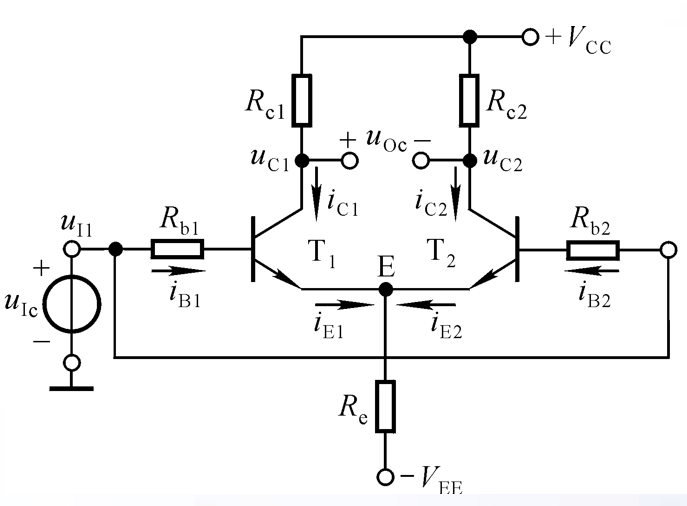
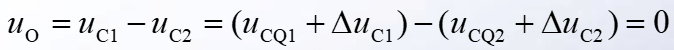
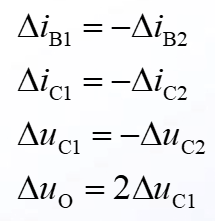
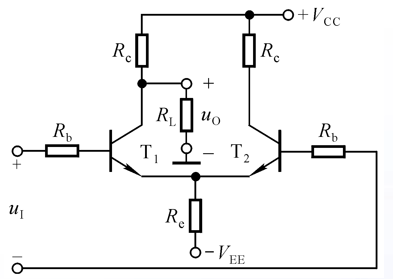
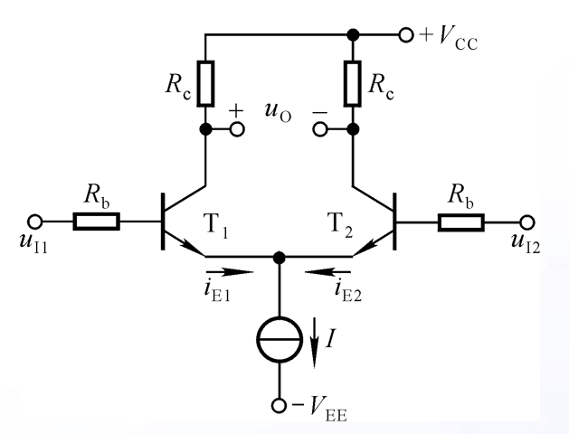
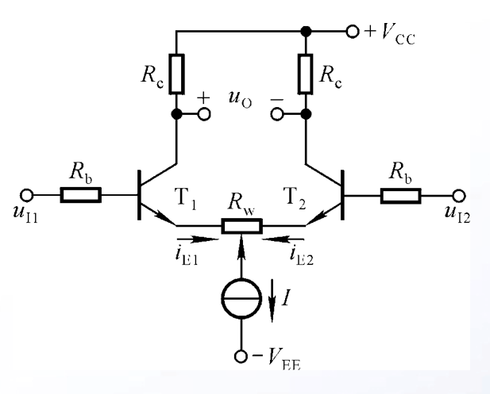
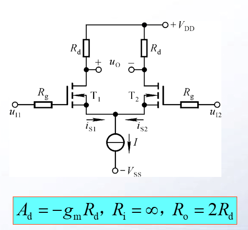

# 电路设计从入门到弃坑5【差分放大电路】

之前的博文里介绍了基本放大电路的拓扑和分析方法，并且利用这些电路构造出多级放大电路；多级放大器可以解决大多数信号处理中产生的问题——但是很多晶体管本身的问题并不能通过组合放大器来解决，而且一般的放大器组合以后很可能还会导致一些新问题出现（比如交越失真），需要进一步改进。在放大器出现早期，由于当时技术缺陷，晶体管受温度影响非常大，面对这种情况，很多电路都会使用外电路补偿，而随着控制理论的发展，差分放大电路应运而生，很大程度上解决了晶体管受温度影响大的问题

## 零点漂移

**零点漂移**：放大电路中输入电压为0，但是输出电压不为0的现象

产生**原因**：

* 温度变化
* 直流电源波动（偏置电流不稳定）
* 元器件老化

主要原因是**晶体管对温度敏感**，因此零点漂移（零漂）也称为温度漂移（温漂）

克服温漂的方法：**引入直流负反馈**，**温度补偿**。

为了解决零点漂移的问题，人们构造了差分放大电路

## 差分放大电路

基本放大电路是这样的：

信号从Rb输入三极管，而当发生零点漂移时，Rb相当于短路，而uo处相当于存在一个直流激励

自然可以想到在uo处加入一个电流源（或用电压源替代）来消除零点漂移，如下所示

考虑到这个电压源要跟随三极管的性质变化而变化，显然无法实现，于是考虑从三极管本身的性质入手

假设存在一个和T完美对称的三极管，把它组成基本放大电路后接到uo的负极，于是就可以等效替代这个电压源了，如下图

显而易见，Re1和Re2还可以用一个电阻Re=Re1//Re2来等效，于是我们就得到了教科书里面常见的**差分放大电路拓扑**，如下所示：

其中两个三极管放大电路的参数抑制，因此外电路支路量也一致，并且**等于其中一个三极管放大电路支路量的2倍**
$$
I_{BQ1}=I_{BQ2}=I_{BQ}\\
I_{CQ1}=I_{CQ2}=\frac12 I_{C}\\
I_{EQ1}=I_{EQ2}=\frac12 I_{E}\\
U_{CQ1}=U_{CQ2}=U_{CQ}\\
u_{OC}=U_{CQ1}-U_{CQ2}=0\\
$$
其中Uoc指*共模信号*（见下文解释）

为了对这个电路放大的信号进行区分，定义两类信号

* 共模信号Uc（Common）：大小相等、极性相同的信号
* 差模信号Ud（Difference）：大小相等、极性相反的信号

需要注意，这里说的极性指的不只是信号的正负极，还可以理解成“信号导数的符号”

> 当Ua、Ub具有相同增减性时（Ub增大，Ua也增大），二者就是一对共模信号；相反，当Ua、Ub增减性相反时，二者就被视为一对差模信号

特别指出：共模信号如果大小不等，计算时一般使用两个信号的平均值$\frac{A+B}{2}$；差模信号则使用两个信号之差的平均$\frac{|A-B|}{2}$

直观上看，零点漂移就是与晶体管**本身**有关的共模信号。差分放大电路可以有效抑制这种共模信号，并将外加到Ui1、Ui2上的差模信号正常放大。

> 这里的表述不严谨，相关等效推理请看下面的“反馈”介绍

电路左侧Ui1称为同相输入端，右侧Ui2则是反相输入端——对于上面的基本差分放大电路，这个定义是可以左右互换的

另外有一个不引人注意的问题：差分放大电路需要引入*负电源*——为了放大完整的交流信号，这是必要的，并且负电源应该和正电源对称。当然这就使得差分放大电路的应用存在一定难度。不过在之后我们会介绍修复这个问题的方法

**这个电路只能工作在理想状态下**

> 现实中没有两个一模一样的三极管，如果有，那就是测量精度不够高
>
> 在人类能造水滴之前，大概是没办法生产出这样的晶体管的（笑）

但是根据这个电路，我们可以有效地克服零点漂移、抑制共模信号、放大差模信号

它可以作为实际差分放大电路的理想模型使用；而实际使用的差分放大电路就是根据它设计出来的。在介绍实际使用的差分放大电路之前，我们还应该仔细讨论一下**长尾式差分放大电路**的性质，并引入一些新概念

## 长尾式差分放大电路

> 因为Re就像是一个长尾巴所以上面的基本差分放大电路被称为长尾式差分放大电路

不管什么放大电路，归根结底都可以用之前说的放大电路分析流程去套用。首先来看静态分析

差分放大电路的静态分析体现了它的*共模抑制效应*

在这里假设Uic是一个输入的共模信号（包括且不限于零漂、线阻导致的信号偏移、雷击导致的感应电流），因为共模信号对整个电路起作用，而且我们要分析的是共模信号对输出的影响，所以在这里等效为两输入端接到一个电压源的同极

显而易见，

并且

也就是说当**两个三极管完美对称时，共模放大倍数$A_C=\frac{\Delta u_{Oc}}{\Delta u_{Ic}}=0$**，共模信号得到了抑制

特别指出这里的共模信号：
$$
u_{I1}=u_{I2}=u_{Ic}
$$
上面的推导看似很完美，但是只要你想起这篇文章的开篇就能知道一个问题：温漂是三极管内部的问题，怎么把它等效成一个外部问题？

这就是Re发挥的*负反馈*作用

首先引入一个名词：**反馈**（Feedback）。反馈指的是将系统的输出引回输入的过程，Re就将温度变化引起的各种信号变化等效为共模信号。当温度升高，会导致三极管CE结压降减少，相对应Ic会增大，进而导致Ue电位升高（因为Re分压把Ue的电位抬高了，这就是Re发挥的作用），导致基极电流Ib减少，于是Ic=βIb，Ic就又小了。经过这套流程，Re相当于把Ic反馈到了两管的b极（正规说法就是电流负反馈，具体解释会在后面集成运放的部分讲述）

接下来再进行动态分析，如下图所示：

动态分析主要关注信号输入对信号输出造成的影响，信号输入是典型的一对差模信号，具有以下关系：
$$
u_{I1}=-u_{I2}=u_{Id}/2
$$
直接用一堆带Δ的量表示差模信号，如下图所示：

可以推知：$\Delta i_{E1}=-\Delta i_{E2}$，即Re对差模信号无反馈作用

差模放大倍数
$$
A_d=\frac{\Delta u_{Od}}{\Delta u_{Id}}=-\frac{\beta (R_C // \frac{R_L}{2})}{R_b+r_{be}}
$$
其中$R_i=2(R_b+r_{be})$，$R_O=2R_C$

## 差分放大电路的接法

经过上述分析，已经能够基本得到差分放大电路的总体拓扑和原理，下面先介绍一下它的几个参数

* 共模抑制比$K_{CMR}=\frac{A_d}{A_c}$：表述差分放大电路放大差模信号和抑制共模信号的能力

    当差分放大电路参数理想对称时，$K_{CMR}=\infin$

    **该参数越大，差分放大器性能越好**

* 差模放大倍数$A_d$

* 共模放大倍数$A_c$

* 输入电阻$R_i$

* 输出电阻$R_o$

上面这些参数也会在之后介绍的运算放大器中出现，其中共模抑制比、差模、共模放大倍数是差分放大电路独有的参数

### 差分放大电路具有四种基本接法

1. 双入单出

    

    基本参数变化情况如下：

    输入回路没有变化，Ieq、Ibq、Icq和双端输出时候一样，但是输出端发生了变化：
    $$
    U_{CQ2}=V_{CC}-I_{CQ}R_C\\
    U_{CQ1}=\frac{R_L}{R_C+R_L} V_{CC}-I_{CQ}(R_C//R_L)  \ \ \ \ 这里出现了变化
    $$
    同时，差模信号下
    $$
    A_d=-\frac12 \frac{\beta(R_C //R_L)}{R_b+r_{be}}\\
    A_c=-\frac{\beta(R_C //R_L)}{R_b+r_{be}+2(1+\beta)R_e}
    $$
    需要特别注意：

    双端输出时的Ad**不是**单端输出时的两倍

    单端：$A_d=-\frac{\beta (R_C // \frac{R_L}{2})}{R_b+r_{be}}$

    双端：$A_d=-\frac12 \frac{\beta(R_C //R_L)}{R_b+r_{be}}$

2. 双入双出

    就是上面作为例子介绍的最基本接法

    不再赘述

3. 单入双出

    对于单端输入的差分放大电路，**输入差模信号的同时总是伴随着共模信号输入**
    $$
    u_{Id}=u_I\\
    u_{Ic}=u_I/2
    $$
    

    于是
    $$
    u_O=A_d u_I+A_C \frac{u_I}{2} +U_{OQ}
    $$
    输出=差模输出+共模输出+静态偏置

4. 单入单出

    单端输入单端输出则融合了上面所说的输入输出特点：

    * 双端输入时**无共模信号输入**；单端输入时**有共模信号输入**
    * 
    * 

这就是差分放大电路在接入时的特点

需要注意：双端输出具有比单端输出更优秀的差分特性，所以尽可能使用双端输出；单端输入则让一部分共模信号输入放大电路，在某些场合是必要的，不能够一味否定

## 改进的差分放大电路

根据上述计算，Re越大，每边漂移越小，共模负反馈越强，那么单端输出时的Ac越小，Kcmr越大，差分放大器性能越好；但是Re越大，所需Vee越大；同时三极管很难做到完美对称，中间损失的部分必须使用更强的Re反馈来弥补。综上所述，为了让差分放大电路能在现实中得到应用，我们需要趋于无穷大的Re和合适的Ieq

于是**可以用电流源取代Re**

一个恒流源的等效电阻为无穷大，而且能为三极管提供合适的偏置电流

在实际应用中往往使用**镜像电流源**电路来实现，相关内容会在后面的运算放大器结构部分介绍，这里简单看一下它的理想电路模型

为了弥补两个三极管不对称带来的误差电流，还可以在电流源和三极管e极之间接入一个**调零电位器**Rw

其取指应当稍大，这样可以减少损耗电流

引入这个电位器后，可以通过调节它的中点位置来平衡两边三极管e极流过的电流，使得差分电路完美对称，给电路带来以下参数变化：
$$
A_d=-\frac{\beta R_C}{R_b+r_{be}+(1+\beta)\frac{R_W}{2}}\\
R_i=2(R_b+r_{be})+(1+\beta)R_W
$$
对于集成电路实现的差分放大电路，因为制作MOSFET比较方便，可以使用MOSFET制造差分放大电路，如下图所示

也有着不错的效果
