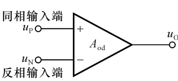
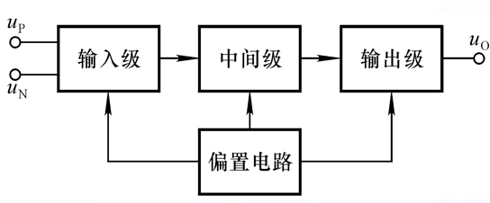

# 电路设计从入门到弃坑6【集成运算放大器简介】

集成电路是以半导体单晶硅为芯片，采用专门的制造工艺，把晶体管、场效应管、二极管、电阻和电容等元件及其之间连线组成的完整电路制作在一起，使之具有特定功能的电路技术

集成运放是一种典型的模拟集成电路，集成运放具有以下基本特征：

* 级间直接耦合
* 能够方便制造对管（一致性良好的对偶晶体管），因此广泛采用差分放大电路和电流源电路
* 能够方便地实现复杂电路，使得性能良好
* 使用有源元件来替代难以集成的无源器件，甚至会使用大量晶体管替代电阻、电容
* 多采用复合管工艺

**实际集成运放的性能非常高**，以至于常常可以近似为理想运放，分析外特征和电气特性时也常常使用理想运放模型进行等效

理想运放即理想运算放大器，就是将集成运放的各项技术指标理想化得到的电路模型，具有以下指标：

* 开环差模电压增益$A_{od}=\infin$
* 差模输入电阻$r_{id}=\infin$
* 共模抑制比$A_{od}=\infin$
* 输出电阻$r_O=0$
* 输入失调电压、电流、零漂均为0

一言以蔽之，*输入电阻无穷、输出电阻为0、开环电压放大倍数正无穷、共模抑制比正无穷的差分放大器*

可以推导出它的重要特征：

* 伏安特性是阶跃函数，i<0时输出$-U_{OM}$，i>0时输出$+U_{OM}$，在i=0时发生跃变
* 虚短：两输入端电势相等
* 虚断：两输入端节点流向运放输入端的电流为0

上面三个结论会在后面的运放应用部分详细梳理，这里请先当作背景知识记一下

实际的集成运放还是和理想运放有些区别。

一个是它的工作区域分为线性区和非线性区，实际运放的放大倍数无法达到正无穷，因此它的非线性区*相对*较宽

> 实际通用运放的$A_{od}$能够达到几十万倍，因此是“相对较宽”
>
> 这也导致集成运放工作在线性区时的最大输入电压$u_P-u_N$值仅为**uV**级别，需要使用反馈机制才能让它工作在线性区

本篇的重点在于集成运放的内部结构，一个典型运放的结构框图如下所示：

其中，

* 偏置电路：为各级放大电路设置合适的静态工作点。采用**电流源电路**（电流镜）构造，为晶体管**提供偏置电流**
* 输入级：又称前置级，多采用差分放大电路。要求**输入电阻**Ri**大**，**差模放大倍数**Ad**大**， **共模放大倍数**Ac**小**，**输入端耐压高**。
* 中间级：又称主放大级，多采用共射放大电路。要求**有足够的放大能力**。
* 输出级：又称功率级，多采用准互补输出放大电路。要求**输出电阻**Ro**小**，**最大不失真输出电压**Uom尽可能大。

下面来单独讨论各级结构

## 输入级

输入级常常（或者是一定）使用差分放大电路拓扑，目的有三个：

* 抑制共模信号，防止零漂
* 提高差模放大倍数，增大输入电阻
* 

## 电流源电路

## 放大级

## 直接耦合互补输出

# 集成运放

