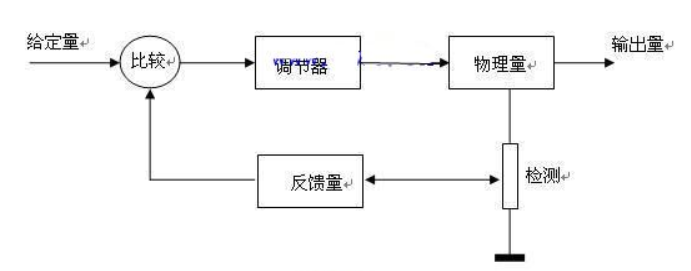
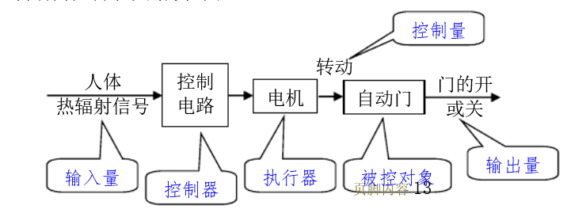

# 电路设计从入门到弃坑9【电路中的反馈】

**放大电路输出量的一部分或全部通过一定的方式引回到输入回路，影响输入，称为反馈**

## 反馈的分类和判断

对于反馈，最基本的分类方式就是根据反馈调节信号的方向：是*增强*输出信号还是*削弱*输出信号，从反馈的结果判断，**凡反馈的结果使*输出量*的变化减小的为负反馈，否则为正反馈，或者凡反馈的结果使*净输入量*减小的为负反馈，否则为正反馈**；此外，一个反馈回路总有输入端和输出端，可以将一个具有单输入单输出端的简单反馈回路看作一个单输入单输出反馈网络。**如果反馈输入端与电路系统输出端直接相连，则称为电压反馈；如果反馈输入端与电路系统输出端不直接相连**（比如隔了一个电阻）**，则称为电流反馈；如果反馈输出端与电路系统输入端直接相连，则称为串联反馈；如果反馈输出端与电路系统输入端不直接相连，则称为并连反馈**

上面的定义并不是反馈分类的真正定义，但是对于一般的反馈回路使用它们进行判断已经相对准确了

除了针对*反馈调节结果*、*反馈输入端形式*、*反馈输出端形式*进行分类，还可以区分直流反馈和交流反馈：**直流通路中存在的反馈称为直流反馈，交流通路中存在的反馈称为交流反馈**

或者可以从系统的分割角度分类：**只对多级放大电路中某一级起反馈作用的称为局部反馈，将多级放大电路的输出量引回到其输入级的输入回路的称为级间反馈（或称总体反馈）**

如上图中R3引入局部反馈，R4引入级间反馈

## 深入了解反馈环路

没有反馈的电路常被称为**开环**网络，如下图所示

这就是一个常见的电压比较器电路，它的输入和输出部分相互独立

而引入了**反馈网络**的电路被称为**闭环**网络

无论是放大电路还是其他的电机控制电路、传感器控制电路，抑或是更抽象的控制算法，甚至是一个门把手，都可以视为一套**控制系统**，**输入量**（模拟信号、变量和人手）会进入这个控制系统，控制系统对信号进行处理后变成**输出量**，对物理世界或数字信号的控制会在这个过程中完成

一般的控制系统都是开环系统：门把手接收来自人手的力学量输入，通过把手轴把垂直的力转化成力矩，再让力矩通过弹簧转化成横向的力传递给门闩，最后门闩输出一个横向的力——门就打开了，在这个过程中不存在反馈的过程，所以说手的动作并不会因为门打开的速度太慢而加快；如果在此之上引入“人眼”这个“反馈”，就不一样了：如果人手的力太小，不足以打开门，人眼从门闩“接收到门未打开的信号”，于是加大手的力度，使得门能更快打开，这就形成了一个闭环系统

人眼在这个过程中的“观察”可以被总结成**采样**

换一个例子：自动门的控制系统方框图如下所示

这就是一个典型的开环控制系统

对应于放大电路，就是具有相似控制过程的**开环放大电路**。可以联想到基本放大电路都是开环的放大电路，一个独立的运放也是开环的

现在我们从广义控制系统回到放大电路中，可以发现**放大电路中的输入量和输出量总是电信号，控制器和执行器都由集成运放或分立半导体放大电路实现，被控对象则是电信号的参数**。

> **放大电路输出量的一部分或全部通过一定的方式引回到输入回路，影响输入，称为反馈**

再回头看反馈的定义，可以发现：

* 放大电路主体拓扑决定控制器和执行器的实现
* 反馈电路主体拓扑决定反馈回路的实现
* 直流和交流反馈类型确定了输出量的形式
* 串联和并联反馈类型确定了输出量返回输入回路的多少
* 电压和电流反馈类型确定了输出量通过什么方式引回输入回路
* 正负反馈类型确定了输入量如何被影响
* 局部和级间反馈类型限制了反馈网络的作用域

### 反馈网络

一般来说只要是能改变电信号的电路就能作为反馈网络，但是对于**闭环放大器**电路，至少需要保证两点：

* **不使用正反馈网络**
* **反馈级数不会过大**

> 正反馈网络会导致这样的现象：
>
> 一个放大电路供电电压+-3V，接收信号1mV，理论上要放大100倍到100mV，但是由于正反馈的存在，电路在上电几乎瞬间就达到了3V的输出
>
> 一个放大电路供电电压+-3V，未接入任何信号，理论上不会存在输出，但是因为上电瞬间，输入端收到了微弱的电磁波形成电流，又因为存在正反馈，输出电压开始呈指数上升，在几秒之内达到了3V
>
> 放大电路是绝对不能使用正反馈的——我们宁愿电路开环也不想让放大电路变成一个“电源”
>
> 而过深的负反馈级数可能会导致这样的现象：
>
> 上电后电路平稳运行，但是当周围出现强磁场或雷击或其他什么扰动时，输入端出现了一个高频尖峰，正好这个尖峰的谐波由于寄生电容进入了反馈回路，虽然对放大器放大的低频信号没有什么干扰，但是针对高频谐波相当于原来的反馈回路并联了一个电容，于是负反馈系数减小，正反馈系数增大，电路满足1+AF=0的起振条件，发生了*针对这个高频尖峰信号的自激振荡*，如果负反馈深度不够的话问题还不大，这个尖峰被放大一会后就会因为衰减而自行消失，但是深度负反馈下，谐波反馈递增速率大于衰减速率，最后输出信号就会叠加一个高频谐波，这就使得整个放大电路产生问题

### 正负反馈

### 采样

### 反馈叠加

串联反馈和并联反馈本质上是针对反馈和输入叠加点的电压和电流反馈的分类。**串联反馈是将反馈网络处理过的信号以电压形式叠加到输入信号上；并联反馈是将反馈网络处理过的信号以电流形式叠加到输入信号上**

四种类型的反馈具有以下特点

