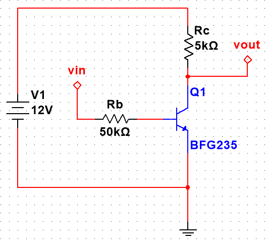
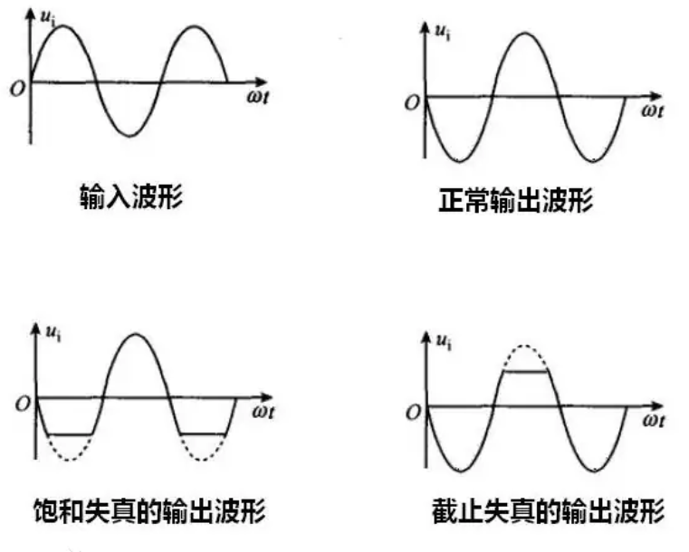
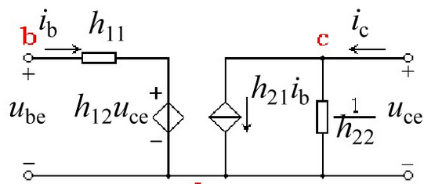
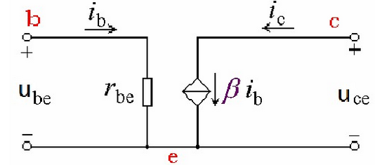

# 基本放大电路

三极管在模电中的基本应用就是基本放大器，正像真空管曾经的功能一样，工作在放大区。而在数电中，三极管经常工作在截止区或饱和区，并且要求能够快速地通过放大器，这里暂不讨论。

电子电路中放大的对象是变化量，也就是说，放大电路需要处理变化的信号，有时候是低频交流，有时候是高频脉动直流。任何放大电路都可以从信号的角度上抽象成一个二端口网络，可以使用H参数矩阵对其进行基本描述

基本性能指标：

* **电压放大倍数**：$A_u=\frac{U_o}{U_i}$ 输出电压/输入电压，就是H参数矩阵中的电压参数
* **电流放大倍数**：$A_i=\frac{I_o}{I_i}$ 输出电流/输入电流，H参数矩阵中的电流参数
* 转移参数：这个参数就是H参数矩阵中的跨导和跨阻，但是在实际应用中作用不大，所以一般不讨论，只在特定电路中进行计算
* **通频带**：衡量放大电路对不同频率信号适应能力的参数，分为上限频率和下限频率，以0.707也就是$1/\sqrt{2}$为界限，取放大倍数位于0.707|A~M~|中间的频率值作为通频带，也称为中频段
* **输入电阻**：$R_i=\frac{U_i}{I_i}$，从输入端看去的网络等效电阻（*输入电压电流有效值之比*），一般越大越好（能够保持输入信号的完整性）
* **输出电阻**：$R_o=\frac{U_o}{I_o}$，从输出端看去的网络等效电阻，一般越小越好（可以将输入信号完好地传递给后续电路或以比较高的功率输出给后续用电器）。另一种计算方法（带载）：$R_o=\frac{U_o^`-U_o}{\frac{U_o}{R_L}}=(\frac{U_o^`}{U_o}-1)R_L$，U~o~表示带R~L~时的电压输出有效值；U~o~'表示空载时输出电压有效值
* 最大不失真输出电压U~OM~：输出电压的交流有效值
* **最大输出功率**：用来衡量功率放大电路的带载性能
* 效率η：输出电压和输入电压之比$\eta=\frac{U_o}{U_i}$

在讨论放大电路之前，需要先了解三极管在放大的工作特性

### 三极管放大区工作特性

1. 输入特性

    三极管的U~BE~和I~B~之间的关系称为三极管的**输入特性**，描述了随BE结电压变化，b极电流的“输入”大小变化

    一般来说U~BE~>0.7V，也就是高于三极管导通电压时，I~B~才会出现，随后I~B~会呈现指数变化。这是由于U~BE~决定了b极能吸引到的电子数，U~BE~增大，电流也就会增大

    当考虑U~CE~时，会发现**随着U~CE~增大，I~B~曲线右移**，但是**U~CE~增大到1V以上后，曲线右移就会变得不明显**。这是因为U~CE~决定了从e极发射的电子总量，而U~BE~决定了能通过b区的电子量，电子总量增加，自然被吸引到b极的电子数量增加，b极电流相应增加，但是当e极所有电子都被发射出去以后——也就是发射的电子“饱和”了——不管怎么增加U~CE~，被b极吸引到的电子数目也不会有太大增加

    

2. 输出特性

    三极管的**输出特性**指的是U~CE~与I~C~之间的关系

    如下图所示，三极管的输出特性是一个很经典的模型

    

    > 理解了这个模型，就可以说理解了三极管

    先看I~B~恒定的情况下，选取其中I~B1~曲线，可以看到随U~CE~升高，I~C~迅速变大，这就体现了U~CE~控制电子发射总量。对应上一篇文章中提到过的电子管，就可以把U~CE~理解成“灯丝电压”，是I~C~主要的影响量（**根据KCL，I~E~=I~C~+I~B~，但是由于I~B~本来就很小，所以I~C~≈I~E~**），当U~CE~增大到某种程度后，I~C~就不再变化了，这是因为e极能释放的电子数已经达到了上限

    再看跟随I~B~变化的情况：I~B~=0区域以下被分成了“**截止区**”，这就对应了三极管截止工作状态；I~B~达到最大，也就是U~BE~≥U~CE~后，I~C~同样受到了限制，无法再进一步增大，这就是“**饱和区**”

    而模拟电路中最关注的就是放大，放大就要靠三极管工作在放大区。这个区域内，具有一个铁律：
    $$
    I_C=\beta I_B
    $$
    其中$\beta=\frac{\Delta i_C}{\Delta i_B}$，这个参数仅由三极管结构和制造工艺决定（三极管固有性质）

    同样地，可以获得更精确的三极管电流公式：
    $$
    I_E=I_C+I_B=(\beta+1)I_B
    $$
    通常三极管的β值都在几百，不过在实际电路中会通过外部条件限制β来让三极管工作在合适的状态

3. 温度特性

    三极管是半导体器件，说到半导体就必须提温度特性了

    **温度升高，β值升高，导致I~B~不变时BE结电压U~BE~下降；或者U~BE~不变时I~B~升高**

    就因为这个性质，需要在后续的放大电路中引入补偿电阻（温度反馈电阻）

4. 性能参数

    β值、α值：$\alpha=\frac{\Delta i_C}{\Delta i_E}=\frac{\beta}{1+\beta}$

    最大工作频率$f_T$：使β=1的信号频率，当信号大于该频率时，三极管将不能正常工作（大概率直接烧毁，因为高频的信号会让三极管工作在开关状态，发热巨大）

    最大集电极电流$I_{CM}$

    CE结击穿电压$U_{(BR)CEO}$

    最大集电极耗散功率$P_{CM}$

## 共射放大电路

最基本拓扑如下图所示

其中Vin和Rb需要保证U~BE~大于三极管开启电压，并让I~B~处于合适的区间；Vcc通过R~C~控制U~CE~来让三极管工作在放大区,R~C~用于将集电极电流变化转换为电压变化

### 静态工作点

> 因为三极管的放大工作状态需要很多支路量来描述，所以引入了**静态工作点**概念：输入电压为0时，晶体管**各极电流、BE端电压、管压降**这些参数统称三极管的静态工作点，如下所示：
>
> * **B极电流$I_{BQ}$**
> * **C极电流$I_{CQ}$**
> * **E极电流$I_{EQ}$（工程上常常将其近似等于$I_{CQ}$）**
> * **BE间电压$U_{BEQ}$**
> * **管压降$U_{CEQ}$**

**引入静态工作点就是为了描述一个放大电路在什么条件下能够实现“良好的放大性能”**

信号放大的基本要求就是：

1. 信号完整性：被放大的信号不能出现失真

    失真就是指输出信号和输入信号在函数*形式*上出现不一致（但是它们的相位是允许出现偏差的，峰值也一定会发生变化）

2. 信号强度：被放大的信号应该变强，至少不能被削弱

    1V峰值的信号可以被放大到2V，但是不应该被削弱到0.1V，不过在某些特殊电路里可以牺牲信号强度换取信号质量（比如把1V的信号转换成0.8V，在某些工况下是可行的）

对于这个放大电路来说，如果静态工作点发生**偏移**，就很可能出现信号的**饱和失真**和**截止失真**

> 对于该电路，交流信号会直接叠加在直流电源信号上，从图像上看，输出信号是输入信号先经过反相，再向上平移直流电源电压的距离。如果静态工作点发生偏移，就会导致三极管无法保持工作在放大区的状态
>
> *截止失真：由晶体管截止造成的失真*
>
> 
>
> *饱和失真：由晶体管饱和造成的失真*
>
> 
>
> 上面两句话说了个寂寞。给大伙翻译翻译什么叫截止失真：三极管本来工作在放大区，但是如果Q点（静态工作点）“下偏”——也就是U~CE~偏大时，同样的信号电压（信号电流源于电压）就无法让三极管保持放大状态，而三极管直接截止，**信号的波谷就会被削去**；经过三极管反相放大后，**输出信号就会出现削波峰**的情况，这就是截止失真
>
> 同理，如果U~CE~偏小时，由于信号电流过大，三极管直接从放大区冲进了饱和区，于是信号的波峰就无法被放大了；经过三极管反相后，**输出信号的波谷就会被削去**
>
> 需要注意的就是*“只有”静态工作点偏移会导致这两种失真，如果是输入信号本身电压过大或过小，都将视为静态工作点设置问题*；而且和习惯上的“截止、饱和”不一样，三极管基本放大电路具有反相放大的特性，导致输出电压的削波峰、削波谷是相反的

因此，为了保证模拟电路正常工作，就要保证晶体管的静态工作点稳定且正确，一般还要让输入输出信号共地，且负载上无直流分量

为了解决这个问题，工程师提出了下面的**阻容耦合放大电路**，这个电路是便宜小家电（尤其是小夜灯）里最常见的模拟电路之一

### 直接耦合与阻容耦合

使用两个耦合电容C1、C2将放大电路分为直流通路和交流通路

相较于直接通过电阻耦合信号、输出部分，**阻容耦合电路能够显著改善交流损失和输出部分叠加直流分量的问题**

它将整个电路分割成了直流通路和交流通路，直流部分起到电源的作用，交流部分则实现了前后级可解耦可耦合的信号传输。

> 电路中，“耦合”指的是电路网络中，若其中某一回路支路量发生变化，能影响到其他电路也发生类似的变化。耦合的作用就是把某一电路区域的能量输送（或转换）到其他的电路区域中去
>
> 解耦指的就是两部分电路不相干或者相干性很小，能够近乎独立地工作
>
> 良好的放大电路要求电路内部信号可解耦，电路传输过程中信号高耦合

对于阻容耦合，最关键的就是耦合电容容量要好好选取，并且极性电容的极性不能弄反。**耦合电容一般都选择大电容，而且以低ESR的钽电容或高频低阻电容为优**，很多HiFi电路中都是用上百uF的黑金刚电容来保证直流-交流回路隔离，**小信号电路中也一般使用1~100uF的较大电容**，这是为了减小容抗（$X_C=\frac{-j}{\omega C}$）

### 针对温度漂移的改进电路

由于半导体器件对于温度较敏感，而三极管工作在放大区，需要承载较大电流的情况下常常会产生很大的热量，因此需要保证静态工作点稳定，克服温度漂移。一般来说通过调节I~BQ~实现Q点稳定

如果考虑到温度漂移，可以设计**基本共射放大电路**，如下所示：

该电路在基本放大电路基础上引入了反馈电阻R2、Re和旁路电容C3

**在I~R2~>>I~B~条件下**，$U_{BQ}=\frac{R_2}{R_1 + R_2} V_{CC}$，进而存在$I_{EQ}=\frac{U_{BQ}-U_{BEQ}}{R_e}$，令$U_{BQ}=U_{BE}+\Delta U_{BE}$模拟温度漂移的情况，存在$U_{BQ}-U_{BE}>>\Delta U_{BE}$，因此$I_{EQ}$会保持稳定状态

这就是Re为直流通路引入了**反馈**

> 反馈是模拟电路中的经典工作调节方式，通过将输出端的信号引回到控制电路，可以以此调整控制电路内部的电压电流，这一控制方式也广泛应用于数字信号处理中
>
> **负反馈**：使输出量变化减小的反馈
>
> **正反馈**：使输出量变化增大的反馈
>
> 这里Re就起到了直流负反馈的作用，其值越大，反馈越强（I~EQ~收到抑制越强），Q点越稳定

以上直流通路称为**分压式电流负反馈工作点稳定电路**，这个电路的特点就是通过引入直流负反馈补偿温度漂移，其实使用更直接的方法也可以——比如将R1、R2替换成热敏电阻，并放置在三极管旁边，这样就能根据三极管的温度来实时稳定电路输出，但是显然成本更高；还可以直接在b、e之间接入稳压二极管，这种方法也相当于引入了负反馈

还应该注意*旁路电容C3*：**这个电容主要用于提高引入负反馈后的交流信号放大倍数**，如果不加这个电容，就相当于增大输入电阻为$R_i=R_1//R_2//[r_{be}+(1+\beta)R_e]$，进而可以算出放大倍数$A_u\approx -\frac{R_L}{R_e}$，可以发现没有旁路电容时，相当于输入回路和输出回路都并接了一个Re电阻——**去掉旁路电容后，输入电阻会变大，输出电阻则不变**

最后说一下如何确定基本共射放大电路的参数，但是在此之前==需要读者先了解三极管的电路分析模型，见最后部分的等效电路法求解电路参数==

针对电路交流部分使用交流等效模型，得到电路参数：
$$
V_{BB}=\frac{R_1}{R_1R_2} V_{CC}\\
R_b=R_1//R_2
$$

## 共集放大电路

## 共基放大电路

## 分析三极管放大电路的通用方法

对于模拟电路尤其是放大电路的分析，前人已经总结出了一套通用的分析方法学。不同于模拟集成电路，一般的分立元件模拟电路都有着明显的直流和交流通路，也不需要考虑器件大小和导线寄生参数造成的种种干扰，一般来说遵循以下步骤对放大电路进行分析就可以得到电路的大致特性

### 直流通路和交流通路分解

为了便于实现、减少干扰，现代的放大电路都会将直流驱动信号和交流小信号分成*正交*（指的是互不影响）的两个部分，称为**直流通路**和**交流通路**

二者一般通过耦合电容、旁路电容、滤波电容进行隔离。对于直流通路，应保留R~S~，置U~S~=0，电容视为开路，电感视为短路或仅保留寄生电阻；对于交流通路，将大容量电容视为短路，直流电源视为短路或仅保留内阻，如果是较高频信号，可视情况保留容抗

直流通路一般用于设置Q点，交流通路负责传输信号。因此直流通路关心的是Q点稳定性与整体功耗；交流通路则关心信号放大倍数、输入阻抗、输出阻抗、通频带、带载能力等

### 图解法静态分析

根据测量/仿真结果进行信号动态分析（扫频、扫相、输入输出采样）后，获取一个放大电路的输入特性和输出特性。之后根据V~BB~、R~b~在输入特性曲线上画出输入回路负载线；根据V~CC~、R~c~在输出特性曲线上画出负载线，即可得到两图中的交点，也就是静态工作点Q。两个负载线的函数如下：
$$
u_{BE}=V_{BB}-i_B R_b \\
u_{CE}=V_{CC}-i_C R_c
$$
根据图像调整Q点位置就可以改善静态工作点

同时，根据**输出图像上的负载线斜率**可以得到**电压放大倍数**。有A~i~/A~u~是图像变化时的斜率

### 电路失真分析与波形分析

使用示波器分别测量输入和输出信号的波形就可以得知电路失真情况和电路稳定性

对应可以采用改变静态工作点的方法消除失真

这个方法常用于配合图解法静态分析：依次进行失真分析和图解法分析，微调电路参数，可以快速让电路*收敛*到适合放大的区域

截止失真消除方法：增大V~BB~（也就是**向上平移输出回路负载线**），对于采用了反馈机制的基本共射放大电路，还可以减小R1、增大R2

饱和失真消除方法：增大R~b~，减小R~c~，减小β，减小V~BB~、增大V~CC~（**向下平移输出回路负载线**）

一般将电路调参的过程称为**电路参数收敛**，这也是仿真软件通用的描述

特别地，**交流负载线也过Q点，并且斜率等于$R_C //R_L$**

### 等效电路法求解电路参数

三极管是一个典型的非线性器件，但是可以忽略某些特殊参数，使用线性元件建立**三极管电路分析等效模型**，这样就能够建立放大电路等效模型，使用传统的电路分析方法对电路参数进行求解

1. **直流模型**

    该模型适用于Q点分析，可以用于估算静态工作点，等效电路如下所示：

    

    这就是三极管最经典的**流控电流源模型**，但是有时候为了突出三极管的PN结特性，还会再I~B~、I~C~的位置上串接两个二极管（方向从P到N）

    使用这个模型分析基本放大电路：
    $$
    I_{BE}=\frac{V_{BB}-U_{BEQ}}{R_b},U_{BEQ}随管类型变化,一般为0.7V\\
    I_{CQ}=\beta I_{BQ}\\
    U_{CEQ}=V_{CC}-I_{CQ}R_e
    $$
    事实上就是刚开始使用的推导方式，输入回路等效于恒压源（0.7V），输出回路等效于流控电流源，二者共地

    这个模型在精度要求不高的情况下适用性很广

2. **低频小信号模型**

    ==该模型只适用于低频小信号==

    直接将三极管视为一个二端口网络，使用H参数矩阵进行描述
    $$
    u_{BE}=f(i_B,u_{CE}) \\
    i_C=f(i_B,u_{CE})
    $$
    由上述方程可以得到交流等效模型

    

    输入回路是一个U~CE~控制的压控电压源和输入电阻h~11~的串联；输出则还是和直流模型一样，只不过输出部分并联了一个跨导

    可以写出这个二端口网络的H参数矩阵
    $$
    \left[ \begin{matrix}
    输入电阻R_{be} & be动态电阻\frac{\partial u_{BE}}{\partial u_{CE}}|_{I_B} \\
    放大倍数\beta & 输出跨导G_{ce} \\
    \end{matrix} \right]
    $$
    小信号等效模型应用在交流通路上，可以得到以下**交流等效模型**

    

    这个模型的基本公式就是
    $$
    r_{be} \approx r_{bb} + (1+\beta) \frac{U_T}{I_{EQ}}
    $$
    小结论：**在输入特性曲线上，Q点越高，r~be~越小**

### 静态分析和动态分析

最后一个分析方法就是静态-动态分析的混合使用

**静态分析**就是指对直流通路直流信号进行分析，一般使用**直流等效模型**

**动态分析**就是指对交流通路交流信号进行分析，一般使用**交流等效模型**

二者用于估算放大电路的元件参数和三极管选型，是分析过程中的最后一步

于是整体的设计思路就是：

1. 确定要放大的信号幅值、频率、所需放大倍数
2. 根据波形分析选择合适的三极管
3. 完成静态分析和动态分析，搭建测试电路
4. 多轮测试完成电路收敛
5. 收敛过程中综合使用图解法、等效模型仔细推敲元件选型，最后将静态工作点稳定到合适的位置

分析电路时则要反向思路，先使用示波器和扫频法测出电路的目标信号和基本参数，再通过等效模型确定外围元件参数
