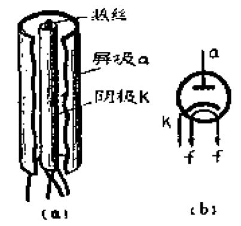
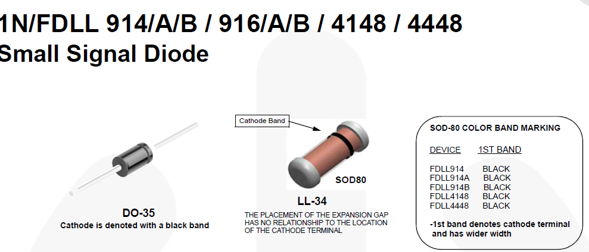
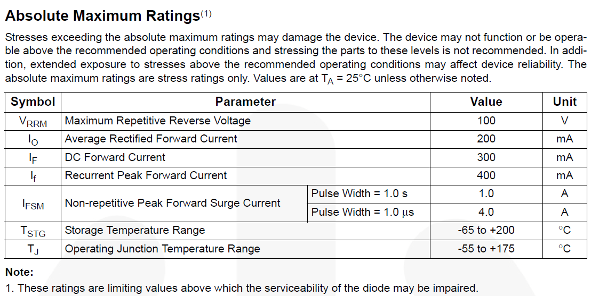
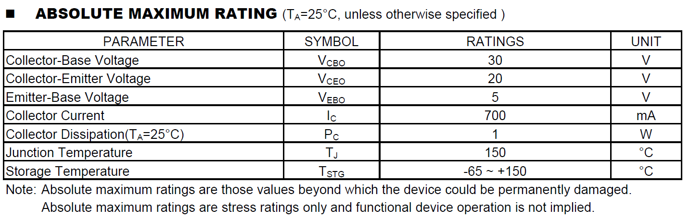

# 基础晶体管

最基础的电路是由无源元件，即电阻、电容、电感三者构成的电路，两端通电后可以产生一个暂时稳定的电信号。不论是机缘巧合还是为了验证实验，曾经的物理学家开始注意到电的特殊性质，并加以研究，他们最先对电的性质进行探寻，从风筝实验到电磁感应定律一点点理解了电磁运作的原理，于是电气工程就出现了。然而到19世纪末为止，一直都只有无源电路的存在，电路的分析理论也仅有基础的电磁感应定律和由麦克斯韦方程组衍生出的基尔霍夫定律——直到20世纪的工程师发明出真空管，开启电子电路的时代。电路从最初使用电能和磁场能来控制、转化其他能量这个单一用途，进一步拓展出使用电信号来描述、控制其他信号，乃至使用电信号进行计算的用途。实现这些功能的基础就是具有控制功能的有源器件，也就是常说的二极管、三极管等元件。现代的半导体晶体管在20世纪中期才被发明出来，在此之前承担电子信号变换作用的元件一直是真空管。

## 真空管

在半导体材料被发明之前，人们都使用电子管或者说真空管对电路进行操控，现代的半导体技术实质上还是在使用半导体达到真空管的用途，只不过因为半导体材料可以在硅片上进行制造，大大缩小了电路体积——但是它们的用途是相似的

现在真空管已经被市场淘汰，剩下的也不过成了爱好者们的玩具，不过理解真空管有助于了解二极管、三极管等基本的晶体管在电路中起到的作用

电子管主要分为：二极管、三极管、五极管、束射管、复合管等，听上去和半导体器件很相似

二极管是其中最简单的，它中间装有两个电极，一个是由金属丝制成用于发射电子的阴极，另一个是接收电子的屏极。给阴极通电，电流会将金属加热，管内已经被抽成了真空，因此金属丝就能发射电子，屏极则负责将这些电子接收。

在屏极接高电势，阴极接低电势时，屏极会主动吸引阴极发出的电子。一般来说二极管的加热部件是独立的，围绕在阴极周围，如下图所示（图b为电路符号，K为阴极，a为屏极，两个f表示加热部件）

因此实际上会有很多（效率懂得都懂，但是当时能用就行）电子从阴极到达屏极；反之在屏极接低电势，阴极接高电势时，电子的发射会被抑制——这就造成了二极管具有**单向导电性**

基于PN结的二极管实际上也是起到单向导电性的作用，只不过由于引入了半导体技术，它的功能更加丰富、复杂了（实际上前人们也使用了很多方法改进真空管让它们做到现在半导体二极管的功能——毕竟第一台电子计算机都是用真空管制造的）

容易看出，这个大二极管具有一个致命的问题：功耗大得离谱，这玩意实际上就是个电灯泡——工作时常常能达到外壳100多度，用手摸一下就能烫熟的那种......这就是真空管的通病了：它们都需要使用额外的电热丝来让金属发出电子，而半导体管则不需要这些

再来看三极管：

它中间多了一个栅极g——这个称呼也被保留到了后来的场效应管中——可以通过控制栅极来实现控制阴极-屏极电流，这也是双极结型晶体管和场效应管的共同原理和要达到的目的：**用一个电流/电压控制另一个电流/电压**

值得指出的是：真空三极管的很多特性与专有名词被移植到了晶体三级管上，如果学完了三极管/晶体管再来学另一个，会感到很熟悉

真空管中还有一个较三极管更复杂的分支——五极管。他在三极管的栅极和屏极之间插入另外两个电极，于是栅极被分成了*控制栅极*、*帘栅极*和*抑制栅极*，这个器件主要用于减少的真空三极管中超大寄生电容和超量漂移电流的影响，从而能够实现“**高频开关和放大**”（在当时确实是高频）的开关，第一台电子计算机中也大多用了五极管配合继电器进行开关

最后需要提的就是束射管（至于复合管嘛，管如其名），它就是高中物理里面大名鼎鼎示波管的父类——通过将高速电子流打在荧光屏上实现显示功能，使用周边的电磁铁来控制显示的位置

不过束射管还有很多其他变种，辉光管、荧光管等上世纪苏联时代的遗产都是束射管的成员，它们大都利用加热器-金属灯丝-荧光材料/电子射线的原理进行发光显示信息，可以说是现代发光二极管的鼻祖了

利用这些真空管，前人们也制造出了放大器、振荡器、线性电源乃至开关电源等设备，其耐用性甚至能把一部分使用现代技术的设备打趴下。比起教科书中从半导体物理直接讲起，个人认为晶体管这种”朴素“的老古董更能体现模拟电路的本质——**通过支路量操控支路量，从而实现模拟电信号的变换**

而真空管中的几个基本元件的性质也会在晶体管元件上得到体现

* 二极管——单向导电与反向击穿
* 三极管——电流放大与开关控制

## 二极管

> 我再用真空管，诺伊斯就是个伞兵！——肖克利（他没说过）

简单了解过真空管，我们再来看看现代半导体科技的结晶，**晶体管**

首先要谈的就是二极管了。不过要看懂现代半导体科技，就要从它们的基础——半导体材料开始。由于本篇的重点在于半导体器件，所以这里仅进行笼统的概括。我们先从二极管的物理基础**PN结**看起。

### 二极管就是PN结

半导体材料（硅/锗）的单质都是很难导电的，因为其中的电子和空穴浓度相等，即使外加电压，也会很快形成电流的动态平衡；然而这种平衡容易随着外界环境改变而改变，通过向纯净的半导体材料中掺入受控量的N型杂质和P型杂质，可以分别得到**N型半导体**和**P型半导体**，这种技术称为**掺杂**

> N型杂质就是氮族元素（IVA族），它们的最外层电子数为5；P型杂质则是硼族元素（IIIA族），它们的最外层电子数为3
>
> 显而易见，N型杂质的掺杂会导致自由电子数量增多，半导体的载流子为多子，即自由电子，这就是为什么它被称为**N**egative；相反地，P型杂质的掺杂会导致空穴数量增多，半导体的载流子为多子，即空穴，这也是为什么它被称为**P**ositive
>
> 使用能带理论可以解释多子导电：导带中的电子就是载流子，能够导电；而空穴作为电子反向移动（跃迁）的等效，也可以等效地导电。相关内容可以参考《半导体物理》教材或本博文的参考书《模拟电子系统设计指南（基础篇）：从半导体、分立元件到TI集成电路》

幼儿园的小朋友都知道，半导体材料的导电性容易受到外界温度、光照等因素影响。这是因为在特定温度热平衡的条件下，对特定的半导体材料，电子浓度$n_o$和空穴浓度$p_o$的乘积始终为常数，公式如下：$n_o * p_o = n_i^2$

> 电子在核外的量子分布状态成为**状态密度**；电子的能量分布称为**费米函数**
>
> 费米函数可以表明电子占据特定允态能级的概率，而它的值是由当前温度T和**费米能级**$E_F$决定的，表达式如下：
> $$
> f(E)=\frac{1}{1+e^{(E-E_F)/kT}}
> $$
> 当T=0K时，可以发现所有低于费米能级的允态能级会被填充；高于费米能级的允态能级则会空出
>
> 当T有一个大于0K的确定值时，上式就存在一个极限值，并且填充态和空态之间出现了过渡，随着温度升高，这个极限值会逐渐降低，这就导致**导带中热平衡的电子浓度会随着导带能级与温度变化而变化**，表达式如下
> $$
> n_0=N_Ce^{-(E_C-E_F)/kT}
> $$
> 参数$N_C$表示导带中的有效态密度函数，它的值仅由半导体材料的有效质量和温度确定

根据上式不难得出：在温度稳定的条件下，半导体材料的本征浓度为常数

一般地，把两种不同的体系合二为一时，载流子可以互相流动；但是热平衡的时候一定会形成统一的费米能级，这是因为出现了载流子浓度交换，因此可以**把掺杂的过程看作使费米能级变化进而改变导带宽度的过程**；由此也可以推断出光照和温度也会让导带宽度变化，进而影响半导体材料导电性

说完了P型和N型半导体，终于能谈到PN结了——二极管归根结底就是一个封装起来的PN结，通过控制PN结的物理性质就可以制造出不同种类的二极管

PN结的物理性质十分复杂，这里我们只讲*简化的PN结模型*

在一个晶格内，将P型和N型半导体连接在一起就形成了PN结，电子会从N区扩散到P区，空穴会从P区扩散到N区，因此在二者的接触区附近，电子和空穴会复合抵消，将其称为**耗尽区**或**空间电荷区**——在特定温度的热平衡条件下，不施加额外能量，电子或空穴是不能通过PN节的；同时由于在结的两侧存在相反的电荷，这就建立了一个穿越PN结的电场

当没有给PN结施加额外能量时，耗尽区会阻挡电流形成，不过仍然会存在微弱的电流穿过耗尽区，根据方向分为**正向扩散电流**和**反向漂移电流**；如果在外部对PN结两端施加正向电场，使得耗尽区内电场被抵消，空穴和电子就能够自由流动，在此过程中耗尽区越厚，所需要施加的外部能量就越大

> 想象一种极端情况，将P型半导体的掺杂浓度提升到极限，甚至将其换成金属，那么电子便会自由地从P区向N区扩散，但是随着扩散，P区的电子浓度会逐渐变低，反而会形成一个从N区到P区的势垒，这一过程是动态平衡，这个势垒就是大名鼎鼎的肖特基势垒，利用贵金属和N型半导体就可以制成*肖特基二极管*，它的原理和结型二极管十分相似，但是最后的产物完全不一样：加正向电压时肖特基势垒会变窄而导致其内阻减小，这一性质导致它具有正向压降低的优点

虽然二极管耗尽区的这个电场（一般称为内建势垒或内电场）很强，能抑制多子的运动，但是P区的少子电子会因此漂移到N区；N区的少子空穴也会穿过PN结到达P区，二者引起的电流分别称为正向扩散电流和反向漂移电流，二者大小相等、方向相反

因此，PN结也就是二极管的最根本、最基础特性就是**单向导电性**

### 从伏安特性出发

回想一下真空管时代我们都用真空二极管干了什么？拿它单向导电和反向稳压！当年肖克利老爷子准备了一份真空管的伏安特性，然后对着面前的硅片就开始研究：怎么让这破玩意弄得像真空管一样？我们也先从伏安特性出发，理解二极管的性质

* 正偏曲线

  二极管的P极接高电势、N极接低电势，即**正偏**，在这个情况下二极管的伏安特性曲线近似于指数函数
  
  二极管正偏伏安特性曲线如下所示：
  
  
  
  U~ON~为二极管导通电压，硅管约为0.7V，锗管约为0.5V。因为二极管导通电压相对较低，而导通后电流升高速度很快，在$2 * U_{ON}$后就可以看作是短路状态，因此也常使用二极管的简化模型：当电压<0V（或导通电压）时二极管关断，当电压>0V（或导通电压）时二极管导通且为短路
  
  > 顺带一提，锗二极管虽然导通电压更低，但是已经基本被市场淘汰了，因为
  >
  > 1. 锗稳定性不好、提炼加工困难导致其一致性难以保证
  > 2. 价格更高
  > 3. 难以在硅片上集成
  >
  > 同样遭遇的还有锗三极管，它的结压降也是约为0.5V（甚至视型号不同会更低一些为0.3V），但是因为制造工艺和品控问题早早停产，只有一些HiFi发烧友在使用锗器件来达到更好的放大性能
  
* 反偏曲线

  之前没有说二极管PN结**反偏**（P极接低电势，N极接高电势）的结果：当阴极电压比阳极电压高时，会形成一个由阴极到阳极的外电场，电流根本不会产生，但是如果这个电压逐渐增高，甚至能够抵消耗尽区的内电场时，二极管就会被**击穿**，击穿时，整个晶体管内会产生大量电子-空穴对，电流会达到最大，换句话说此时二极管近似于短路，在这个过程中二极管会因为电流而剧烈发热，但是**这并不意味着二极管损坏**，如果再撤销这个反向电压，二极管还是会因为内电场重新建立而恢复原状。

  > **材料掺杂浓度较低的PN结中**，当PN结反向电压增加时，空间电荷区中的电场随之增强。这样通过空间电荷区的电子和空穴就会在电场作用下，使获得的能量增大。在晶体中运行的电子和空穴将不断与晶体原子发生碰撞，通过这样的碰撞可使被束缚在共价键中的键电子碰撞出来，产生自由电子-空穴对。紧接着新产生的载流子会在电场作用下撞出其他价电子，又产生新的自由电子-空穴对。如此连锁反应，使得空间电荷区中的载流子的数量雪崩式（也可以理解为链式反应）增加，流过PN结的电流就急剧增大击穿PN结，这种碰撞电离导致击穿称为**雪崩击穿**
  >
  > 而在**材料掺杂浓度较高的PN结中**，耗尽区本来就比较薄，而在此时反偏一个强电场，这就是的耗尽层内中性原子的价电子会被快速拉出，成为自由电子，同时产生空穴，这个过程被称为**场致激发**。在场致激发的影响下二极管内会产生大量载流子，因此出现反向击穿的现象，这种击穿一般需要的外部能量较雪崩击穿更少，被称为**齐纳击穿**

  事实上能够损坏二极管的只有高温和外部破坏。因为**导带中热平衡的电子浓度会随着导带能级与温度变化而变化**，温度越高，热平衡电子浓度越高，越难以导电，而当反向击穿积聚的热量无法被释放时，二极管会被烧毁。二极管的反偏伏安特性如下所示：

  

  U~BR~表示**击穿电压**（分为**雪崩电压**和**齐纳电压**），I~S~为漏电流（反向饱和电流），可见当二极管反偏时，在击穿电压范围内电流会达到很小，而超过击穿电压后，通过二极管的电流就会迅速增大（一般雪崩击穿电流增大速率比齐纳击穿更快）

### 特性

1. 单向导电性

   二极管的单向导电性应该不用多介绍，大家品鉴的足够多了。一般利用这个性质，可以实现二极管的半桥整流或**全桥整流**（对于三相电可以使用三相桥整流），用于将交流信号变成脉动的直流信号。对于单相交流信号，可以直接在变压器中间抽头，用两个背对背的二极管就可以实现全桥整流

   还可以利用这个性质实现**boost电路**（倍压整流）来进行DC-DC升压；对于高频信号则可以使用类似的电路（二极管后接电阻和并联的电容，前接激励源）实现**包络检测**，从高频调制的信号中提取低频信号

   在一般电路中应用比较多的就是**钳位电路**和**削波电路**，可以通过两个二极管分别连到VCC和GND端防止某个节点的电压偏高/过低，但是应该注意要在二极管同一支路串接保护电阻防止泄放电流过大

   因为二极管可以起到改变高频信号偏置电流的作用（因为它的正向电容可以在一定程度上滤除高频信号），所以可以使用它和分压电阻、电容实现压控衰减器，示例电路如下

   

2. 反偏稳压性

   如果二极管反向电压超过击穿电压时，它会工作在击穿去，反向电流迅速增加，但电压基本不变，因此可以在保证二极管不过热的情况下让二极管在击穿区实现稳压功能，通过专门设计的，在击穿区内有着陡峭特性曲线（利用齐纳击穿特性）的二极管成为齐纳二极管，也就是俗称的稳压二极管

   > 一般来说稳压二极管都会有很高的掺杂浓度，这是因为稳压管利用了齐纳击穿而不是雪崩击穿：雪崩击穿所需的外部电压一般相当高，击穿时会很快产生巨大的电流，在这种情况下二极管的结温非常难以控制，因此一般的二极管一旦出现雪崩击穿基本就意味着烧毁；但是齐纳击穿的击穿电压相对较低，而且它的击穿伏安特性更平滑，只要在外接一个电阻用于控制击穿电流就可以相对容易地实现稳压

3. 反偏变容性

   耗尽层相当于PN两块半导体之间的绝缘体，因此二极管存在寄生电容（*结电容*）；又因为外加电压时耗尽层厚度会发生变化，因此二极管的寄生电容就会发生变化——通过在某一侧只掺入微量杂质，可以实现一个相当厚的耗尽区，如果此时对二极管反偏，这个耗尽区厚度会很容易变化，由此达到**变容二极管**的作用

4. 温度敏感性

   因为导带中热平衡的电子浓度会随着导带能级与温度变化而变化，所以**反向饱和电流**会对温度敏感——会**随温度增加而快速增加**。其次，**温度升高，二极管正向压降减小，正向工作电流增大，**这是因为温度升高会导致耗尽区的原子共价键不稳定，更容易被外加电场激发出自由电子-空穴对

5. 耗尽电容与扩散电容

   高频交流信号下，二极管中的耗尽层会演变成一个以硅为电介质的平行板电容器，对应的电容被称为**耗尽电容**。它会随二极管反向偏压而变化。

   当二极管正片时，由于耗尽层附近区域会有过量少子电荷聚集，出现电荷存储效应，局部的电荷浓度出现了不平衡，这就相当于又引入了一个电容，被称为**扩散电容**，它的大小与PN结点的横截面积成正比，一般为10-100pF

   利用这两个电容可以推导出二极管的高频小信号模型：正偏时一个小电阻并两个电容；反偏时一个大电阻并一个电容（耗尽电容）

其实还有发光二极管、肖特基二极管等多种结构的二极管，它们都有自己的特点，但是暂且不作介绍

### 电路应用

下面给出1n4148二极管（来自安森美）的datasheet

常见的参数都已给出，1n4148是通用性的开关二极管，电路设计中主要需要参考其击穿电压（100V）、最大正向电流（200mA）、峰值电流（400mA）、工作温度（-55到175）、功率（500mW）、漏电流（0.025uA-5uA）、开关频率（或者说恢复时间）（4ns）

可见它的开关频率比较高，但耐压相对一般，也缺少反向击穿稳压的能力，因此适合用作开关二极管或检波二极管的替代品

## 三极管

> 一个有源器件可以通过一个电信号控制其他电信号——真空三极管告诉电气工程师的遗言

三极管又称**双极结型晶体管**，也就是所谓的**BJT**（Bipolar Junction Transistor）

特别地，“晶体管”——Transistor实际上是贝尔实验室对跨导变阻器（Transconductance Varistor）的简称

### 三极管与二极管

为了实现电信号的相互控制，三端器件是必须的。对于一个三端器件，我们一般通过双端口网络模型进行分析。对于三极管，更适合使用双端口网络的T参数和H参数矩阵进行描述——但这太学术了！从直观上理解**三极管就是一个水龙头**

我们先来看需要三端元件做什么：首先它要使用一端的电压/电流进行控制，就假设这个三端元件有ABC三个端口，要想在A端口产生这个电压/电流，就要找到一个地，因此三端元件一定需要一个接地点，让另外两端到这一端产生电流。暂且假设这个接地点是B——既然有电流产生，根据基尔霍夫电流定律，A端流入和C端流入电流之和就是B端流出的电流。一切都解释的通了：A端通过AC之间的电流/电压控制BC之间的电流/电压，这不就是一个受控源吗！我们将AC之间的电流/电压与BC之间电流/电压的比值记作**增益β**，不难看出**β<1**恒成立，换个角度，这其实就是T参数矩阵中的一个参数

这就能解释三极管是水龙头这个比喻了：通过扭动水龙头把手可以可以控制水流的大小

对于三极管来说，他正是使用电流控制电流，A端被称为**基极**，记为**b**（**B**ase），B端称为**发射极e**极（**E**mitter），C端称为**集电极c**极（**C**ollector）。**be电流控制ce电流**。以下部分都会使用e、b、c三个极的简写形式

### 一点简单的原理

三极管有两种大类型：**NPN**和**PNP**。它们的名字来源于其中“结”的排列顺序。它们的大致结构和电路符号如下所示：

BJT使用c和e极作为电流源端，b作为电流控制端，**电路符号中的箭头表示器件处于正向有源状态时的电流方向**

目前PNP和NPN两种晶体管都被大量生产，但是相对而言NPN型生产效果更好——半导体中电子的流动性比空穴流动性更强，NPN的内部具有两个N型半导体区，所以它内部的电子浓度更高，可以达到更高的工作速度和承载更大电流。对于NPN管而言，共e极模式下，c极将基极注入的小电流放大输出；其他条件下，**当E~b~>E~e~时，晶体管c、e导通**；PNP管与其相反，共射模式下，c极将离开b极的小电流放大输出，而**当E~b~<E~e~时，晶体管c、e导通**

实际上三极管的原理比较复杂，但在这里我们主要讨论的是其电气性质，所以只用NPN举例简单解释一下。正如其命名，BJT是由两个PN结构成的，其中电荷载流子穿过两个不同电荷浓度区域PN结时会发生双向扩散，这就导致了BJT的内电流。一个BJT的剖面图如下所示

> 原谅我的灵魂画作

可以发现**BJT成型于c极底座，b极被做得很薄，e极则被控制在较高的掺杂浓度**。这么做主要有以下几个原因：

1. 让e极可以很容易地被be电压激发出电子
2. 让b极容易被穿过
3. c极可以完整接住来源于e极的电子

可以发现整个流程和真空三极管的发射电子-控制电子-接收电子有异曲同工之妙。特别地，e极电子作为多子向b极扩散后，本来是少子的b极电子浓度大增，会自发向电子浓度相对较低的c极扩散，因此BJT被划分为少子载流元件

> 顺便一提场效应管FET是多子载流元件，这就是为什么FET能承受相对更大的电流，这个话题按下不表

当b极和e极加正向电压时，e极高浓度电子被快速激发，直接在电场作用下达到e极，而如果没有其他电源，这些电子会自行穿过b极进入外电路；但是一旦施加了更高（大于E~ce~）的电压，这些电子中的绝大多数就会进入c极（因为c极的面积比b极大得多），随后进入外电路。生产中为了降低在到达c极之前被空穴中和掉电子的百分比和被b极电压“吸引走”电子的百分比，b区就被做得很薄了

> 有些人在学习模电不久后觉得三极管就是两个二极管的简单串联，只不过多加了一个控制功能，这种想法是完全**错误**的！

一般在模拟电路设计中，认为c极电流是b极电流的线性函数，也就是大名鼎鼎的**β**；但是对于更精确的BJT电路，需要使用电压控制模型，或者说**EM（Ebers-Moll）模型**，需要考虑一个指数函数
$$
I_C=I_S(e^{\frac{qV_{BE}}{kT}-1})
$$
这个模型基于三极管的物理模型建立，相对精确。V~BE~可以被描述为$V_{BE}=\frac{kT}{q} ln \frac{I_C}{I_S}$

使用这个模型的一个优点在于可以将三极管建模成跨导：电压控制，跨导和集电极电流成比例关系，常用于SPICE模型仿真和高频电路的理论计算中

上面提到了**β值**，这可以说是三极管最重要的性能指标了，它的正式名称为**共射极电流增益**，**在正向有源区近似于c极直流电流和b极直流电流的比值**；另一个重要参数是**共基极电流增益α**，**在正向有源区近似于从发射极到集电极的电流增益**，其值一般接近于1。相关公式如下
$$
\alpha=\frac{I_C}{I_E} \\
\beta=\frac{I_C}{I_B} \\
I_E=I_B+I_C \\
\beta=\frac{\alpha}{1-\alpha} \\
\alpha=\frac{\beta}{1-\beta}
$$

> BJT是非对称器件，因此当把c、e极互换后BJT会工作在反向有源模式，一般不会这样使用BJT，它的内部结构也为正向有源模式进行了优化。在CMOS制造工艺中，常常使用低性能的“横向”对称BJT，这是为了平衡成本（硅片面积）和性能

### 很多复杂的性质

因为很复杂，所以跳过！

三极管的性质太多了，而这些性质造就了它的多种用途。可以说现代中小功率模拟电路就是建立在三极管之上的；而大功率模拟电路则被场效应管所掌控

下一部分会详细讲述三极管的基本应用。这里先了解一下三极管的基本工作区域和输入输出性质（以NPN为例）

BJT有5个不同的工作区，列举如下：

1. **正向有源（正偏）**：V~c~>V~b~>V~e~，$I_C=\beta I_B$，水龙头把手在开合范围内，可以控制水流大小。be结正偏，bc结反偏
2. **饱和（完全导通）**：V~b~>V~e~，V~c~<V~b~，b极电压超过了c极电压，就像是手把水龙头开到最大，水龙头把手都扭歪了，自然水会喷涌而出，这时三极管c极电流会达到最大。所有PN结正偏，常用于实现逻辑电路中的开关闭合
3. **截止**：V~b~<V~e~，水龙头被关上，BJT的c极电流近似于0，属于漏电流；e极电流则近似等于b极电流。所有PN结反偏，可以实现逻辑电路中的开关断开
4. **反向有源（反偏）**：V~c~<V~b~<V~e~，反向电流通过三极管，相当于把c、e极对调。实际中很少使用该模式，因为β值会小得多，相当于三极管内阻被放大了。集成电路中可能会在某些地方用到（大概）
5. **雪崩击穿**：俗称炸管，一般来说三极管被击穿会直接烧毁，因为两个PN结的性质不可能完全一致，这就导致但凡电流过大一点，一个PN结不会被烧毁，另一个一定会被烧掉！三极管的耐压规定了ce、be电压的最大值，选型前一定要注意

PNP型三极管的性质和NPN型的性质正好对偶，有兴趣的读者可以自行证明PNP三极管的相关性质

> 自证不难

下面是经典的小信号通用三极管S8050的datasheet

它使用了经典的TO-92封装，在很多收音机里都能见到这个NPN开关管的身影。

耐压be 5V；ce 20V；cb 30V。也就是说最好驱动电压不要超过5V，如果使用独立电源为三极管供电，电源也不能超过20V

c极电流700mA，算是开关管里面比较大的，能够驱动一些小型的功率设备了

**开关管是指用于充当开关元件的三极管**，也就是说它会工作在截止-导通两个状态下，因此其最重要属性就是开关频率，其次才是增益

而**功率管是指专门用于功率放大的三极管**，它会一直工作在正偏状态下，其最重要属性是增益

**通用管是指介于二者之间，能够在一定范围内通用使用的三极管**，在各种各样的电路里都能见到这种三极管，它们的性能指标比较均衡，一般来说两个不同型号的通用管是很有可能相互取代的

可以从output capacitance输出电容看出s8050的开关频率：1MHz下为9pF，一般来说工作在几十kHz可以达到更低的电容量，属于工作在中频的三极管。它的增益在120到400之间，取200的中间值，属于放大性能一般的三极管。s8050就是这样一个中庸的三极管，各种地方都能使用，因此它的出货量很大，价格便宜。生产商也很多。

特别提一下current gain bandwidth product电流增益带宽积：放大器带宽和带宽的增益的乘积，在频率足够大时是一个常数，三极管的CGBP其实没有什么用，*在高频运算放大器中可以指示放大器的性能*

## 场效应管

场效应管（FET，Field Effet Transistor）和三极管一样，同属于晶体管大家族，其中比较常用的就是MOSFET金属氧化物半导体场效应管（Metal Oxide Semiconductor Field Effect Transistor），它常常以互补金属氧化物半导体（CMOS，Complementary Metal Oxide Semiconductor）的形式出现在数字集成电路中，下面对它进行简单的介绍

### 电场效应

### 平衡投入产出比

### 小号继电器

### 功率半导体器件

