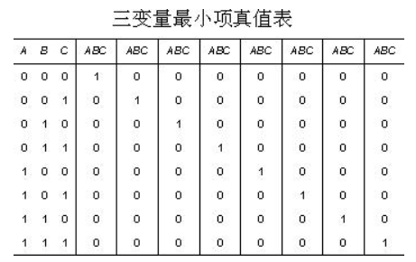
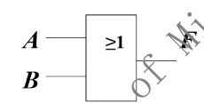
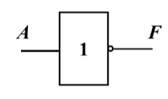
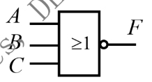
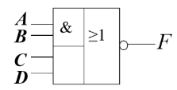
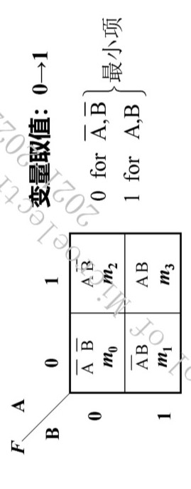
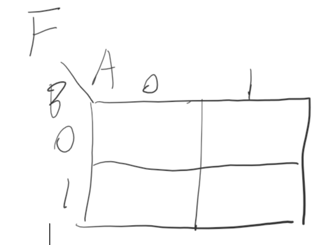

# 电路设计从入门到弃坑10【数字电路概论】

数字电路源于抽象的数学。早在十八世纪，机械式的计算器就已经出现，它们的数学原理和现代计算机进行数学计算时的原理是很类似的。数字电路的作用仅仅是把当时低效、慢速的机械零件替换成更高速的的继电器、真空管、分立式三极管乃至74门电路——当进入集成电路时代以后，大规模集成电路、CMOS、HDL、UVM的出现才让数字电路区别于其他事物成为“信息时代的代表性产物之一”

**数字量**：在幅度上离散的物理量；描述数字量的信号称为**数字信号**

最早的数字电路使用电子管和继电器实现，体积庞大；而随着晶体管和集成电路的出现，现在的数字电路设计已经形成了一条完善的产业链，从上游的设计-验证，再到下游的生产、封测，每个环节都有着自己独有的设计方法和实现思路。本系列不讨论数字集成电路设计（毕竟笔者也没学到这块），只讨论基础的板级数字集成电路设计和一部分HDL知识

在谈论数字电路之前，应该先了解数字电路的数学原理——数制、离散化、布尔代数这一系列抽象的学科

## 数制

按照进位规则进行计数，即进位的制度，称为**数制**

**基数**（radix）：一个数制所包含的数字符号的个数

计算机和生活中常见的基数有2、8、16、10，钟表计时也采用12、24、60的基数

也就对应了0、1；0、1、2、3、4、5、6、7；0、1、2、3、4、5、6、7、8、9、A、B、C、D、E、F；0、1、2、3、4、5、6、7、8、9这些**数码**（），数码就是组成一个数字能使用的符号

一个数的大小由它的数码大小和数码所在的位置决定，数码所在的位置称为“**权**”（weight），由基数的乘方表示。以小数点为界，小数点左边第一个数码的权为D^0^，第二个数码权为D^1^，小数点右边第一个数码权为D^-1^，第二个数码权为D^-2^，以此类推

* 二进制，基数2：0101.010 按权展开：$0*2^3+1*2^2+0*2^1+1*2^0+0*2^{-1}+1*2^{-2}+0*2^{-2}$
* 八进制，基数8：107.56 按权展开：$1*8^2+0*8^1+7*8^0+5*8^{-1}+6*8^{-2}$
* 十进制，基数10：49.09 按权展开：$4*10^1+9*10^0+0*10^{-1}+9*10^{-2}$
* 十六进制，基数16：8A63.00 按权展开：$8*16^3+A*16^2+6*16^1+3*16^0+0*16^{-1}+0*16^{-2}$

**数字电路中惯例使用二进制，因为使用电路高低电平和是否导通来对应二级制中的0和1比较方便**

任意r进制都可以按权展开为
$$
(N)_r=\sum_{i=-m}^{n-1}k_i r^i
$$
其中k为数码，r为基数

### 二进制、八进制、十进制、十六进制互化

**二进制（Binary）用B表示（bin）**

**八进制（Octal）用O表示（oct）**

**十六进制（Hexadecimal）用H表示（hex）**

**十进制（Decimal）用D表示（dec）**

首先说一下二进制-八进制-十六进制之间的转化，因为它们之间完成转化的步骤很简单：

**三位二进制位等于一位八进制位，按权展开得到数码即可**

**四位二进制位等于一位十六进制位，按权展开得到数码即可**

>$$
>(01\ 001)_B=(1 1)_O \\
>(0100\ 1010)_B=(4 A)_H \\
>(37)_O=(011\ 111)_B \\
>(FF)_H=(1111\ 1111)_B
>$$

然后是各个进制化为十进制的方法：

**直接按权展开后算出结果即可**

> $$
> (1 1)_O =1*8^1+1*8^0=(9)_D\\
> (4 A)_H=4*16^1+A*16^0=(74)_D \\
> (011\ 111)_B=0*2^5+1*2^4+1*2^3+1*2^2+1*2^1+1*2^0= (31)_D\\
> (10.010)_B=1*2^1+0*2^0+0*2^{-1}+1*2^{-2}+0*2^{-2}=(2.25)_D
> $$

十进制转换成任意进制则需要辗转相除法配合连乘法：

**将十进制数的整数部分除以r取余数，直到商为0，将余数逆序排列，得到r进制的整数部分；将十进制的小数部分乘以r，取出乘积的整数部分，剩下的小数继续乘r，直到满足精度，将乘积的整数部分顺序排列得到r进制的小数部分**

但是一般来说只要先转化成二进制小数，就可以根据二进制数得到对应的八进制和十六进制数了

或者可以采用直观的记法：*先除得整数部分数码，然后把从上到下得到的结果，按照从小数点向左排列的方式写到结果的整数部分；再乘得小数部分数码，然后把从上到下得到的结果，按照从小数点向右排列的方式写到结果的小数部分*

### 常见的二进制代码

代表信息的数码称为**代码**

常见的二进制代码有以下几种：

1. 8421BCD码（二-十进制码，Binary Coded Decimal）

    看着很高端，实际上就是用四位二进制对一位十进制数进行编码——更简单的理解就是把十六进制前十个数取出来，然后用0000、0001、0010、0011......这样依次排列的二进制数给它们编码，采用0000~1001这十个二进制数即可

    其实也有其他的BCD码，比如2421、5421、4221、余3码等等

    > 2421、5421、4221、8421BCD码都是有权码，余3码是偏移码，由8421BCD码+3后得到
    >
    > 余3码各组数中两数互为反码，这是他的最大特点

    由于8421BCD可以直接和十进制完成转换，所以现在的2-10进制译码器大都采用8421BCD码实现，这也是最常用的BCD码。但是**8421码不能直接转换成二进制码，而是要先转换成十进制，再从十进制转回二进制**

2. 格雷码（Gray Code）

    格雷码的任意两个相邻码之间只有一位不同，因此它是一种循环码，可以保证它在传输过程中引起的误差较小，常用于高速通信

3. ASCII码

    这个算是老生常谈了，不再赘述

### 二进制原码、补码、反码表示法

**原码**：二进制数本身

**反码**：对原码逐位取反，等于n位最大数（n个1）与与其源码之差

**补码**：将反码最低位+1，将二进制数低位（包括小数部分）的右边第一个1保持不变（包含此1），向左逐位取反可以直接从原码获得补码

反码的反码是原码；补码的补码是原码

### 带符号二进制数

在二进制数最高位之前加一个**符号位，0代表正数，1代表负数**，就可以表示带符号的二进制数了

二进制的原码、反码、补码中**正数**均表示为**0加原码（二进制数本身）**

负数则是：**符号位1加原码；符号位1加反码；符号位1加补码**

> 37的二进制数为100101，原码、反码、补码表示均为0100101
>
> -37的二进制表示则为
>
> 原码：1100101
>
> 反码：1011010
>
> 补码：1011011

### 带符号二进制数的运算

数字电路中的**减法**运算可以用**补码相加**来完成；**乘法**运算则用**加法搭配移位**实现

**先将两数化为补码形式，然后相加，再对结果求其补码就能得到原来两数相减的结果**

**乘法中则使用左移n位代表乘2^n^，右移n位代表除2^n^**

### 偏移码

**双极性码**：能够表示信号的幅值和极性的代码

**偏移码**将带符号二进制数的补码的符号位取反得到

带符号位的原码、反码、补码、偏移码都是偏移码

## 布尔代数

1846年，乔治布尔创立了布尔代数，从此数字逻辑有了独有的分析和设计方法。布尔代数中的变量只有0和1两种取值，布尔代数中也存在函数，称为**布尔函数**，它的输入变量可以有多个，输出变量只有一位。

布尔代数最基本的三个运算就是“与或非”

**与**运算也称逻辑乘，两个输入都是1才输出1，$F=A·B$

**或**运算也称为逻辑加，只要有一个输入是1就输出1，$F=A+B$

**非**运算也称为取反运算，输入0则输出1，输入1则输出0，$F=\overline A$

由这三个基本运算可以得到更复杂的逻辑运算，如与非、或非、与或非

其中有两个比较常见的运算

**同或**：输入相同则输出1，$F=A\odot B$

**异或**：输入不同则输出1，$F=A\oplus B$

布尔代数中还有一些基本定理：

* **交换律**：$A \cdot B=B \cdot A,A+B=B+A$
* **结合律**：$A(BC)=(AB)C,A+(B+C)=(A+B)+C$
* **分配律**：$A(B+C)=AB+BC,A+BC=(A+B)(B+C)$
* **0-1律**：$1\cdot A=A,1+A=1,0 \cdot A=0,0+A=A$
* **互补律**：$A \cdot \overline A=0,A+\overline A=1$
* **重叠率**：$A \cdot A=A,A+A=A$
* **还原律**：$\overline{\overline{A}}=A$
* 反演律（**摩根定理**）：$\overline {AB}=\overline{A} \cdot \overline{B},\overline{A+B}=\overline{A}\cdot\overline{B}$
* 摩根定理推论：若$\overline {AX}=\overline {A}+\overline{X}$，$X=BC$，则有$\overline{ABC}=\overline{A}+\overline{B}+\overline{C}$

布尔代数基本规则：

* **代入规则**：任何一个逻辑代数等式中，如果等式两边出现的某一变量都用同一个逻辑函数代替，则等式依然成立

* **反演规则**：设F为逻辑函数，如果将该函数表达式中所有的*与*换成*或*、*或*换成*与*，*0*换成*1*，*1*换成*0*，*原变量*换成*反变量*，*反变量*换成*原变量*，则所得逻辑函数就是原函数$F$的反函数，记作$\overline F$

    对于反函数，恒有$\overline{\overline{F}}=F$，且反演过程中要保证运算优先顺序不变，不是单一变量上的反号保持不变

* **对偶规则**：若F为逻辑函数，将其中所有的*与*换成*或*、*或*换成*与*，*0*换成*1*，*1*换成*0*，就可以得到F的对偶式，记为$F'$，若F成立，则其对偶式也成立，恒有$(F')'=F$

    使用对偶规则可以将要证明的公式数减少一半

布尔代数常用定律：

* **吸收律**：$A+AB=A,A(A+B)=A$
* **合并律**：$AB+\overline{AB}=A,(A+B)(A+\overline B)=A$
* **冗余定理**：$AB+\overline{A}C+BC=AB+\overline{A}C$，$(A+B)(\overline{A}+C)(B+C)=(A+B)(\overline{A}+C)$
* **冗余定理推论**：$AB+\overline{A}C+BCDE=AB+\overline{A}C$
* **反相分配律**（反变量吸收律）：$A+\overline{A}B=A+B,A(\overline{A}+B)=AB$
* $A\odot B=\overline{A \oplus B}$，$A\oplus B=\overline{A \odot B}$
* $A\oplus A =0,A\oplus \overline{A}=1,A\oplus 0=A,A\oplus 1=\overline{A}$
* 若$A\oplus B =C$，则$A\oplus C =B,B\oplus C =A$
* 若$A\oplus B \oplus C=0$，则$A\oplus B \oplus 0=C,C\oplus B \oplus 0=A$
* 若$A\oplus B \oplus C=D$，则$A\oplus B \oplus D=C,A\oplus C \oplus D=B,B\oplus C \oplus D=A$

由上面的推导可知：多变量异或运算中，运算结果至于变量为1的个数有关，与变量为0的个数无关，若有奇数个变量为1，则结果为1；若有偶数个变量为1，则结果为0

## 布尔函数

布尔函数就是逻辑值的函数，也称为逻辑函数，它以逻辑变量作为输入，以运算结果作为输出

**任何组合逻辑电路都可以用特定的布尔函数描述，而布尔函数与真值表、逻辑图、波形图、卡诺图等价**——这正是FPGA、CPLD等可编程逻辑器件的基础原理

### 描述布尔函数

布尔函数可以使用逻辑表达式、组合逻辑电路图、卡诺图的形式进行描述

### 逻辑表达式

使用逻辑运算符描述逻辑函数的表达式就是逻辑表达式

形如`F=AB+CD+A+C`的式子就是逻辑表达式

> 逻辑表达式千奇百怪，一万个工程师眼里有一万个逻辑函数
>
> 因此需要确定一个标准的逻辑表达式来方便化简，为了找到这个标准的表达式，人们制定出两种标准：最小项、最大项
>
> **最小项**又称为**标准与项**，与项是指原变量及其反变量的逻辑乘（与运算）项，而标准与项就是指**由n个变量组成的n变量函数中的与项里，每个变量都以原变量或反变量的形式出现一次，且只出现一次**，因此n变量逻辑函数中最多由2^n^个最小项
>
> 
>
> 当ABC取某一组值时，只有一个最小项值为1，其他都等于0；变量取值相同的任意两个最小项乘积为0；全体最小项的和为1
>
> 使用$m_i$的形式对最小项进行编号，**i**为**使某一最小项为1时，变量取值二进制数对应的十进制数**
>
> **原变量用1表示，反变量用0表示**，严格按照字母排序取值得到变量对应的二进制数
>
> **最大项**又称**标准或项**，正好和与项对偶，**n变量组成的或项中，每个变量都以原变量或反变量的形式出现一次，且只出现一次，此或项为最大项，也称为标准或项**
>
> 
>
> 和与项不同的地方就在于**取使某一最大项为0时，变量取值二进制数对应的十进制数作为i**，使用$M_i$表示最大项
>
> 还需要特别注意：**最大项中原变量取0，反变量取1**
>
> **最大项和最小项互为反函数**，将变量取反、或与交换以后就能得到相对的项；且**不在最小项中出现的编号，一定会在最大项编号中出现**
>
> 你肯定看不懂上面这段东西，因此这里摘录四道例题和对应的答案，尝试对照看几遍，再重新读一下上面的文字，如果你懂了，那就继续往下看；如果你没有懂，不要尝试继续阅读，返回数电教材重新翻阅最大项、最小项相关的内容并对照习题答案进行学习
>
> 例题A：
>
> 有$\overline{A}B\overline{C}=1$，写出其编号
>
> 答案：ABC：010，有(010)~2~=(2)~10~，得到编号为m~2~
>
> 例题B：
>
> 直接写出A、B、C、D四个变量组成的表达式最小项中m~1~、m~5~、m~13~项
>
> 答案：m~1~=$\overline{A}\overline{B}\overline{C}D$、m~5~=$\overline{A}B\overline{C}D$、m~13~=$AB\overline{C}D$
>
> 例题C：
>
> 写出A、B、C变量组成表达式最大项中的M~2~、M~4~
>
> 答案：M~2~=$A+\overline{B}+C$，M~4~=$\overline{A}+B+C$
>
> 例题D：写出变量A、B、C、D组成表达式最大项中的$A+B+\overline{C}+D$对应的编号
>
> 答案：已知0 0 1 0，可得(0010)~2~=(2)~10~，答案为M~2~

对于布尔函数表达式，有两种标准写法：**标准或与式**、**标准与或式**

与或式是逻辑变量先与后或构成的逻辑表达式，如下所示

$F(A,B,C,D,E,F)=ABC+\overline{C}D+A\overline{CD}EF+E\overline{F}$

**标准与或式是指与或式中每一项都是最小项**

标准与或式可以用$F=\sum m(1,2,...,i)$表示，括号里的数字表示最小项的序号

或与式和与或式正好相反：逻辑变量先或后与形成的逻辑表达式为或与式，如下所示

$F(A,B,C,D)=(A+C)(\overline{B}+D)(\overline{A}+C+D)$

**标准或与式是指或与式中每一项都是最大项**

标准与或式和标准或与式是同一种逻辑关系的两种表述方式

#### 真值表

#### 组合逻辑电路图

与门

> 

或门

> 

非门

> 

或非门

> 

与或非门

> 

异或门

> 

同或门

> 

#### 波形图

波形图常用于描述复杂的组合逻辑电路或各种时序逻辑电路

往往需要一个时钟信号作为控制信号

依次让各个输入输入信号变化（出现一个周期的脉冲），观察输出波形，就可以得到电路的特性

#### 卡诺图

**卡诺图**是一个由逻辑函数输入的组合构成的表格

如下图所示

按照以下步骤书写卡诺图：

1. 画出表格

    

    需要注意：卡诺图横竖方向排序需要按照8421BCD码的顺序排列，因为8421BCD码是循环码，这样可以反映逻辑的对称性进而方便化简

2. 填入变量

#### 带随意项的卡诺图

#### 引入变量卡诺图（VEM）

引入变量卡诺图是将一个n变量的函数分离出一个变量填入剩下n-1个变量的卡诺图中，这样卡诺图的面积就得到了化简

**一般来说取最后一个变量作为引入变量**

**圈变量时需要把相同的变量圈出来**

### 布尔函数的化简

当一个逻辑函数中包含的项达到最少，且每一项中的变量也不能减少时，称该逻辑函数已经达到**最简**

实际电路中，尤其是组合逻辑电路，所使用的逻辑门数量越多，电路延时越大，硬件开销越多，因此应该在搭建电路之前完成布尔函数的化简工作，此后再使用逻辑门电路完成搭建就可以提高效率

化简一个逻辑函数有以下方法：

1. 公式法

    常常使用摩根定理、吸收率等方法减少逻辑变量数目

2. 卡诺图法

    1. 普通卡诺图
    2. 随意项卡诺图
    3. 引入变量卡诺图

