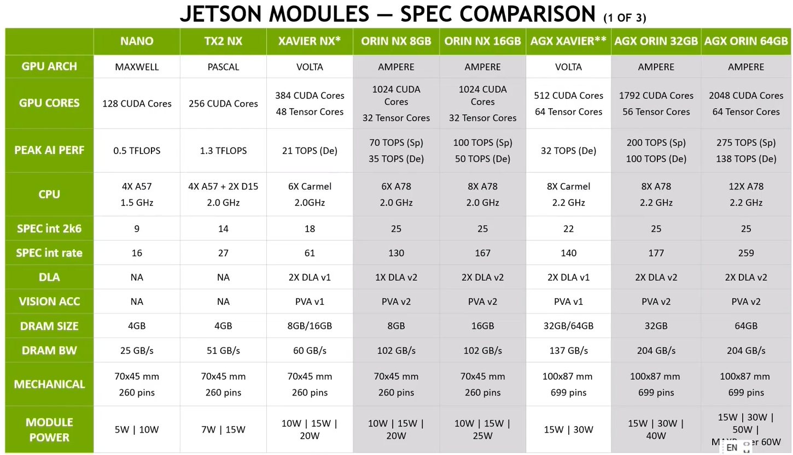
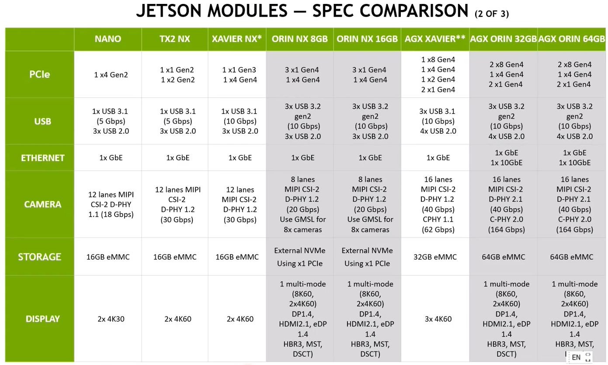
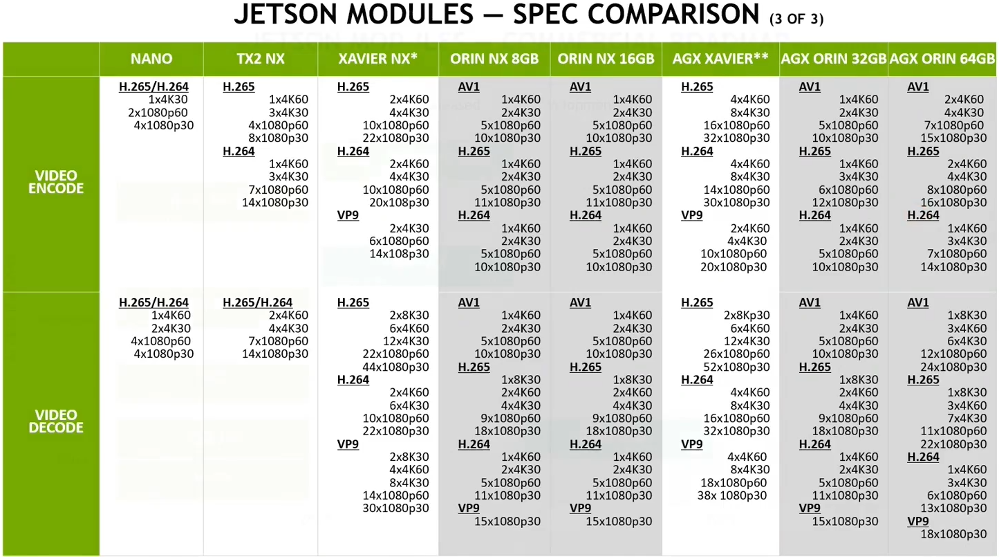

# NN加速器1.5【Nvidia边缘端平台】

本节补充介绍一下Nvidia推出的边缘端SoC平台的相关参数和实现

## 平台简介

参数对比图如下

### Jetson系列

* Jetson AGX Xavier

    提供32TFLOP@INT8算力

    10-30W

    存在32GB/64B内存（显存）两种型号

    官方售价$899/1299

* Jetson Xavier NX

    提供21TFLOP@INT8算力

    10-20W

    存在8GB/16GB内存（显存）两种型号

    官方售价$399/499

* Jetson TX2

    提供1.33TFLOP@FP16算力

    7.5-15W+

    官方售价$399

* Jetson Nano

    提供0.5TFLOP@FP16算力

    5-10W

    官方售价$99

### Orin系列

* Jetson Orin AGX

    搭载12核Cortex-A78处理器

    提供275TFLOP@INT8算力，基于Ampere架构GPU+双核NVDLA

    搭载PVA、HDR ISP

    10-30W

    64GB HBM，提供204GB/s带宽

* Jetson Orin NX

    * 8GB版本

        搭载6核Cortex-A78处理器

        提供70TFLOP@INT8算力，1024CUDA+32Tensor+1NVDLA

        10-20W

        官方售价$399

    * 16GB版本

        搭载8核Cortex-A78处理器

        提供100TFLOP@INT8算力，1024CUDA+32Tensor+2NVDLA

        10-25W

        官方售价$599

* Jetson Orin Nano

    搭载6核Cortex-A78处理器

    **阉割NVENC**

    * 8GB版本

        提供40TFLOP@INT8 sparse算力（20TFLOP@INT8 dense算力），1024CUDA+32Tensor，无NVDLA

        7-15W

        官方售价$399

    * 4GB版本

        提供20TFLOP@INT8 sparse算力（10TFLOP@INT8 dense算力），512CUDA+16Tensor，无NVDLA

        5-10W

        官方售价$599

    与Orin NX封装pin2pin兼容

## NV边缘计算SoC外设

### PVA

即Programmable Vision Accelerator，常见的机器视觉算法硬件加速器

### VIC

即Video Image Compositor，高级的的图像处理（包括变换、OSD等）加速器

### OFA

即Optical Flow Accelerator，光流和双目帧间视差计算的硬件加速器