# 基于PyTorch部署YOLO算法

本篇博文主要参考[Github开源代码](https://github.com/bubbliiiing/yolo3-pytorch)及对应教程总结

参考教程列在最后

> 2024.12.10 更新

## YOLO算法原理简介

YOLO即**You Only Look Once**算法，到目前为止共有11个基本版本：从YOLO到YOLOv11，除此之外还有一些系列衍生版本，比较出名的就是旷视科技的YOLOx

其最大的特点是**运行速度很快**，可以用于实时系统——这一点和古老的RCNN算法相反，RCNN虽然很准但是太慢了

与2023年起大火的基于Transformer（ViT）的目标检测算法想比，YOLO难以实现端到端，似乎更显落后，但因为其计算速度更快而始终没有被工业界放弃（或许在算力得到大幅提升后，DETR等模型将取代YOLO，但这至少需要较长一段时间），One-Stage的思想则贯穿始终，这是我们需要学习的。

### YOLO基础原理

对于目标检测任务，一直以来有两个流派：一个思路是将其分解为两个任务，先找到图片中某个存在对象的区域，然后再识别出该区域中具体是哪个对象，对于对象识别问题可以由很多经典的CNN算法完成，但对于寻找图像中目标所在区域却不好实现。一个最简单的想法就是遍历图片中所有可能的位置，逐一检测其中是否存在某个对象，挑选其中概率最大的作为输出——显然效率低得离谱

后来Fast RCNN/Faster RCNN出现了，先从图片中选出这些**候选区**（Region Proposals），再对其中的对象进行识别，最后还需要对候选区进行微调来让它们更接近真实的bounding box，这个过程称为**边框回归**。循规蹈矩的遍历-回归也正是它慢的原因。虽然Faster RCNN能将图片识别加快到5帧（2015年），但显然难以适应工业环境

> 早期的Tow-Stage类型的算法（大都基于RNN实现）大都有这个痛点

另一个思路的One-Stage类型算法则认为可以将目标检测看成一个任务，作为其中代表性算法的YOLO被提出解决了工业应用的问题

[YOLO](###参考论文)提出了新的解决方法：**将目标检测看作独立的一个任务**，也就是只要看一眼就能知道对象和它们的位置。不过YOLO还是借鉴了候选区的逻辑，将它内含于特性**单元格**（**Grid** Ceil）中，从而将一幅图片大致分成很多区域，挨个区域寻找。[自YOLOv2起](###YOLOv2的改进)，YOLO算法仿照Faster RCNN使用了预定义的**先验框**（Anchor Box）来近似边框回归的过程。

在最初的YOLO算法中，一幅图片被划分成SxS（下图为7x7）个**单元格**Grid Ceil，**每个单元格负责去检测那些中心点落在该格子内的目标**（Object）。如下图，狗的中心点位于红点所在单元格，该单元格负责预测这个狗。


在神经网络中，每个单元格会预测周围的B个边界框，所谓的边界框即**Bounding Box**，也称为BBox，一个BBox就包含了一个目标的位置（采用如下图所示红色框的左上角点坐标**x**、**y**和宽高**w**、**h**描述）信息和置信度（**Confidence**）信息。边界框的置信度包含两个方面：*所预测边界框含有目标的可能性大小*$Pr(object)$和*对应边界框的准确度IOU*，用下式表示：
$$
Pr(Object) * IOU_{pred}^{truth}
$$
如果有一个object落在一个grid cell里，第一项$Pr(object)$取1，否则取0

> 这个设置出于YOLO“**对自己负责**”的设计思想：一个Object只由一个grid来进行预测，不要多个grid都抢着预测同一个Object。
>
> 当对应边界框是背景，不包含目标时，$Pr(object)=0$；当边界框包含目标时，$Pr(object)=1$，这是一个二值函数。说人话就是如果边界框里面有目标的中心点，则设置$Pr(object)=1$，否则设为0
>
> 更具体地说就是在设置训练样本的时候，样本中每个Object归属到且仅归属到一个grid，即使有时Object跨越了几个grid，也仅指定其中一个。在计算出该Object的边界框的中心位置后，这个中心位置落在哪个grid，该grid对应的输出向量中该对象的类别概率就是被定为1（该gird负责预测该对象），所有其它grid对该Object的预测概率设为0（不负责预测该对象），这样既满足了*条件概率（下面会谈到）*，也能实现目标检测任务的精准划分

边界框（Bounding Box）的准确度可以用**预测框**（Predict Bounding Box）与**实际框**（Ground Truth）的**IOU**（Intersection Over Union，**交并比**）来表征。

> IOU表征了预测的Bounding Box与真实框Ground Truth的接近程度，这个IOU是在训练阶段计算的，用来让模型收敛
>
> IOU=交集部分面积/并集部分面积，2个框完全重合时，IOU=1，不相交时IOU=0

综合上述因素，可知YOLO输出的总置信度本质上相当于一个条件概率$P(C_i|object)$，其中object表示该单元格内含有目标的可能性大小，$C_i$表示该单元格内物体是$C_i$这个种类的概率，最后可以得到置信度$Confidence=Pr(object)*IOU$，这就推回了上面的式子。

这样，每个边界框中包含了 (x,y,z,w) 和confidence一共5个值；而每个网格还包含预测中心点落在其中Object的类别（**Class**）。因此对于C个类别物体、SxS个网格，每个网格要预测的B个边界框，整体网络的输出就是
$$
[S,S,(B*(4+1)+C)]
$$
上式是一个典型的YOLO输出3维张量，描述了每个网格输出（5xB+C）个BBox和对应类别的情景，该输出形式在**早期**的YOLO中得到使用

> 这里也体现了YOLO设计中“**对自己负责**”的思想：单元格（Grid Cell）负责预测对应中心点落在该格子内的目标，因此class信息是针对每个网格的；边界框（Bounding Box，BBox）负责预测目标的位置和置信度信息，因此x, y, w, h, confidence信息是针对每个bounding box的

举例来说，初代YOLO在PASCAL VOC中使用图像输入为448x448，取S=7，B=2，一共有20个类别（C=20），输出张量尺寸为(7,7,30)

但**上述YOLO的输出是不能直接使用的**，需要先进行解码（Decode）才能在图像上绘制图框（使用x,y,w,h信息）、标记种类（使用class信息）和确信度（使用confidence信息）。这就需要使用到YOLO后处理算法进行Decode。

每个BBox中的Confidence信息都杂糅了0或1的$Pr(object)$值，需要首先排除掉所有Confidence项。YOLO采用了很自然的想法：设置一个Sort-Filter，根据阈值超参数把所有Confidence信息从大到小排序后首先取前n项，再滤掉得分低于threshold的BBox，这就得到了**可能目标的位置**

> 这个Decode是对应每个BBox预测的Confidence都预先“编码”（Encode）了$Pr(Object)$项，需要将其剔除得到真正BBox的置信度

得到每个BBox的“class-specific confidence score”（原文语）后，留存的框框还是很多，这时候就需要对保留的BBox进行NMS处理，才能得到最终的检测结果。

> NMS算法在下文基本结构部分介绍

早期YOLO都采用上述Sort-Filter-NMS三步法，但后续版本中，该后处理算法甚至得到了强化，以至于成为嵌入式部署开发者的一大负担——YOLO的后处理算子基本无法硬件（基于NPU）加速。而后处理过程中的NMS算法正是YOLO难以实现端到端的最大原因。

下图给出了[第一代YOLO算法](https://arxiv.org/abs/1506.02640)的主干网络结构（不包含后处理），可以发现它与其他早期版本的CNN一样，呈现出经典的层级结构

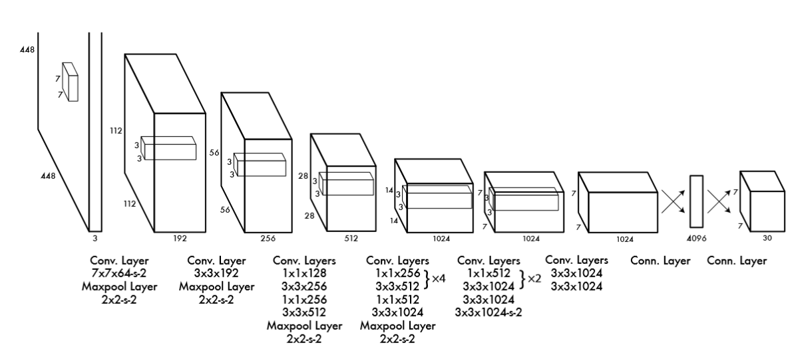

实际物体有大有小，早期YOLO（YOLO、YOLOv2）的缺陷就在于难以预测小物体，于是从YOLOv3开始就引入了**特征金字塔**（**Feature Pyramid**）的概念。它通过对图像下采样建立一个图形金字塔来实现针对大、中、小号物体的检测：比如一张416x416像素的图片，可以将其分成大单元格组成（每个格子是52x52像素，共有个8x8个框）、中单元格组成（每个单元格是26x26像素，共有16x16个框）、小单元格组成（每个单元格是13x13像素，共有32x32个框）的三种**特征图**（Feature Map），对每个特征图进行分析从而更完善地实现目标检测

对于多重Scale，目前主要有以下几种主流方法，如下图所示：


(a) 这种方法最直观。首先对于一幅图像建立图像金字塔，不同级别的金字塔图像被输入到对应的网络当中，用于不同scale物体的检测。但这样做的结果就是每个级别的金字塔都需要进行一次处理，速度很慢。

(b) 检测只在最后一个特征图上进行，这个结构无法检测不同大小的物体。

(c) 对不同深度的特征图分别进行目标检测。[SSD算法](###参考论文)中采用的便是这样的结构。缺点在于每一个特征图获得的信息仅来源于之前的层，之后的层的特征信息无法获取并加以利用。

> SSD算法采用了这样一种思路：特征层（Feature Layer）的大小随层数不断增加而逐渐减小，并且每产生一个特征层，都会对这一层进行目标检测，然后所有的检测结果都会被Fast NMS合并筛选，最终生成最后的bbox。它的原本思路是在不同深度的特征图获得后，直接进行目标检测，这样小的物体会在相对较大的特征图中被检测出来，而大的物体会在相对较小的特征图中被检测出来。这样的结构有助于检测到不同大小的物体，但是会忽略下一层可能得到的增殖特征。在实际的特征图中，深度不同所对应的特征图包含信息不是绝对相同的。随着网络深度的加深，浅层的特征图中主要包含低级的信息（物体边缘，颜色，初级位置信息等），深层的特征图中包含高等信息（例如物体的语义信息：狗，猫，汽车等等）。因此在不同级别的特征图中进行检测，听起来好像可以对应不同的尺度（Scale），但是实际上精度并没有期待的那么高。

(d) 与(c)很接近，但有一点不同的是**当前层的特征图会对未来层的特征图进行上采样并加以利用**。这是一个有跨越性的设计，因为有了这样一个结构，当前的特则会概念图就可以获得“未来”层的信息，从而让低阶特征与高阶特征有机融合，提升检测精度。

> 这里的“上采样”并不是简单的传统算法resize，而是通过卷积神经网络实现的升维，即特征金字塔的高层提炼了更高维度的图像信息

YOLOv3中，先通过特征提取网络对输入图像提取特征，得到三种大小的**特征图**（Feature Map）：**52x52**、**26x26**、**13x13**，然后对应分出52x52、26x26、13x13个**grid cell**，如果某个目标的中心位于哪个grid cell里，就由对应的grid cell来预测目标的种类（典型的YOLO思维），YOLO要求每个grid cell都会预测固定数量的边界框（BBox），只有和IOU最大的边界框才能用于预测对应目标

> YOLO就是用了(d)思路，YOLOv3将采样网络的最后三层输出分别使用上采样网络和Concat进行连接，进一步提取预测特征

### YOLO的基本结构

所有YOLO算法都大致可以分成三个部分（不包含后处理部分）：

* **Backbone**：残差卷积，用于提取图像特征，作为YOLO主干网络，可以随意替换
* **Neck**：上采样网络和输出环节，将图像特征通过图像金字塔融合，分成多个YOLO检测头输出
* Prediction（**Head**）：YOLO检测头，进行特征图到YOLO标准输出张量的映射，同时负责分辨种类，得到预测结果BBox

上述结构基本是在YOLOv3后定型的，在此之前的早期YOLO都使用了类似AlexNet一样的卷积层堆叠，只能分出Backbone和Head部分。

YOLO要求输入为416x416像素的RGB图像，一般来说被保存为`Tensor[-1, 416, 416, 3]`（即常见的NHWC格式，其中-1代表网络允许输入多个Batch）。输出是一个`Tensor[-1, 7, 7, 30]`（v1）或`Tensor[-1, 56, 56, 255]`（v3）

每个版本的YOLO输入输出格式大都不一样，不过它们的映射关系是类似的：将输入的三通道图像（`Tensor[<输入图像宽>, <输入图像高>, 3]`）映射为对应scale的信息张量（`Tensor[<输出scale>, <输出scale>, P<每个可能目标种类的概率>+C<每个边界框的置信度>+S<边界框的位置坐标>]`）。输入很好理解，就是RGB图像；输出Scale表示的是当前特征图在x、y方向的单元格数

每个YOLO版本对应的可支持识别对象种类数决定了P：比如初代YOLO支持20种不同目标种类，那么P=20

> 需要注意：这里的概率表示*条件概率*，其条件概率值都是对应网格位置存在任意一种对象条件下对应目标种类的概率。具体含义就是上面基础原理部分讲述的置信度信息。在此基础上，对应目标种类$C_i$的概率才是其边界框置信度P
>

输出张量最后的S参数是四个边界框位置参数：**width、height、corner_x、corner_y**，一般使用“x,y,w,h”描述。在后续版本的YOLO算法中，预测机制有所微调，输出的x、y值从左上角角点坐标换为Object中心点坐标

为了从输出的复杂Tensor中提取出最有可能的那些对象和位置，YOLO采用**NMS**（Non-maximal suppression，**非极大值抑制**）算法。其核心思想是：**选择得分最高的作为输出，与该输出重叠的去掉，不断重复这一过程直到所有备选处理完**，主要解决的是一个目标被多次检测的问题

> 在很多情况下，会被多次同一个边界框会被多次检测，但是我们希望最后仅仅输出其中一个置信度最高的预测框和对应的种类，使用NMS算法可以这样实现：首先从所有的检测框中找到置信度最大的那个框，然后挨个计算其与剩余框的IOU，如果计算值大于预设的阈值（重合度过高），那么就将该框剔除；然后对剩余的检测框重复上述过程，直到处理完所有的检测框

针对YOLO的实际预测过程，这里我们不考虑批输入，认为只是预测一张输入图片，以初版YOLO为例：最终的网络输出是7x7x30的Tensor，我们可以将其分割成三个部分：类别概率部分为`Tensor[7,7,20]`，置信度部分为`Tensor[7,7,2]`，而边界框部分为`Tensor[7,7,2,4]`（*需要先根据原始图片和先验框计算出其真实值*）。然后将前两项相乘得到真正的置信度，这样所有的准备数据已经得到了（每个边界框对于所有种类各自的真正置信度）

最自然的思路就是：首先对于每个预测框根据类别置信度选取置信度最大的那个类别作为其预测标签，预先设置一个置信度阈值，将置信度小于该阈值的框过滤掉，剩余的是置信度比较高的预测框，最后再对这些预测框使用NMS算法，留下来的就是检测结果

> NMS是对所有预测框一视同仁或者区分类别进行计算需要仔细考虑。一般来说大家都**区分每个类别分别使用NMS**，但是在某些情况下一视同仁的准确度更高

初代YOLO算法的官方实现采用了不同的处理思路：先使用NMS，然后再确定各个边界框的类别。对于98个框，首先将小于置信度阈值的值归0，然后分类别地对置信度值采用NMS，这里NMS处理结果不是剔除，而是将其置信度值归为0。最后才是确定各个box的类别，当其置信度值不为0时才做出检测结果输出。

如下所述：

1. 设置一个Score的阈值，低于该阈值的候选对象排除掉（将对应Score设为0）
2. 遍历每一个对象类别使用NMS
3. 遍历该对象的98个Score
4. 找到Score最大的那个对象及其bounding box，添加到输出列表
5. 对每个Score不为0的候选对象，计算其与前一步输出对象的边界框的IOU
6. 根据预先设置的IOU阈值，所有高于该阈值（重叠度较高）的候选对象排除掉（将Score设为0）
7. 如果所有边界框要么在输出列表中，要么Score=0，则该对象类别的NMS完成，返回步骤2处理下一种对象 
8. 获得输出列表即为预测的对象

> 根据原论文所述，NMS算法对YOLO的性能影响很大，为了尽可能提高速度，就采用了这种不是很直接的思路

**两种策略结果是一样的**，在后续版本的YOLO中，两种后处理思路都是可以的

### YOLO的训练特点

由于YOLO是呈现前后解耦的三个主干网络，所以训练时会优先对最前面的下采样网络（特征提取网络）进行预训练，在此基础上训练整体网络。为了让网络适应不同的输入图像尺寸、不同的目标尺寸，YOLOv2以后的网络在训练时会根据规则调整网络参数和输入图

> 初代YOLO先使用了ImageNet数据集对前20层卷积网络进行预训练，然后再使用完整的网络进行微调（Fine-tuning）训练

早期YOLO使用sum-squared error loss损失函数，如下图所示

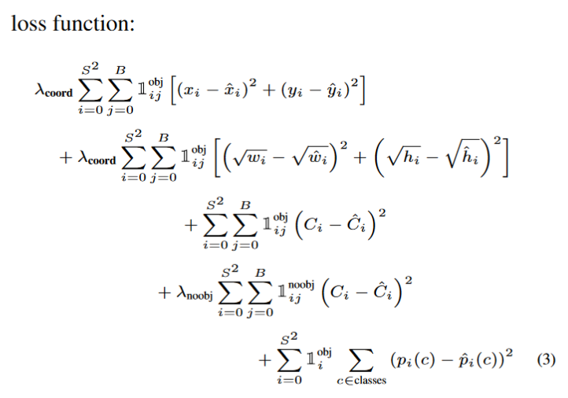

前两行计算预测坐标（x,y,w,h）损失，第三行是对BBox中包含Confidence信息的预测损失，第四行是不含Object的BBox的Confidence信息的预测损失，最后一行用于计算类别（Class）预测损失

YOLO的最后一层采用线性激活函数Sigmoid（自v3版本，早期YOLO使用Softmax），其它层都是LeakyReLU。训练中还采用了drop out和数据增强（data augmentation）来防止过拟合

### YOLOv2的改进

[YOLOv2](###参考论文)在网络结构上的核心改进在于引入了**BN**（Batch Normalization批标准化）**算子**，并引入了伴随YOLO算法很长一段时间的**先验框（Anchor Box，也可翻译为锚框）**。

BN算子在现代的CNN中已经是标配了，但在2016年，它确实是一个新概念——引入BN层有助于解决反向传播过程中的梯度消失和梯度爆炸问题，降低对一些超参数（如学习率、网络参数的大小范围）及激活函数的敏感性

初代YOLO包含全连接层，从而直接预测BBox包含的坐标值。借鉴Faster RCNN，YOLOv2也尝试采用**先验框**。在每个grid cell预先设定一组不同大小和宽高比的边框，覆盖整个图像的不同位置和多种尺度。这些先验框作为预定义的候选区，检测覆盖范围内是否存在Object，并能辅助微调目标边界框的位置。

> Faster RCNN的方法只用卷积层与RPN（Region  Proposal Network）算子来预测Anchor Box的偏移值与置信度，而不是直接预测坐标值。作者发现通过**预测偏移量**而不是坐标值能够简化问题，让神经网络学习起来更容易。

初代YOLO每个grid只能预测两个BBox，导致整个图像最多能预测的目标仅有SxSx2个（若S=7，则为98个）；YOLOv2中每个grid采用A个先验框，则总共能够预测出SxSxA个目标（若S=13，A=9，则为1521个）。先验框机制不仅让YOLO摆脱了全连接层，而且增加了可预测的目标数，这对小目标预测至关重要。在实验中，使用先验框会让精确度（precision）稍微下降，但能让YOLO能预测出大于一千个框，同时召回率（recall）和mAP大大提高。·

这个先验框一般采用手动选择（这也是为什么要叫它“先验”，因为它包含了先验信息）。YOLOv2对训练集中目标的边框进行K-means聚类分析，以寻找尽可能匹配样本的边框尺寸。

在Faster RCNN训练的早期阶段，目标位置预测容易不稳定：先验框的宽度和高度由学习而来，其取值没有任何约束，因此预测边框的中心可能出现在任何位置。因此YOLO调整了预测公式，将预测边框的中心约束在特定gird网格内

这里需要提到先验框机制的一个问题，如下图所示，当输入为416*416时，网络最后的三个特征图大小为13x13，26x26，52x52。图中的黄色框是目标的ground truth值，即标注框；蓝色框是目标中心点所在grid对应的Anchor Box

> 样本中每个Object归属到且仅归属到一个grid。该gird负责预测该对象，所有其它grid不负责预测该对象

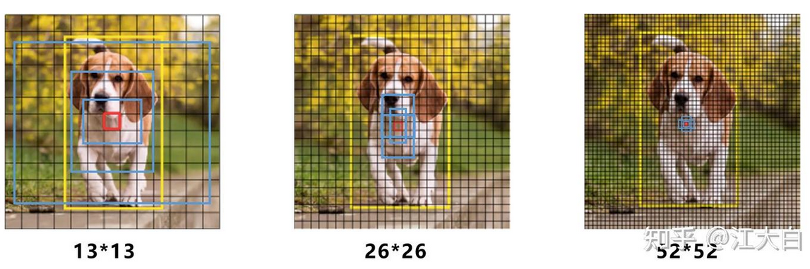

如果网络训练时既定的目标种类较少，先验框机制是没有问题的，但随着预测种类的增多（比如COCO数据集有80个类别），每个先验框都有自己的x、y、w、h、obj、class共5类参数，这会导致网络需要输出的结果数量为
$$
(5+class)*(f_a + f_b + f_c)*n_{A}
$$
其中，class表示预测种类，f分别表示三个特征图的像素数，n表示预先标记先验框的数目。这里以上图416x416输入图再COCO数据集下的预测结果为例，产生
$$
(5+80)*(13*13+26*26+52*52)*3=904995
$$
个预测结果——若输入变为640x640，则将产生2142000个预测结果，进而对后续的NMS造成极大负担，严重拖累网络性能！虽然Anchor-Based范式能够提高精度，但它也存在巨大的性能问题。遗憾的是，直到后续的YOLOX和YOLOv6，先验框问题才被解决

### YOLOv3的改进

2018年，[YOLOv3](###参考论文)的提出奠定了YOLO基础结构，从v3起，YOLO可以通过改变模型结构来权衡速度与精度（此前只能改变输入图来权衡）

> It achieves 57.9 AP50 in 51 ms on a Titan X, compared to 57.5 AP50 in 198 ms by RetinaNet, similar performance but 3.8× faster

第三个版本的改进点主要有三个：

* **引入FPN**

    FPN的基本形态在上文的YOLO基础原理部分已经进行了介绍。需要提到的是：在2016年，论文Feature Pyramid Networks for Object Detection提出了所谓的特征金字塔网络，YOLOv3正是对该结构进行了修改并引入。

    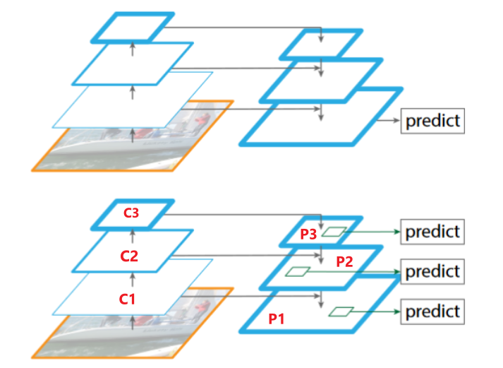

    FPN的灵感来自于传统图像处理中的高斯金字塔、拉普拉斯金字塔。拉普拉斯金字塔通过采集高斯金字塔的残差来提取背景特征，而卷积层显然比求差更能提取高维特征。FPN中，在原图基础上使用三个卷积层*自底向上*得到不同尺度（每个图都是一个tensor，因此可以称为不同维度）的特征图C1、C2、C3（特征图经过卷积，尺寸会越来越小），再与右侧金字塔通过两个卷积层得到的三个特征图相加减（add/sub）或者直接拼接（concat）得到输出特征图P3、P2、P1。

    > 作者将左侧金字塔上采样的一次过程称为一个stage，每次抽取的特征都是每个stage最后层的输出。因此金字塔最后一层具有最强的语义特征，众多层一起构成了特征金字塔

    高层的特征图具有更小的尺寸，因此**左侧金字塔中的卷积层起到了升维和下采样的作用**。右侧金字塔*自顶向下*的路径基于上采样（Upsampling）算子实现，将高层特征图上采样为尺寸更大的特征图。图中的横向连接是将C1、C2、C3和上采样生成的相同大小特征图P1、P2、P3进行融合，因此**右侧金字塔中的卷积层起到了二次特征提取和上采样的作用**，能够反映不同维度图像特征之间的残差关系

* **引入Darknet-53这样的残差卷积神经网络**

    2015年的[ResNet](###参考论文)解决了深层CNN难以训练的问题，采用残差结构的Darknet-53能够提供远超早期AlexNet风格卷积神经网络的性能

* **抛弃了基于Softmax的分类器，并将分类损失换成交叉熵（binary cross-entropy loss）**

    早期YOLO采用简单的Softmax单标签分类，YOLOv3将原来用于单标签多分类的softmax层改进为用于**多标签分类**的逻辑回归（logistics）层。具体方式就是将网络类别（Class）输出端的Softmax算子改成**Sigmoid**算子

    > 早期YOLO假设一张图像或一个目标只属于一个类别，但在一些复杂场景下，一个object可能属于多个类。比如预设的类别中存在apple和red apple这两类，那么就会多标签分类就会同时识别出这两个类

    Sigmoid算子可以将输入约束在0到1的范围内，因此当一张图像经过特征提取后的某一类输出经过sigmoid函数约束后如果大于0.5，就表示属于该类。不过引入Sigmoid后导致**计算量大大增加**，而且分类损失需要更换为二分类交叉熵

### YOLOv3算法结构

YOLOv3算法结构图如下所示


可以发现算法主要由三部分组成：

* **Backbone**：实际上是一个Darknet-53残差神经网络，用于提取图片中的特征
* **Neck**：进行上采样，将提取出的特征分成三个特征图输出，每条输出路径都被称为一个“YOLO Head”
* Prediction（**Head**）：用于处理目标检测结果并以BBox方式输出

将上面的结构图转换成下面的形式会更方便理解


其中Backbone部分可以看成由一个CBL和5个ResNet构成

* **CBL**：也常称为**DBL**，YOLOv3中的最小组件，包含了`Conv-BN-LeakyReLU`这样的结构，可以看成经过改进的卷积单元组合

  > CBL就是取结构首字母**C**onv-**B**N-**L**eakyReLU组成的
  >
  > DBL的意思就是“Darknet Basic Layer”
  >
  > 两种名称都可以称呼这个组织结构（把LeakyReLU换成普通ReLU也可以用这个名称描述）

  

  ```python
  self.conv1 = nn.Conv2d(inplanes, planes[0], kernel_size=1, stride=1, padding=0, bias=False)
  self.bn1 = nn.BatchNorm2d(planes[0])
  self.relu1 = nn.LeakyReLU(0.1)
  ```

* **ResNet Unit**：残差单元，结构如下图所示

	

	两层CBL加一条**残差边**就构成了残差单元，在后面会遇到**ResNetx**的写法，表示内部有x个残差组件外加一个CBL

	残差边指的是从输入直接连到输出并和两个CBL输出叠加的那一部分数据

	

	ResNetx中的CBL起到了下采样的作用

	```python
	class ResUnit(nn.Module):
	    def __init__(self, inplanes, planes):
	        super(ResUnit, self).__init__()
	        self.conv1 = nn.Conv2d(
	            inplanes, planes[0], kernel_size=1, stride=1, padding=0, bias=False)
	        self.bn1 = nn.BatchNorm2d(planes[0])
	        self.relu1 = nn.LeakyReLU(0.1)
	
	        self.conv2 = nn.Conv2d(
	            planes[0], planes[1], kernel_size=3, stride=1, padding=1, bias=False)
	        self.bn2 = nn.BatchNorm2d(planes[1])
	        self.relu2 = nn.LeakyReLU(0.1)
	
	    def forward(self, x):
	        residual = x
	        # CBL_1
	        out = self.conv1(x)
	        out = self.bn1(out)
	        out = self.relu1(out)
	        # CBL_2
	        out = self.conv2(out)
	        out = self.bn2(out)
	        out = self.relu2(out)
	        # ADD
	        out += residual
	        return out
	```

接下来会遇到[1, 2, 8, 8, 4]这个数组，表示Backbone部分是由下面的结构串成的

`CBL-ResNet1-ResNet2-ResNet8-ResNet8-ResNet4`

在两个ResNet8和ResNet4的输出部分，会引出三个特征图（Feature Map），这一段的输出就对应了FPN中左侧的升维金字塔


接下来三个特征图会被引入到Neck部分做进一步**上采样**（UpSampling），这里对应了FPN右侧的二次特征提取金字塔。首先输入的是最小特征图13x13：它是由ResNet4输出的，会首先被送到一个上采样层

* UpSampling：连续的五层Conv，如下所示

	这个特征图会被五层Conv处理，从而得到第一个**预测节点**输出

	```python
	def make_last_layers(filters_list, in_filters, out_filter):
	    # Generate Last Layer
	    m = nn.Sequential(
	        conv2d(in_filters, filters_list[0], 1), # get feature 1
	        conv2d(filters_list[0], filters_list[1], 3), # get feature 2
	        conv2d(filters_list[1], filters_list[0], 1), # get feature 3
	        conv2d(filters_list[0], filters_list[1], 3), # get feature 4
	        conv2d(filters_list[1], filters_list[0], 1), # get feature 5
	        conv2d(filters_list[0], filters_list[1], 3), # get result 1
	        nn.Conv2d(filters_list[1], out_filter, kernel_size=1, stride=1, padding=0, bias=True) # get result 2
	    )
	    return m
	...
	self.last_layer0 = make_last_layers([512, 1024], out_filters[-1], len(anchors_mask[0]) * (num_classes + 5))
	```

	需要注意：这里与上面的图示存在差别，在YOLOv3的各版本实现中Prediction部分是不同的！

* 上采样金字塔：将第一层预测节点输出作为下一次输入的一部分，通过**Concat**和第二个ResNet8的输出连接，这个操作并不会将二者相加，而是会改变输出Tensor的维度

	接下来就是再次通过5层CBL运算得到第二个预测节点的输出

	重复这一步骤，将第二个预测节点输出和第一个ResNet8的输出相Concat，再通过5层CBL就得到了第三个预测节点

最后，得到的三个预测节点被送到Prediction部分，每个预测节点都会通过两层`CBL-Conv`处理，分别得到三种不同大小的输出特征图

* 13x13特征图：13x13x255
* 26x26特征图：26x26x255
* 52x52特征图：52x52x255

最后一部分的PyTorch实现如下所示

```python
def forward(self, x):
	# Get Features in Shape of:
    # 52,52,256 max
    # 26,26,512 mid
	# 13,13,1024 min
    x2, x1, x0 = self.backbone(x)

    """
    Feature3 from out5
    13,13,1024 -> 13,13,512 -> 13,13,1024 -> 13,13,512 -> 13,13,1024 -> 13,13,512
    """
    # Get Branch
    out0_branch = self.last_layer0[:5](x0)
    out0        = self.last_layer0[5:](out0_branch) # out0 = (batch_size,255,13,13)
    # UpSample
    # 13,13,512 -> 13,13,256 -> 26,26,256
    x1_in = self.last_layer1_conv(out0_branch)
    x1_in = self.last_layer1_upsample(x1_in)
    # Concat
    # 26,26,256 + 26,26,512 -> 26,26,768
    x1_in = torch.cat([x1_in, x1], 1)

    """
    Feature2 from out4
    26,26,768 -> 26,26,256 -> 26,26,512 -> 26,26,256 -> 26,26,512 -> 26,26,256
    """
    # Get Branch
    out1_branch = self.last_layer1[:5](x1_in)
    out1        = self.last_layer1[5:](out1_branch) # out1 = (batch_size,255,26,26)
    # UpSample
    # 26,26,256 -> 26,26,128 -> 52,52,128
    x2_in = self.last_layer2_conv(out1_branch)
    x2_in = self.last_layer2_upsample(x2_in)
    # Concat
    # 52,52,128 + 52,52,256 -> 52,52,384
    x2_in = torch.cat([x2_in, x2], 1)

    """
    Feature1 from out3
    52,52,384 -> 52,52,128 -> 52,52,256 -> 52,52,128 -> 52,52,256 -> 52,52,128
    """
    out2 = self.last_layer2(x2_in)

    # Output
	return out0, out1, out2
```

整体来看，训练过程中对于每幅输入图像，YOLOv3会预测三个不同大小的3-D tensor，对应三个不同的Scale。**设计这三个Scale的目的就是为了能够检测出不同大小的物体**。Tensor大小分别为52x52、26x26、13x13

以`Tensor[-1, 13, 13, 255]`为例，原始输入图像会被分成分割成13x13的**单元格（grid cell）**，每个单元格对应着3D tensor中的1x1x255这样一个长条形维度。

> YOLOv3支持80个种类（因为它使用到了含有80种目标的COCO数据集进行训练）
>
> 255这个数字来源于`3*(80+4+1)`，其中`3`代表这个单元格包含3个边界框；`80`代表对应每个类别物体的置信度（Confidence）；`4`代表bounding box的四个坐标；`1`代表BBox中包含的复合置信度信息（即之前提到的$Pr(Object) * IOU_{pred}^{truth}$）

如果训练集中某一个实际框（Ground Truth）对应的目标中心恰好落在了输入图像的某一个单元格中，那么这个单元格就负责预测此物体的边界框（YOLO的基础设计思想），中心所在的这个单元格所对应的物体置信度就被赋予1，其余的单元格则为0（也就是$Pr(object)$）

由于每个单元格被赋予3个不同大小的**先验框**（Prior Box 或者说 Anchor Box），训练过程中这个单元格会逐渐学会如何选择哪个大小的先验框，以及如何对这个先验框进行微调（即offset/coordinate）。YOLO遵循这样的规则：**每个单元格只选取与实际框的IOU重合度最高的那个先验框**。上面说有三个预设的不同大小的先验框——作者首先在训练前提前将COCO数据集中的所有bbox使用`K-means clustering`分成9个类别，每3个类别对应一个Scale，这样总共3个Scale。这样的先验信息可以有效帮助网络准确预测每个预测框的offset/coordinate。

得到三个特征图后，就可以把它们送到后处理步骤。

### 多头后处理

在引入多个YOLO Head检测头后，出现了一个问题：如何对三个乃至更多输出图进行统一的后处理呢？其实很简单：拼接。

每个YOLO Head输出都是一个3-D Tensor，以YOLOv3为例，尺寸分别是`[52,52,255]`，`[26,26,255]`，`[13,13,255]`，在后处理过程中，只需要保证最后一个尺寸不变，直接将52+26+13=91条输出拼接（Concat）起来即可。最后得到`[91,91,255]`即8281个BBox直接输入到Sort-Filter-NMS后处理算法即可。为了加快处理，需要在此之前排除所有置信度为0和较小的BBox

### Darknet的YOLO实现

darknet是官方的YOLO实现，使用基于C/C++的Darknet编写

> 相比于TensorFlow来说，Darknet并没有那么强大，但是它完全由C实现且没有任何依赖，同时支持CPU和GPU运算

源码通过`https://github.com/pjreddie/darknet`获取

git clone以后只需要使用

```shell
cd darknet
make
```

就可以完成编译了

随后下载预训练的权重文件并将它放在darknet目录下就可以使用检测功能

```shell
wget https://pjreddie.com/media/files/yolov3.weights
./darknet detect cfg/yolov3.cfg yolov3.weights data/dog.jpg
```

darknet的yolo使用VOC格式数据集进行训练

## 应用广泛的YOLO

目前大部分边缘端设备的目标检测demo都选择基于[YOLOv5](###参考论文)来实现。YOLOv5是基于YOLOv4改进而来，这两代算法对YOLO系列做了最重要的几项改进。yolov4是yolov3基础上的大规模改进；yolov5则没有继续对v4的框架进行改动，只是调整了网络结构来提高速度和准确度，因此能够很好地适应工业场景，尤其是ultralytics的YOLOv5是很经典的针对工业场景的实现，可以有效地部署在手机平台或边缘设备上。

> YOLOv5与YOLOv4都是2020年提出的

### YOLOv4结构改进


如上图所示，Yolov4在Yolov3的基础上进行了很多的创新。

在结构方面，CBL被保留下来，同时加入了CSP结构、SPP结、PAN结构。虽然加入了很多新结构，但是总体上还是Backbone-Neck-Prediction（Head）三部分

里面的五个基本组件：

* CBM：Conv-BN-Mish组成的最小网络组件
* CBL：Conv-BN-LeakyReLU组成的最小网络组件，v3里面CBL的保留
* ResUnit：将v3里面的CBL改成CBM，结构不变
* CSPx：借鉴CSPNet结构而来的特征提取组件，取代了v3中的ResNetx，依然是`[1, 2, 8, 8, 4]`构成残差特征提取网络
* SPP：一套最大池化层网络的组合，用于对提取到的特征图进行**多尺度融合**

在算法思路部分，每个部分进行的改进如下：

* Input：采用**Mosaic数据增强**、**cmBN**、**SAT自对抗训练**
* Backbone：结合了**CSPDarknet53**、**Mish**激活函数、**Dropblock**，通过提升网络深度和复杂度获取更好的特征提取效果
* Neck：加入了**SPP模块**，并在原先的FPN结构上叠加了**PAN结构**
* Prediction：保留YOLOv3三个检测头输出的结构，改进训练时的损失函数**CIOU_Loss**和使用了**DIOU_nmns**算法

接下来仔细说一下每个改进的作用及含义

### Mosaic数据增强

这是参考了**CutMix数据增强**提出的方法，使用4张图片随机缩放、裁剪、排布后再进行拼接，这样有助于丰富数据集、减少GPU使用。主要步骤如下：

1. 每次随机读取四张图片
2. 分别对每张图片进行随机的反转、尺寸缩放、改变明度/饱和度/色调
3. 将图片组合到同一张图片中，若出现空隙则用黑色填充
4. 在上述过程中会导致标注框被裁剪，需要对应删除和调整标注框以方便计算损失函数

> 训练时使用Mosaic数据增强，可以一次性计算4张图片的数据，使得Mini-batch大小并不需要很大，只要一个GPU就可以获得比较好的效果

如果上一个iteration中，小物体产生的**loss不足**（比如小于某一个阈值），则下一个iteration就用**拼接图**；否则就用**正常图片**训练

### CSPDarknet53结构

这是在Darknet53基础上借鉴CSPNet经验组成的特征提取网络，并且引入了Backbone部分特供的**Mish激活函数**
$$
mish=x*tanh(ln(1+e^x))
$$
它和LeakyReLU的区别在于负半轴，LeakyReLU在负半轴有一个固定的斜率$\lambda$，而mish则有一个非常近似于0的非线性部分

> 这个非线性部分很好地增强了网络的性能，不过对于嵌入式设备太不友好了。tanh、ln和exp的组合就像1453年的奥斯曼帝国打君士坦丁堡一样狂暴鸿儒缺少大规模dsp甚至是fpu的嵌入式设备，嵌入式设备还是应该老老实实用LeakyReLU/普通ReLU
>
> 喜报：YOLOv5以后就避免了使用这类激活函数

CSP的总体结构和Darknet类似，只不过把CBL换成了**CBM**（**C**onv-**B**N-**M**ish）。每个CSP模块前面的卷积核的大小都是3x3，stride=2，起下采样作用

CSP模块先将基础层的特征映射划分为两部分，然后通过跨阶段层次结构将它们合并，在减少了计算量的同时可以保证准确率，如下图


注意右下角的CSPX，自第一个CBM起分成了两部分，一个部分经过残差网络提取深度特征，然后另一部分在经过简单处理后与深度特征融合

### Dropblock

YOLOv4的Dropblock和常见网络中的Dropout功能类似，也是缓解过拟合的一种正则化方式，通过**随机删除减少神经元的数量，使网络变得更简单**，这会随机的删减丢弃一些信息，但卷积层在丢失上层数据的情况下仍然可以从相邻的激活单元学习到相同的信息

这是YOLO系列中v4独有的功能。不过这个东西对于网络的性能没什么提升，还会让网络变慢，唯一的作用就是削弱训练过程中的过拟合，后续的YOLO算法就把该模块扔掉了

> 看上去没什么用，实际上确实没什么用

### SPP模块

SPP（Spatial Pyramid Pooling）模块其实在Yolov3中已经以单层池化的形式存在了，而在v4中得到了普遍应用。它使用多个池化层并行，参数为`[1*1（相当于直接输出）, 5*5, 9*9, 13*13]`，最后再Concat拼接在一起，能有效**增加主干特征的接收范围，显著的分离了最重要的上下文特征**

一个通用的SPP模块示例如下图

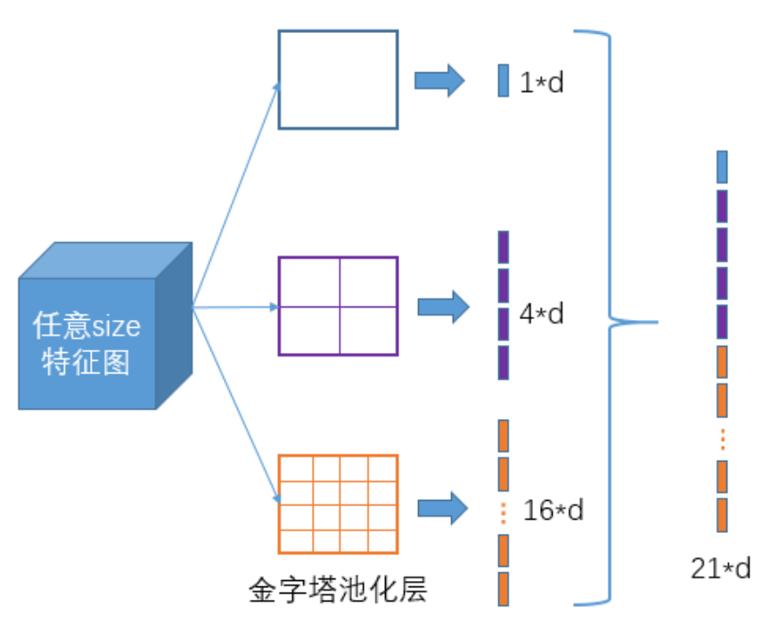

这个模块在之后的YOLOv5中也有保留，对网络的提升效果很大

### FPN+PAN结构

YOLOv3 Neck部分的特征金字塔被保留下来，但融合[PANet](###参考论文)进行了修改。最初“下采样”形成图像金字塔的过程，即`[12884]`里面8-8-4各自引出一个scale特征图的部分得到了保留，v4版本修改了特征图的尺寸，如下图左侧的黄色箭头所示


> "CSP8"采样出76x76特征图，第二个"CSP8"采样出38x38特征图，"CSP4"采样出19x19特征图

上图右侧用绿色上采样箭头连起来的图像金字塔就是原版FPN结构——自顶向下将高层特征信息用上采样方式融合


如上图（来自PANet论文）所示，YOLOv4借鉴了PANet的思路，将PAN与FPN交叉使用。2018年的PANet来自目标分割领域，其原论文就是在FPN的基础上，通过额外增加一个自下而上的特征提取金字塔来获得较强语义。

在目标分割任务中，需精确识别物体边缘，而大尺度的浅层网络中包含了大量边缘细节信息，这是PANet所需要的。而在深度较高的CNN和FPN中，从C2到C5（上图采用了四层FPN），再从P5到P2的过程需要经过大量卷积层，这会导致边缘信息丢失。因此PANet作者在其之外添加了一个由不到10层卷积形成的下采样阵列，从FPN右侧的特征提取金字塔输入端直接得到C2到C5的原始特征图数据，并与从P5到P2的下采样特征图输出进行Concat，起到保留细节信息的作用。

YOLOv4选择PAN的主要原因则是它能够准确地保存空间信息。当图像经过神经网络的各个层时，特征的复杂度增加，特征图中的语义信息增多，但空间信息和分辨率会降低，而PAN正好可以弥补这一点

v4模型中计算的特征图尺寸如下所示


不难发现，**PAN结构在FPN的输出基础上又进行了一次下采样**，对应下图右侧的三个Concat


FPN层自顶向下传达**强语义特征**，而PAN则自底向上传达**强定位特征**，从不同的主干层对不同的检测层进行参数聚合

整理一下采样的顺序：CSP4的19x19输出首先进入SPP，与来自第二个CSP8的输出Concat以后变为FPN金字塔的38x38特征图；19x19特征图在通过SPP后还会被缓存给PAN金字塔使用。下一步就是第一个CSP8输出的76x76特征图与经过二次上采样的38x38特征图融合得到为PAN金字塔准备的76x76特征图；在这一过程中间，38x38特征图也被缓存下来。这样得到FPN金字塔的三层完整结构，首先进行76x76特征图与38x38特征图的混合下采样，最后是38x38与19x19的混合下采样，分别得到PAN金字塔的三层输出特征图。

最终Prediction部分获得三个特征图：

* 76x76x255
* 38x38x255
* 19x19x255

自从YOLOv4后，各个视觉神经网络模型中的单一FPN开始被*SPP+FPN连接+PAN*的结构取代

### IOU_Loss

目前有四种IOU损失函数的计算思路，他们的特征如下：

**IOU_Loss**：主要考虑检测框和目标框重叠面积。

**GIOU_Loss**：在IOU的基础上，解决边界框不重合时的问题。

**DIOU_Loss**：在IOU和GIOU的基础上，考虑边界框中心点距离的信息。

**CIOU_Loss**：在DIOU的基础上，考虑边界框宽高比的尺度信息。

在YOLO中训练和部署分类过程都需要使用IOU损失函数，YOLOv4在训练中使用CIOU，**在后处理的nms算法内嵌入了DIOU**。CIOU_loss是在DIOU_loss的基础上添加影响因子，从而包含真实框的信息，在训练时用于回归。但在部署以后的矫正框过程中，不需要真实框信息，也就不用考虑影响因子，因此直接用DIOU_nms即可，这可以大大加快运算速度

YOLOv4中使用的损失函数如下

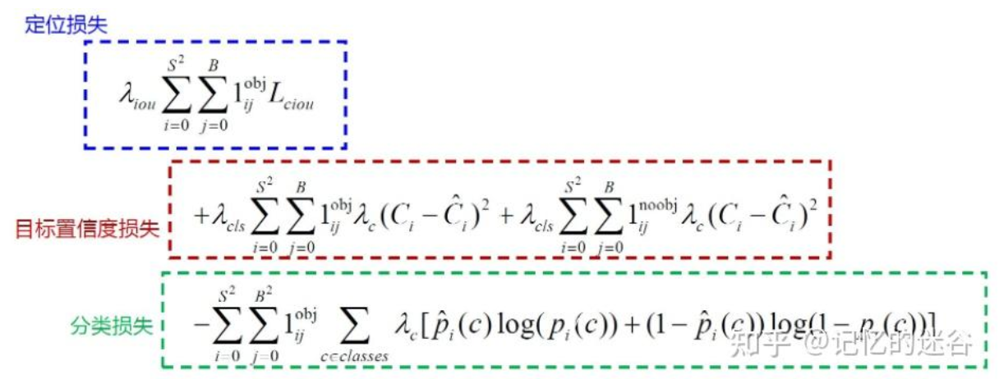

### 其他训练方案改进

在输入上，YOLOv4采用了自对抗训练（Self-Adversarial Training，**SAT**）方法：在训练第一阶段，神经网络改变原始图像而不是网络权值。通过这种方式，神经网络对其自身进行一种对抗式的攻击，改变原始图像，制造图像上没有目标的假象。在第二阶段，训练神经网络对修改后的图像进行正常的目标检测。利用SAT，一定程度上能够提高模型的鲁棒性

### YOLOv5结构改进

ultralytics的YOLOv5（6.0）代码中，给出的目标检测网络中一共有6个版本，分别是**Yolov5tiny、Yolov5n、Yolov5s、Yolov5m、Yolov5l、Yolov5x**。YOLOv5与v4的区别并不太大，但是相当有效地**加快了推理速度**，这让YOLOv5跑在更多嵌入式平台上。

> 下面的几乎所有改进都是为了一个目的：加快运行速度、减小网络体积

下面以最基础的**YOLOv5s**来介绍，这是yolov5中**最标准**的网络。后面的3种都是在此基础上不断加深网络层数，不断加宽特征图宽度；前两种则是在此基础上替换Backbone部分和缩减卷积层数

YOLOv5在v4基础上做了如下改进：

* 输入图：**自适应先验框计算**、**自适应图片缩放**
* Backbone：**Focus结构**、**双CSP结构**
* Neck：**CSP2版本的FPN+PAN结构**
* Prediction（Head）：沿用v4的后处理算子和标准的三阶段后处理算法
* 损失函数：使用**GIOU_Loss**

> YOLOv5的SPP+FPN+PAN结构选取尺寸与YOLOv4一样，同时也沿用了改进的IOU_Loss

下面来依次介绍

### 自适应先验框计算

YOLOv5的输入部分除了沿袭v4的**Mosaic数据增强**外，还引入了自适应先验框计算和图片缩放功能

在YOLO系列中，针对不同的数据集总会设置初始长宽的**先验框**（Anchor Box），网络训练中会在初始先验框基础上输出预测框并和真实框比对，再反向传播迭代网络参数，因此初始先验框总是YOLOv4以前网络很重要的一部分，YOLOv5也不例外。不过v5中将初始先验框计算功能嵌入到代码中，提供了一个脚本在每次训练时都能自适应计算不同训练集里面最佳的先验框值。

大多数情况下，可以直接采用COCO数据集上的初始先验框

```xml
anchors:
  #最小的特征图上的锚框
  - [10,13, 16,30, 33,23]  # P3/8
  #中间特征图上的锚框
  - [30,61, 62,45, 59,119]  # P4/16
  #最大特征图上的锚框
  - [116,90, 156,198, 373,326]  # P5/32
```

### 自适应图片缩放

过去的YOLO乃至其他目标检测算法中，网络输入的尺寸都是固定的，而输入图的长宽则不相同，常将原始图片统一缩放到一个标准尺寸，再送入检测网络中。YOLOv3使用416x416、v4使用608x608像素。为了让图片缩放长宽比保持恒定，就需要在图像边缘填充黑边。如果填充过多，则会存在大量的信息冗余，从而影响整个算法的推理速度。YOLOv5代码中datasets.py的letterbox函数可以对原始图像**自适应地添加最少黑边**，这样就减少了计算量，让目标检测速度大大提高。

> 理论上通过这种简单的改进，推理速度可以得到37%的提升
>
> 需要注意：**只有在使用模型推理时才会采用缩减黑边的方式，训练时仍采用缩放到416x416大小并填充黑边的方式**

基本算法如下：

1. 分别按照长和宽计算缩放系数
2. 选出更小的那个缩放系数
3. 计算缩放后的尺寸并执行缩放
4. 计算需要填充的黑边
5. 将黑边区域使用`(114, 114, 114)`色彩填充（一种接近灰色的黑色）

### Focus结构

这是YOLOv5中独有的结构，这个模块准确地说并不属于Backbone，而是它的一个前置操作，目的是在图片进入Backbone前，对图片进行切片操作

具体来说就是**在一张图片中每隔一个像素拿到一个值**（类似临近下采样），从而获得四种互补的图片，它们互补且没有信息丢失，从而让W、H信息集中到了通道空间，扩充输入通道为原来的4倍。最后将得到的新图片再次卷积就能获得**没有信息丢失情况下的二倍下采样特征图**了。

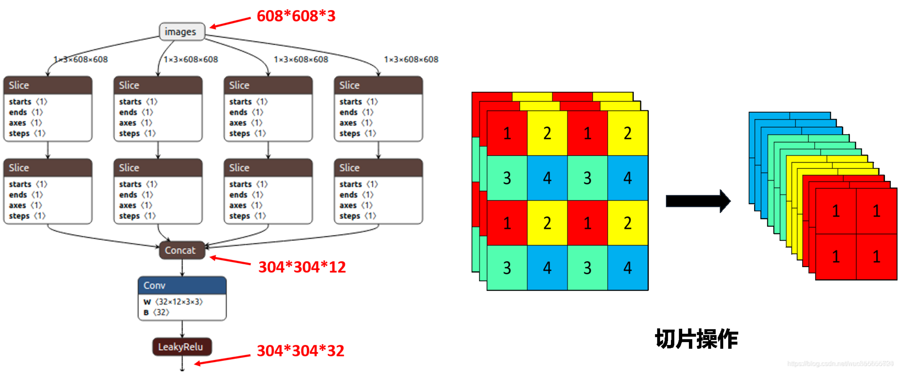

网络中，`[1,3,608,608]`的输入经Focus结构进行切片，先变为`[1,12,304,304]`的特征图，再经过一次32个卷积核变为`[1,32,304,304]`的特征图。改进后，**参数量变少，也就达到提速的效果**；同时下采样时没有信息的丢失，让后面的卷积效果增强

### 双CSP结构

Yolov4中只有主干网络使用了CSP结构；Yolov5中则设计了两种CSP：**CSP1_X**和**CSP2_X**结构，分别应用在Backbone和Neck网络中

CSP1_X的结构和原来的ResNetx结构类似；CSP2_X结构则是将CSP1_X里面的x个ResUnit换成了2x个CBL，如下图所示

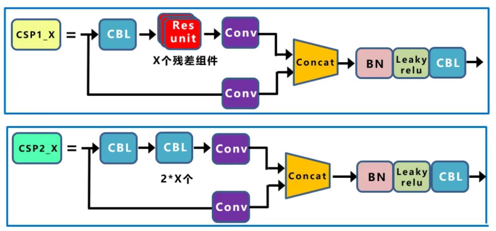

CSP1计算量更大且有残差结构；CSP2稍小，更易于计算

CSP2应用到Neck部分以后，显著增强了网络特征融合的能力

在各个不同版本的YOLO中，最大的不同就是CSP的深度，如下图所示


从YOLOv5s到x，各层CSP的深度递增

### GIOU_Loss

YOLOv5的GIoU加入了C检测框（C检测框是包含了检测框和真实框的最小矩形框），这样就可以解决检测框和真实框没有重叠的问题。但是当检测框和真实框之间出现包含的现象的时候GIoU就和IoU loss是同样的效果了

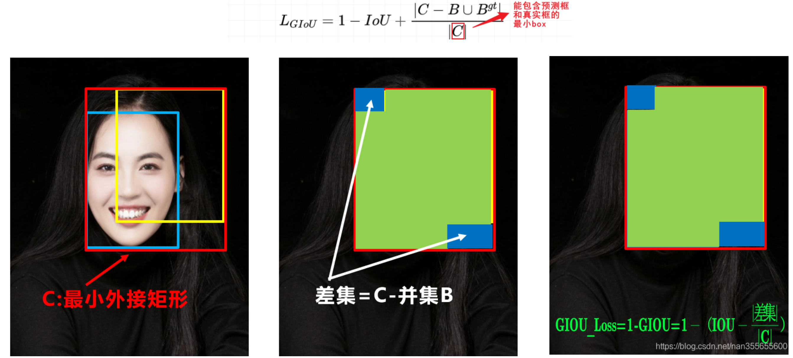

### 配环境

本篇重点在于介绍YOLO的原理，因此仅对环境配置简述

> 需要声明：在算力受限的硬件设备上部署YOLOv5是很nt的，如果想要在MCU上部署算法请选择YOLOv3及以下，或者使用专用算法抑或是YOLOX-tiny这样的魔改版YOLO算法
>
> 下面的配置步骤适用于**ultralytics**的其他YOLO实现部署在PC端

1. 安装anaconda和python环境

2. 安装Cuda和Cudnn环境

	自行查阅其他教程，不再赘述。可以在Win或Linux下完成（视物理机情况而定）

	要求**PyTorch>=1.7**

	**PyTorch的依赖关系需要查看官网，和Cuda、Cudnn对应，千万不要装错**

3. 下载源码文件并配置环境

	```shell
	git clone https://github.com/ultralytics/yolov5  # clone
	cd yolov5
	pip install -r requirements.txt  # install
	```

	其中可以考虑使用`pip install -r requirements.txt -i https://pypi.tuna.tsinghua.edu.cn/simple`来加速下载

	这一步一定要注意

	**Python>=3.7.0**

4. 下载权重文件

	从README.md文档里面最后[Pretrained Checkpoints](https://github.com/ultralytics/yolov5/releases)里面找到需要模型的权重文件，并将其下载到一个目录，在后面要用到

5. 测试

	```shell
	python detect.py --source 0 --weights="<权重文件路径>" #使用摄像头检测
	python detect.py --source=“data/images/zidane.jpg” --weights="<权重文件路径>" #使用默认图片测试
	```

按照上面这几步就可以完成YOLO的测试了

如果需要在自己的项目里集成YOLO，可以参考README文件里面的代码

```python
import torch

# Model
model = torch.hub.load('ultralytics/yolov5', 'yolov5s')  # or yolov5m, yolov5l, yolov5x, custom

# Images
img = 'https://ultralytics.com/images/zidane.jpg'  # or file, Path, PIL, OpenCV, numpy, list

# Inference
results = model(img)

# Results
results.print()  # or .show(), .save(), .crop(), .pandas(), etc.
```

### 训练自己的模型

**YOLOv5使用YOLO格式的数据集，标注的时候需要注意**

有两种保存数据集的方法

第一种是直接按照官方格式要求制作

需要四个基本目录：

* train_img：训练集图片目录
* train_ann：训练集标注目录
* val_img：测试集图片目录
* val_ann：测试集标注目录

图片目录放在一个images目录下；标注目录放在一个labels目录下；这两个目录还要同时放进一个总的根目录下

整体结构如下所示（下面的命名和上面所示不相同，实际上目录命名是比较随意的）


然后需要制作对应的dataset.yaml

```yaml
train: <训练集图片的路径>
val: <测试集图片的路径>

nc: <种类数>

names: ['<种类的名字1>', '<种类的名字2>']
```

一个根目录和对应的yaml文件要一起放在yolov5/data目录下以便使用（也可以放在其他位置，只要训练的时候用参数指定出来就行）

这样数据集就制作完毕了，可以用下面的命令开始训练

```shell
python train.py --img 640 --data data/<数据集的yaml文件> --cfg models/<模型的yaml文件> --weights weights/<模型的对应与训练权重文件> --batch-size <每批训练的数量> --epochs <迭代次数，一般50或以下即可>
```

训练完成后就可以按照上面的步骤进行测试了

## 快速更新的YOLO

自从YOLOv4算法出现后，YOLO系列开始了快速的版本迭代。

### YOLOX

2021年，旷视科技发布了YOLOX模型，引入了两个重要的革新：

* 解耦头 Decoupled Head
* 实现了Anchor-Free

下图给出了YOLOX的基本结构，可以看到

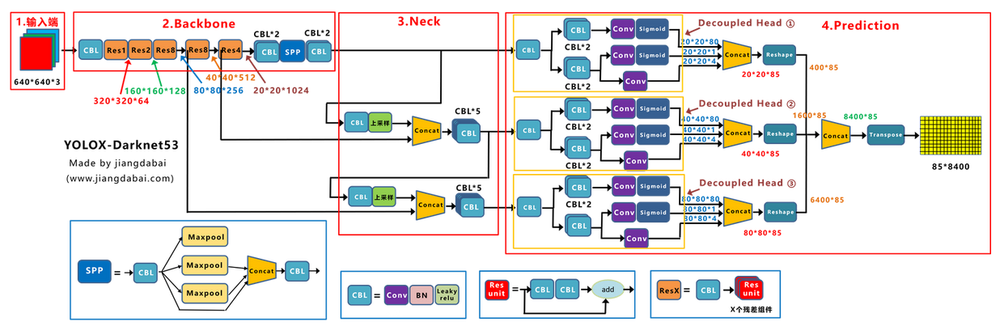

YOLOX的结构非常简单，几乎和YOLOv3一样（Darknet53特性提取、FPN+PAN），但由于上述两个重大革新，使得其精度有效提高。下面来看看它是怎么做的：

首先，以往YOLO的检测头都把分类分支的输出和回归分支的输出直接拼接；但实际上不仅仅是两阶段检测器在使用解耦头，学术界早在2017年的[RetinaNet](###参考论文)上就为一阶段检测器引入了解耦头。

> 这里不得不提一下RetinaNet，虽然它并不是YOLO系列，但仍是一个具有关键意义的一阶段检测网络：在模型被提出的这个节点，学术界中实现了一阶段检测对二阶段检测的全面超越。利用Focal Loss损失函数，RetinaNet在精度上超过此前的二阶段网络，在速度上超过此前的一阶段网络
>
> 基础网络结构上，RetinaNet采用了经典的ResNet Backbone加FPN加解耦头设计，并利用基于Anchor的训练范式

引用YOLOX团队自己的解释：他们最初并没有计划解耦检测头，这是在将YOLOX推进到端到端范式（NMS-Free）时的无意发现——端到端YOLOX的测试结果时钟不如标准YOLOX；将原始YOLO Head换成解耦头后，端到端YOLOX表现出的差距缺显著缩小。于是团队将解耦头应用到了标准YOLOX中，发现性能发生了较大提升，这说明目前YOLO系列所使用检测头的表达能力可能有所欠缺，没有Decoupled Head的表达能力强；不过解耦检测头会增加运算复杂度。

如上面YOLOX结构图所示，解耦头实际上就是把原来一个或多个串行卷积块构成的YOLO Head分成多组。YOLOX团队权衡算法速度和性能，最终选用了如下图所示的标准架构：使用一个1x1卷积CBL块降维，在后面的两个分支中各使用2组CBL块

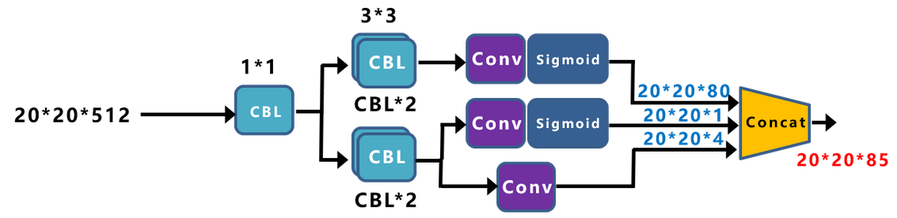

在每一个检测头输出端进行Concat之前，都有三个分支（这里以 `[20, 20, 85]` 尺寸的输出为例）：

* 类别解耦头输出（`[20, 20, 80]`）：预测目标框的类别，最后的尺度 `80` 代表数据集中的类别数（YOLOX使用到COCO数据集训练了80个类别的数据，因此这里的数字是 `80`），属于N分类问题，需要经过Sigmoid再输出
* 检测框前景解耦头输出（`[20, 20, 1]`）：对判断目标框的置信度，属于二分类问题，需要经过一个Sigmoid输出
* 检测框坐标解耦头输出（`[20, 20, 4]`）：对目标框的（x, y, w, h）坐标信息进行预测

不难发现，这里三个解耦头输出实际上就是YOLO一直以来的”目标种类“+”复合置信度信息“+”目标坐标“输出——把每部分的预测解耦，这就是解耦头的由来和目的。把三个解耦头Concat，再进行一次转置（transpose或permute），就得到了YOLOX以后更加常见的**特征向量组**风格输出

其他版本YOLO的常见输出是这样的：
$$
[S,S,(B*(4+1)+C)]
$$
这实际上还保留着早期CNN的特点：张量化。但YOLOX的特征向量组输出是这样的：

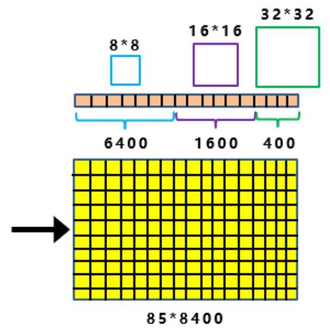

由三维张量变成了二维张量（根据实现不同，也可以使用三维张量，但后处理就会更加复杂），以上面20x20+40x40+80x80三个YOLO Head输出拼接成的矩阵尺寸为8400x85，这里8400指的是**预测框的数量**，而85是**每个预测框所包含的信息**，分别是：x、y、h、w、obj五个基本预测框参数（尺寸和目标置信度）再加上80种类别目标所对应的类别置信度。

后处理方面，目标置信度obj是二值化的（不是1就是0），而类别置信度是归一化的，所有80个参数相加等于1，因此YOLOX输出的预测框的置信度等于二者乘积。实际上与YOLO所一贯使用的公式一样，只不过输出形式（张量尺寸）变了


另一方面，自从YOLOv2开始，YOLO都采用了基于先验框 Anchor 的范式，而同时代学术界的另一些检测器（比如[Centernet与FCOS](###参考论文)）都使用了无先验的方法，而YOLOX将它们引入YOLO系列，首次实现了 Anchor-Free

> 这在后面的YOLOv6上也得到了应用

在开始之前，我们先回到FCOS中：FCOS作者观察到自动Faster RCNN以来的先验框（Anchor Box）热潮和它的缺陷——长宽比和数量等需要人工设计、无法在训练后动态修改、大量先验框会让预测框的数量变多。因此FCOS提出了一个基于RetinaNet的网络结构（ResNet作为主干、FPN作为多尺度融合、Head部分采用解耦头机制），但网络预测（或者说回归）的目标函数选取“每个Anchor到预测框的四个偏移量”：对于特征图上的某一点(x,y)，只要它落入标注框中心区域，那么它就被视为**正样本**，摆脱Anchor的关键就在于如何将正样本和标注框GT进行匹配，以匹配结果来计算损失函数。

但所有Anchor预测出的偏移量都不一定可靠，因此FCOS还引入了一个额外的卷积（卷积核为1）预测每个Anchor独有的*centerness*值，这个值反映了网络对目标的中心区域的置信度。centerness主要解决了两个问题：

* 边界框回归不稳定性：边界框回归可能会受到物体形状的复杂性和遮挡的影响而变得不稳定，关注目标中心区域可以减少这些影响
* 区分重叠的检测框：在多个目标重叠的情况下，仅依赖于预测框的置信度无法很好地区分出目标之间的差别

centerness卷积通过输出一个介于0和1之间的值来表示预测框内某个位置是否接近目标的中心区域（0表示非常远离，1表示非常接近），对接近目标中心的预测框给出更大权重，从而表示正样本

再看YOLOX，采用Anchor-Free范式后，YOLOX输出的参数量可以用下式描述：
$$
(5+class)*(f_a + f_b + f_c)
$$
在COCO数据集下训练，式中class=80表示预测目标种类数，f表示三个YOLO Head的特征图（或者说特征向量组）输出数，代入式子
$$
(5+80)*(400+1600+6400)=714000
$$
相比[采用先验框的算法](###YOLOv2的改进)，这减少了2/3的参数量！

那么，YOLOX是怎样实现的呢？非常巧妙，它将FPN+PAN中下采样过程的大小信息引入Head部分弥补先验框的信息。

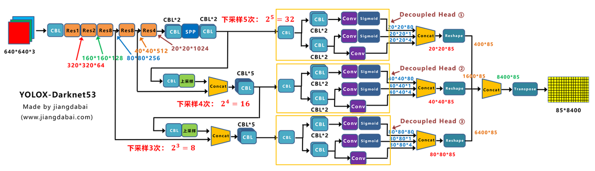

如上图所示，最上面的20x20头，下采样5次，即$2^5=32$，输出的400个特征向量就包含了32x32的先验框对应信息。同理，中间的分支对应先验框尺寸我16x16，输出40x40个预测框。这样网络的输出就能够以先验框尺寸为桥梁，和图片上所有标注好的目标框相关联。

虽然和FCOS摆脱Anchor的方式不同，但思路是一致的——在训练过程中，通过借鉴FCOS的方法，YOLOX也需要挑选出**正样本**先验框，得到正样本后，其中心点对应的grid也就是**正样本预测框**的grid了。

YOLOX使用了**标签分配**的方式进行二者的关联：比如第3、10、15个锚框是正样本锚框，则对应到网络输出的8400个预测框中，第3、10、15个预测框就是相应的正样本预测框。随着训练的推进，在先验框基础上不断预测并进行回归更新网络参数，这就实现了脱离先验框的网络训练

在算法具体实现上，还需要使用到初步筛选+SimOTA算法两步来完成训练。

执行初步筛选有两种方式：

* 与FCOS类似，**根据目标框来判断**：以gt（ground truth）为基准，设置5x5的正方形，挑选内部所有可能的先验框

    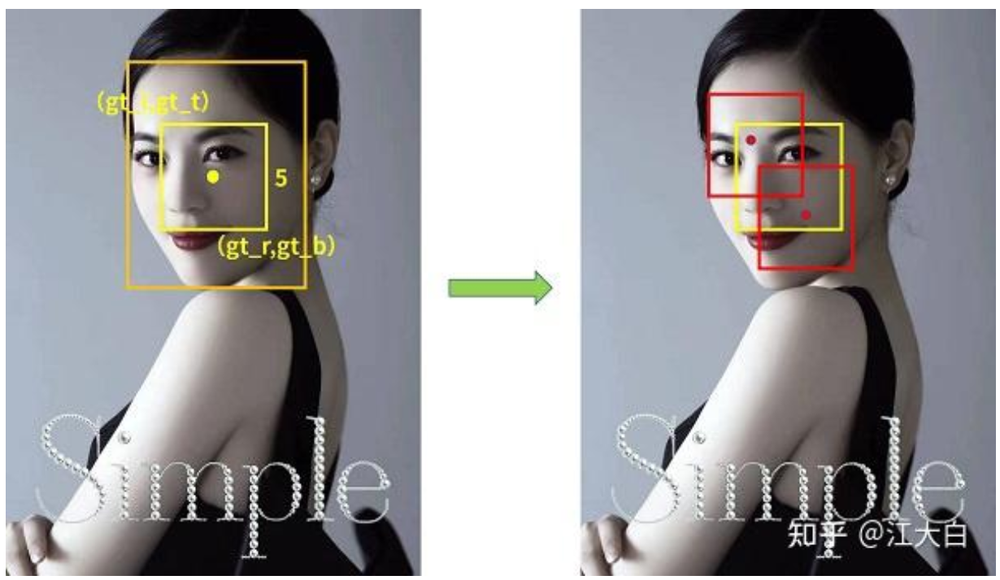

    如上图所示，黄色框是gt，以其中心点寻找5x5黄色框（上方右图）内符合要求的先验框

* 后续算法大都采用**根据中心点来判断**的方式：以gt计算出每张图片的左上角、右下角坐标

    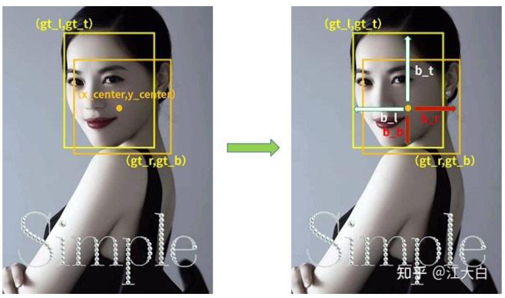

    如上图所示，根据橙色标注框去寻找覆盖了橙色中心点的先验框坐标，提取出所有可能检测出橙色中心点的先验框来，此时先验框的中心点只能落在矩形范围内，bl、bt、br、bb都要大于0才行，这样就实现了筛选

完成初筛后，使用到SimOTA算法进行精细化筛选，这个流程主要分为四个阶段：

* 正样本信息提取：

    我们假设图片上包含3个标注框GT，检测类别是人脸和人体，因此检测类别设置为2，此外假设以及在初筛后得到了1000个先验框

    因此，我们所需的正样本就包含在1000个先验框中。根据先验框的位置，可以得到和网络最终输出矩阵所一一对应的数据，因此这时可以拿到网络对应的1000个预测框x、y、w、h、obj、class信息

* 损失函数计算

    根据1000个预测框和3个GT的位置信息（x,y,w,h），计算全部IOU，再从IOU得到位置损失函数

    根据1000个预测框和3个GT的类别信息（条件概率obj和先验概率class乘积），计算全部类别分数的交叉熵，得到类别损失函数

* cost成本计算

    有了位置和类别损失函数（reg loss和cls loss），将二者相加就可以得到cost成本函数

* SimOTA求解

    有了上述信息，标签分配问题就转换成了标准的OTA问题，使用经典的Sinkhorn-Knopp算法需要多次迭代，因此YOLOX采用一种简化的SimOTA算法求近似解。算法内容参考[论文原文](###参考论文)，由于不涉及目标检测，这里就不再赘述

完成标签分配任务后，将标注框和正样本相对应，计算二者误差，这就是最终的损失函数值了。YOLOX允许使用IOU和GIOU两种位置损失；而类别损失则采用BCE。注意到上一步标签分配精细化筛选中，已经计算过了所有可能预测框和GT的IOU，因此最后的位置损失只需要计算标注框和筛选出的正样本预测框即可。但类别损失仍要针对全部8400个预测框进行计算。此外，解耦头中对class和object两个输出使用了sigmoid进行归一化，但训练时并不需要这一步，因为BCE Loss已经包含了归一化操作

### YOLOv6

2022年，美团技术团队发布了YOLOv6，融合了近期多种网络结构、训练策略、测试技术、量化和模型优化等思想，但在基础结构上相比前几代模型提升不大。主要改进点总结如下：

* 引入EfficientRep作为核心特征提取模块
* 基于重参数化理念，引入Rep-VGG中的Rep进入Neck部分的SPP-FPN-PAN模块
* 引入解耦头（Decoupled Head）的设计理念到YOLO主线
* 实现了Anchor-Free，并给出实验证明有效性

> 令人感叹的是，YOLOv6相比YOLOX并没有多大提升，甚至部分情况下要全方面劣于YOLOX

YOLOv6的网络架构就像是YOLOX和YOLOv5的混合，采用了v5的Backbone、Neck和X的Head。作者分析发现YOLOv5使用的CSPNet架构对GPU等硬件利用率并不高，于是引入了RepVGG中可参数化的卷积模块（即RepConv），这个模块在训练时表现为多分支的结构，而实际部署时，又可以选择性地融合成单个3x3的卷积，从而更好利用GPU和cuDNN这类编译框架。将这些RepConv模块堆叠起来就构成了网络所使用的核心特征提取模块EfficientRep

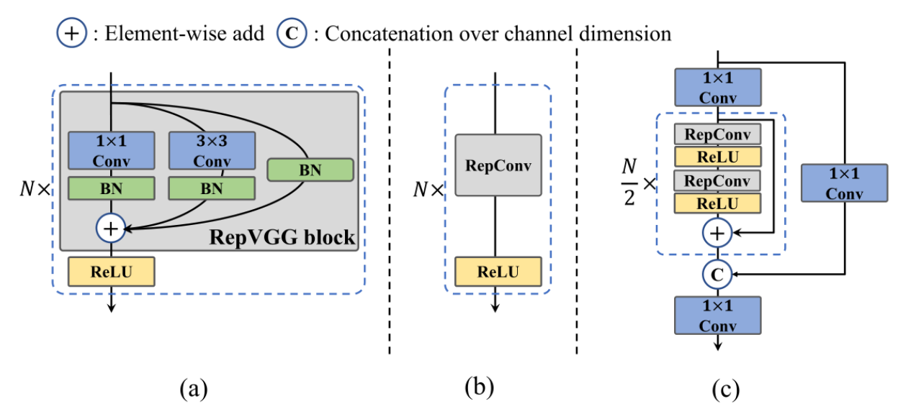

如上图(a)所示，训练阶段和小模型采用这样的多尺度分支卷积，能够提升网络的计算效率；而如上图(b)所示，在推理阶段，RepConv模块能够转换为标准的3x3卷积块，从而有效利用GPU性能；而对于大模型，如上图(c)所示，可以改用CSPStackRep Block作为核心，可以在不增加计算成本的前提下提升性能。YOLOv6还将该结构引入到Neck部分的PAN和HEAD部分的解耦头

> 使用YOLOv7提供的Rep结构可以更加清晰
>
> 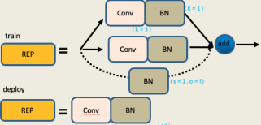
>
> 训练train中，模块使用三组卷积：最上面的分支是3x3的卷积，用于**特征提取**；中间的分支是1x1的卷积，用于**平滑特征**；下面的分支是一个**残差边**。最后三者结果相加
>
> 推理deploy中，上面的三组卷积模块**重参数化转换**得到一个3x3的卷积，从而提高推理性能

解耦头设计实际上已经在YOLOX中首次引入，但YOLOv6对解耦头进行了精简设计后，综合考虑硬件计算开销重新设计了一个高效的解耦头模块。实际表现与YOLOX的性能差距不大，但算是首次将解耦头引入YOLO主线，所以在此提一下。

至于Anchor-Free范式，YOLOv6基本与YOLOX一脉相承，通过更改网络结构、引入SimOTA算法来完成标签分配任务，并将其归类为“动态标签分配”，还结合实验证明了Anchor-Free相比于Anchor-Based能为网络带来效率提升。

### YOLOv7

YOLOv7是YOLOv4作者于YOLOv6几乎同时发布的模型（按arxiv发布时间，v7甚至比v6更早），二者几乎使用了相同的优化方式（结合重参数化对网络结构进行改进），但YOLOv7在网络结构上做了探索（相对地，并没有引入解耦头或Anchor-Free），主要改进点即：

* 引入E-ELAN结构（扩展高效层聚合网络，Extended Efficient Layer Aggregation Network），在不破坏原有梯度路径的情况下增强网络的学习能力

但YOLOv7保留了先验框 Anchor 机制，混合了固定和动态两种标签分配；同时*并没有引入解耦头*。这里主要分析v7带来的高效ELAN结构

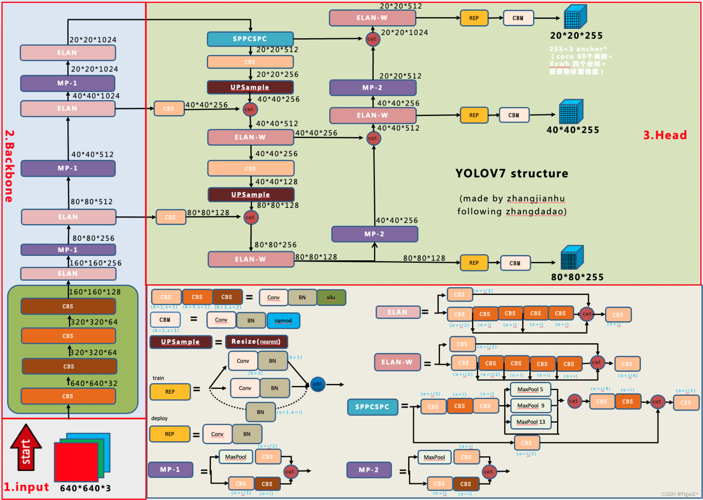

整体上，YOLOv7和YOLOv5保持一致，只不过更换了一些内部组件。ELAN和E-ELAN是本文引入的最关键模块，它通过控制最短、最长的梯度路径，允许深度模型更有效地学习和收敛

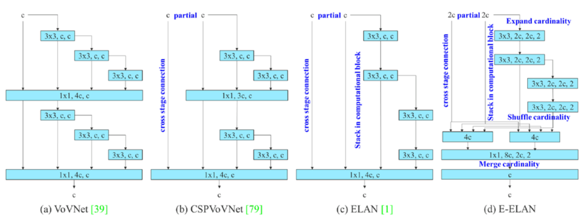

网络中还用到了由MaxPooling和步长为2的3x3 Conv2d实现的MP模块，该模块能在保证前后通道数不变的情况下实现FPN上采样

> 传统高斯金字塔基于MaxPooling，而特征金字塔采用步长为2的卷积，但MP模块结合二者（能够提高性能，但计算效率降低）

### YOLOv8

Ultralytics在2023年初在Github上正式发布了YOLOv8的算法模型，和YOLOv5一样没有形成正式的论文，但该模型与YOLOv5一道成为了近年来目标检测工业应用的新标杆。但实际上，该模型与v6、v7版本的关联说大不大、说小不小，只是对YOLOv5的网络结构和思想进行了扩展，主要改进点总结如下：

* 换用全新的卷积算子和特征提取网络，使用最新最强的SiLU激活函数
* 在Head部分增加了增强特征提取层
* 与YOLOv5兼容可扩展，并实现了一个ultralytics统一YOLO训练-部署框架

同时，模型也沿用了YOLOX和YOLOv6的两个核心特征：

* 引入解耦头的设计理念
* 实现了Anchor-Free

此外，模型引入了源于YOLOv6和YOLOv7的动态标签分配策略和ELAN模块设计理念，因此可以说YOLOv8是近年来YOLO系列的集大成之作。网络结构如下图所示，可以发现在上面几乎可以找到YOLOv5以后所有模型的身影


首先是Backbone部分，网络使用基于CSP（**C2f**模块）和**SPPF**的特征提取网络。

其中，**C2f**模块保留CSP的思想，用于替换掉v5中的C3模块，同时它借鉴ELAN通过多个不同尺度特征图的Concat来明显提升收敛速度和效果，下面两张图给出了C2f和C3、ELAN的对比

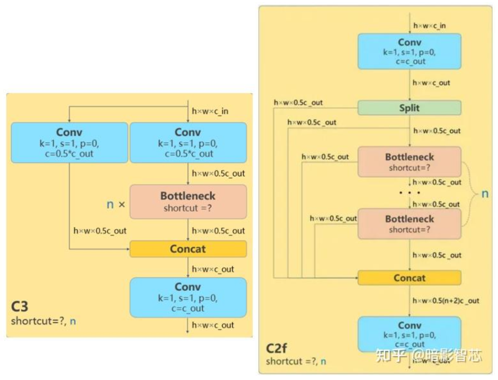

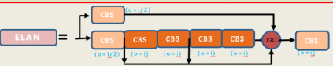

**SPPF**模块用于替换v5的SPP模块。SPP将三个并行的MaxPool和输入Concat到一起。SPPF是将三个5x5尺寸MaxPool做串行计算，再残差连接后进行Concat操作，减少特征图的冗余计算，提高了推理速度。当然，在训练阶段，上述所有卷积都可以替换成RepConv，从而增强网络表达。

特征融合Neck部分，YOLOv8改进了基于FPN+PAN的结构，称之为**PAFPN**。总体上保留了PAN的思想，但在结构上删除了上采样阶段中的卷积结构，这就类似于YOLOv7的MP模块二者兼得

Head部分，YOLOv8也引入了解耦头，如下图所示

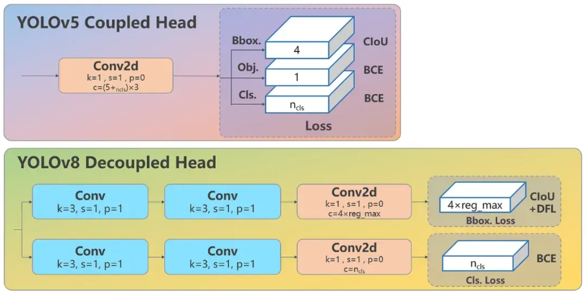

与YOLOX的三头解耦不同，YOLOv8采用了双头解耦，根据损失函数类型分成了**分类分支**和**回归分支**。这一设计与YOLOv8的训练策略有关。

YOLOX对于特征图上面的每个grid中心点预测“N个类别对应的置信度参数+4个预测框坐标参数+1个目标先验置信度”；而YOLOv8消除了用来判断目标先验置信度的分支，对特征图上面每个grid中心点预测“N个类别对应的置信度参数+4个regmax参数”，其中regmax表示包含了**前regmax个具有最高先验置信度检测框的坐标**。

> YOLOv8认为**预测目标位置和预测目标种类分别属于回归任务和分类任务**，二者表述了不同的特征，通道数不应相等（在YOLOX中，分类和回归通道均为256）
>
> 在v8中，对于分类分支，设置通道数
> $$
> C_{cls}=max(C^3,min(N_{cls},100))=256
> $$
> 对于回归分支，设置通道数
> $$
> C_{reg}=max(16,\frac{C^3}{4},4*regmax)=64
> $$
> 这就使得上面的解耦头输出分别是：
>
> * 目标种类分类分支维度 $[Batch,N_{cls},H,W]$
> * 目标坐标和置信度回归分支维度 $[Batch,4*regmax,H,W]$

YOLO一直以来的策略是：使用把计算预测框和真实框之间的位置偏移量视为回归任务，使用把预测目标的类型视为分类任务，而Anchor就是联系二者的桥梁。在YOLOX引入的Anchor-Free范式中，对于特征图上的每一个grid预测4个坐标的参数，YOLOX预测的是该grid距离标注框的宽度、高度以及标注框本身的宽度、高度；但YOLOv8直接参考[FCOS](###参考论文)预测的是中心点位置，即grid距离标注框上下左右四个边框的距离，如下图所示

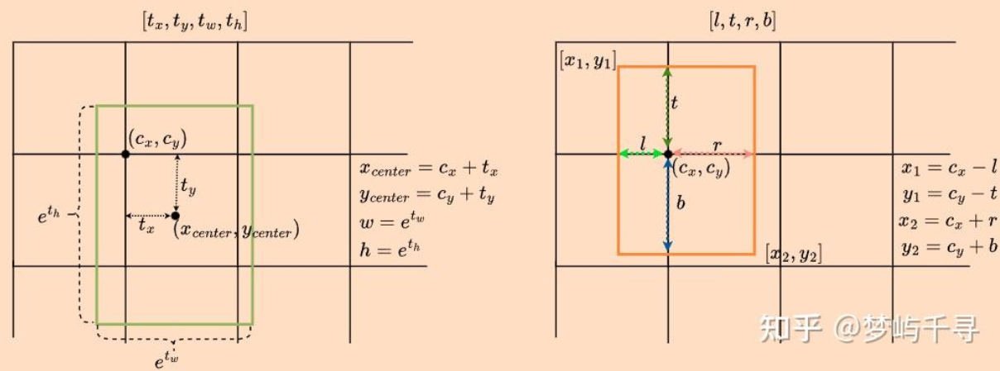

但特别地，YOLOv8没有直接预测这个值，而是使用到DFL通过预测一个离散分布计算得到。

这里插入介绍一下YOLOv8所使用的损失函数体系：YOLOv8中判断物体类别和对应置信度的分类分支采用**BCE**损失；坐标位置相关的回归分支损失由**CIOU**和**DFL**（Distribution Focal Loss）的线性组合（加权和）

其中CIOU由IOU、GIOU、DIOU逐渐演变而来，使用下式定义
$$
CIOU=IOU-(\frac{\rho^2 (b,b^{GT})}{c^2}+\alpha \nu)
$$
其中 $\nu$ 用来衡量宽高比的一致性
$$
\nu = \frac{4}{\pi^2}(arctan \frac{w_{GT}}{h_{GT}}-arctan \frac{w}{h})^2
$$
CIOU考虑到框的横纵比，能够解决DIoU无法区分“重叠面积一定但长宽比不同”情况的问题

DFL损失主要用于处理边界框回归任务，尤其是在分类模型中利用离散分布表示连续边界框回归的问题，将回归任务从单点预测转变为分布预测，使得模型能够更准确地拟合复杂的目标边界。DFL的实现如下

```python
class DFL(nn.Module):
    # DFL模块
    # Distribution Focal Loss (DFL) proposed in Generalized Focal Loss https://ieeexplore.ieee.org/document/9792391
    def __init__(self, c1=16):
        super().__init__()
        self.conv   = nn.Conv2d(c1, 1, 1, bias=False).requires_grad_(False)
        x           = torch.arange(c1, dtype=torch.float)
        self.conv.weight.data[:] = nn.Parameter(x.view(1, c1, 1, 1))
        self.c1     = c1

    def forward(self, x):
        # b, self.reg_max * 4, 8400
        b, c, a = x.shape
        # b, 4, self.reg_max, 8400 => bs, self.reg_max, 4, 8400 => b, 4, 8400
        # 以softmax的方式，对0~16的数字计算百分比，获得最终数字。
        return self.conv(x.view(b, 4, self.c1, a).transpose(2, 1).softmax(1)).view(b, 4, a)
```

在计算损失函数过程中，又会涉及到Anchor-Free范式的核心：标签分配算法。YOLOv8使用了**对齐分配器**（**TaskAlignedAssigner**，**TAL**）进行**动态标签分配**，针对所有grid预测得到的class score（来自分类分支，包含类别置信度信息）和reg score（来自回归分支，包含检测框坐标和先验置信度信息），将二者加权以获得最终的分数score，对其进行排序后选择TopK个样本

最后，我们可以得到YOLOv8的损失函数表达式：
$$
Loss=\alpha L_{cls}+ \beta L_{CIOU}+ \gamma L_{DFL}
$$
其中，预测目标类型置信度的分类损失$L_{cls}$使用交叉熵损失，预测框坐标位置的回归损失$L_{CIOU}$使用CIOU损失，预测框先验置信度的回归损失$L_{DFL}$使用DFL损失。其中分类损失要计算全部预测框和标注框之间的损失，但回归损失不需要——在损失函数上，YOLOv8和YOLOX是相似的。

回到上面的预测问题：为什么YOLOv8会选择将预测框位置和预测先验置信度分支合并？本质就是由于二者都属于回归任务。在预设regmax的过程中，可以发现(l,t,r,b)四个参数的取值范围受到DFL影响，均在 `[0,regmax-1]` 这个区间，实际上这个步骤就是让网络输出regmax个最接近标注框的预测坐标，预测框先验置信度的部分被包含在了DFL算子内。

> 这种处理有时候会导致问题：如果输入图像中原始目标的宽度或高度过大，则会出现预测边界框小于原始目标的情况，因为regmax的取值限制了“预测框边界”偏离“负责预测目标种类的grid中心点”的最大l、t、r、b距离
>
> 比如图像中实际标注框GT宽度为1000，但能够预测的最大宽度为960，这时候就导致预测不准，需要调整regmax的值

值得注意的是：YOLOv8全部的卷积后激活函数均使用了SiLU，该激活函数在计算难度和精度效果上实现了均衡。此外，自YOLOv8后，ultralytics的算法均能够通过统一的python框架进行部署，还提供了基于其他语言的API接口，能够方便用户使用。

### YOLOv9

YOLOv9和YOLOv7、YOLOv4的一作是同一个人，论文于2023年发布。YOLOv9延续了YOLOv7的工作，针对深度网络中传输时的重要数据丢失问题提出了如下改进：

* 引入深度监督概念
* 将E-ELAN更新为GELAN（通用高效层聚合网络）

为了解决数据在深度网络中传输时信息丢失的问题，作者提出了一种新的辅助监督框架，称为可编程梯度信息。这一改进的目标在于校正深层特征金字塔丢失大量小目标物体信息丢失问题。作者认为每个特征金字塔都需要接收到所有目标物体的信息，以便后续的主干分支能够保留完整的信息来学习对各种目标的预测。这一改进在训练端生效，但对YOLO网络结构改进不大

此外，结合CSPNet和ELAN，作者设计出一种均衡轻量化、高速推理和精度的通用高效层聚合网络GELAN，它支持任意神经网络模块堆叠，因此通过将CSPNet进行堆叠，网络可以获得好效率

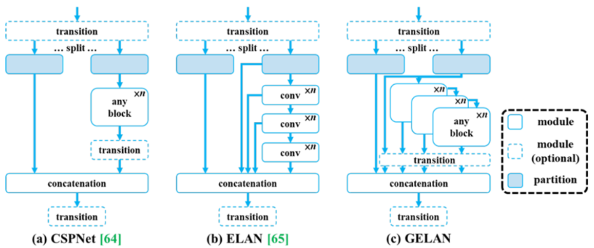

### YOLOv11

2024年，Ultralytics发布了最新迭代的YOLOv11。令人遗憾的是YOLOv11并未带来更亮眼的改进点，但它通过堆叠先进的Tricks仍在当前的ConvNet中取得了SOTA成绩；YOLOv11是否能应对ViT的挑战还需要时间来考察。主要改进点在于：

* 使用C2K2模块替代C2f模块
* 采用C2PSA模块替代SPPF模块
* 将YOLO Head解耦头中的分类分支检测头的两个标准卷积改成DepthWise卷积（DW卷积参考MobileNetv2和ShuffleNet的实现）

基本上可以把YOLOv11视为在YOLOv8基础上进行的部署优化——同样，YOLOv11与YOLOv8、YOLOv5框架兼容。

## NMS-Free的YOLO

2021年，DeTR横空出世，开启了Transformer与ConvNet之间的对决

### DeTR

DeTR即Detection with Transformer，听名字就知道：Transformer从NLP领域打过来了。虽然Transformer又大又难算，但事实上，DeTR是一个十分简洁的工作，基本流程就是：用ResNet提特征，再接Transformer处理一下，最后**直接**输出类别和边界框。但毫无疑问，DeTR开创了**端到端**（End-to-End）检测的典范，正如[它的名字](###参考论文)那样。

首先来看算法的核心，如下图所示，是一个Transformer

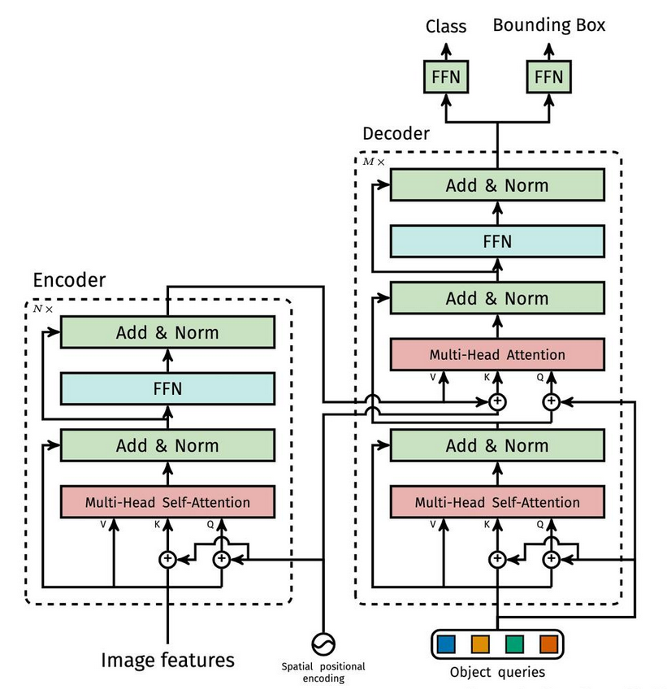

其中encoder的输入是ResNet输出的特征图，decoder的输出是“经过随机初始化”的**object query**。

需要注意，为了方便Transformer处理，输入特征图的维度被转换成了 `[Batch, N, 256]` ，其中N表示 $\frac{H}{32}*\frac{W}{32}$ 。由于Transformer还需要输入位置嵌入（**Position Embedding**），即为输入序列提供位置信息，因此DeTR采用了二维Position Embedding的方式，直接从输入图中计算位置信息，对于不足的地方进行填0补齐（Padding）

损失函数部分，采用二分图匹配的方式将object query分配给检测框GT，作者将其称为“将目标检测任务看作集合预测任务”。算法上直接使用了 **匈牙利匹配**

### YOLOv10

与上述所有版本的YOLO不同，YOLOv10开门见山指出了YOLO一直以来的拖累：NMS。面对Transformer系列算法猛烈的冲击，ConvNet需要采用更“现代”的手段来实现高实时性、**端到端**的推理。为此，作者提出了一致**双标签分配NMS-Free训练法**，终于让YOLO摆脱（暂时地）了NMS的限制

在DeTR中，解决NMS问题的策略就是训练期间的“一对一”标签分配，每个目标都只有一个正样本，且正样本的筛选是基于类别代价和位置代价二者共同决定的，使得DETR可以在推理阶段体现出无NMS的端到端检测特性；不过这也导致了训练收敛缓慢、模型性能降低的问题。

而YOLOv10同样使用到了“一对一”标签分配策略，实现极其简单：将YOLOv8使用的TAL分配器中排序的TopK设置为1。但为了解决劣势，YOLOv10在“一对一”之外还并行做了一个“一对多”检测头，将FPN+PAN的多尺度特征送给另一个检测头去做预测，在训练阶段该检测头采用TopK=10的YOLOv8 TAL分配器默认配置，如下图所示。

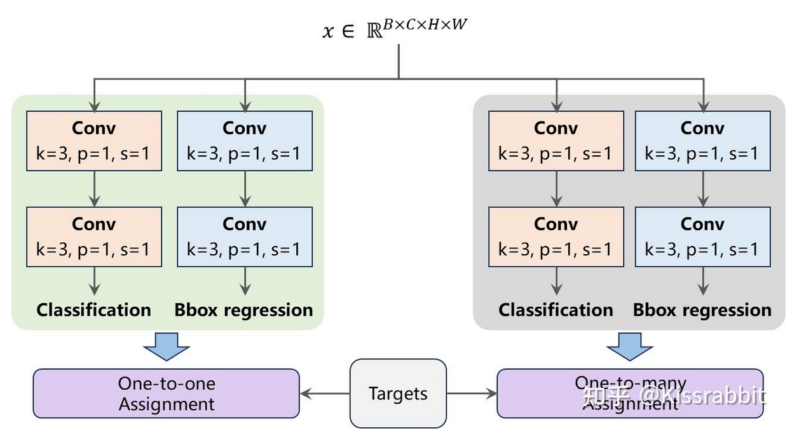

通过该检测头，可以从“一对多”标签中向Backbone和Neck传回更丰富的梯度信息，从而更快更新主干参数——换句话说，它将YOLO的Backbone和Neck部分视作了“encoder”

在训练结束后，“一对多”检测头的任务也就完成了，将其丢弃并保留“一对一”检测头去做无NMS的端到端推理，实现无NMS的端到端YOLO推理框架。这个流程有点像“知识蒸馏”所遵循的理念

但是稍加思考，就不难发现“一对一标签分配能帮助减少NMS依赖”是经不起推论的——即便是DETR系列，冗余检测依旧存在，因此可以说二者并不一定相关。只能说距离真正的端到端检测框架建立，还是有些时日的。也许在这个过程中，YOLO作为目标检测领域的一棵常青树将一直活跃在NMS-Free的道路上。

# 参考教程

https://cloud.tencent.com/developer/article/1972776

https://zhuanlan.zhihu.com/p/700522397

https://blog.csdn.net/xu1129005165/article/details/134076266

https://pjreddie.com/darknet/yolo/

https://zhuanlan.zhihu.com/p/40332004

https://zhuanlan.zhihu.com/p/46691043

https://blog.csdn.net/qq_29462849/article/details/81100165

https://www.cnblogs.com/ywheunji/p/10809695.html

https://blog.csdn.net/xiaohu2022/article/details/79211732

https://zhuanlan.zhihu.com/p/143747206

https://zhuanlan.zhihu.com/p/371014098

https://blog.csdn.net/a8039974/article/details/123353407

https://zhuanlan.zhihu.com/p/397993315

https://blog.csdn.net/m0_61595251/article/details/142903569

https://zhuanlan.zhihu.com/p/706355958

https://zhuanlan.zhihu.com/p/702085780

https://zhuanlan.zhihu.com/p/416709193

https://zhuanlan.zhihu.com/p/680900567

https://zhuanlan.zhihu.com/p/421170951

https://zhuanlan.zhihu.com/p/700522397

### 参考论文

YOLO【2016年】：https://arxiv.org/abs/1506.02640

SSD：https://arxiv.org/abs/1512.02325

Faster R-CNN：https://arxiv.org/abs/1506.01497

YOLOv2（YOLO9000）【2016年】：https://arxiv.org/abs/1612.08242

FPN：https://arxiv.org/abs/1612.03144

ResNet：https://arxiv.org/abs/1512.03385

RetinaNet：https://arxiv.org/abs/1708.02002

YOLOv3【2018年】：https://arxiv.org/abs/1804.02767.pdf

PANet：https://arxiv.org/abs/1803.01534

CSPNet：https://arxiv.org/abs/1911.11929

YOLOv4【2020年】：https://arxiv.org/abs/2004.10934.pdf

YOLOv5【2020年】：https://arxiv.org/abs/2004.10934

CenterNet：https://arxiv.org/abs/1904.08189

FCOS：https://arxiv.org/abs/2006.09214

YOLOX【2021年】：https://arxiv.org/abs/2107.08430

DeTR【2021年】：https://arxiv.org/abs/2005.12872

ViT【2021年】：https://arxiv.org/pdf/2010.11929

YOLOv6【2022年】：https://arxiv.org/abs/2209.02976

YOLOv7【2022年】：https://arxiv.org/abs/2207.02696

YOLOv8【2023年】：https://ieeexplore.ieee.org/document/10533619

YOLOv9【2023年】：https://arxiv.org/abs/2402.13616

YOLOv10【2024年】：https://arxiv.org/abs/2405.14458

YOLOv11【2024年】：https://arxiv.org/abs/2410.17725

