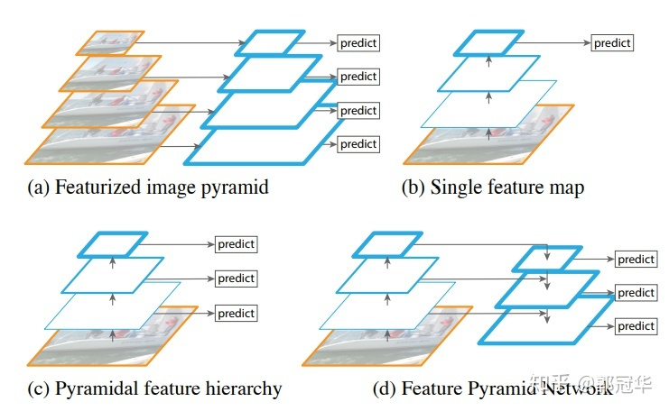
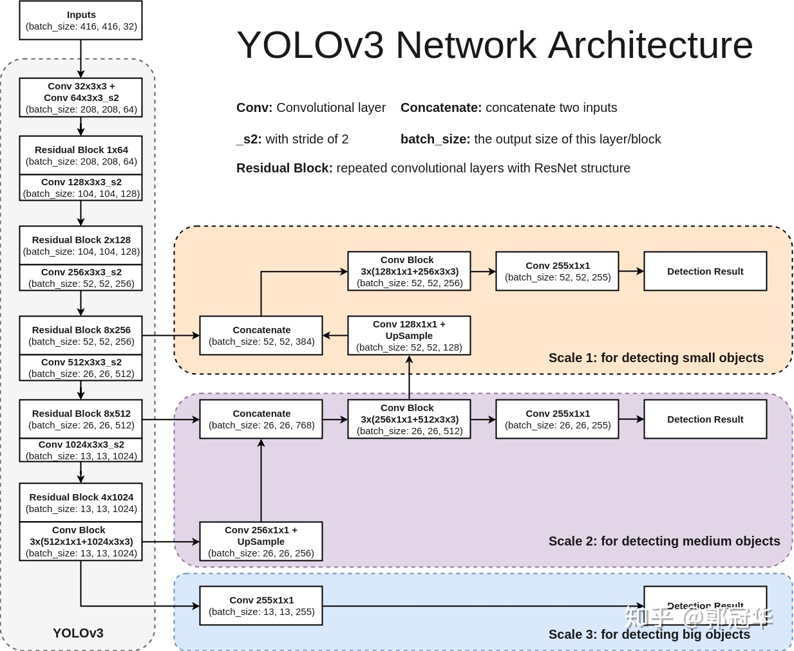
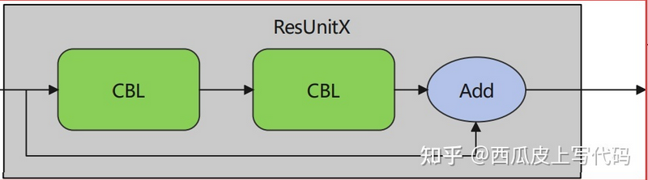
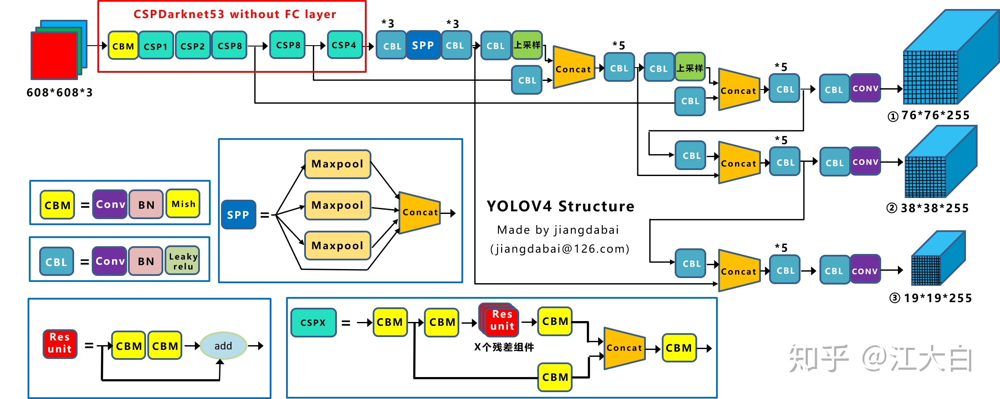
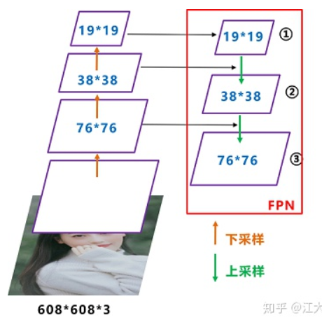
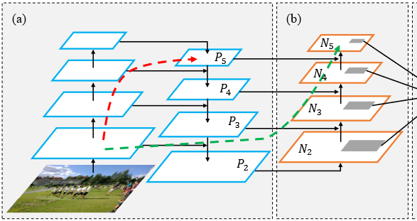
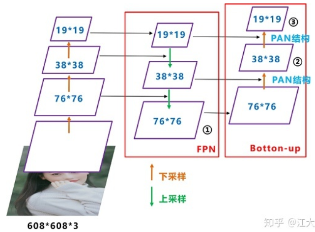
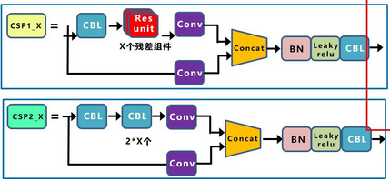

# 基于PyTorch部署YOLO算法

本篇博文主要参考[Github开源代码](https://github.com/bubbliiiing/yolo3-pytorch)及对应教程总结

参考教程列在最后

## YOLO算法原理简介

YOLO即**You Only Look Once**算法，到目前为止共有五个基本版本：从YOLO到YOLOv5，除此之外还有一些系列衍生版本，比较出名的就是旷视科技的YOLOx

其最大的特点是**运行速度很快**，可以用于实时系统——这一点和古老的RCNN算法相反，RCNN虽然很准但是太慢了

### YOLO基础原理

对于目标检测任务，一直以来有两个流派：一个思路是将其分解为两个任务，先找到图片中某个存在对象的区域，然后再识别出该区域中具体是哪个对象，对于对象识别问题可以由很多经典的CNN算法完成，但对于寻找图像中目标所在区域却不好实现。一个最简单的想法就是遍历图片中所有可能的位置，逐一检测其中是否存在某个对象，挑选其中概率最大的作为输出——显然效率低得离谱

后来Fast RCNN/Faster RCNN出现了，先从图片中选出这些**候选区**（Region Proposals），再对其中的对象进行识别，最后还需要对候选区进行微调来让它们更接近真实的bounding box，这个过程称为**边框回归**。循规蹈矩的遍历-回归也正是它慢的原因。虽然Faster RCNN能将图片识别加快到5帧，但显然完全没有办法适应工业环境

> 早期的Tow-Stage类型的算法（大都基于RNN实现）大都有这个痛点

另一个思路的One-Stage类型算法则认为可以将目标检测看成一个任务，作为其中代表性算法的YOLO被提出解决了工业应用的问题

YOLO提出了新的解决方法：**将目标检测看作独立的一个任务**，也就是只要看一眼就能知道对象和它们的位置。不过YOLO还是借鉴了候选区的逻辑，将它内含于特性**单元格**（Grid Ceil）中，从而将一幅图片大致分成很多区域，挨个区域寻找。同时YOLO也使用了预定义的**先验框**（Prier Box）来近似边框回归的过程。

一幅图片被划分成很多**单元格**（Grid Ceil），**每个单元格负责去检测那些中心点落在该格子内的目标**，如下图，狗的中心点位于红点所在单元格，该单元格负责预测这个狗，每个单元格会预测周围的复数个边界框，并获取对应边界框的置信度（Confidence Score），置信度包含两个方面：*所预测边界框含有目标的可能性大小*$Pr(object)$和*对应边界框的准确度IOU*。

> YOLO的一个原则就是“*对自己负责*”：一个Object只由一个grid来进行预测，不要多个grid都抢着预测同一个Object。更具体地说就是在设置训练样本的时候，样本中每个Object归属到且仅归属到一个grid，即使有时Object跨越了几个grid，也仅指定其中一个。具体就是计算出该Object的边界框的中心位置，这个中心位置落在哪个grid，该grid对应的输出向量中该对象的类别概率就是被定为1（该gird负责预测该对象），所有其它grid对该Object的预测概率设为0（不负责预测该对象），这样既满足了*条件概率（下面会谈到）*，也能实现目标检测任务的精准划分

边界框的准确度可以用预测框与**实际框**（Ground Truth）的**IOU**（Intersection Over Union，**交并比**）来表征

> 当对应边界框是背景，不包含目标时，$Pr(object)=0$；当边界框包含目标时，$Pr(object)=1$，这是一个二值函数。说人话就是如果边界框里面有目标的中心点，则设置$Pr(object)=1$，否则设为0
>
> IOU表征了预测的Bounding Box与真实框Ground Truth的接近程度，这个IOU是在训练阶段计算的，用来让模型收敛
>
> IOU=交集部分面积/并集部分面积，2个框完全重合时，IOU=1，不相交时IOU=0

综合上述因素，可知YOLO输出的总置信度本质上相当于一个条件概率$P(C_i|object)$，其中object表示该单元格内含有目标的可能性大小，$C_i$表示该单元格内物体是$C_i$这个种类的概率，最后可以得到$置信度Confidence=Pr(object)*IOU$


完成了单一划分单元格的预测还不够，因为实际物体有大有小，YOLOv1、v2的缺陷就在于难以预测小物体，于是从YOLOv3开始就引入了多重Scale的概念。它通过对图像下采样建立一个图形金字塔来实现针对大、中、小号物体的检测：比如一张416x416像素的图片，可以将其分成大单元格组成（每个格子是52x52像素，共有个8x8个框）、中单元格组成（每个单元格是26x26像素，共有16x16个框）、小单元格组成（每个单元格是13x13像素，共有32x32个框）的三种**特征图**（Feature Map），对每个特征图进行分析从而更完善地实现目标检测

对于多重Scale，目前主要有以下几种主流方法，如下图所示：



(a) 这种方法最直观。首先对于一幅图像建立图像金字塔，不同级别的金字塔图像被输入到对应的网络当中，用于不同scale物体的检测。但这样做的结果就是每个级别的金字塔都需要进行一次处理，速度很慢。

(b) 检测只在最后一个特征图上进行，这个结构无法检测不同大小的物体。

(c) 对不同深度的特征图分别进行目标检测。SSD中采用的便是这样的结构。缺点在于每一个特征图获得的信息仅来源于之前的层，之后的层的特征信息无法获取并加以利用。

> SSD算法采用了这样一种思路：特征层（Feature Layer）的大小随层数不断增加而逐渐减小，并且每产生一个特征层，都会对这一层进行目标检测，然后所有的检测结果都会被Fast NMS合并筛选，最终生成最后的bbox。它的原本思路是在不同深度的特征图获得后，直接进行目标检测，这样小的物体会在相对较大的特征图中被检测出来，而大的物体会在相对较小的特征图中被检测出来。这样的结构有助于检测到不同大小的物体，但是会忽略下一层可能得到的增殖特征。在实际的特征图中，深度不同所对应的特征图包含信息不是绝对相同的。随着网络深度的加深，浅层的特征图中主要包含低级的信息（物体边缘，颜色，初级位置信息等），深层的特征图中包含高等信息（例如物体的语义信息：狗，猫，汽车等等）。因此在不同级别的特征图中进行检测，听起来好像可以对应不同的Scale，但是实际上精度并没有期待的那么高。

(d) 与(c)很接近，但有一点不同的是**当前层的特征图会对未来层的特征图进行上采样并加以利用**。这是一个有跨越性的设计，因为有了这样一个结构，当前的特则会概念图就可以获得“未来”层的信息，从而让低阶特征与高阶特征有机融合，提升检测精度

YOLO先通过特征提取网络对输入图像提取特征，得到三种大小的**特征图**（Feature Map）：**52x52**、**26x26**、**13x13**，然后对应分出52x52、26x26、13x13个**grid cell**，如果某个目标的中心位于哪个grid cell里，就由对应的grid cell来预测目标的种类，YOLO要求每个grid cell都会预测*固定数量*的**边界框**（Bounding Box），只有和IOU最大的边界框才能用于预测对应目标

> YOLO就是用了(d)思路，YOLOv3将采样网络的最后三层输出分别使用上采样网络和Concat进行连接，进一步提取预测特征

**YOLO的输出是不能直接使用的，需要先进行解码（Decode）才能在图像上绘制图框、标记种类和确信度**

### YOLO结构与输入输出

YOLO算法大致可以分成三个部分：

* Backbone：残差卷积，用于提取图像特征，作为YOLO主干网络，可以随意替换
* Neck：上采样网络，用于将图像特征通过图像金字塔融合
* Prediction：预测结果处理，进行特征图到Tensor的映射，同时负责同一对象多种类分辨

要求输入为416x416像素的RGB图像，一般来说被保存为`Tensor[-1, 416, 416, 3]`。输出是一个`Tensor[-1, 7, 7, 30]`（v1）或`Tensor[-1, 56, 56, 255]`（v3）

每个版本的YOLO输入输出格式大都不一样，不过它们的映射关系是类似的：将输入的三通道图像（`Tensor[<输入图像宽>, <输入图像高>, 3]`）映射为对应scale的信息张量（`Tensor[<输出scale>, <输出scale>, P<每个可能目标种类的概率>+C<每个边界框的置信度>+S<边界框的位置坐标>]`）

输入很好理解，就是RGB图像

输出Scale表示的是当前特征图在x、y方向的单元格数

每个YOLO版本对应的可支持识别对象种类数决定了P：比如YOLOv1支持20种不同目标种类，那么P=20

> 需要注意：这里的概率表示条件概率，其条件概率值都是对应网格位置存在任意一种对象条件下对应目标种类的概率
>
> 也就是说如果该网格存在一个对象，那么其条件：对应网格位置存在任意一种对象的概率为1，否则为0
>
> 在此基础上，对应目标种类$C_i$的概率才是其边界框置信度概率P

最后的S是四个边界框位置参数：**width、height、centre_x、centre_y**

为了从输出的复杂Tensor中提取出最有可能的那些对象和位置，YOLO采用**NMS**（Non-maximal suppression，**非极大值抑制**）算法。其核心思想是：**选择得分最高的作为输出，与该输出重叠的去掉，不断重复这一过程直到所有备选处理完**，主要解决的是一个目标被多次检测的问题

> 在很多情况下，会被多次同一个边界框会被多次检测，但是我们希望最后仅仅输出其中一个置信度最高的预测框和对应的种类，使用NMS算法可以这样实现：首先从所有的检测框中找到置信度最大的那个框，然后挨个计算其与剩余框的IOU，如果其值大于一定阈值（重合度过高），那么就将该框剔除；然后对剩余的检测框重复上述过程，直到处理完所有的检测框

针对YOLO的实际预测过程，这里我们不考虑批输入，认为只是预测一张输入图片，以YOLOv1为例。

最终的网络输出是7x7x30的Tensor，我们可以将其分割成三个部分：类别概率部分为`Tensor[7,7,20]`，置信度部分为`Tensor[7,7,2]`，而边界框部分为`Tensor[7,7,2,4]`（*需要先根据原始图片和先验框计算出其真实值*）。然后将前两项相乘得到真正的置信度，这样所有的准备数据已经得到了（每个边界框对于所有种类各自的真正置信度）

最自然的思路就是：首先对于每个预测框根据类别置信度选取置信度最大的那个类别作为其预测标签，预先设置一个置信度阈值，将置信度小于该阈值的框过滤掉，剩余的是置信度比较高的预测框，最后再对这些预测框使用NMS算法，留下来的就是检测结果

> NMS是对所有预测框一视同仁或者区分类别进行计算需要仔细考虑。一般来说大家都**区分每个类别分别使用NMS**，但是在某些情况下一视同仁的准确度更高

YOLO算法的官方实现却采用了另外一个不同的处理思路：先使用NMS，然后再确定各个box的类别。

对于98个框，首先将小于置信度阈值的值归0，然后分类别地对置信度值采用NMS，这里NMS处理结果不是剔除，而是将其置信度值归为0。最后才是确定各个box的类别，当其置信度值不为0时才做出检测结果输出。

如下所述：

1. 设置一个Score的阈值，低于该阈值的候选对象排除掉（将对应Score设为0）
2. 遍历每一个对象类别使用NMS
3. 遍历该对象的98个Score
4. 找到Score最大的那个对象及其bounding box，添加到输出列表
5. 对每个Score不为0的候选对象，计算其与前一步输出对象的边界框的IOU
6. 根据预先设置的IOU阈值，所有高于该阈值（重叠度较高）的候选对象排除掉（将Score设为0）
7. 如果所有边界框要么在输出列表中，要么Score=0，则该对象类别的NMS完成，返回步骤2处理下一种对象 
8. 获得输出列表即为预测的对象

> 根据原论文所述，NMS算法对YOLO的性能影响很大，为了尽可能提高速度，就采用了这种不是很直接的思路

**不过两种策略结果是一样的**

### YOLO的训练特点

由于YOLO是呈现前后解耦的三个主干网络，所以训练时会优先对最前面的下采样网络（特征提取网络）进行预训练，在此基础上训练整体网络

> YOLO官方先使用了ImageNet数据集对前20层卷积网络进行预训练，然后再使用完整的网络

YOLO的最后一层采用线性激活函数，其它层都是LeakyReLU。训练中还采用了drop out和数据增强（data augmentation）来防止过拟合

### YOLOv3算法结构

YOLOv3算法结构图如下所示


可以发现算法主要由三部分组成：

* Backbone：实际上是一个Darknet53残差神经网络，用于提取图片中的特征
* Neck：进行上采样，将提取出的特征分成三个部分输出
* Prediction：用于处理图像识别结果并以锚点方式输出

将上面的结构图转换成下面的形式会更方便理解



其中Backbone部分可以看成由一个CBL和5个ResNet构成

* **CBL**：也常称为**DBL**，YOLOv3中的最小组件，包含了`Conv-BN-LeakyReLU`这样的结构，可以看成经过改进的卷积单元组合

  > CBL就是取结构首字母**C**onv-**B**N-**L**eakyReLU组成的
  >
  > DBL的意思就是“Darknet Basic Layer”
  >
  > 两种名称都可以称呼这个组织结构（把LeakyReLU换成普通ReLU也可以用这个名称描述）

  

  ```python
  self.conv1 = nn.Conv2d(inplanes, planes[0], kernel_size=1, stride=1, padding=0, bias=False)
  self.bn1 = nn.BatchNorm2d(planes[0])
  self.relu1 = nn.LeakyReLU(0.1)
  ```

* **ResNet Unit**：残差单元，结构如下图所示

	

	两层CBL加一条**残差边**就构成了残差单元，在后面会遇到**ResNetx**的写法，表示内部有x个残差组件外加一个CBL

	残差边指的是从输入直接连到输出并和两个CBL输出叠加的那一部分数据

	

	ResNetx中的CBL起到了下采样的作用

	```python
	class ResUnit(nn.Module):
	    def __init__(self, inplanes, planes):
	        super(ResUnit, self).__init__()
	        self.conv1 = nn.Conv2d(
	            inplanes, planes[0], kernel_size=1, stride=1, padding=0, bias=False)
	        self.bn1 = nn.BatchNorm2d(planes[0])
	        self.relu1 = nn.LeakyReLU(0.1)
	
	        self.conv2 = nn.Conv2d(
	            planes[0], planes[1], kernel_size=3, stride=1, padding=1, bias=False)
	        self.bn2 = nn.BatchNorm2d(planes[1])
	        self.relu2 = nn.LeakyReLU(0.1)
	
	    def forward(self, x):
	        residual = x
	        # CBL_1
	        out = self.conv1(x)
	        out = self.bn1(out)
	        out = self.relu1(out)
	        # CBL_2
	        out = self.conv2(out)
	        out = self.bn2(out)
	        out = self.relu2(out)
	        # ADD
	        out += residual
	        return out
	```

接下来会遇到[1, 2, 8, 8, 4]这个数组，表示Backbone部分是由下面的结构串成的

`CBL-ResNet1-ResNet2-ResNet8-ResNet8-ResNet4`

在两个ResNet8和ResNet4的输出部分，会引出三个Feature Map


接下来三个Feature Map会被引入到Neck部分做进一步**上采样**（UpSampling）

首先进行分析的是最小的特征图13x13：它是由ResNet4输出的，会首先被送到一个上采样层

* UpSampling：连续的五层Conv，如下所示

	这个特征图会被五层Conv处理，从而得到第一个**预测节点**输出

	```python
	def make_last_layers(filters_list, in_filters, out_filter):
	    # Generate Last Layer
	    m = nn.Sequential(
	        conv2d(in_filters, filters_list[0], 1), # get feature 1
	        conv2d(filters_list[0], filters_list[1], 3), # get feature 2
	        conv2d(filters_list[1], filters_list[0], 1), # get feature 3
	        conv2d(filters_list[0], filters_list[1], 3), # get feature 4
	        conv2d(filters_list[1], filters_list[0], 1), # get feature 5
	        conv2d(filters_list[0], filters_list[1], 3), # get result 1
	        nn.Conv2d(filters_list[1], out_filter, kernel_size=1, stride=1, padding=0, bias=True) # get result 2
	    )
	    return m
	...
	self.last_layer0 = make_last_layers([512, 1024], out_filters[-1], len(anchors_mask[0]) * (num_classes + 5))
	```

	需要注意：这里与上面的图示存在差别，因为在YOLOv3的各版本实现中Prediction部分是不同的！

* 上采样金字塔：将第一层预测节点输出作为下一次输入的一部分，通过**Concat**和第二个ResNet8的输出连接，这个操作并不会将二者相加，而是会改变输出Tensor的维度

	接下来就是再次通过5层CBL运算得到第二个预测节点的输出

	重复这一步骤，将第二个预测节点输出和第一个ResNet8的输出相Concat，再通过5层CBL就得到了第三个预测节点

最后，得到的三个预测节点被送到Prediction部分，每个预测节点都会通过两层`CBL-Conv`处理，分别得到三种不同大小的锚点

* 13x13特征图：13x13x255
* 26x26特征图：26x26x255
* 52x52特征图：52x52x255

最后一部分的PyTorch实现如下所示

```python
def forward(self, x):
	# Get Features in Shape of:
    # 52,52,256 max
    # 26,26,512 mid
	# 13,13,1024 min
    x2, x1, x0 = self.backbone(x)

    """
    Feature3 from out5
    13,13,1024 -> 13,13,512 -> 13,13,1024 -> 13,13,512 -> 13,13,1024 -> 13,13,512
    """
    # Get Branch
    out0_branch = self.last_layer0[:5](x0)
    out0        = self.last_layer0[5:](out0_branch) # out0 = (batch_size,255,13,13)
    # UpSample
    # 13,13,512 -> 13,13,256 -> 26,26,256
    x1_in = self.last_layer1_conv(out0_branch)
    x1_in = self.last_layer1_upsample(x1_in)
    # Concat
    # 26,26,256 + 26,26,512 -> 26,26,768
    x1_in = torch.cat([x1_in, x1], 1)

    """
    Feature2 from out4
    26,26,768 -> 26,26,256 -> 26,26,512 -> 26,26,256 -> 26,26,512 -> 26,26,256
    """
    # Get Branch
    out1_branch = self.last_layer1[:5](x1_in)
    out1        = self.last_layer1[5:](out1_branch) # out1 = (batch_size,255,26,26)
    # UpSample
    # 26,26,256 -> 26,26,128 -> 52,52,128
    x2_in = self.last_layer2_conv(out1_branch)
    x2_in = self.last_layer2_upsample(x2_in)
    # Concat
    # 52,52,128 + 52,52,256 -> 52,52,384
    x2_in = torch.cat([x2_in, x2], 1)

    """
    Feature1 from out3
    52,52,384 -> 52,52,128 -> 52,52,256 -> 52,52,128 -> 52,52,256 -> 52,52,128
    """
    out2 = self.last_layer2(x2_in)

    # Output
	return out0, out1, out2
```

整体来看，训练过程中对于每幅输入图像，YOLOv3会预测三个不同大小的3D tensor，对应三个不同的Scale。设计这三个Scale的目的就是为了能够检测出不同大小的物体。Tensor大小分别为52x52、26x26、13x13

以`Tensor[-1, 13, 13, 255]`为例，原始输入图像会被分成分割成13x13的**单元格（grid cell）**，每个单元格对应着3D tensor中的1x1x255这样一个长条形维度。255这个数字来源于`3*(80+4+1)`，其中`3`代表这个单元格包含3个边界框；`80`代表对应每个类别物体的置信度（Confidence）；`4`代表bounding  box的四个坐标；`1`代表物体置信度（Objectness Score）

> YOLOv3支持80个种类

如果训练集中某一个实际框（Ground Truth）对应的目标中心恰好落在了输入图像的某一个单元格中，那么这个单元格就负责预测此物体的边界框（正如开头所说的YOLO算法思路一样），中心所在的这个单元格所对应的物体置信度就被赋予1，其余的单元格则为0（也就是$Pr(object)$）。此外每个单元格还被赋予3个不同大小的**先验框**（Prior Box）。在训练过程中，这个单元格会逐渐学会如何选择哪个大小的先验框，以及如何对这个先验框进行微调（即offset/coordinate）。YOLO遵循这样的规则：**每个单元格只选取与实际框的IOU重合度最高的那个先验框**。上面说有三个预设的不同大小的先验框——作者首先在训练前提前将COCO数据集中的所有bbox使用`K-means clustering`分成9个类别，每3个类别对应一个Scale，这样总共3个Scale。这样的先验信息可以有效帮助网络准确预测每个预测框的offset/coordinate，先验框也就成为了YOLO系列的一个传统。

YOLOv3的一个改进点就是**将原来的单标签分类改进为多标签分类**。将原来用于单标签多分类的softmax层换成用于多标签多分类的逻辑回归层。

原来分类网络中的softmax层都是假设一张图像或一个目标只属于一个类别，但在一些复杂场景下，一个object可能属于多个类

> 比如预设的类别中存在apple和red apple这两类，那么就会多标签分类就会同时识别出这两个类

逻辑回归层主要用到sigmoid函数，该函数可以将输入约束在0到1的范围内，因此当一张图像经过特征提取后的某一类输出经过sigmoid函数约束后如果大于0.5，就表示属于该类。

**但是加入Sigmoid的一个问题就在于计算量大大增加了！**

### Darknet的YOLO实现

darknet是官方的YOLO实现，使用基于C/C++的Darknet编写

> 相比于TensorFlow来说，Darknet并没有那么强大，但是它完全由C实现且没有任何依赖，同时支持CPU和GPU运算

源码通过`https://github.com/pjreddie/darknet`获取

git clone以后只需要使用

```shell
cd darknet
make
```

就可以完成编译了

随后下载预训练的权重文件并将它放在darknet目录下就可以使用检测功能

```shell
wget https://pjreddie.com/media/files/yolov3.weights
./darknet detect cfg/yolov3.cfg yolov3.weights data/dog.jpg
```

darknet的yolo使用VOC格式数据集进行训练

## ultralytics的YOLOv5实现

ultralytics的实现是很经典的工业场景实现，可以有效地部署在手机平台或边缘设备上。

yolov4是yolov3基础上的大规模改进；yolov5则没有对大框架进行改动，只是调整了网络结构来提高速度和准确度

### YOLOv4结构改进



如上图所示，Yolov4在Yolov3的基础上进行了很多的创新。

在结构方面，CBL被保留下来，同时加入了CSP结构、SPP结、PAN结构。虽然加入了一些新结构，但是总体上还是Backbone-Neck-Prediction三部分

里面的五个基本组件：

* CBM：Conv-BN-Mish组成的最小网络组件
* CBL：Conv-BN-LeakyReLU组成的最小网络组件，v3里面CBL的保留
* ResUnit：将v3里面的CBL改成CBM，结构不变
* CSPx：借鉴CSPNet结构而来的特征提取组件，取代了v3中的ResNetx，依然是`[1, 2, 8, 8, 4]`构成残差特征提取网络
* SPP：一套最大池化网网络的组合，用于对提取到的特征图进行**多尺度融合**

在算法思路部分，每个部分进行的改进如下：

* Input：采用**Mosaic数据增强**、**cmBN**、**SAT自对抗训练**
* Backbone：结合了**CSPDarknet53**、**Mish**激活函数、**Dropblock**，通过提升网络深度和复杂度获取更好的特征提取效果
* Neck：加入了**SPP模块**和**FPN+PAN结构**
* Prediction：结构保留v3，改进训练时的损失函数**CIOU_Loss**和使用了**DIOU_nmns**算法

接下来仔细说一下每个改进的作用及含义

### Mosaic数据增强

这是参考了**CutMix数据增强**提出的方法，使用4张图片随机缩放、裁剪、排布进行拼接，这样有助于丰富数据集、减少GPU使用

> 训练时使用Mosaic数据增强，可以一次性计算4张图片的数据，使得Mini-batch大小并不需要很大，只要一个GPU就可以获得比较好的效果

如果上一个iteration中，小物体产生的**loss不足**（比如小于某一个阈值），则下一个iteration就用**拼接图**；否则就用**正常图片**训练

### CSPDarknet53结构

这是在Darknet53基础上借鉴CSPNet经验组成的特征提取网络，并且引入了Backbone部分特供的**Mish激活函数**
$$
mish=x*tanh(ln(1+e^x))
$$
它和LeakyReLU的区别在于负半轴，LeakyReLU在负半周有一个固定的斜率$\lambda$，而mish则有一个非常近似于0的非线性部分

> 这个非线性部分很好地增强了网络的性能，不过对于嵌入式设备来说太不友好了！tanh、ln和exp的组合就像1453年的奥斯曼帝国打君士坦丁堡一样狂暴鸿儒缺少大规模dsp甚至是fpu的嵌入式设备，嵌入式设备还是应该老老实实用LeakyReLU/普通ReLU

CSP的总体结构和Darknet类似，只不过把CBL换成了**CBM**（**C**onv-**B**N-**M**ish）。每个CSP模块前面的卷积核的大小都是3x3，stride=2，起下采样作用

CSP模块先将基础层的特征映射划分为两部分，然后通过跨阶段层次结构将它们合并，在减少了计算量的同时可以保证准确率，如下图


注意右下角的CSPX，自第一个CBM起分成了两部分，一个部分经过残差网络提取深度特征，然后另一部分在经过简单处理后与深度特征融合

### Dropblock

YOLOv4的Dropblock和常见网络中的Dropout功能类似，也是缓解过拟合的一种正则化方式，通过**随机删除减少神经元的数量，使网络变得更简单**，这会随机的删减丢弃一些信息，但卷积层在丢失上层数据的情况下仍然可以从相邻的激活单元学习到相同的信息

这是YOLO系列中v4独有的功能

> 看上去没什么用，实际上确实没什么用

不过这个东西对于网络的性能没什么提升，还会让网络变慢，唯一的作用就是削弱训练过程中的过拟合

### SPP模块

SPP模块其实在Yolov3中已经存在了，在v4中得到了普遍应用。它使用多个池化层并行，参数为`[1*1（相当于直接输出）, 5*5, 9*9, 13*13]`，最后再Concat，能有效**增加主干特征的接收范围，显著的分离了最重要的上下文特征**

这个模块在之后的YOLOv5中也有保留，对网络的提升效果很大

### FPN+PAN结构

YOLO最前面Backbone有着“下采样”形成图像金字塔的过程，最明显的部分就是`[12884]`里面8-8-4各自引出一个scale特征图，在v4里面把特征图的尺寸改变了，但思路没有变化，如下图左边的黄色箭头金字塔那样



8采样出76x76特征图，第二个8采样出38x38特征图，4采样出19x19特征图

上图右侧用绿色上采样箭头连起来的图像金字塔就是FPN结构——自顶向下将高层特征信息用上采样方式融合，正如上面对YOLO原理的分析，FPN这个重要结构会让当前层的特征图对未来层的特征图进行上采样并加以利用，可以说Neck部分最重要的算法就是它了！



YOLOv4中引入的PAN结构借鉴了PANet的思路（如上图），与FPN交叉使用，如下所示



不难发现，**PAN结构在FPN的输出基础上又进行了一次下采样**，对应下图右侧的三个Concat


这样结合的原因是：FPN层自顶向下传达**强语义特征**，而特征金字塔则自底向上传达**强定位特征**，从不同的主干层对不同的检测层进行参数聚合

整理一下采样的顺序：CSP4的19x19输出首先进入SPP，与来自第二个CSP8的输出Concat以后变为FPN金字塔的38x38特征图；19x19特征图在通过SPP后还会被缓存一下留着PAN金字塔使用。下一步就是第一个CSP8输出的76x76特征图与经过二次上采样的38x38特征图融合得到为PAN金字塔准备的76x76特征图；在这一过程中间，38x38特征图也被缓存下来。这样得到FPN金字塔的三层完整结构，首先进行76x76特征图与38x38特征图的混合下采样，最后是38x38与19x19的混合下采样，分别得到PAN金字塔的三层输出特征图。

最终Prediction部分获得三个特征图：

* 76x76x255
* 38x38x255
* 19x19x255

### IOU_Loss

目前有四种IOU损失函数的计算思路，他们的特征如下：

**IOU_Loss**：主要考虑检测框和目标框重叠面积。

**GIOU_Loss**：在IOU的基础上，解决边界框不重合时的问题。

**DIOU_Loss**：在IOU和GIOU的基础上，考虑边界框中心点距离的信息。

**CIOU_Loss**：在DIOU的基础上，考虑边界框宽高比的尺度信息。

在YOLO中训练和部署分类过程都需要使用IOU损失函数，YOLOv4在训练中使用CIOU，在最后分类时候的nms算法内嵌入了DIOU。CIOU_loss是在DIOU_loss的基础上添加影响因子，从而包含真实框的信息，在训练时用于回归。但在部署以后的矫正框过程中，不需要真实框信息，也就不用考虑影响因子，因此直接用DIOU_nms即可，这可以大大加快运算速度

### YOLOv5结构改进

Yolov5官方代码中，给出的目标检测网络中一共有4个版本，分别是**Yolov5s、Yolov5m、Yolov5l、Yolov5x**四个模型。YOLOv5与v4的区别并不太大，但是相当有效地**加快了推理速度**，这让YOLOv5跑在更多嵌入式平台上。

> 下面的几乎所有改进都是为了一个目的：加快运行速度、减小网络体积

下面以最基础的**YOLOv5s**来介绍，这是yolov5中**最小**的网络。后面的3种都是在此基础上不断加深网络层数，不断加宽特征图宽度

YOLOv5在v4基础上做了如下改进：

* 输入端：**自适应锚框计算**、**自适应图片缩放**
* Backbone：**Focus结构**、**双CSP结构**
* Neck：**CSP2版本的FPN+PAN结构**
* Prediction与输出端：没有其他重要改进

下面来依次介绍

### 自适应锚框计算

YOLOv5的输入部分除了沿袭v4的Mosaic数据增强外，还引入了自适应锚框计算和图片缩放功能

在YOLO系列中，针对不同的数据集总会设置初始长宽的**锚框**（Anchor），网络训练中会在初始锚框基础上输出预测框并和真实框比对，再反向传播迭代网络参数，因此初始锚框总是YOLOv4以前网络很重要的一部分，YOLOv5也不例外。不过v5中将初始锚框计算功能嵌入到代码中，从而在每次训练时都能自适应计算不同训练集里面最佳的锚框值。

### 自适应图片缩放

常用的目标检测算法中，不同的图片长宽都不相同，因此常用的方式是将原始图片统一缩放到一个标准尺寸，再送入检测网络中。YOLOv3使用416x416、v4使用608x608像素。为了让图片缩放长宽比保持恒定，就需要在图像边缘填充黑边，这让信息冗余从而影响推理速度。而YOLOv5代码中datasets.py的letterbox函数可以对原始图像**自适应地添加最少黑边**，这样就减少了计算量，让目标检测速度大大提高。

> 理论上通过这种简单的改进，推理速度可以得到37%的提升
>
> 需要注意：**只有在使用模型推理时才会采用缩减黑边的方式，从而提高目标检测和推理的速度**

基本算法如下：

1. 分别按照长和宽计算缩放系数
2. 选出更小的那个缩放系数
3. 计算缩放后的尺寸并执行缩放
4. 计算需要填充的黑边
5. 将黑边区域使用`(114, 114, 114)`色彩填充（一种接近灰色的黑色）

### Focus结构

这是YOLOv5中独有的结构，这个模块准确地说并不属于Backbone，而是它的一个前置操作，目的是在图片进入Backbone前，对图片进行切片操作

具体来说就是**在一张图片中每隔一个像素拿到一个值**（类似临近下采样），从而获得四种互补的图片，它们互补且没有信息丢失，从而让W、H信息集中到了通道空间，扩充输入通道为原来的4倍。最后将得到的新图片再次卷积就能获得**没有信息丢失情况下的二倍下采样特征图**了。

经过这样的改进后，**参数量变少了，也就达到了提速的效果**；同时下采样时没有信息的丢失，让后面的卷积效果增强

### 双CSP结构

Yolov4中只有主干网络使用了CSP结构；Yolov5中则设计了两种CSP：**CSP1_X**和**CSP2_X**结构，分别应用在Backbone和Neck网络中

CSP1_X的结构和原来的ResNetx结构类似；CSP2_X结构则是将CSP1_X里面的x个ResUnit换成了2x个CBL，如下图所示



CSP1计算量更大且有残差结构；CSP2稍小，更易于计算

CSP2应用到Neck部分以后，显著增强了网络特征融合的能力

在各个不同版本的YOLO中，最大的不同就是CSP的深度，如下图所示


从YOLOv5s到x，各层CSP的深度递增

### 配环境

本篇重点在于把YOLO的原理，因此仅对环境配置简述

> 需要声明：在算力受限的硬件设备上部署YOLOv5是很nt的，如果想要在MCU上部署算法请选择YOLOv3及以下，或者使用专用算法抑或是YOLOX-tiny这样的魔改版YOLO算法
>
> 下面的配置步骤适用于**ultralytics**的其他YOLO实现部署在PC端

1. 安装anaconda和python环境

2. 安装Cuda和Cudnn环境

	自行查阅其他教程，不再赘述。可以在Win或Linux下完成（视物理机情况而定）

	要求**PyTorch>=1.7**

	**PyTorch的依赖关系需要查看官网，和Cuda、Cudnn对应，千万不要装错**

3. 下载源码文件并配置环境

	```shell
	git clone https://github.com/ultralytics/yolov5  # clone
	cd yolov5
	pip install -r requirements.txt  # install
	```

	其中可以考虑使用`pip install -r requirements.txt -i https://pypi.tuna.tsinghua.edu.cn/simple`来加速下载

	这一步一定要注意

	**Python>=3.7.0**

4. 下载权重文件

	从README.md文档里面最后[Pretrained Checkpoints](https://github.com/ultralytics/yolov5/releases)里面找到需要模型的权重文件，并将其下载到一个目录，在后面要用到

5. 测试

	```shell
	python detect.py --source 0 --weights="<权重文件路径>" #使用摄像头检测
	python detect.py --source=“data/images/zidane.jpg” --weights="<权重文件路径>" #使用默认图片测试
	```

按照上面这几步就可以完成YOLO的测试了

如果需要在自己的项目里集成YOLO，可以参考README文件里面的代码

```python
import torch

# Model
model = torch.hub.load('ultralytics/yolov5', 'yolov5s')  # or yolov5m, yolov5l, yolov5x, custom

# Images
img = 'https://ultralytics.com/images/zidane.jpg'  # or file, Path, PIL, OpenCV, numpy, list

# Inference
results = model(img)

# Results
results.print()  # or .show(), .save(), .crop(), .pandas(), etc.
```

### 训练自己的模型

**YOLOv5使用YOLO格式的数据集，标注的时候需要注意**

有两种保存数据集的方法

第一种是直接按照官方格式要求制作

需要四个基本目录：

* train_img：训练集图片目录
* train_ann：训练集标注目录
* val_img：测试集图片目录
* val_ann：测试集标注目录

图片目录放在一个images目录下；标注目录放在一个labels目录下；这两个目录还要同时放进一个总的根目录下

整体结构如下所示（下面的命名和上面所示不相同，实际上目录命名是比较随意的）


然后需要制作对应的dataset.yaml

```yaml
train: <训练集图片的路径>
val: <测试集图片的路径>

nc: <种类数>

names: ['<种类的名字1>', '<种类的名字2>']
```

一个根目录和对应的yaml文件要一起放在yolov5/data目录下以便使用（也可以放在其他位置，只要训练的时候用参数指定出来就行）

这样数据集就制作完毕了，可以用下面的命令开始训练

```shell
python train.py --img 640 --data data/<数据集的yaml文件> --cfg models/<模型的yaml文件> --weights weights/<模型的对应与训练权重文件> --batch-size <每批训练的数量> --epochs <迭代次数，一般50或以下即可>
```

训练完成后就可以按照上面的步骤进行测试了

# 参考教程

https://pjreddie.com/darknet/yolo/

https://zhuanlan.zhihu.com/p/40332004

https://zhuanlan.zhihu.com/p/46691043

https://blog.csdn.net/qq_29462849/article/details/81100165

https://www.cnblogs.com/ywheunji/p/10809695.html

https://blog.csdn.net/xiaohu2022/article/details/79211732

https://zhuanlan.zhihu.com/p/143747206

### 参考论文

https://arxiv.org/pdf/1804.02767.pdf

https://arxiv.org/pdf/2004.10934.pdf

https://arxiv.org/abs/1803.01534
