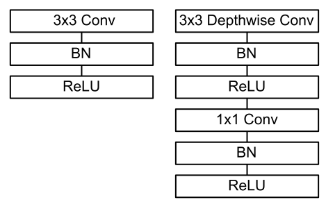
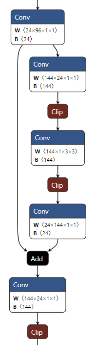
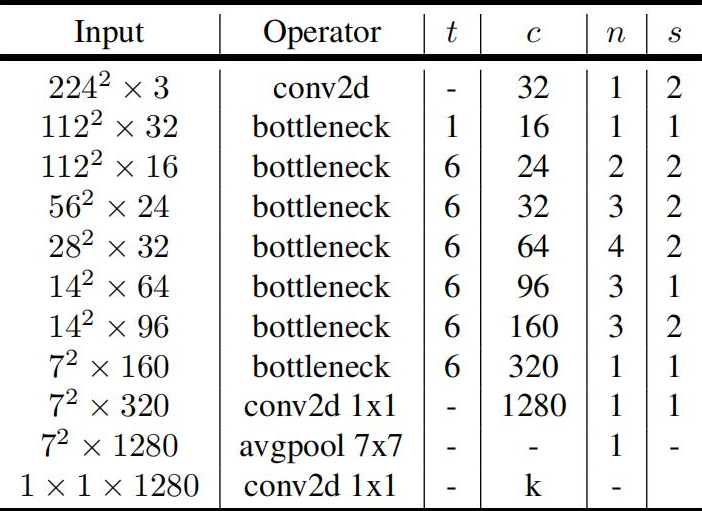
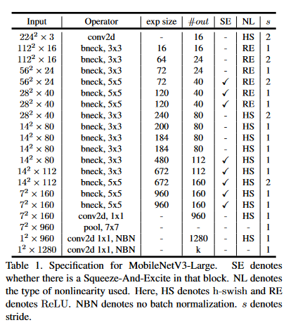
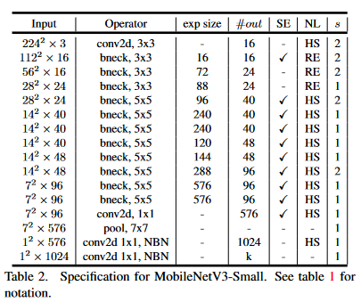
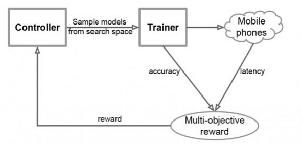
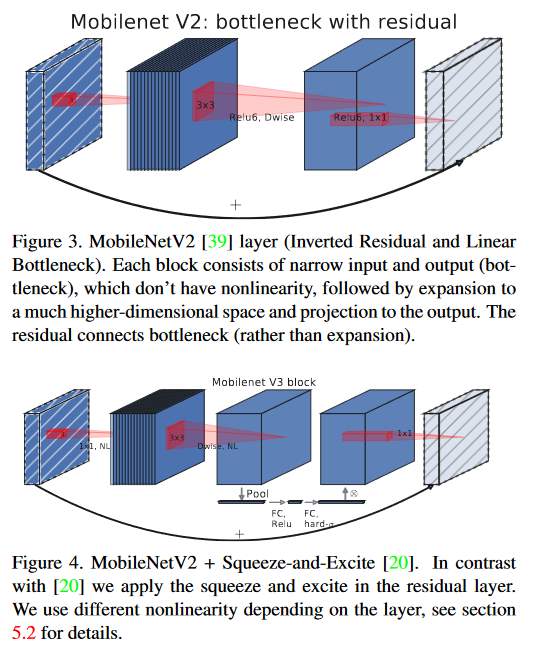
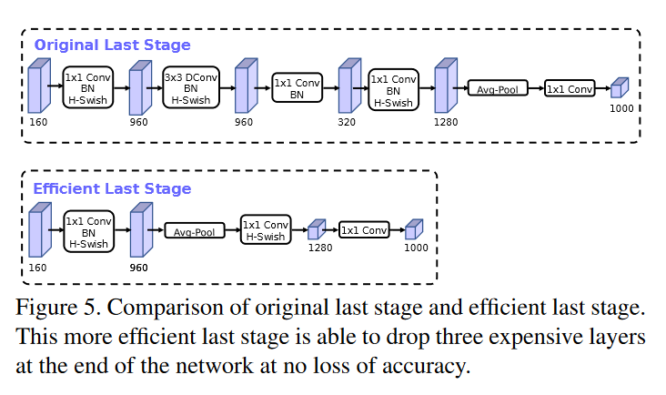

# MobileNet的原理与PyTorch实现

Mobilenet和ShuffleNet是目前应用比较广泛的两种轻量级卷积神经网络，轻量级网络参数少、计算量小、推理时间短，更适用于存储空间和功耗受限的边缘端和嵌入式平台。其中ShuffleNet是Face++在2017提出的轻量级网络，通过引入**group和Channel Shuffle**操作来让神经网络运算量大大减小。MobileNet是谷歌团队在同年提出的专注于移动端或者嵌入式设备中的轻量级CNN网络，提出了**Inverted Residual Block**结构，在此基础上能大大降低卷积层的消耗。二者的核心目标都是**在尽可能减小准确率损失的条件下大量减少参数与运算量**。到目前为止，MobileNet已经出现了三个版本，MobileNetv1、v2、v3；ShuffleNet也出现了两个版本：v1和v2。

由于MobileNetv2版本中也借鉴ShuffleNet使用了group操作，所以这里主要基于MobileNet介绍其结构和PyTorch官方实现（v2版本）

> MobileNetv2已经被官方收录到PyTorch库中，可以直接调用；MobileNetv3还只有一个简单的个人实现。二者的GitHub仓库如下：
>
> * V2：https://github.com/pytorch/vision/blob/6db1569c89094cf23f3bc41f79275c45e9fcb3f3/torchvision/models/mobilenet.py#L77
> * V3：https://github.com/xiaolai-sqlai/mobilenetv3/blob/adc0ca87e1dd8136cd000ae81869934060171689/mobilenetv3.py#L75

## MobileNetv2

主要资料来自[原论文](https://arxiv.org/abs/1801.04381)（发布在CVPR2018上，也可以从官网看）、网络和个人整理

### 深度可分离的卷积

学术界一直在追求更高的性能，因此对于卷积网络的构建方法往往是“力大砖飞”，通过构建更深更复杂的网络以提高准确性，辅以各种训练trick和理论性能更高的算子，但工业界需要的一直是”更小更快“，这也是MobileNet的基本构建思想——将标准的卷积分解成**深度卷积（DepthWise Conv）**和**点卷积（PointWise Conv）**

传统的卷积直接将多个卷积核作用到多个特征图，得到多个输出特征图；MobileNet使用的**深度可分离卷积（Depth-wise Separable Convolution）**将这个过程拆分成两部分：**depthwise卷积将与输入通道等量个滤波器对应作用到输入通道，pointwise卷积再使用与输出通道等量个1x1卷积核合并depthwise卷积的输出**



如上图，左边是传统的3x3卷积核卷积，右图是3x3卷积核深度可分离卷积

标准卷积的计算量为
$$
输入特征图尺寸*输入特征图数量*输出特征图数量*卷积核尺寸
$$
而深度可分离卷积的计算量为
$$
dw卷积+pw卷积=dw输入特征图尺寸*dw输入特征图数量*dw卷积核尺寸+pw输入特征图数尺寸*pw输入特征图数量*输出特征图数量
$$
二者作比可得到
$$
\frac{深度可分离卷积}{标准卷积}=\frac{1}{输出特征图数量} + \frac{1}{卷积核尺寸}
$$
对于3x3卷积核情况下， 可以得到8~9倍计算量的减少，需要付出的只是微小的准确率

### ReLU6激活函数

MobileNetv2引入了**ReLU6**来取代ReLU，因为ReLU在低维度情况下会导致较大的特征损失，后面我们会提到MobileNet使用了先升维再降维的InvertedResidualBlock方法，因此ReLU不再适合作为降维后的激活函数

ReLU6函数实际上就是对ReLU作限幅，当输入数据大于6时，将其限制在6

下面是MobileNet中用到基本Conv-BN-ReLU6模块的构建

```python
class ConvBNReLU(nn.Sequential):
	def __init__(self, in_planes, out_planes, kernel_size=3, stride=1, groups=1, norm_layer=None):
        padding = (kernel_size - 1) // 2
        if norm_layer is None:
            norm_layer = nn.BatchNorm2d
        super(ConvBNReLU, self).__init__(
            nn.Conv2d(in_planes, out_planes, kernel_size, stride, padding, groups=groups, bias=False),
            norm_layer(out_planes),
            nn.ReLU6(inplace=True)
        )
```

这里CBR块会自行确定padding：*当卷积核长宽大于3的情况下会加入padding*

### 线性瓶颈和深度可分离卷积组成的倒残差结构

如下图所示，MobileNetv2汲取了ResNet的残差块思路，同时结合了深度可分离卷积。

输入数据首先分成两路，一个残差边直接连到输出进行加和，另一端数据先进入一个PW卷积，这个卷积的目的是**升维**——DW卷积没有改变通道数的能力，如果输入了很少的通道，那么DW卷积只能提取出低维特征，效果会很差，引入一个升维的PW卷积将数据维度提高到原来的t倍，这样后面的DW卷积就能提取出`t*Cin`维的特征

PW卷积和DW卷积后都加入了BN层和ReLU6层用来提高性能，随后数据会经过第二个PW卷积，完成**降维**回到和输入通道数相同的维度。特殊地，*这层PW卷积后没有加入激活函数*，因为作者认为激活函数存在**线性瓶颈**（Linear Bottleneck）：在高维空间能够有效增加非线性，但在低维空间则会破坏特征。因此在降维后直接去掉ReLU，反而能获得更好的效果



标准的ResNet残差块结构基于3x3卷积+残差边的形式，ResNet残差块是*先降维卷积提取特征后再升维*，MobileNetv2使用了相反的*先升维提取特征后再降维*，因此这种结构称为倒残差块**InvertedResidualBlock**

论文中表示”ResNet呈现沙漏形，InvertedResidualBlock则是纺锤形“，本质上这是对DW卷积在高维提取特征的适配

PyTorch的官方实现如下所示：

```python
class InvertedResidual(nn.Module):
    def __init__(self, inp, oup, stride, expand_ratio, norm_layer=None):
        super(InvertedResidual, self).__init__()
        self.stride = stride
        assert stride in [1, 2] # 限制步长只能是1或2

        if norm_layer is None:
            norm_layer = nn.BatchNorm2d

        hidden_dim = int(round(inp * expand_ratio)) # 根据expand_ratio计算隐藏层的维度
        # 在输入维度==输出维度且步长为1的情况下，该块才被视为倒残差块
        self.use_res_connect = self.stride == 1 and inp == oup

        layers = []
        if expand_ratio != 1: # 在expand_ratio不为1的情况下构建第一次pw卷积
            # 第一层pw卷积
            layers.append(ConvBNReLU(inp, hidden_dim, kernel_size=1, norm_layer=norm_layer))
            
        layers.extend([
            # dw卷积
            ConvBNReLU(hidden_dim, hidden_dim, stride=stride, groups=hidden_dim, norm_layer=norm_layer),
            # 第二层pw卷积
            nn.Conv2d(hidden_dim, oup, 1, 1, 0, bias=False),
            norm_layer(oup),
        ])
        self.conv = nn.Sequential(*layers) # 构建卷积边

    def forward(self, x):
        if self.use_res_connect:
            return x + self.conv(x) # 残差边
        else:
            return self.conv(x)
```

在倒残差块构建中，代码引入了expand_ratio参数，这个参数决定了隐藏层的维度和是否使用残差结构，在后面的网络主干结构中引入了一个总参数表，expand_ratio会被其中的参数t决定，暂且按下不表

### 网络主干

论文中的网络结构如下图所示：



其中，

* **t**：扩展因子，对应上面倒残差块结构的`expand_ratio`参数
* **c**：输出特征图深度（通道数）
* **n**：瓶颈层（也就是倒残差块）的重复次数
* **s**：卷积步长，只针对第一层卷积，与ResNet中引入的步长类似，用来改变特征图的尺寸

下面来整体介绍网络结构。

首先是决定网络输入层、输出层通道数的函数`_make_divisible`，函数根据输入通道数v和分割值divisor返回真正卷积的输入通道数

```python
def _make_divisible(v, divisor, min_value=None):
    """
    This function is taken from the original tf repo.
    It ensures that all layers have a channel number that is divisible by 8
    It can be seen here:
    https://github.com/tensorflow/models/blob/master/research/slim/nets/mobilenet/mobilenet.py
    :param v:
    :param divisor:
    :param min_value:
    :return:
    """
    if min_value is None:
        min_value = divisor
    new_v = max(min_value, int(v + divisor / 2) // divisor * divisor)
    # Make sure that round down does not go down by more than 10%.
    if new_v < 0.9 * v:
        new_v += divisor
    return new_v
```

网络主干引入了几个超参数：

* num_classes：输出种类，用于图像分类任务
* width_mult：位宽乘数，用于调整每层输入通道数
* inverted_residual_setting：指定倒残差块排布，需要更改网络结构才设置
* round_nearest：对每层通道数取整为该值的倍数
* block：指定使用的倒残差块类型，需要更改网络结构才设置
* norm_layer：指定BN层类型，需要更改网络结构才设置

```python
class MobileNetV2(nn.Module):
    def __init__(self,
                 num_classes=1000,
                 width_mult=1.0,
                 inverted_residual_setting=None,
                 round_nearest=8,
                 block=None,
                 norm_layer=None):
        super(MobileNetV2, self).__init__()

        if block is None: # 指定使用的倒残差块类型
            block = InvertedResidual

        if norm_layer is None: # 指定BN层类型
            norm_layer = nn.BatchNorm2d

        input_channel = 32 # 初始输入通道
        last_channel = 1280 # 初始输出通道

        if inverted_residual_setting is None: # 指定倒残差块排布
            inverted_residual_setting = [
                # t, c, n, s
                [1, 16, 1, 1],
                [6, 24, 2, 2],
                [6, 32, 3, 2],
                [6, 64, 4, 2],
                [6, 96, 3, 1],
                [6, 160, 3, 2],
                [6, 320, 1, 1],
            ]
        # 该表格很重要

        # only check the first element, assuming user knows t,c,n,s are required
        # 检查inverted_residual_setting是否合规
        if len(inverted_residual_setting) == 0 or len(inverted_residual_setting[0]) != 4:
            raise ValueError("inverted_residual_setting should be non-empty "
                             "or a 4-element list, got {}".format(inverted_residual_setting))

        # 计算输入通道数
        input_channel = _make_divisible(input_channel * width_mult, round_nearest)
        # 计算输出通道数
        self.last_channel = _make_divisible(last_channel * max(1.0, width_mult), round_nearest)
        
        # 构建第一层
        self.features = [ConvBNReLU(in_planes=3, out_planes=input_channel, stride=2, norm_layer=norm_layer)]
        # 构建倒残差块
        for t, c, n, s in inverted_residual_setting:
            # 计算每层输出通道
            output_channel = _make_divisible(c * width_mult, round_nearest)
            for i in range(n):
                stride = s if i == 0 else 1 # 计算第一层步长
                features.append(block(input_channel, output_channel, stride, expand_ratio=t, norm_layer=norm_layer)) # 构建残差块结构
                input_channel = output_channel
        # 构建输出层
        features.append(ConvBNReLU(input_channel, self.last_channel, kernel_size=1, norm_layer=norm_layer))
        # 构建整体网络结构
        self.features = nn.Sequential(*features)

        # 构建分类器
        self.classifier = nn.Sequential(
            nn.Dropout(0.2),
            nn.Linear(self.last_channel, num_classes), # 全连接层输出分类结果
        )

        # 初始化权重和偏置
        for m in self.modules():
            if isinstance(m, nn.Conv2d):
                nn.init.kaiming_normal_(m.weight, mode='fan_out')
                if m.bias is not None:
                    nn.init.zeros_(m.bias)
            elif isinstance(m, (nn.BatchNorm2d, nn.GroupNorm)):
                nn.init.ones_(m.weight)
                nn.init.zeros_(m.bias)
            elif isinstance(m, nn.Linear):
                nn.init.normal_(m.weight, 0, 0.01)
                nn.init.zeros_(m.bias)

    def _forward_impl(self, x):
        x = self.features(x) # 网络结构
        x = nn.functional.adaptive_avg_pool2d(x, 1).reshape(x.shape[0], -1) # 平均池化
        x = self.classifier(x) # 分类器
        return x

    def forward(self, x):
        return self._forward_impl(x) # 网络主干
```

这里着重强调一下倒残差块设置表

```python
inverted_residual_setting = [
	# t, c, n, s
    [1, 16, 1, 1],
    [6, 24, 2, 2],
    [6, 32, 3, 2],
    [6, 64, 4, 2],
    [6, 96, 3, 1],
    [6, 160, 3, 2],
    [6, 320, 1, 1],
]
```

第一列t是扩展因子，决定了每个倒残差块的升维系数，该表中除了第一个残差块（实际上就是一层卷积）外，都设置升维系数是6，也就是将维度升高6倍后提取特征再降维回原来的状态

第二列c输出通道数顾名思义，就是对应残差块输出的通道数目，代码中使用

```python
output_channel = _make_divisible(c * width_mult, round_nearest)
```

构建，将其乘了系数width_mult（该程序中设置为1.0）并按round_nearest=8取整

我们能够发现如下规律

```python
inverted_residual_setting = [
	# t, c, n, s
	# 208,208,32 -> 208,208,16
    [1, 16, 1, 1],
    # 208,208,16 -> 104,104,24
    [6, 24, 2, 2],
    # 104,104,24 -> 52,52,32
    [6, 32, 3, 2],
	# 52,52,32 -> 26,26,64
    [6, 64, 4, 2],
    # 26,26,64 -> 26,26,96
    [6, 96, 3, 1],
	# 26,26,96 -> 13,13,160
    [6, 160, 3, 2],
    # 13,13,160 -> 13,13,320
    [6, 320, 1, 1],
]
```

主干网络呈升维趋势，每一层都比上一次提取更高维度的信息。

第三列n代表倒残差块的重复次数，官方实现没有重复超过4次，这是为了网络轻量级考虑，根据准确性和计算复杂度的侧重，可以适当修改重复次数

第四列s代表步长，MobileNet通过特定层中引入步长=2来改变输出特征图的大小

## MobileNetv3

MobileNetv1提出了DW-PW结构的深度可分离卷积，并引入了ReLU6结构；MobileNetv2在其基础上借鉴ResNet构建Bottleneck，并使用PW-DW-PW实现了升维-特征提取-降维的倒残差块结构，并根据线性瓶颈理论去掉了倒残差块最后的ReLU来提高效率；MobileNetv3则在v2基础上使用两种**AutoML**技术——*MnasNet*和*NetAdapt*让网络效率进一步提升

MobileNetv3提供了两个版本，分别为MobileNetv3-l（large）以及MobileNetv3-s（small），二者的区别在于网络主干bottleneck的个数，small为11个，large为15个，网络结构如下图所示





v3版本其实算是“非人造”的CNN，因为其中的主干网络构建依赖于AutoML技术，很多参数都是通过另外的网络生成的，只有一些神经网络难以优化的部分被人为修改。这里主要介绍对应的trick和基本技术理念

下面详细介绍MobileNetv3的实现

### AutoML

谷歌在2019年提出了**MnasNet**——一个优于MobileNet的网络，但特别的是这个网络是使用强化学习神经结构搜索（**NAS**）构建的。团队将网络结构设计问题描述为一个考虑CNN模型精度和推理实时性的多目标优化问题，使用架构搜索和强化学习以找到模型。

模型产生过程就是设置一个目标，控制网络遍历可能的组合，生成一个CNN，把这个CNN在ImageNet上跑几轮以后转换成TFLite，在到移动端用单核CPU测试延迟，分别得到准确度和延迟，再反馈给控制网络。消耗大量算力以后就搞出来帕累托最优的模型了



MobileNetv3正是在NAS技术构建出的MnasNet上实现的

### hswish和hsigmoid激活函数

MobileNetv3采用`hswish`函数作为激活函数，从而大大优化网络的非线性表达

常规swish函数采用`x * sigmoid(x)`实现，但由于sigmoid过于费时，作者采用ReLU6作为替代，于是有
$$
hswish(x)=x \times ReLU6(x+3)/6
$$
同样更换的还有`sigmoid`函数：
$$
hsigmoid(x)=ReLU6(x+3)/6
$$
作者对比了hswish和ReLU，发现hswish在高维度的特征提取中效果更好，根据MobileNetv2的经验就只在高维度的层后使用hswish——模型每个倒残差块中第一个PW卷积层后使用常规ReLU函数，而在之后的DW卷积层后使用hswish函数。

在实际部署中，往往采用乘0.16667完成除以6的操作，x+3和ReLU6会被融合到卷积层权重和偏置内

```python
class hswish(nn.Module):
    def forward(self, x):
        out = x * F.relu6(x + 3, inplace=True) / 6
        return out

class hsigmoid(nn.Module):
    def forward(self, x):
        out = F.relu6(x + 3, inplace=True) / 6
        return out
```

### SE通道注意力模块

MobileNetv3在结构中加入了**SE-Net**，将其放在dw卷积之后。因为SE结构会消耗一定的时间，所以作者在含有SE的结构中，将expansion layer的channel变为原来的1/4,这样既提高了精度，同时还没有增加时间消耗。

这个网络的核心思想是**在基础网络之上使用另一个新的神经网络，让这个网络通过学习来自动获取到特征图每个通道的重要程度，然后依照这一结果给每个特征图赋一个权重值，这样能让神经网络重点关注有用的特征并抑制对当前任务用处不大的特征**，这就是经典的**SE注意力机制**

SE注意力机制的实现步骤如下：

1. **Squeeze**：通过全局平均池化将每个通道的二位特征压缩为一个数
2. **Excitation**：为每个特征通道生成一个权重值，经过两个全连接层构建通道间相关性
3. **Scale**：将得到的权重归一化并加权到每个通道的特征上

也就是说SE注意力机制结构为：*平均池化-全连接-全连接-矩阵乘法*

于是得到改进的倒残差块变成了这样的结构：



具体代码实现如下：

```python
class SeModule(nn.Module):
    def __init__(self, in_size, reduction=4):
        super(SeModule, self).__init__()
        self.se = nn.Sequential(
            nn.AdaptiveAvgPool2d(1), # Squeeze平均池化
            nn.Conv2d(in_size, in_size // reduction, kernel_size=1, stride=1, padding=0, bias=False), # PW卷积替代全连接层功能
            nn.BatchNorm2d(in_size // reduction),
            nn.ReLU(inplace=True), # 普通ReLU激活函数
            nn.Conv2d(in_size // reduction, in_size, kernel_size=1, stride=1, padding=0, bias=False), # PW卷积替代全连接层功能
            nn.BatchNorm2d(in_size),
            hsigmoid() # hsigmoid替换sigmoid
        )

    def forward(self, x):
        return x * self.se(x) # Scale矩阵乘法
```

里面的两层CBR块就是为了替代全连接层的功能，可以尽可能减小参数量

得到的倒残差结构如下所示：

其中`nolinear`表示采用的非线性层类型，`semodule`表示采用的SE模块类型

```python
class Block(nn.Module):
    def __init__(self, kernel_size, in_size, expand_size, out_size, nolinear, semodule, stride):
        super(Block, self).__init__()
        self.stride = stride
        self.se = semodule

        self.conv1 = nn.Conv2d(in_size, expand_size, kernel_size=1, stride=1, padding=0, bias=False) # PW卷积
        self.bn1 = nn.BatchNorm2d(expand_size)
        self.nolinear1 = nolinear
        
        self.conv2 = nn.Conv2d(expand_size, expand_size, kernel_size=kernel_size, stride=stride, padding=kernel_size//2, groups=expand_size, bias=False) # DW卷积提取特征
        self.bn2 = nn.BatchNorm2d(expand_size)
        self.nolinear2 = nolinear
        
        self.conv3 = nn.Conv2d(expand_size, out_size, kernel_size=1, stride=1, padding=0, bias=False) # PW卷积降维
        self.bn3 = nn.BatchNorm2d(out_size)
        # 最后不使用非线性层

        self.shortcut = nn.Sequential()
        # 当块的输入通道和输出通道不等时加入一层PW卷积来实现通道变换
        if stride == 1 and in_size != out_size: 
            self.shortcut = nn.Sequential(
                nn.Conv2d(in_size, out_size, kernel_size=1, stride=1, padding=0, bias=False),
                nn.BatchNorm2d(out_size),
            )

    def forward(self, x):
        out = self.nolinear1(self.bn1(self.conv1(x))) # PW卷积升维
        out = self.nolinear2(self.bn2(self.conv2(out))) # DW卷积特征提取
        out = self.bn3(self.conv3(out)) # PW卷积降维
        if self.se != None:
            out = self.se(out) # 使用SE注意力机制
        out = out + self.shortcut(x) if self.stride==1 else out # 加入残差边
        return out
```

### 高效输出网络

MobileNetv2在平均池化层前加入了一个1x1的pw卷积，用于提高特征图维度，但这带来了一定计算量，MobileNetv3优化了这个结构，先使用平均池化将特征图从7x7缩小到1x1，再使用pw卷积升维，这样减小了7x7=49倍的计算量。同时v3直接去掉了前面一层倒残差块，测试发现两种结构并没有显著的性能差异。新老结构对比如下：



这个结构显然更符合MobileNet轻量化的预期

### NetAdapt算法优化

NetAdapt算法也是基于强化学习的网络优化算法，专门用于对各个模块确定之后的网络层微调每一层的卷积核数量，也被称为**层级搜索**（Layer-wise Search）

MobileNetv3的主干网络参数就是通过该算法优化的

> 很显然使用这个算法会大大增加网络构建过程中的计算量，不过在网络构建以后就不需要再考虑它了

### 网络主干

这里以MobileNetv3-**l**为例，s模型是与之类似的，只不过网络层数变少了，参数也有所不同

GitHub上的实现没有采用和v2一样的设置表，而是简单的逐块设置bneck。代码相对简单，分成了输入、bneck、输出三大部分。

输入部分就是一个用来hswish激活函数的3x3卷积核，步长=2的卷积块。输出部分和上面提到的改进一样

重点的残差块参数从左往右依次是：卷积核大小、输入通道数、扩展因子（升维系数）、输出通道数、非线性层种类、是否采用SE注意力模块、步长

> 需要注意：网络的总体参数基于MnasNet修改，根据NetAdapt算法优化决定，因此可以说达到了相对完美的程度

```python
class MobileNetV3_Large(nn.Module):
    def __init__(self, num_classes=1000):
        super(MobileNetV3_Large, self).__init__()
        self.conv1 = nn.Conv2d(3, 16, kernel_size=3, stride=2, padding=1, bias=False)
        self.bn1 = nn.BatchNorm2d(16)
        self.hs1 = hswish()

        self.bneck = nn.Sequential(
            Block(3, 16, 16, 16, nn.ReLU(inplace=True), None, 1),
            Block(3, 16, 64, 24, nn.ReLU(inplace=True), None, 2),
            Block(3, 24, 72, 24, nn.ReLU(inplace=True), None, 1),
            Block(5, 24, 72, 40, nn.ReLU(inplace=True), SeModule(40), 2),
            Block(5, 40, 120, 40, nn.ReLU(inplace=True), SeModule(40), 1),
            Block(5, 40, 120, 40, nn.ReLU(inplace=True), SeModule(40), 1),
            Block(3, 40, 240, 80, hswish(), None, 2),
            Block(3, 80, 200, 80, hswish(), None, 1),
            Block(3, 80, 184, 80, hswish(), None, 1),
            Block(3, 80, 184, 80, hswish(), None, 1),
            Block(3, 80, 480, 112, hswish(), SeModule(112), 1),
            Block(3, 112, 672, 112, hswish(), SeModule(112), 1),
            Block(5, 112, 672, 160, hswish(), SeModule(160), 1),
            Block(5, 160, 672, 160, hswish(), SeModule(160), 2),
            Block(5, 160, 960, 160, hswish(), SeModule(160), 1),
        )

        self.conv2 = nn.Conv2d(160, 960, kernel_size=1, stride=1, padding=0, bias=False)
        self.bn2 = nn.BatchNorm2d(960)
        self.hs2 = hswish()
        self.linear3 = nn.Linear(960, 1280)
        self.bn3 = nn.BatchNorm1d(1280)
        self.hs3 = hswish()
        self.linear4 = nn.Linear(1280, num_classes)
        self.init_params()

    def init_params(self):
        # 初始化参数
        for m in self.modules():
            if isinstance(m, nn.Conv2d):
                init.kaiming_normal_(m.weight, mode='fan_out')
                if m.bias is not None:
                    init.constant_(m.bias, 0)
            elif isinstance(m, nn.BatchNorm2d):
                init.constant_(m.weight, 1)
                init.constant_(m.bias, 0)
            elif isinstance(m, nn.Linear):
                init.normal_(m.weight, std=0.001)
                if m.bias is not None:
                    init.constant_(m.bias, 0)

    def forward(self, x):
        # 输入部分
        out = self.hs1(self.bn1(self.conv1(x)))
        # 主干部分
        out = self.bneck(out)
        # 输出部分
        out = self.hs2(self.bn2(self.conv2(out)))
        out = F.avg_pool2d(out, 7)
        out = out.view(out.size(0), -1)
        out = self.hs3(self.bn3(self.linear3(out)))
        out = self.linear4(out)
        return out
```

