# 三维重建2【光学参数标定】

本系列博文旨在构建从底层CMOS传感器硬件到顶层算法的三维重建全栈知识架构，但重点在于图像信号处理和三维重建算法。希望能记录自己在学习三维重建过程中学到的知识，并为各位读者指明学习方向，抛砖引玉。

主要框架参考[Yvon Shong](https://www.zhihu.com/people/yvonshong/posts)和[Wang Hawk](https://www.zhihu.com/people/hawk.wang/columns)的博文撰写，其他参考资料包括《智能传感技术课程PPT》、冈萨雷斯《数字图像处理》

## 与成像有关的重点参数

这里对第1篇的内容进行补充，说明一些与成像（图像质量）有关的重点参数及其成因。若读者需要了解有关光学参数部分，可以之间调到本篇的下一节

### 噪声

上一章我们从CCD/CMOS原理到ISP部分都在提噪声，但一直没有对CMOS的噪声进行归类。可以知道，噪声的来源有很多，其中**最重要的来源就是Sensor电路内部**。

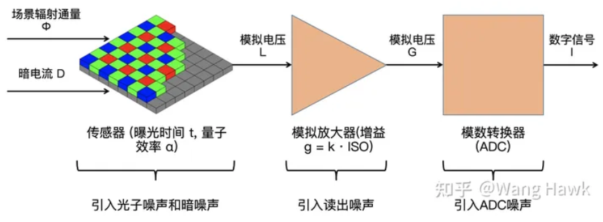

如上图所示，**场景辐射通量Φ**即光子辐射通量，它照射到光电二极管上，通过间接带隙半导体（Si）的非竖直跃迁过程产生电子；同时传感器自身因为温度影响会释放出一些电子，它和APS电路漏电流一起构成了**暗电流D**，二者共同提供了APS输出电压。每个APS电压都会被附近的放大器先放大一次，再在读出电路的精密运放中再放大一次；最后的ADC会把模拟电压信号转换成数字信号

我们可以将Sensor内部引入的噪声分成四大部分：

* **光散粒噪声**（光子噪声）：由单位时间内入射光子随机分布引起的噪声
* **暗噪声**：由于暗电流作用导致的噪声
* **读出噪声**：由每个APS的近端放大器和用于处理ISO的精密运放引起的噪声
* **ADC噪声**：由ADC量化误差引入的噪声

#### 光散粒噪声

> 在对光电效应一知半解的人看来，当光电二极管受到恒定光照时每个单位时间接收到的光子数量和激发出的电子数量都是固定的，*实际上并不是这样*

在上一节中，我们提到过在光电二极管中，会出现光电转化随机过程。单位时间内，一个光电二极管接收到的光子数是随机的，光电转化的过程也是随机的，前者的随机性要比后者的随机性更大。这是因为光电转化的过程主要受到硅晶体声子只能与有限数量、固定波长的光子发生吸收碰撞的影响，而在芯片制造过程中会努力避免材料不均匀和出现缺陷的情况，并且效果显著；但对于接收光子数就无法控制了。

可以认为**单个光电二极管**（单个像素）**在曝光期间接收的光子平均数量与曝光时间及光通量成正比**，**作为随机变量的光子数遵循泊松分布**，即
$$
N \sim \pi(\alpha t \Phi)
$$
其中N是光电二极管接收的光子数，π表示泊松分布，α是一个比例系数，t表示曝光时间，Φ是光通量

这种由随机变量引起的波动性在图像上表现为可见的噪声，被称为**光散粒噪声**或**泊松噪声**。遵循泊松分布的随机量均值和方差相等，因此光散粒噪声呈现如下图所示的分布，其均值E(N)越大，方差D(N)越大，曲线覆盖宽度越宽

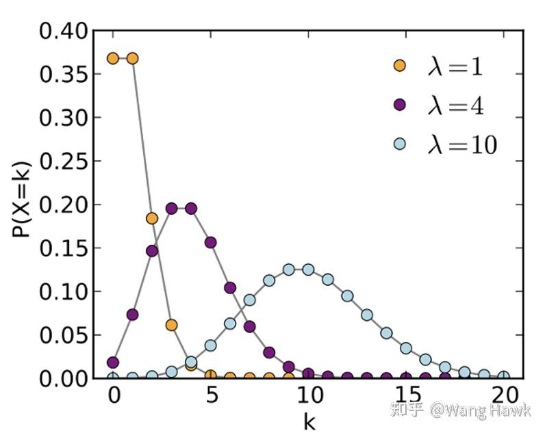

这在频谱上呈现为典型的**白噪声**，导致光散粒噪声具有两个明显特点：

* 曝光时间越长或场景光照越强，捕获到的光子数量均值越大，其波动也越大，表现为光子噪声绝对值越大
* 光子数量越多，噪声绝对值越大，但在图像中反而越不明显

直观上看，当画面较暗时，单个像素捕获的光子平均数量少，波动也较小；随着图像变亮，光散粒噪声增加变得明显；但当图像继续变亮时，虽然光子噪声的幅值变大了，但从肉眼上看却变得不明显了。因此**对于比较明亮的场景以及较大尺寸的传感器，光散粒噪声是最主要的噪声来源**

> 信噪比先减小，再增加

#### 暗噪声

之前提到过，CCD/CMOS传感器P衬底中的电子分布是动态且随温度变化的，导致即便在没有接受到光子时，因为温度的影响光电二极管也会释放出电子，这就是光电二极管的**热激发**。

在曝光时间内，热激发电子的数目也是一个符合泊松分布的随机量，用下式描述
$$
N \sim \pi(t D)
$$
其中t是曝光时间，D是当前温度下单位时间内的热电子数量。这个随机量也会导致图像上的噪声，即**热噪声**

在没有光线入射或入射光非常少时，光电二极管不会在其下方势阱中积累电荷，但总会有部分热电子进入势阱，这就让热噪声被引入了电路。热噪声的主要特点有：

* **与温度成指数关系，温度每升高6摄氏度，热噪声的均值扩大一倍**
* **与曝光时间成线性关系，曝光时间越长，热噪声越强**

因此如果要控制乃至消除热噪声，需要：

* **降低Sensor的温度**
* **控制曝光时间在一个较短的值**

当然，还有一个基于ISP的解决方法：首先测量出带有热噪声的图像，保存每个像素对应的黑电平值，并在最终图像中使用**黑电平校正**算法减去噪声值即可

读者可能注意到了，上面所有的噪声都是“热噪声”，但本节的标题是“暗噪声”——实际上暗噪声包含两部分：热噪声和漏电流噪声。

在传统的PPS结构中，CMOS的外部电路都是只有输入端的，很少或根本不会有漏电流反灌进光电二极管或读出电路；但在APS中，我们引入了一个三态门，它是基于一个源极跟随器的（有些实现中还会加入一个传输门），就因为这个源极跟随器，会导致可能存在部分漏电流灌入输出节点。因此暗噪声=热噪声+漏电流引起噪声

不过这对我们处理暗噪声几乎没有影响，因为现代ISP基本都配备了黑电平校正，可以直接通过预标定的暗噪声来滤除其影响

当然，由于光散粒噪声和暗噪声共同作用，传感器像素在进入放大器之前的输出电平就变成了一个随机量。由于两个泊松分布之和也是泊松分布，且其均值是两个泊松分布的均值之和，因此L可以表示为

$$
L \sim \pi(t(\alpha \Phi +D)
$$

其中L表示光电传感器（APS）的输出电平

#### 读出噪声和ADC噪声

读出噪声是信号被“放大”这一过程带来的。

理想的运放相当于做乘法，通过运放的模拟电平应当与像素受到的曝光量（接收光子数）成正比。但实际运放会受到供电电压、制造工艺乃至电路设计影响，出现失真，让原始值偏离与光子数成正比的理想值。

运放电路引入的噪声由两大部分构成：

* **本征噪声**：也被称为电压噪声。由于电子器件的非理想性质引起，与运放的电路设计、工艺实现有关，其在宽频带内存在
* **1/f噪声**：也被称为低频噪声、闪烁噪声或粉色噪声。其功率谱密度随着频率增加而下降，呈现为S(f)=K/f的特性。成因复杂，一种解释是认为它与电子器件中的缺陷和杂质有关，在低频工作下会集中“偶发”暴露出来

> 运放的信噪比反映了读出噪声的大小

被放大的信号还会经过ADC才能被转换成固定的数字值，这个过程会为信号添加**ADC量化噪声**。因为模拟电平值是连续的，但ADC量化的数字值是离散的，因为这个映射关系导致的误差被称为量化误差，是量化误差带来了量化噪声

> ADC的信噪比反映了量化噪声的大小

最后还要考虑到集成电路无处不在的**热噪声**。由于电阻、MOSFET内部的电子热运动，会出现随机涨落的噪声电流。热噪声是一种典型的白噪声

我们一般将电路热噪声、运放引起的噪声、ADC量化噪声统称为**读出噪声**（因为运放和ADC噪声占主要部分，因此有时候也分开称为读出噪声和ADC噪声）。读出噪声符合高斯分布，功率谱密度几乎是频带内的一条水平线，呈现**白噪声**特点

### 信噪比

在上面一节，我们能得知**信号带噪声输出公式**：
$$
I=Lg +n_{read}g+n_{ADC}
$$
其中I表示Sensor的像素数字量输出，L表示光电传感器（APS）的输出电平，g是与ISO增益有关的设置值常量，$n_{read}$​表示读出噪声，$n_{ADC}$表示ADC量化噪声。这里面读出噪声和ADC噪声都符合高斯分布，而原始电压则符合泊松分布

其中
$$
L \sim \pi(t(\alpha \Phi +D);n_{read} \sim N(0,\sigma_{read});n_{ADC} \sim N(0,\sigma_{ADC})
$$
由于读出噪声和ADC量化噪声都符合高斯分布，可以把式子简化为**仿射噪声模型**
$$
I=Lg +n_{add},n_{add}=n_{read}g+n_{ADC} \sim N(0,\sqrt{\sigma_{read}^2 g^2 +\sigma_{ADC}^2})
$$
其中$n_{add}$被称为**加性噪声**——因为它看上去就像是一个偏置值，直接加在Lg参数上

结合之前的介绍，根据公式可知：

- 场景很亮时，光散粒噪声起主导作用
- 场景很暗时，暗噪声起主导作用，曝光时间越长，暗噪声影响越大
- 光散粒噪声和输入信号绑定在一起，无法消除
- 低ISO值时，ADC噪声更突出，而高ISO值时，光散粒噪声和读出噪声更突出

因为暗噪声的存在，像素的原始值并不绝对反映场景的亮度；且暗噪声是最难去除的——拍摄多张图像并取均值的方法可以有效减轻遵循正态分布（高斯分布）的读出噪声和ADC噪声的影响，但对暗噪声于事无补。因此不如整体测量出噪声值再从最终信号中减去

> 在仿射噪声模型中，$n_{add}$被看作整体信号的偏置，所以可以独立去除；但暗噪声不一样，它是作为信号的“附加增益”存在的

得到了上面的结论，看似噪声和图像的曝光时间、受光亮正相关，但实际上图片噪声随光照的变化如下图所示，要解释这个问题就要引入**信噪比**的概念。

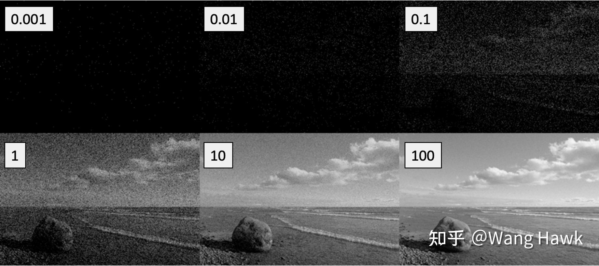

信噪比SNR定义为信号功率和噪声功率的比值，一般用信号主频率分量的功率谱密度代表信号功率；背景噪声的功率谱密度代表噪声功率。我们用信噪比则反映了噪声相比信号的相对大小，当**噪声减小时其方差变小，而信噪比减大**。**图像的噪点多少实际上取决于信噪比的大小**

Sensor场景下，信噪比可以定义为
$$
SNR=\frac{E^2(I)}{\sigma^2(I)}=\frac{(\alpha t \Phi g)^2}{\alpha t \Phi g^2 +\sigma^2_{read} g^2 +\sigma^2_{ADC}}
$$
当**曝光时间t很大，或者场景很亮时**，我们可以忽略掉加性噪声部分，即
$$
SNR=\frac{(\alpha t \Phi g)^2}{\alpha t \Phi g^2 }=\alpha t \Phi
$$
这种情况下像素值越大，信噪比也越大，**噪声在图像中看起来越不明显**。这就是为什么强光环境下图像噪点会很少

反过来讲，如果曝光时间t很小，或者场景很暗时，光噪可以忽略，加性噪声占主导，有
$$
SNR=\frac{(\alpha t \Phi g)^2}{\sigma^2_{read} g^2 +\sigma^2_{ADC}}
$$
如果图像亮度保持不变，SNR的分子固定；ISO增大导致g增大，最后让SNR下降，噪声变明显

### 噪声标定

终于到了最后的解决噪声部分。在上一章的黑电平校正算法部分，我们略过了如何标定黑电平值，现在来介绍。

根据上面的介绍，**暗电流、读出噪声、ADC量化噪声、运放增益尺度**就是我们要标定并最终在图片中减去的值了。我们将它们分成暗噪声和加性噪声两部分处理。

暗噪声的处理非常难，因为我们并不知道g的具体值（这是一个与ISO成正比的常数），但考虑到加性噪声服从高斯分布且均值是0，根据中心极限定理，我们在有大量数据的情况下，可以看作加性噪声为0！这样就为求解暗噪声提供了方便

于是在停止曝光的情况下直接拍摄大量图像，再对这些图像取均值，相当于令Φ=0，求解E(I)，得到
$$
E(I)=tDg
$$
我们可以知道在一定ISO下（g不变）、一定曝光时间条件下的暗帧！这就意味着不求出暗电流D的具体值，只要在同等曝光时间和ISO设定的图像中减去这个暗帧，就可以直接消除图像中的暗噪声。在这个过程中我们需要做的就是**针对相机的不同ISO设置分别标定当前暗帧**

> 这便是在上一章中提到“减去预标定的带有暗电流的图像”的原因

不过由于ISP中常常使用自动曝光，就不太好针对每个曝光时间标定暗帧，因此可以利用暗噪声大小与曝光时长成正比，标定出一些典型ISO值后通过线性插值的方式来计算出中间ISO值的补偿比例即可

接下来处理加性噪声。在标定后，整个式子变得简单：
$$
\delta^2(I)=E(I)g+\sigma^2_{add}
$$
像素的方差与均值呈现出线性关系，这就方便通过取平均来补偿了。我们可以在特定增益g下拍摄大量灰阶图像，针对每张图像先减去当前暗帧后求每个像素均值的方差，并使用线性回归算法拟合出一条最符合的直线如下图所示

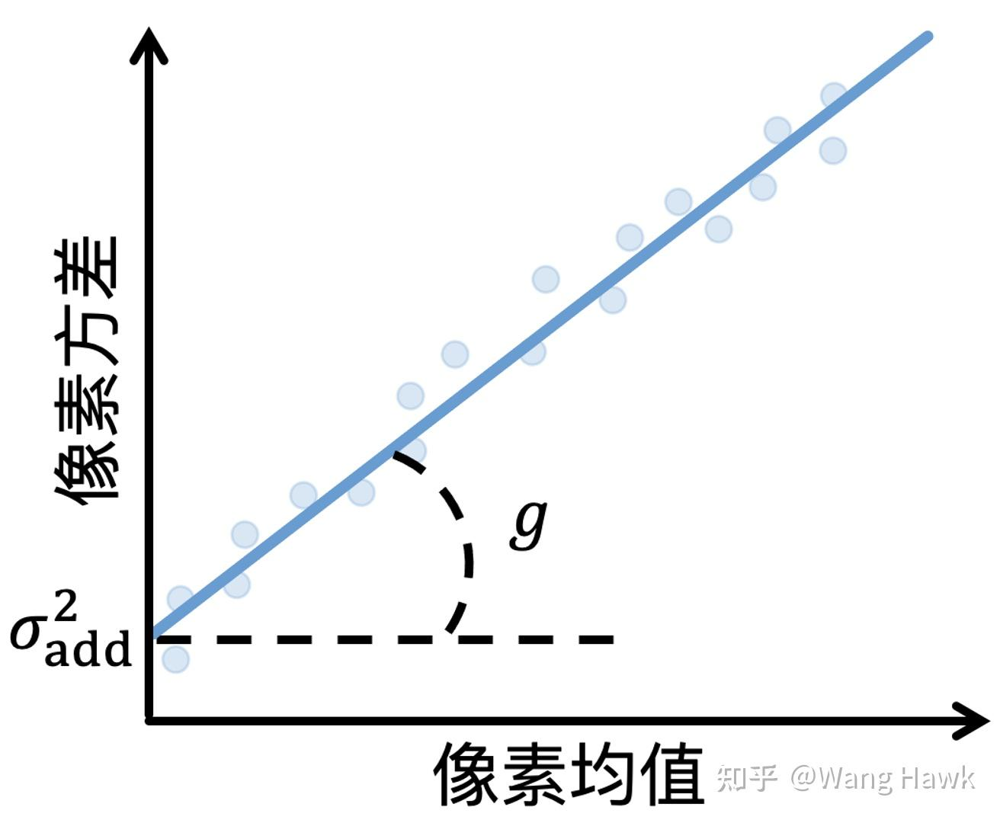

这条直线的斜率就是增益g，截距则是加性噪声的方差$\sigma^2_{add}$

> 灰阶图像如下图所示
>
> 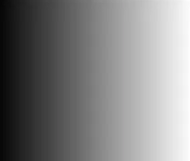
>
> 其目的就是为不同位置的像素提供不同的亮度值，方便获得均值-方差图表

这样，我们就能够实现黑电平校正算法了。工业上的实现还要考虑一些细节，采用各种trick做处理，不再赘述

### 动态范围

**动态范围**（dynamic range）是可变化信号最大值和最小值的比值

在各种传感器中，动态范围都是重要的参数。图像领域，动态范围是指图像能捕捉的场景中光亮度的范围。这里的亮度指的是发光强度与发光面面积之比，单位坎德拉cd/m。

> 1cd等于频率为$540*10^{12}$​Hz的单色光源在给定方向单位立体角发出的光通量
>
> 发光面定义为垂直于光源发光指定方向的面

在上一章提到过自然场景中，最大亮度和最小亮度的比值可以高达10000:1，由于人眼和Sensor结构差别极大，人眼的动态范围可以动态调节，但Sensor的动态范围就只能在某个较小区间了。更糟糕的是ISP过程还会让Sensor的动态范围进一步缩小，导致相机的动态范围比Sensor的动态范围还要小一些

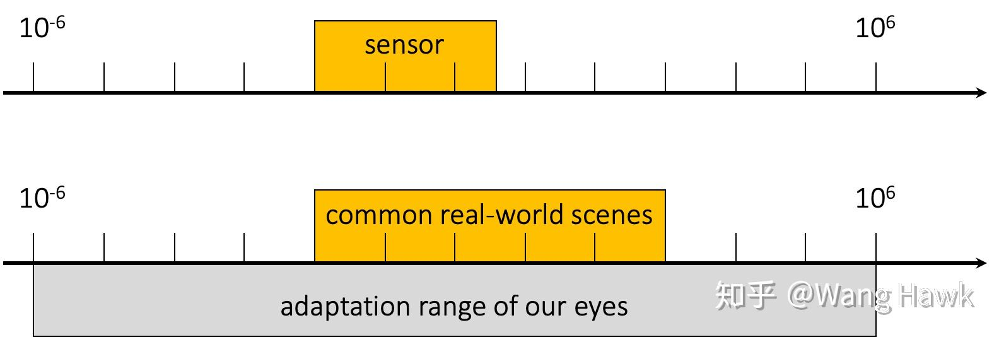

那么如何进行高动态范围成像呢？上一章中介绍了使用Gamma函数对图像进行校正的方式，这在ISP中很常见，但对于专业的照相机需求远远不够。目前广泛使用的一种方法是通过多重曝光的图像合成，来生成高动态范围的图像，核心思想非常简单：**拍摄同一场景不同曝光度下的多张照片并将它们合理融合起来**

> 很好理解，一部分照片负责补足一段动态范围内的信息，从整体上建立一个更广的动态范围

首先要对图像进行Gamma校正，使用非线性图像恢复响应函数对图像像素做处理，让图片符合人眼感受。

需要用到基本对数函数
$$
g(f)=ln(f^{-1})
$$
代入相机成像函数
$$
z_{ij}=f(E_i \Delta t_j) \leftrightarrow f^{-1}(z_{ij})=E_i \Delta t_j 
$$
得到
$$
g(z_{ij})=ln(E_i) +ln(\Delta t_j)
$$
使用下面的公式让它作用到原始图像
$$
Z_{ij,lin}=exp(g(z_{ij}))
$$
即可

目前已知量是Z和t，未知量是场景的辐照度E和Gamma变换函数g。为求出g，可以在固定场景对着同一物体拍摄多张照片，这样就多了一个约束条件，即在多次拍摄时，E是不变的。再假设g是一个单调递增函数（*辐照度越强，图像亮度值越大*），且g是平滑的，那么我们可以通过下式求出未知量
$$
\O =\sum_{i=1}^N \sum_{j=1}^N [g(z_{ij}) -ln(E_i)-ln(\Delta t_j)]^2 +\lambda \sum_{z=Z_{min}+1}^{Z_{max}-1} g''(z)^2
$$
这是一个典型的最小二乘问题，可以直接计算得到g

考虑到多次拍摄过程中的加权融合，需要采用下列加权系数函数来确定每幅图的权重

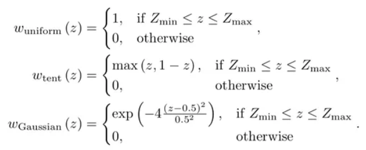

这就得到了HDR图像

## 相机成像模型

上一部分介绍了与成像有关的重点参数，下面开始本篇的重点：用计算机对相机的成像模型进行描述，这主要涉及到光学参数。

### 齐次坐标

在描述相机成像模型时，会用到平面几何、立体几何的基本原理，因此如何在计算机中描述基本几何概念就尤为重要。以二维空间为例，通常在表述一个点的时候，经常使用形如 $[x,y]^T$ 这样的坐标来表示，但在机器视觉领域，为了方便计算机的描述和计算，通常使用**齐次坐标**来表示一个点
$$
[x,y,w]^T
$$
从形式上来看，就是在原来的1x2矩阵上增加了w坐标值，这个w坐标的目的是为了方便简化坐标计算。一般来说，计算机描述坐标变换需要使用
$$
P_1=RP_0 +t
$$
其中R是旋转矩阵，T是平移矩阵

> 这里用到了矩阵相乘等效为坐标变换

但引入齐次坐标后，该式变为
$$
P_1=TP_0
$$
其中T是空间变换矩阵，这样空间点的变换。

通常情况下，齐次坐标中的w会被归一化，从而使用
$$
[\frac{x}{w},\frac{y}{w},1]^T
$$
描述一个二位点。可以发现这个w涉及一个线性变换（就是尺度变换），不会影响矩阵表示坐标的自由度

> 通过引入一个不为0的新维度来构造更方便使用的数学工具，齐次坐标应用到了这样的设计思想。在作用上，齐次坐标引入的w和四元数引入的w是非常相似的——都通过引入新的变量解决现有自由度下无法处理的问题

对于三维空间，同理可得到
$$
[\frac{x}{w},\frac{y}{w},\frac{z}{w},1]^T
$$
为了方便，通常取w=1，也就是说，将一个二维点$(x,y)$改写成$(x,y,1)$，就可以得到齐次坐标了。更进一步，w可以取到任何实数，也包含0，当且仅当w=0时的齐次坐标
$$
p=[x,y,0]^T
$$
表示无穷远处的点。习惯上使用
$$
X=[1,0,0]^T
$$
表示二维空间中的X轴，同理也可以有$Y=[0,1,0]^T$。对于这些无穷远处的点，一般将其称为**理想点**

下面来看直线和平面的齐次坐标表示法。将中学解析几何直线表达式 $ax+by+c=0$ 通过线性代数描述为向量内积形式如下
$$
[a,b,c][x,y,1]^T=0
$$
我们可以发现其中包含了 $[x,y,1]^T$ 的二维点齐次坐标。令 $l=[a,b,c]^T, p=[x,y,1]^T$ ，代入上式可得到**点在直线上的方程**
$$
p^T l=l^T p=0
$$
这便是直线的齐次坐标表示，我们可以直接用这里的$l=[a,b,c]^T$描述一条直线。对于两个直线的**交点**，我们可以用 $p=l_1 \times l_2$ 来唯一确定；**两点确定一条直线**的表达式为 $l=p_1 \times p_2$ 。可以发现这里*利用叉乘实现了点和直线的转换*

同样地，对于平面解析几何表达式 $ax+by+cz+d=0$ ，有齐次坐标表示**点在平面上的方程**
$$
p^T \pi = \pi^T p=0
$$
其中，$p=[x,y,z,1]^T$ 描述空间中的一个点，$\pi=[a,b,c,d]^T$ 描述空间中的一个**平面**，其中的 $v=[a,b,c]^T$ 描述了该平面 $\pi$ 的**法向量**

**三点确定一个平面**，该原理用矩阵描述为给出 $p_{1,2,3}=[z_{1,2,3},y_{1,2,3},z_{1,2,3},1]^T$ 三个任意点，可以唯一得到平面矩阵
$$
\pi =\left[ \begin{matrix}
(p_1 -p_3) \times (p_2 -p_3)\\
-p_3^T (p_1 \times p_2)
\end{matrix} \right]
$$
而对于**三个平面所唯一确定的一点** $p$，通过求解下列方程可以得到
$$
\left[ \begin{matrix}
\pi_1^T\\
\pi_2^T\\
\pi_3^T\\
\end{matrix} \right]_{3\times 4}
p_{4 \times 1} = 0
$$
该方程通过加入法向量归一化约束，即其范数
$$
\|v \| = \sqrt{a^2 +b^2 +c^2} =1
$$
来将方程整理为
$$
\left[ \begin{matrix}
a_1 & b_1 & 1\\
a_2 & b_2 & 1\\
a_3 & b_3 & 1\\
\end{matrix} \right]

\left[ \begin{matrix}
x\\
y\\
z\\
\end{matrix} \right]
=
\left[ \begin{matrix}
-d_1\\
-d_2\\
-d_3\\
\end{matrix} \right]
$$
来进行求解，这个方程的系数矩阵是满秩的，更容易计算

### 空间变换

基于齐次坐标，我们就可以通过**空间变换**的方式来描述实际物体、光学成像和二维图像之间的关系了。常见的空间变化包括欧式变换、相似变换和仿射变换。一般采用变换矩阵的方式来描述一个变换的过程，这利用到矩阵相乘等效为坐标变换的概念

**欧式变换**矩阵为
$$
H=\left[ \begin{matrix}
R&t\\
0&1\\
\end{matrix} \right]
$$
这是最常用的变换。对于3维空间，其中R为3x3的旋转矩阵，描述一次变换中的起始点是如何通过旋转到达目标点，满足 $RR^T = 1$ ，即R是一个*正交矩阵*，且满足$\|R\| = 1$；其中t表示3x1的平移向量，描述一次变换中的起始点是如何通过平移到达目标点。利用旋转+平移，就可以描述一次完整的空间变换

> 对于2维空间，R是2x2矩阵，t是2x1向量

两点之间的欧式变换可以写为
$$
P_1 =HP_0
$$
这便是上一节中给出的计算机内对坐标变换的描述，其中的 $P_0,P_1$ 均为齐次坐标

欧式变换是**等距变换**，即正方形经过欧式变换后，仍为正方形，圆经过欧式变换后仍为圆，即**形状、大小上不会发生改变**。这样的变换具有线性性质，因此被称为**线性变换**。三维空间的欧式变换可以用下式描述

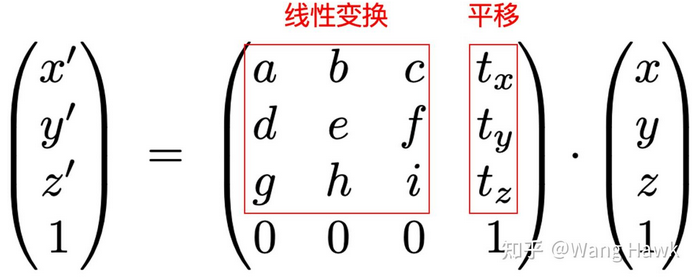

我们一般用角度 $\theta$ 描述旋转，用平移坐标 $(t_x, t_y)$ 描述平移，因此欧式变换一般展开为
$$
H=\left[ \begin{matrix}
cos(\theta)&-sin(\theta)&t_x\\
sin(\theta)&cos(\theta)&t_y\\
0&0&1\\
\end{matrix} \right]
$$
另一种变换被称为**相似变换**，它的特点是**变换前后形状不变，但大小改变**。比如比如一个三角形，三条边是3、4、5，作用了相似变换后，变成了0.3、0.4、0.5，三条边的比例仍然是3:4:5，但各自的大小却变了。相似变换通过在欧式变换旋转矩阵R上左乘一个尺度因子s得到
$$
H'=\left[ \begin{matrix}
sR&t\\
0&1\\
\end{matrix} \right]
$$
通过将正交的旋转矩阵R换成任意矩阵A，我们可以得到**仿射变换**
$$
H=\left[ \begin{matrix}
A&t\\
0&1\\
\end{matrix} \right]
$$
此时的**变换前后形状和大小都会改变**，但仍然会存在一些**不变量**

* 平行线：原本平行的两直线经仿射变换后仍然是平行线
* 长度比：平行线段的长度比不变
* 面积比：图形的面积比不变

更一般地，将变换矩阵中0和1换为任意值v和w
$$
H=\left[ \begin{matrix}
R&t\\
v&w\\
\end{matrix} \right]
$$
可以得到**射影变换**，这是一种比较一般的变换形式

### 光学模型

现在开始讨论相机光学模型，让我们回到最基础的小孔成像模型。不难想到，相机成像就是将一个空间点X映射到一个虚像平面上的点x。根据相似三角形，如下图所示，可以得到X和x坐标之间的关系，其中z=f是焦距，Z是像距

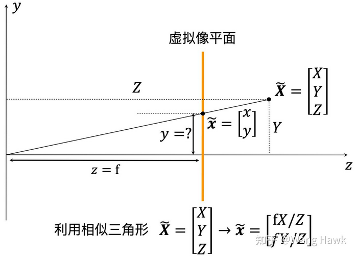

将这个关系转换成齐次坐标表示，得到对于目标三维点
$$
X=\left[ \begin{matrix}
X\\
Y\\
Z\\
1\\
\end{matrix} \right]
$$
有对应的像平面二维点
$$
x=\left[ \begin{matrix}
\frac{f}{Z} X\\
\frac{f}{Z} Y\\
1\\
\end{matrix} \right]
$$
注意到齐次坐标的特性：坐标经过任意等比例变换后表示同一个点，因此有
$$
x=\left[ \begin{matrix}
f X\\
f Y\\
Z\\
\end{matrix} \right]
$$
进而得到映射矩阵
$$
P=\left[ \begin{matrix}
f&0&0&0\\
0&f&0&0\\
0&0&1&0\\
\end{matrix} \right]
$$
这里我们先将其拆分为**二维缩放变换**和**归一化投影变换**，后面将介绍这样拆分的作用
$$
P=
\left[ \begin{matrix}
f&0&0\\
0&f&0\\
0&0&1\\
\end{matrix} \right]

\left[ \begin{matrix}
1&0&0&0\\
0&1&0&0\\
0&0&1&0\\
\end{matrix} \right]
$$
这里右侧的归一化投影相当于将三维空间点投影到了一个对焦距离Z=1的标准像平面上。

由于相机都是采用离散的像素来表示图像信息的，因此需要对图像平面进行离散化，这导致从图像平面（二维）到像素平面（二维）之间存在一个尺度伸缩（取决于单位像素的尺寸）和原点偏移（取决于像素平面的坐标原点设定，一般图像选取左上角作为原点）

其中**原点偏移**可以之间通过在二维缩放变换矩阵中加入平移因子t=(x,y)来计算，即
$$
P=
\left[ \begin{matrix}
f&0&t_x\\
0&f&t_y\\
0&0&1\\
\end{matrix} \right]

\left[ \begin{matrix}
1&0&0&0\\
0&1&0&0\\
0&0&1&0\\
\end{matrix} \right]
$$
其中的 $t_{x,y}$ 表示像平面原点（主点）和像素平面原点（图像左上角(0,0)坐标）的像素差值

**尺度伸缩**的概念则与相机像素尺寸有关。当我们从三维世界坐标投影到二维的虚拟像平面时，所有的单位都是不变的。 例如用毫米来描述三维点相对相机光心（原点）的位置时，虚拟像平面上的像点的坐标依然用毫米来描述；但把点坐标从虚拟像平面真正转换成由像素构成的图像时，相关的坐标就发生了变化。因此上述矩阵中还应该包含一个尺度变换系数，使得目标点的坐标能够按照毫米到像素的比例进行等比例的变化。

令 $m_{x,y}$ 表示x、y方向上的像素密度（例如单位pix/mm），令 $a_{x,y}$ 表示按像素数目描述的对焦距离（例如单位pix），令 $f$ 表示实际对焦距离（例如单位mm），存在
$$
a_{x,y} =fm_{x,y}
$$
从而有包含尺度伸缩因子的变换矩阵
$$
P=
\left[ \begin{matrix}
a_x&0&p_x\\
0&a_y&p_y\\
0&0&1\\
\end{matrix} \right]

\left[ \begin{matrix}
1&0&0&0\\
0&1&0&0\\
0&0&1&0\\
\end{matrix} \right]
$$
不难发现，左侧的变换矩阵实际上就是一个欧式变换矩阵，因此我们可以说：**小孔相机模型成像过程实际上是对三维实际点进行欧式变换的过程**

> 这里隐含地把 $t_{x,y}$ 改写成了 $p_{x,y}$ ，更符合传统教材的表述，说明这是对于原点 $P_0$ 的平移处理

### 世界坐标和相机坐标

通过可以定义三个坐标系

* **世界坐标系**：用户定义的三维世界的坐标系，描述目标物在真实世界里的位置
* **图像坐标系**：以相机所采集二维图像的左上角为原点定义的坐标系，用于描述三维物体在相机中所成像的投影透射关系
* **相机坐标系**：以相机为原点建立的坐标系，从相机的角度描述物体位置，作为沟通世界坐标系和图像坐标系的中间一环

根据上面内容，似乎可以直接将小孔相机模型的坐标映射过程视为相机坐标系->图像坐标系

然而在实际投影时，很难用相对于光心的位置来表达坐标。因为世界坐标是用户定义的，但在小孔相机模型中我们先入为主使用了相对于光心表达的相机坐标。但现实中我们能够明确知道的只有世界坐标系下的坐标，因此还需要将世界坐标系转换为相机坐标系，因此将小孔相机模型的坐标映射过程分为两个关键步骤：

1. 从世界坐标系转换为相机坐标系
2. 从相机坐标系转为图像坐标系

也就是**世界坐标系->相机坐标系->图像坐标系**。这里引入世界坐标系存在另一个重要原因：我们可以人为规定一个场景下的固定空间点作为世界坐标系的原点，从而将相机的*位姿*考虑进来

在世界坐标系到相机坐标系的变换中，还需要分成两步：

1. 将坐标原点平移到光心
2. 将各个世界坐标轴经3维旋转到和相机坐标轴对齐

想要表达这个操作，我们可以先设相机坐标系在世界坐标系中的位姿矩阵
$$
T_{world2camera} =\left[ \begin{matrix}
R_{3\times 3}&C\\
0^T&1\\
\end{matrix} \right]_{4 \times 4}
$$
其中 $R_{3\times 3}$ 表示相机坐标系在世界坐标系下的姿态，C表示相机光心在世界坐标系下的坐标。我们可以用前者描述旋转世界坐标系坐标轴的过程，用后者描述平移世界坐标系原点到光心的过程——只需要将该矩阵求逆后左乘世界坐标系，即
$$
P_{camera}=T_{camera2world}P_{world}=T_{world2camera}^T P_{world} =
\left[ \begin{matrix}
R_{3\times 3}^T&-R_{3\times 3}^T C\\
0^T&1\\
\end{matrix} \right]_{4 \times 4}
$$
考虑到 $R_{3\times 3}^T$ 是一个正交旋转矩阵，描述世界坐标系在相机坐标系中的姿态（与上面的 $R_{3\times 3}$ 正好互逆），为了使用方便，我们可以令 $R'_{3\times 3}=R_{3\times 3}^T$ ，从而让这个变换操作可以简洁地表达为变换矩阵
$$
X_c=\left[ \begin{matrix}
R_{3\times 3}&-R_{3\times 3}C\\
0&1\\
\end{matrix} \right]
$$
现在我们就可以得到**理想情况下的小孔相机成像模型**，如下
$$
x=KR[I|-C]X=

\left[ \begin{matrix}
a_x&0&p_x\\
0&a_y&p_y\\
0&0&1\\
\end{matrix} \right]

\left[ \begin{matrix}
1&0&0&0\\
0&1&0&0\\
0&0&1&0\\
\end{matrix} \right]

\left[ \begin{matrix}
r_1&r_2&r_3&t_1\\
r_4&r_5&r_6&t_2\\
r_7&r_8&r_9&t_3\\
0&0&0&1\\
\end{matrix} \right]
$$
其中每个值都是矩阵，除了像素点x和三维坐标点X外，从左到右依次是描述从像平面到图像坐标系映射关系的**内参矩阵**
$$
K=
\left[ \begin{matrix}
a_x&0&p_x\\
0&a_y&p_y\\
0&0&1\\
\end{matrix} \right]
$$
用于投影到标准Z=1像平面的**归一化投影变换矩阵**
$$
[I|0]=\left[ \begin{matrix}
1&0&0&0\\
0&1&0&0\\
0&0&1&0\\
\end{matrix} \right]
$$
和描述从世界坐标系到相机坐标系映射的**外参矩阵**
$$
[R|-CR]
$$
其中包含**3D旋转矩阵**
$$
R=R_{3\times 3}^T=
\left[ \begin{matrix}
r_1&r_2&r_3\\
r_4&r_5&r_6\\
r_7&r_8&r_9\\
\end{matrix} \right]
$$
和**3D平移矩阵**
$$
t=-RC=\left[ \begin{matrix}
t_1\\
t_2\\
t_3\\
\end{matrix} \right]
$$
外参矩阵与归一化投影变换矩阵相乘可以表示为 $R[I|-C]$ 的形式，就可以还原到最上面的成像模型方程了

根据矩阵从右向左乘的执行顺序，这个模型式正好表示了**世界坐标系->相机坐标系->图像坐标系**的递进关系

### 考虑错切的影响

现在的传感器工艺已经非常好了，很少出现长宽不等的像素。但某些时候，我们依然要考虑这种情况，这样内参矩阵K就需要另外一个元素来描述：
$$
K=
\left[ \begin{matrix}
a_x&s&p_x\\
0&a_y&p_y\\
0&0&1\\
\end{matrix} \right]
$$
其中s可能由于像素长宽不等、相机感光阵列XY轴不完全垂直等原因引起。一个常见的例子就是当拍摄一个已经拍摄好的照片时，如果相机和照片不是平行的，那么整体的投影矩阵会出现不为0的s。

### 总结

在不考虑镜头畸变，将相机成像模型简化为小孔成像模型时，考虑世界坐标系中点$P(x_w,y_w,z_w)$，对应相机坐标系中坐标为$(x_c,y_c,z_c)$，而图像平面上对应点的坐标为$(u,v)$，三者满足
$$
\left[ \begin{matrix}
u\\
v\\
1\\
\end{matrix} \right]
=
\left[ \begin{matrix}
f_x&0&c_x\\
0&f_y&c_y\\
0&0&1\\
\end{matrix} \right]

\left[ \begin{matrix}
1&0&0&0\\
0&1&0&0\\
0&0&1&0\\
\end{matrix} \right]

\left[ \begin{matrix}
R&t\\
0&1\\
\end{matrix} \right]

\left[ \begin{matrix}
x_w\\
y_w\\
z_w\\
1\\
\end{matrix} \right]
$$
其中，$f_x$和$f_y$是相机焦距，$c_x$和$c_y$是图像平面的主点坐标，R代表旋转矩阵，t是平移向量

## 相机标定

我们在使用传感器前往往会进行所谓的“标定”或者说“定标”，对相机或者说图像传感器也不例外。相机标定的过程本质上是已知一系列3D点和其对应的2D图像点，通过相机的成像模型求取变换矩阵详细参数的过程。

> 为确定空间物体表面某点的三维几何位置与其在图像中对应点之间的相互关系，必须建立摄像机成像的几何模型。这些几何模型参数就是相机**参数**。在大多数条件下这些参数必须通过实验与计算才能得到，求解参数的过程就是相机**几何参数标定**。一般来说，需要标定的参数包括：**内参**、**外参**、**畸变**参数

根据上一节给出的成像公式，我们可以得到一般的小孔成像相机参数矩阵包含11个自由度，共12个参数，表示为
$$
x = \left[ \begin{matrix}
p_1&p_2&p_3&p_4\\
p_5&p_6&p_7&p_8\\
p_9&p_{10}&p_{11}&p_{12}\\
\end{matrix} \right]X

=\left[ \begin{matrix}
p_1^T\\
p_2^T\\
p_3^T\\
\end{matrix} \right]X
$$
令 $x'=\frac{p_1^TX}{p_3^T X},y'=\frac{p_2^T X}{p_3^T X}$ ，这里采用右侧的化简表示，从而得到能进行方程求解的表达式
$$
p_2^T X-p_3^T X y'=0, p_1^T X-p_3^T X x'=0
$$
将其表述为矩阵方程
$$
\left[ \begin{matrix}
X^T & 0 & -x' X^T\\
0 & X^T & -y' X^T\\
\end{matrix} \right]

\left[ \begin{matrix}
p_1\\
p_2\\
p_3\\
\end{matrix} \right]
=0
$$
当我们有更多点时，可以构成一个 2N 行 3 列的矩阵A与参数矩阵P相乘，将其简单表示为
$$
AP=0
$$
这意味着我们最少只需要11/2 = 5.5对点就可以求解出相机参数矩阵P了

> 其中最后的0.5对点表示X与x'或X与y'之间的关系

### 直接线性变换法

我们一般考虑采样点存在噪声，当点的数量很少时，噪声很大。 所以利用更多的点构成超定方程组来求解，减轻噪声的影响。这个时候上述式子是没有唯一解的。我们一般需要采用一个约束条件，然后以AP范数最小为目标来求解，这样就将标定转化成优化问题

这里先介绍基础的**直接线性变换法**（Direct Linear Transformation，**DLT**）。该算法的求解结果取决于坐标系的选择，当用不同的方式来表达2D点和3D点的坐标时，求取的相机矩阵是不一样的。因此在应用DLT时应该首先对2D点和3D点的坐标值进行归一化变换，并在计算完成后做一些反变换，才能得到最佳的结果，这是DLT的一大缺点。

DLT选择约束条件是
$$
\|p\|^2=1
$$
则存在优化问题
$$
\hat{p}=argmin\|AP\|^2
$$
这里我们的优化目标就是**代数距离**，可以通过SVD分解来求取p
$$
A=U\Sigma V^T
$$
其中V是正交矩阵，Σ是对角矩阵，那么p就是V中对应最小奇异值的那一列，如果SVD分解前将Σ的对角元素从大到小排列，那么p的解就是V的最后一列

DLT算法要求需要预先制作具有精确3D点位置和成像点位置的标定板、没有考虑镜头畸变、还无法引入更多约束条件，缺点重重，因此在现代的相机标定中已基本被淘汰

> 下图展示了DLT算法所需要制作的标定板
>
> 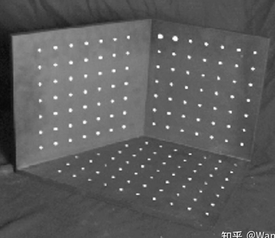

### 考虑畸变的影响

此外，由于相机光学系统制造工艺的误差，实际成像与理想成像存在几何失真，也就是畸变——这是我们不想看到的。这就需要使用畸变矫正算法对图像进行修正，在此之前也需要对**畸变参数**进行标定

### 优化几何距离

### 外参

包含R和t矩阵

目标：实现三维点到三维点的转换

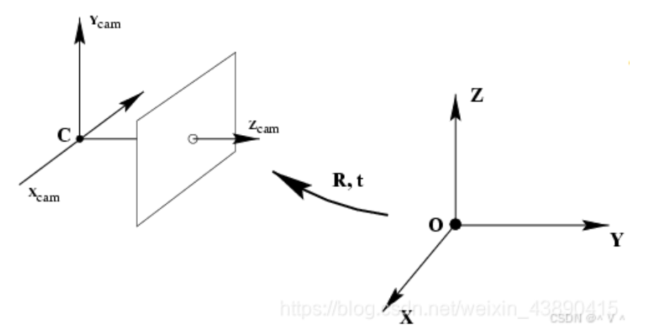

### 内参

包含K矩阵

目标：实现三维点（相机坐标系）到二维点（图像坐标系）映射

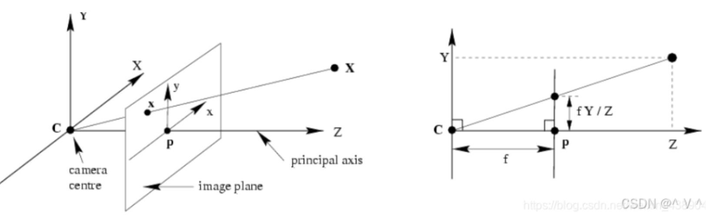

## 张正友标定法

对相机的标定是机器视觉中重要的一步。

对于相机标定，有很多方法，包括传统的标定方法（需要事先做一个精确的互相垂直的3个平面）和自标定法，这里我们详细介绍一下最常用的**张正友标定**法，相关方法可以参考OpenCV的实现，或者直接调用MatLab给出的库

与标定的过程分为两个部分：

1. 从世界坐标系转换为相机坐标系

    这一步本质是三维点到三维点的转换，标定后得到相机的**外参**

2. 从相机坐标系转为图像坐标系

    这是三维点到二维点的转换，标定后得到相机的**内参**

