# 图像处理算法的典型应用

本博客参考《OpenCV3编程入门》（*毛星云* 冷雪飞 电子工业出版社）写成（还有来自毛星云dalao在csdn写成的系列博文），本篇内容旨在总结*嵌入式设备*中常用（基础）的机器视觉算法（上面书籍的后四章），代码主要使用OpenCV实现，部分代码可以直接在OpenMV或类似的嵌入式平台上部署

> 悼念浅默大佬，感谢他为我们带来的技术博客和教程

## 直方图及其应用

**直方图**（**Histogram**）是对数据进行统计的一种方法，通过一个二维的统计图表，其横坐标是统计样本，纵坐标是样本对应某个属性的度量。图像处理中，使用**图像直方图**表示数字图像中像素数据分布统计。下面将以灰度和RGB直方图作为引入，但是任何能够有效描述图像的特征数据都能作为直方图的统计量。

### 灰度和RGB直方图

假设有一副5*5像素的灰度图像，其像素分布如下：

> 1,2,3,2,1,
>
> 3,4,5,2,4,
>
> 5,6,1,5,2,
>
> 1,3,4,6,5,
>
> 8,5,9,1,4
>
> 这里作为举例只列举了个位数值，实际图像的像素值可能是0~255的任何数

我们将图像像素的灰度值作为横坐标，将每个灰度值对应的像素个数作为纵坐标，就能得到一副直方图

0：0个像素；1：5个像素；2：4个像素；3：3个像素；4：4个像素；5：5个像素；6：2个像素；7：0个像素；8：1个像素；9：1个像素；......；254：0个像素；255：0个像素

我们把它画成一幅图：

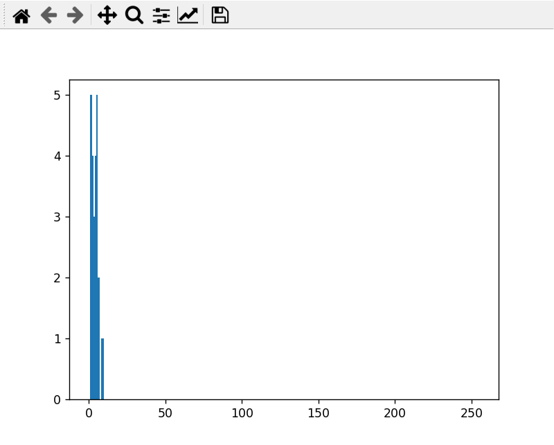

使用下面的代码生成（基于matplotlib数学库而不是opencv）

```python
import matplotlib.pyplot as plt

data = [
    1, 2, 3, 2, 1, 3, 4, 5, 2, 4, 5, 6, 1, 5, 2, 1, 3, 4, 6, 5, 8, 5, 9, 1, 4
]

plt.hist(data, bins=256, range=(0, 255), density=False)
# bins:直方图条数
# range:直方图横坐标范围
# density:当值为False时绘制频数直方图,否则绘制频率直方图
plt.show()
```

也就不难理解直方图的含义：按照灰度值（0~255的int8范围）依次统计图像中对应值像素的数量

我们在图像直方图中定义下面这些概念：

* **bin/bins**：直方图的组距，其数值是从数据中计算出的特征统计量。这也就是直观意义上的直方图横坐标
* **range**：每个特征空间的取值范围。也就是直观意义上直方图横坐标值的集合（“定义域”）
* **dims**：需要统计特征的数目。在灰度图像直方图中，dims=1；在rgb图像直方图中，dims=3。这就是直观意义上直方图统计过程中要考虑的特征元素数目

再给出一个RGB直方图的例子：

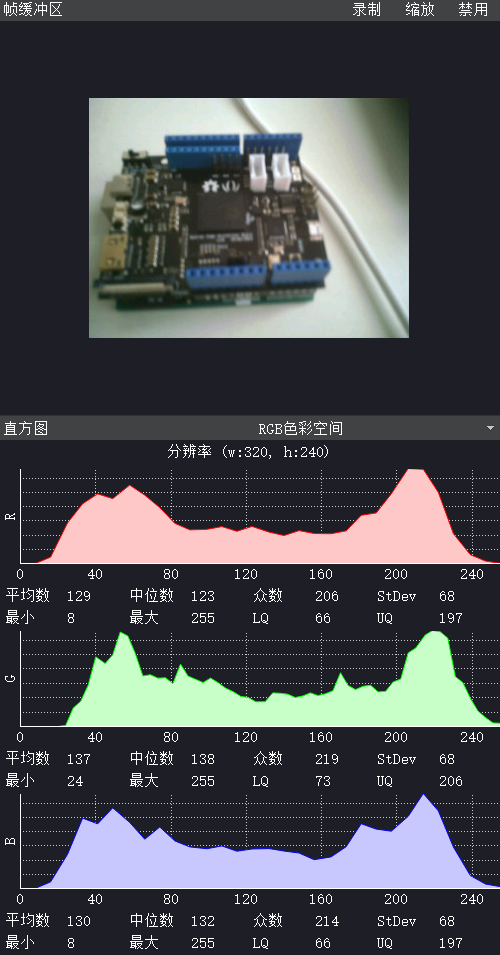

使用OpenMV（给没做过硬件的老哥科普下这是一个可编程的摄像头，基于stm32（微控制器，ARM Cortex-M内核）开发，内置了很多机器视觉算法，官方开发了一套IDE方便进行机器视觉相关应用的开发）就可以在IDE里面采集到这样的图像，下面的直方图就是RGB直方图了。和灰度直方图类似，它分别统计了R、G、B三种颜色像素值在图像中的数目，也就是所谓的三个**通道**。

我们这就可以知道如果需要用直方图法获取图像信息，只需要把图像相关元素数据值作为横坐标，然后统计图像每个与之相关像素的数目，将其作为对应纵坐标，就可以绘制直方图了。不仅仅是RGB颜色，HSV颜色、YCbCr颜色，甚至梯度、方向等信息都可以作为横坐标

### 直方图计算

OpenCV中提供了计算和绘制直方图的函数，如下所示：

```c++
void cv::calcHist(const cv::Mat *images, 
                  int nimages, //输入图像的个数
                  const int *channels, //dims的索引
                  cv::InputArray mask,
                  cv::OutputArray hist, //输出一个二维的直方图
                  int dims, //需要统计的dims数量，或者说需要直方图的通道数
                  const int *histSize, //存放每个维度直方图尺寸的数组
                  const float **ranges, //直方图横坐标范围
                  bool uniform = true, //默认直方图均匀
                  bool accumulate = false //默认直方图在配置阶段清零
                 )
```

需要注意：这里输入的image要求具有相同的深度（CV_8U或CV_32F）和相同的尺寸

如果mask非空，那么它必须是8位且和images具有相同尺寸，这个参数用于标记统计直方图的数组元素数据

dims参数不能大于CV_MAX_DIMS（OpenCV3中设置为32）

OpenCV还提供了一些用于处理直方图的函数

* 寻找最小值和最大值

    下面的函数从输入数组src中找出其中的最小值（最小值位置）和最大值（最大值位置）的指针，兼容一维的数组和二维的图像数据

    ```c++
    void cv::minMaxLoc(cv::InputArray src, 
                       double *minVal, 
                       double *maxVal = (double *)0, 
                       cv::Point *minLoc = (cv::Point *)0, 
                       cv::Point *maxLoc = (cv::Point *)0, 
                       cv::InputArray mask = noArray()
                      )
    ```

* 比较直方图

    下面的函数可以通过相关性、卡方统计量、直方图香蕉、Bhattacharyya距离四种方法对两个直方图进行比较

    ```c++
    double cv::compareHist(cv::InputArray H1, //直方图1
                           cv::InputArray H2, //直方图2
                           int method) //比较算法
    ```

    method参数可以选择

    * CV_COMP_CORREL：相关统计
    * CV_COMP_CHISQR：卡方
    * CV_COMP_INTERSECT：相交
    * CV_COMP_BHATTACHARYYA：Bhattacharyya距离，也可以使用CV_COMP_HELLINGER参数‘

    函数会输出匹配度

### 直方图均衡

有些情况下，图片的对比度很低，呈现雾蒙蒙的状态，如下所示（下面先讨论灰度图像，也就是颜色数据通道为1的情况）：

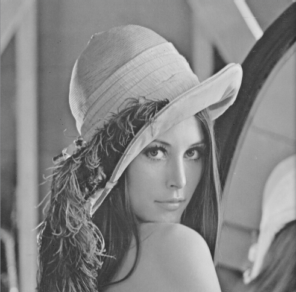

我们通过一些方法提高它的对比度，就能得到更清晰的图像（锐化图像）：

> **对比度**是画面黑与白的比值，也就是从黑到白的渐变层次。比值越大，从黑到白的渐变层次就越多，色彩表现就越丰富

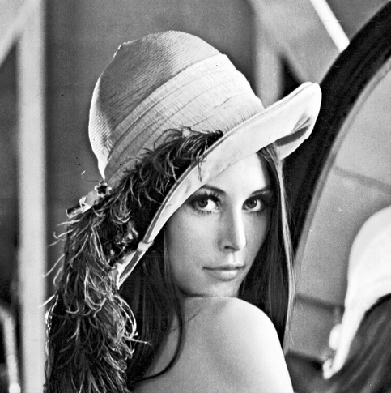

还有些情况下，图片呈现很亮或者很暗的状态，如下图所示：

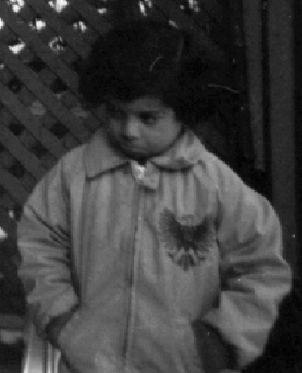

此时也可以通过一种算法提高其亮度：

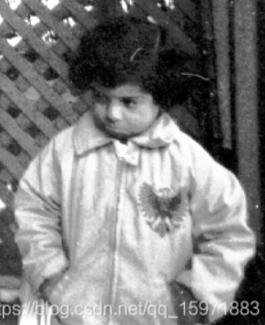

以上两种情况都可以使用**直方图均衡化**算法来实现，同时该算法还能用在图像去雾等领域

这两种情况都有一个共性：图像的直方图集中在了同一个区域。未经均衡化的图像往往都具有这样的特性：直方图集中在某个范围，就比如上面的示例，所有像素值都集中在了0~10区间


直方图均衡化的主要思想是**把原始图像的直方图从比较集中的某个区间变成在全部范围内“均匀”的分布**。通过对图像进行非线性拉伸，重新分配图像像素值，就能让一定范围内的像素数量大致相同

如果一副图像的像素占有很多的灰度级而且分布均匀，那么这样的图像往往有高对比度和多变的灰度色调；对于RGB图像也是类似的，均匀分布的RGB值往往具有更高的对比度，同时图像明暗处的亮度也偏向平均，因此直方图均衡化对于背景和前景都太亮或者太暗的图像非常有用

作为传统的图像增强算法，直方图均衡化的一个主要优势是它是一个相当直观的技术并且是可逆操作，如果已知均衡化函数，那么就可以恢复原始的直方图，并且计算量也不大；缺点则是它对处理的数据不加选择，可能会增加背景杂讯的对比度并且降低有用信号的对比度；变换后图像的灰度级/色度减少，某些细节消失；在直方图有尖锐高峰情况下，经处理后会出现对比度不自然的过分增强。

直方图均衡化的目标就是仅靠输入图像直方图信息自动达到增强图像效果，一般的实现思路是*对图像中像素个数多的值进行展宽，对图像中像素个数少的值进行压缩*

需要注意：**已经进行均衡化的图片再次均衡化将不会有任何变化**

OpenCV中提供了equalizeHist()函数来执行直方图均衡化

```c++
void cv::equalizeHist(cv::InputArray src, //输入图像
                      cv::OutputArray dst //输出均衡化后的图像
                     )
```

内部采用如下算法：

1. 计算输入的直方图

2. 进行直方图归一化，将直方图组距和设置为255

3. 计算直方图积分
    $$
    H'(i)=\sum_{0\le j \le i} H(j)
    $$

4. 以H'作为查询表进行图像变换
    $$
    dst(x,y)=H' (src(x,y))
    $$

### 反向投影

直方图的一个重要应用就是将图像问题转换成统计问题。直方图本质上是对图片中像素特征这“个”统计量的描述，因此可以利用各种统计理论分析图片来对图片中的特征进行检测。

**如果一幅图中显示了某种特殊的结构纹理或某种独特的物体，那么这个区域的直方图可以看作一个概率函数，描述某个像素属于该纹理或物体的概率分布**

反向投影法就是利用上述结论的运算方法，首先计算某一特征的直方图模型，再计算目标图像的直方图模型，得到**给定图像中的所有像素点对应属于特征区域的概率**。因此利用反向投影法，我们可以先计算出特征的直方图，再使用模型去寻找目标图像中存在的对应特征。

> 反向投影法类似于利用直方图进行更细节的图像二值化，只不过比起直接分割低于阈值的像素和高于阈值的像素，反向投影法能够做到更细节的“切分”——利用反向投影法可以根据bins将图像分成层次不同的范围，从而实现小色块的检测。
>
> 二值化调节的是实实在在的比大小阈值；反向投影法中可供调节的就是用于分割的bins值和筛选出来的概率值。

反向投影算法的步骤如下：

> 这里使用到浅墨大佬书中的例子进行介绍

1. 统计已知图像某个特征（要检测特征）的**色度直方图**，通常用**色度-饱和度**（Hue-Saturation，H-S）**直方图**来统计二维直方图，并把直方图表示为概率的形式

    在这一步骤中，应该先把RGB图片转换成HSV格式，HSV颜色空间定义可以参考之前的博文和其他教程，这里不再赘述。提取出其中的H-S特征得到直方图

    下图是要检测的原图，需要检测其中的**肤色**特征（注意，这里指的是肤色。反向投影算法的检测对象偏重于颜色而不是形态），由于手部的肤色特征往往是相近的，因此可以通过突出相同肤色来间接检测人手

    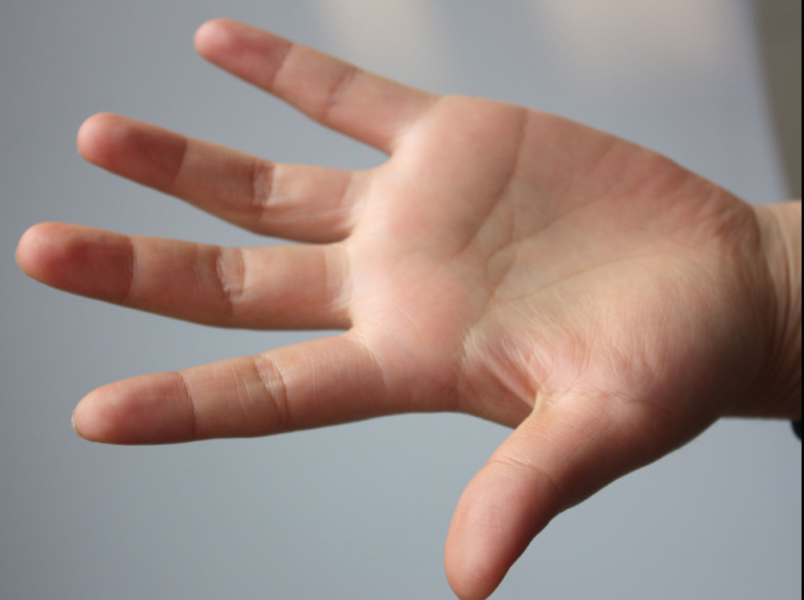

    下面是进行转换的代码片段

    ```c++
    g_srcImage = imread("1.jpg", 1); //得到待测图片
    if(!g_srcImage.data)
    { 
        printf("读取图片错误，请确定目录下是否有imread函数指定图片存在\n");
        return false; 
    } 
    cvtColor(g_srcImage, g_hsvImage, COLOR_BGR2HSV); //将图片转换成HSV格式
    
    //分离Hue颜色通道，也就是HSV中的H
    g_hueImage.create(g_hsvImage.size(), g_hsvImage.depth());
    int ch[ ] = { 0, 0 };
    mixChannels(&g_hsvImage, 1, &g_hueImage, 1, ch, 1);
    ```

    其中函数`mixChannels()`原型如下

    ```c++
    void cv::mixChannels(const cv::Mat *src, //输入数组（描述矩阵的数组）
                         size_t nsrcs, //输入数组的数目（输入矩阵数）
                         cv::Mat *dst, //输出数组
                         size_t ndsts, //输出数组的数目（输出矩阵数）
                         const int *fromTo, //对指定通道进行复制的数组索引
                         size_t npairs //fromTo参数的索引数
                        )
    //它也有一个用于单输入的原型，没有nsrcs和ndsts输入，只支持单幅图像输入
    ```

    这个函数专门用于重排图像通道，这是`split()`、`merge()`、`cvtColor()`函数的综合拓展

    > 浅墨大佬还给出了一个示例用于将4通道RGBA图像转化成3通道BGR图像和一个单独的Alpha通道图像
    >
    > ```c++
    > Mat rgba(100, 100, CV_8UC4,Scalar(1, 2, 3, 4));
    > Mat bgr(rgba.rows, rgba.cols, CV_8UC3);
    > Mat alpha(rgba.rows, rgba.cols, CV_8U1);
    > 
    > Mat out[] = {bgr, alpha};
    > //这里如下拆分：
    > //rgba[0] -> bgr[2] R通道
    > //rgba[1] -> bgr[1] G通道
    > //rgba[2] -> bgr[0] B通道
    > //rgba[3] -> alpha[0] Alpha通道
    > int from_to[] = {0, 2, 1, 1, 2, 0, 3, 3};
    > mixChannels(&rgba, 1, out, 2, from_to, 4);
    > ```

    随后要计算整幅图片的直方图，代码如下

    ```c++
    MatND hist;
    int histSize = MAX( g_bins, 2 ); //g_bins表示直方图的组距，设置为可调节量
    float hue_range[] = { 0, 180 }; //H通道范围映射
    const float* ranges = { hue_range }; //直方图横坐标范围
    
    calcHist(&g_hueImage, //输入图像：H通道图像
             1, //输入图像数量
             0, //通道数量
             Mat(), //掩码
             hist, //输出直方图
             1, //输出直方图数量
             &histSize, //直方图的组距，也就是bins
             &ranges, //直方图横坐标范围
             true, //默认直方图均匀
             false //默认直方图在配置阶段清零
            );
    //计算后得到的直方图纵坐标范围在0~255，不能直接作为概率密度使用
    //要对直方图归一化
    normalize(hist, hist, 0, 255, NORM_MINMAX, -1, Mat());
    ```

    这样就得到了概率形式（经过归一化）的H-S直方图了

2. 将得到的直方图用反向投影法计算出待求特征的像素概率密度分布，再根据模型计算目标图上每个像素属于待求特征的概率，并将结果存储在反射投影图像（必须是单通道（灰度）的图像）中用来显示

    OpenCV提供了用于反向投影算法的函数，如下所示

    ```c++
    void cv::calcBackProject(const cv::Mat *images, //输入数组
                             int nimages, //输入数组的个数
                             const int *channels, //需要统计的通道（dim）索引
                             cv::InputArray hist, //输入的直方图
                             cv::OutputArray backProject, //目标反向投影数组/矩阵
                             const float **ranges, 
                             //每个维度数组每一维的边界阵列，也就是每个维度的取值范围
                             double scale = (1.0), //默认为1，输出方向投影的缩放因子 
                             bool uniform = true //默认为true，指示直方图是否均匀
                            )
    ```

    这个函数能直接完成上面所说步骤，使用代码如下：

    ```c++
    MatND backproj;
    calcBackProject(&g_hueImage, 1, 0, hist, backproj, &ranges, 1, true);
    imshow("反向投影图", backproj);
    ```

    最终会得到下面这样的反向投影图

    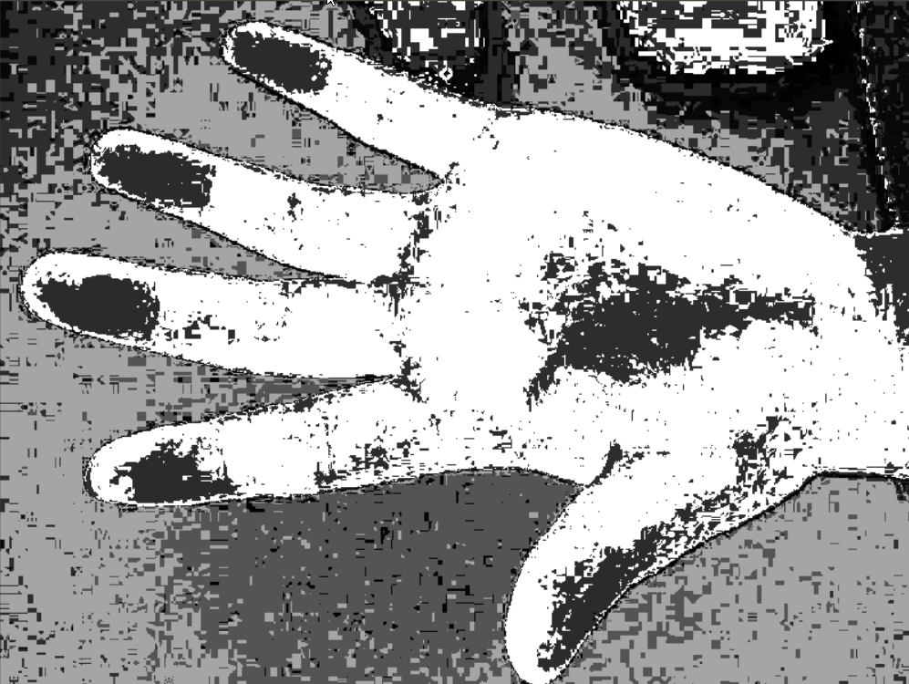

    调节组距g_bins=10可以得到类似二值化的图像，如下

    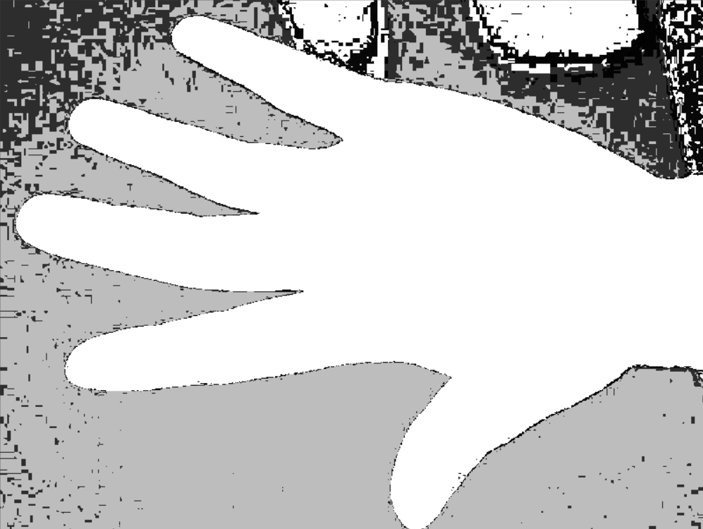

    这样就能够把人手特征分离出来了

    此时的直方图是这样的：

    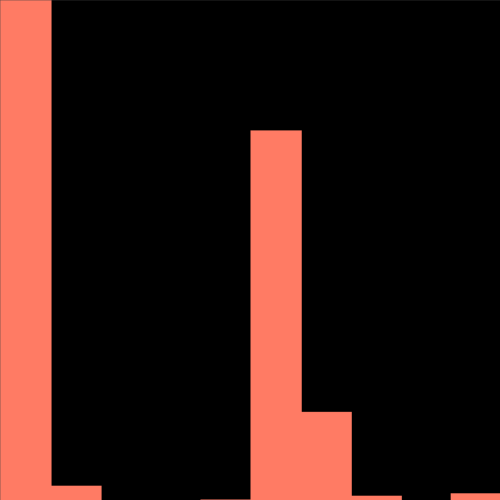

    可以看到bins很小，分出来的直方图也很粗略。之前那个花里胡哨的图案的直方图（bins=154）是这样的：

    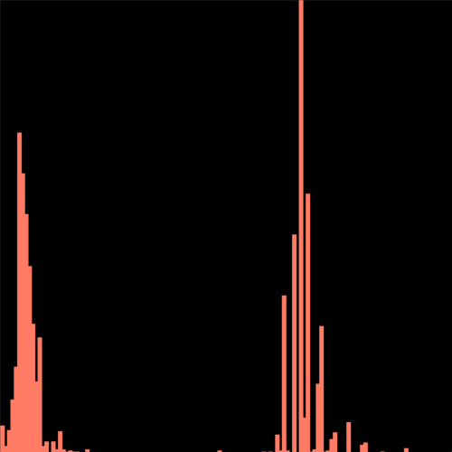

    随着bins的增大，分出来的区间就越来越密集，反映在反向投影图中就是灰度变化更细了

    这个函数的内部机制如下：

    * 遍历图像中的所有像素，获取对应像素的色调数据并找到色调在直方图中的位置，根据输入的图像直方图得到对应bin的数值
    * 将该值存储在新的反射投影图像中
    * 重复上面的步骤，就可以得到反射投影图像了

    不难理解，**这就是对直方图统计的逆运算**，只不过受到bin和输入图像的制约

实际应用中，反向投影法常常能够解决**大面积相似色块的识别问题**，比如大面积颜色识别、车牌识别等。但是这种基于统计的方法会受到光线、物体形状等多方面制约，因此只适合在简单的工业场合应用

> 在神经网络的降维打击下，识别效果拉跨的反向投影法识别物体已经基本没人用了，不过这种算法思路常常与新的图像算法结合

### 模板匹配


## 轮廓检测与应用

图像中的一个轮廓就是一系列点的集合，或者说图像中的一条曲线

OpenCV中提供了一些基于梯度的轮廓处理函数

### 寻找轮廓


### 寻找凸包

**凸包**（Convex Hull）：对于给定二维平面上的点集，凸包是将最外层的点连接起来构成的凸多边形。

利用凸包计算其凸缺陷从而获取物体轮廓是一种经典的算法，OpenCV提供了convexHull()函数来寻找图像点集中的凸包

```c++
void cv::convexHull(cv::InputArray points, 
                    cv::OutputArray hull, 
                    bool clockwise = false, //当为true时，输出顺时针方向的凸包；否则输出逆时针
                    bool returnPoints = true //当为true时返回凸包的各个点，否则返回各点的指数
                   )
```


### 图像轮廓矩


### 分水岭算法


## 特征检测

OpenCV中的特征检测、角点检测等算法由xfeature2d库提供，这是一个第三方库，需要额外配置才能使用。如果需要成熟的算法实现，应使用OpenCV2中的feature2d组件

## 综合应用示例

下面来介绍几个经典的传统机器视觉算法（基于OpenCV-python）应用

### 颜色识别


### 车牌识别


### 小车巡线


### 距离检测


# 参考资料

https://zhuanlan.zhihu.com/p/114185254

https://blog.csdn.net/qq_15971883/article/details/88699218
