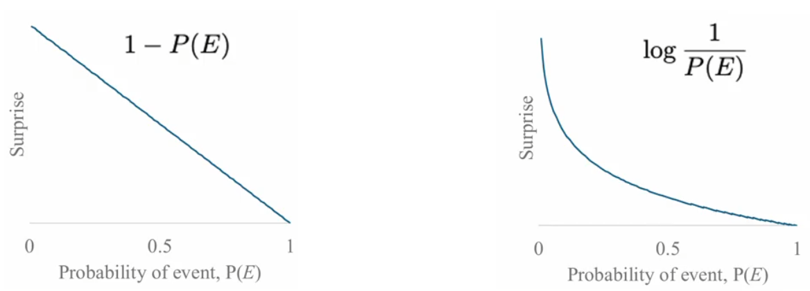

# 信息论相关

信息论是1948年克劳德·香农在其论文《通信的数学理论》（A Mathematical Theory of Communication）中提出的概念。此前，哈利·奈奎斯特研究了在给定系统带宽下信号传输的极限速率，而拉尔夫·哈特利提出了信息的可度量性（他也是首先提出使用对数函数来量化信息的人），而香农在二者研究的基础上，划时代地利用概率论对信息的数学物理意义进行了表征。

## 香农熵

奈奎斯特提出：**信息就是“惊喜度”，一条消息所包含的信息量，取决于它所消除的不确定性**

> 如果一个人被告知“明天太阳会升起”，这几乎没有信息量，因为发生这件事的概率接近100%，没有惊讶；但如果一个人被告知“明天撒哈拉沙漠会下雪”，这句话就包含巨大的信息量，因为事情发生的概率极低，非常令人惊讶。

信息一般被视为一种物理量，它是可以被定量分析的。香农之前的学术界研究止步于此。

香农所作出的最大贡献在于：他将概率论和随机过程引入了信息的表征，使得基于工程学（以电气工程和通信工程为代表）发展而来的早期的信息概念能够被数学工具进行描述。

先来看概率中的基础定义——变量。变量（随机变量）就是变化的量。一个变量在不同时刻下具有不同的取值，在概率论中就体现为随机变量在不同事件下的值，变量的每个取值都有其概率

> 例如经典扔硬币例子里，硬币为正面的概率是0.5

变量可以是信息的容器。**一个变量可以看作一个存储单元，用来存储信息**。

现在考虑如何度量信息。使用任意递减的函数似乎都可以用来描述“信息=惊讶程度”这件事，而在香农之前，哈特利就通过物理层面的分析，认为使用对数函数来量化信息比较合适。

在香农把变量和随机性引入到信息定义之后，我们就可以理解：信息和变量取值的概率有关。不妨假设一个事件x发生的概率是P(x)，那么可以假设其包含的信息量
$$
I(x)=\log_2 \frac{1}{P(x)}=-\log_2 P(x)
$$
定义信息的单位是**比特（bit）**

> 这里选择对数函数有三个好处：对数相加方便计算；两个独立事件的联合惊喜度等于各自惊喜度之和，反映随机变量的基本特性；概率每减半，惊喜度就会+1，符合朴素认知

这里的信息量I(x)被称为**自信息**，也就是事件x包含的信息量。上述定义式反映了自信息的核心性质：**概率越小，信息量越大**

在我们了解单个事件的惊喜度P(x)后，就可以利用求期望的方法获得随机变量X的平均惊喜度，换句话说就是随机变量X的信息的期望。根据信息的定义，这就是**描述变量X状态所需的平均信息量**
$$
H(x)=E(I(x))=\sum_x P(x) \cdot \log_2 \frac{1}{P(x)} = -\sum_x P(x) \cdot \log_2 P(x)
$$
其中H(x)被称为**香农熵**。它代表存储一个变量的信息所需要的比特数（由于香农熵是一个数学期望，它应该被视为存储一个变量的信息所需最低比特数），直接度量了一个变量里信息量的大小

> 这里的“熵”和热力学中的熵实际上是两回事，只不过他们的英文都是Entropy
>
> 香农熵表征了描述一个变量x状态所需要的平均比特数，更贴近“不确定性”的语义，用物理学中比较常见的“混乱程度”定义它是比较令人难以理解的

## 交叉熵与KL散度

利用香农熵，我们可以定量描述独立随机变量的信息，下面我们将其推广到多个变量联合的信息。

一个简单想法是引入**TV散度**（Total Variation Divergence，全变分散度）对两个独立变量进行描述。

对一个变量遍历其所有可能的取值，计算它们之间差值的绝对值，再进行求和，即可得到TV散度，如下式
$$
TV(X,Y)=\sum_i \abs{P(X=i) - P(Y=i)}
$$
TV散度完全工作在统计条件下，对于两个变量P、Q，直接利用L1范数计算它们之间的距离
$$
TV(P,Q)=\frac{1}{2} \sum_x \abs{P(x) - Q(x)}
$$
它的值永远在0到1之间，可以反映两个变量的相关性。但它也具有一个很大的问题：曲线不够平滑，它的导数往往是1、-1或0。这个特性限制了其在很多场景下的应用（尤其是神经网络，我们总是希望神经网络中的函数具有平滑特性，避免梯度突变）

实际应用较多的是**KL散度**（Kullback Leibler Divergence）。通俗来说，KL散度就表示了当变量的真实分布为X时，用Y作为模型来近似X所带来的额外期望惊喜度。

对于事件x，在分布Y下的期望惊喜度减去在分布X下的期望惊喜度，即
$$
KL(X,Y)=\sum_{x \in X} ((-P(X=x) \cdot \log_2 P(Y=x)) - (-P(X=x) \cdot \log_2 P(X=x))) \\
=\sum_{x \in X} P(X=x) \cdot \log_2 \frac{P(X=x)}{P(Y=x)}
$$
不难发现，该式描述了两个变量之间的信息差异，因此KL散度又被称为**相对熵**。对于一个条件概率，有
$$
KL(P||Q) =\sum_{x} P(x) \cdot \log_2 \frac{P(x)}{Q(x)}
$$
其中P代表真实分布，Q代表预测分布，P(P||Q)就表示在预测分布情况下，事件x按照真实分布发生。

KL散度与TV散度之间存在不等关系
$$
TV(P,Q)\le \sqrt{\frac{1}{2} KL(P||Q)}
$$
这就是**平克斯不等式**，它说明如果KL散度很小（信息差异很小），那么TV散度（统计距离）也一定很小，也就是说如果两个分布在信息论意义上接近，它们在统计意义上也必须接近。

KL散度具有三种关键性质：

1. **非负性**

    KL散度总大于等于0，这被称为**吉布斯不等式**。当且仅当P和Q是完全相同的分布时，KL散度为0

2. **非对称性**

    显然，KL(P||Q)≠KL(Q||P)，它是非对称的

3. **对于零概率敏感**

    当P(x)＞0且Q(x)=0时，KL(P||Q)会趋于无穷大

在神经网络等应用中，更常被使用的是**交叉熵（Cross-Entropy）**，其定义如下
$$
H(P,Q)= -\sum_x P(x) \cdot \log_2 Q(x)
$$
可以发现，交叉熵定义式的形式与香农熵的定义式一致，不同点在于它融合了P和Q两种概率分布来描述同一个事件x。其中P可以被视为事件x的真实概率分布，Q可以被视为事件x的预测分布，因此交叉熵就常用于**衡量两个概率分布之间的差异**。

> 在神经网络训练的过程中，交叉熵可以反映“模型的猜测结果有多离谱”：模型输出Q越接近真实值，交叉熵H越小；模型输出Q越背离真实值，交叉熵H越大

在信息论的视角下，交叉熵的物理意义表现为**使用错误分布来编码真实分布的惩罚**。举例来说，我们需要构造分布来拟合一个实际分布Q，同时期望平均编码长度最短：如果使用真实分布Q来设计编码，那么此时的平均编码长度就是香农熵；但如果采用偏离实际分布的预测分布P，那么此时的平均编码长度会变长，等于交叉熵。

交叉熵、香农熵和KL散度具有如下式所述的关系
$$
H(P,Q)=H(P)+KL(P||Q)
$$
其中H(P,Q)表示交叉熵，描述系统的总开销；H(P)表示香农熵，描述系统中数据的固有不确定性；KL(P||Q)表示KL散度，描述预测分布P偏离真实分布Q的程度

在我们关心的**深度学习场景下，数据集固定，因此H(P)是一个常数，最小化交叉熵在数学上等价于最小化KL散度**。上式被称为**信息论铁三角**，它说明了某种具体应用中应该如何权衡使用交叉熵、KL散度或TV散度。

