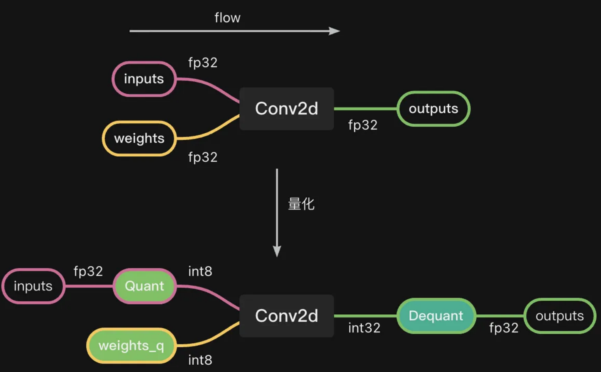

# 针对嵌入式设备的量化部署流程

## 神经网络框架与训练

使用专用的神经网络框架可以大大加快神经网络的研发和训练，从而提升科研/生产效率。目前最主流的框架就是TensorFlow和PyTorch

### TensorFlow与Keras

TensorFlow是由谷歌大脑团队的研究人员和工程师开发的，它是深度学习领域中最常用的软件库

它支持多种语言，常用的有Python和C，同时支持GPU加速

TensorFlow中的所有计算都会被转化为计算图上的节点。整个框架通过**数据流图**的形式来表述计算的编程系统，每个计算都是图上的一个**节点**，而节点之间的**边**描述了计算之间的依赖关系

Keras是用Python编写的框架，可以基于TensorFlow运行

TensorFlow的接口不太适合新手，而Keras提供了高层的API，可以实现快速开发。Keras支持CNN和RNN，可以在CPU和GPU上无缝运行。需要注意：**Keras中模型的层是按顺序定义的**

### PyTorch

PyTorch是Torch的API接口，可用于建立深度神经网络和执行张量计算。Torch是一个基于C++的框架，而PyTorch则运行在Python上

PyTorch基于张量计算（多维数组），就像numpy的ndarray一样，它也可以在GPU上运行

不同于Tensorflow的数据流图，PyTorch使用动态计算图，它的的Autograd软件包从张量生成计算图，并自动计算梯度。因此它可以实现在运行时构建计算图形，甚至在运行时也可以对这些图形进行更改。当不知道创建神经网络需要多少内存的情况下，这个功能便很有价值

## 神经网络图优化

### 算子融合

利用卷积的线性特点，可以将Conv2d后接的任意多BN算子融合到Conv2d算子的卷积核kernel内，并附加一个偏置bias即可。利用相同的原理可以将诸如Conv2D+BN，Conv2D+MatAdd+BN的pattern进行融合。

> 在ONNX中，二维卷积算子被直接作为矩阵乘法GEMM实现，因此该融合也常被称为GEMM+BN融合

融合要求BN层的$\gamma$、$\beta$、$mean$和$Var$各自都是维度与Conv2D层的kernel output_channel具有相同维度的向量，同时有一个微小常数eps来弥补0值

融合前有卷积层算子
$$
y_{Conv2d}=w * x +b
$$
BN层算子
$$
y_{BN}=\gamma \cdot (\frac{y_{Conv2d} - E[x]}{\sqrt{Var[x] +\epsilon}}) +\beta
$$
将二者进行融合即存在
$$
y=w' * x +b'
$$
其中，参数
$$
w'=\frac{\gamma w}{\sqrt{var+\epsilon}}
$$
而参数
$$
b'=\frac{\gamma(b-mean)}{var+\epsilon}+\beta
$$
真正的合并过程如下：

1. 训练得到尺寸为[h, w, in_channel, out_channel]的Conv2d卷积核参数
2. 训练得到BN层的4个向量，其尺寸应当为[out_channel]
3. 使用 `np.transpose(data, [3, 0, 1, 2])` 对卷积核转置，使得其第0维大小为out_channel
4. 对每个维度的kernel值，利用上述公式带入BN层的4个向量循环计算
5. 使用 `np.transpose(data, [1, 2, 3, 0])` 将计算得到的kernel'转置回原维度

同样操作也可用于DW卷积，但是需要稍微改造下计算方法：DW卷积的卷积核尺寸为[h, w, in_channel, m]，最终输出尺寸为[m*in_channel]，因此BN融合在m=1时可以进行。与一般卷积的区别在于两次转置的perm分别为 `[2, 0, 1, 3]` 和 `[1, 2, 0, 3]` 。

任意张量乘法MatMul也可以和BN进行融合
$$
\frac{(A* B+bias-E)* \gamma}{\sqrt{var+\epsilon}}+bias_{BN}=A* (b * \frac{\gamma}{\sqrt{var+\epsilon}})+\frac{(bias-E)\gamma}{\sqrt{var+\epsilon}}+bias_{BN}
$$
融合过程本质上是在获得权重信息后对计算图的合并简化过程，因此完全可以在训练后单独进行

## 量化工具与使用

**量化**（Quantization）即通过减少表示每个权重所需的比特数来压缩原始网络。

神经网络模型的权重和偏置（参数）值都是32位浮点数，这保证神经网络模型的精度，但是浮点数的运算难度相比整形大得多，通过量化技术可以把32位浮点数（FP32）变为整数，从而减小计算量和参数体积。目前性能最稳定的就是INT8的模型量化技术，它将浮点数变为8位整数，相对于原始模型的FP32计算，INT8量化可将模型大小减少4倍，将内存带宽要求减少4倍，设备也不需要FPU，从而让只支持计算INT8的硬件（没有FPU的设备）加速2到4倍。在神经网络计算图模型中，通过 `quant` 量化算子的形式来描述一次量化过程。

一般指的量化就是权重和数据 `FP32 -> INT8` 的过程。但不是所有的算子都会进行量化处理，一些非线性算子（如激活函数）就不会进行量化，因此网络中可能会插入一些反量化算子 `dequant`，这些算子一定会和 `quant` 算子成对出现

量化主要是一种加速前向推理的技术，这导致目前**绝大部分的量化算子仅支持前向传递**

基础的量化方法有三种：

* 训练后动态量化（**Post Training Dynamic Quantization**）：在浮点模型训练完成后进行量化，其中权重会被提前量化，偏置不会被量化，activation则会在前向推理的过程中被动态量化。全部过程中需要根据实际运算的浮点数据范围每层计算一次scale和zero_point，再进行量化。

	由于该方法计算量较大，需要多次计算量化参数，所以不常用

* 训练后静态量化（**Post Training Static Quantization**）：在浮点模型训练完成后进行量化，权重会被提前量化，而activation会基于之前校准过程中记录下固定的scale和zero_point进行量化，从而避免了反复计算参数

    该方法较为常用，因此一般的训练后量化（**Post Training Quantization**，**PTQ**）就是指该方法

* 量化感知训练（**Quantization Aware Training**，**QAT**）：一些模型在训练和量化的过程中会发生较严重的精度损失，因此需要使用量化感知训练。这个过程就是在训练中*模拟*量化过程——数据仍是FP32格式，但是实际值的间隔会受到量化参数的限制

量化一般不依赖于硬件，所以不管是昇腾的量化还是英伟达的量化，都是不用跑在运行环境上的。一般可以用CPU直接处理量化，但对于Transformer等大规模的结构，就需要用到GPU来加速量化过程。

### PyTorch自带量化

一般来说偏置（bias）不进行量化，仍保持FP32（32位浮点数）的数据类型；而权重（weight）会根据原始数据进行量化；activation会因为每次输入数据的不同，导致数据范围每次都是不同的，所以在量化过程中专门会有一个校准过程，即提前准备一个小的校准数据集，在测试这个校准数据集的时候会记录每一次的activation的数据范围，然后根据记录值确定一个固定的范围

### 华为昇腾AMCT工具

量化常用的算法有**二值化**、**线性量化**和**对数量化**，线性量化又可以根据是否有 `offset` 细分为对称量化和非对称量化两种，华为AMCT工具的量化算法采用线性量化方式，并将对称和非对称量化方式进行了归一。量化算法表达式如下
$$
D_{INT8} = clip_{INT8}(round(\frac{D_{FP32}}{scale})+offset)
$$
其中，clip是限幅函数，round是向下取整函数，scale是缩放因子，offset是偏移量。

对于对称量化过程，它将符合IEEE规范，大小从-INF到INF（包含0）的FP32值映射到大小从-127到127的INT8值，有表达式
$$
D_{INT8} = round(\frac{D_{FP32}}{scale})
$$
其中，缩放因子可计算为
$$
scale=D_{MAX}/127
$$
从而得到INT8数据的范围为
$$
[-128\times scale,127\times scale]
$$
而非对称量化，则相当于将FP32值映射到大小从0到255的UINT8值，有表达式
$$
D_{UINT8} = round(\frac{D_{FP32}}{scale}-offset)
$$
其中，scale是FP32格式，offset是INT8的整数格式，可通过下式计算二者的值
$$
scale=\frac{D_{MAX}-D_{MIN}}{255}
$$
使用变换
$$
D_{FP32}=scale \times (D_{UINT8}+offset)=scale \times (D_{INT8}+offset+128)=scale\times (D_{INT8}-offset')
$$
即可得到上面给出的AMCT线性量化算法

## 常见部署工具

### ONNX

ONNX（Open Neural Network  Exchange）是一种针对深度学习所设计的开放的模型格式标准，最初的设计目的是用于存储训练好的模型，并在多种深度学习框架之间进行模型转换和共享，从而实现模型的互操作性。目前其最大的应用也是作为多种深度学习框架共同支持的IR。

ONNX采用序列化数据结构协议**protobuf**来存储模型信息。同样，也可以借助protobuf来解析ONNX模型。ONNX格式定义了一套统一的计算图表示方法，包括操作符、张量和图结构等。

### TensorRT

TensorRT是英伟达针对自家平台（N卡）做的一套加速包（或者说SDK），包含一个深度学习推理优化器和运行时库，可以通过降低算法延迟、增加存储吞吐量等方法加速深度学习推理过程，不过在优化过程中可能会导致算法精度下降的问题。

它建立在老黄的CUDA上，使用了里面的底层库、开发工具，所以对于N卡原生适配

TensorRT提供int8和fp16等优化方式，还支持了浮点数转定点数等优化方法

目前TensorRT支持PyTorch、TensorFlow、Matlab等主流NN框架，还支持从onnx直接解析神经网络模型

TensorRT需要使用专用的模型格式，支持PyTorch的pt、TensorFlow的tf、通用的onnx等模型输入量化

**TensorRT安装过程可以参考官网或其他教程，这里不再赘述**。一般只要Cuda版本正确，安装对应的TensorRT库和头文件到一个目录，再把目录添加到系统环境变量就可以了（尽量避免在Windows上安装，会遇到很难受的兼容性问题）

### NCNN

NCNN是腾讯针对移动端设计的神经网络推理框架，目前支持了onnx模型转换，可以比较方便地部署在移动端和嵌入式平台。
