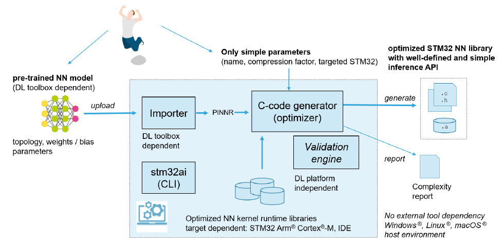
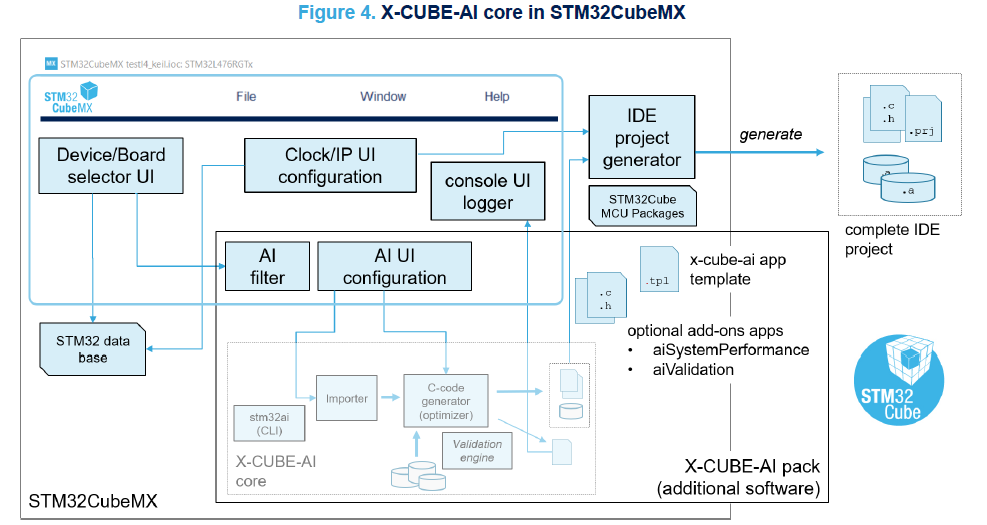
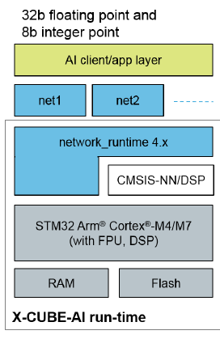

# Cube.AI工具

**Cube.AI**，也称为**X-Cube-AI**是ST推出的一套基于CMSIS-NN（ARM的神经网络库）的部署工具，可以经由CubeMX在stm32上部署神经网络

> 详细介绍可参考[官网](https://www.st.com/zh/embedded-software/x-cube-ai.html)和官方文档**UM2526**

本篇博文中大部分内容都来自官方文档资料和笔者自己的部署经验

这个工具包含以下部分

* Importer：一个将预训练过的神经网络模型转换为内部标准格式的“AI编译器”
* C代码生成器：一个将CubeAI内部标准的神经网络组织成符合CMSIS-NN标准C代码的优化器
* 神经网络运行时库：用于在stm32上执行神经网络推理的运行时库
* CLI组件：用于运行调试神经网络的轻量级shell实现
* Validation引擎：用于在上位机（PC端）或stm32上验证模型的AI引擎

整套工具只依赖于CubeMX环境，而不存在其他外部依赖，因此可以运行在任意系统上（采用Java实现的软件特性）

Cube.AI可以针对大多数stm32设备生成对应的神经网络结构并通过基于CMSIS-NN的运行时库进行实时推理

虽然它作为CubeMX的附加组件，但官方并不将这个组件视为CubeMX的补充，如下介绍：

> X-CUBE-AI通过提供一个在计算和内存(RAM和Flash内存)上优化的自动神经网络库生成器来扩展STM32CubeMX，它可以将最常用的DL框架(如Keras、TensorFlow Lite和ONNX)中预训练的神经网络转换为一个库，并自动集成到最终用户项目中。
>
> 项目会被自动设置好以在STM32微控制器上编译和执行
>
> X-CUBE-AI还扩展了STM32CubeMX，为项目创建添加了特定的MCU过滤，以选择适合用户NN特定标准要求(如RAM或Flash内存大小)的正确设备

准确地说，Cube.AI“调用”了CubeMX来进行器件选型和对MCU中硬件加速模块（比如强制打开ICache、DCache、CRC硬件运算器）进行初始化。

## 组件介绍

整个CubeAI工具类似一个AI编译器，输入一个模型，输出对应模型的C代码，与传统的编译器类似，可以将其分为前端和后端

### 前端转换工具

前端转换工具即Importer，将符合要求的神经网络转换成在CubeAI内部使用的标准格式，方便后续的C代码生成

### 后端生成工具

后端生成工具读取标准格式的神经网络并结合CubeMX的配置输出一套可以部署、验证的C代码

这套工具和CubeMX紧密结合，CubeMX中的设备选型信息会被优先输入到AI filter中，CubeAI会根据这些信息对输入的神经网络进行分析，如果神经网络规模过大超过内存限制，CubeAI就会发出警告；同时CubeAI会选定部分外设，强制CubeMX使能它们，这些外设包括CRC和Cache以及其他的运算加速功能（如果存在），这是为了满足CubeAI生成代码的要求（CMSIS-NN要求调用这些外设），同时也是为了加速运算

### 运行时库

运行时库的架构图如下所示

### 验证模块

## 在stm32上运行神经网络

### 训练模型

### 预先量化

### STM32环境配置与选型

### 输入Cube.AI

### 生成代码

### 根据模板进行推理

### 部署

