# 在SoC上部署神经网络


## 训练框架


## 推理引擎


## NPU

当前市场上面向商用/消费市场的SoC产品有不少都搭载了NPU。一般来讲，这些NPU的通用算力、算法部署灵活性都远不如GPU，但NPU核具有远超GPU的能效比。对于嵌入式神经网络算法部署场景，同功耗、同频率的NPU核心矩阵乘加算力能等效于数百个GPU核心。这主要是因为GPU（这里以Nvidia的实现为准）除了实现INT8、FP16矩阵运算外，还需要兼顾INT16、FP32、INT32等格式的矩阵、向量以及标量运算，其中每个核心分配到的ALU、调度电路、Local Memory等资源相对于NPU这类专用电路更少。另一方面，在电路实现上，单个NPU核心所需的电路面积相较单个GPU核心更小，成本敏感型的嵌入式平台中嵌入NPU能更好地以低面积占用换取高算力性能。

NPU也存在局限性。作为一种专用计算电路，NPU往往只能承担INT8、FP16等少量数据类型的计算，导致目前大部分嵌入式平台部署神经网络算法前都需要进行计算图优化、权重量化、算子融合，并利用神经网络编译器（NNC）生成NPU专用的指令集，再加载到平台执行离线推理。特别地，部分平台提供的NPU舍弃部分专用计算优化来获得更强的灵活性，使其胜任更多算法算子部署。

这里分别介绍Nvidia的NVLDA、瑞芯微的RKNPU和海思的昇腾DaVinci，三者分别代表了灵活性、专用算力优化、兼顾灵活与专用算力的三种设计倾向。

### NVDLA

NVDLA（NVIDIA Deep Learning Accelerator）是Nvidia推出的面向深度学习的硬件加速器架构，专为卷积神经网络（CNN）设计，旨在为边缘设备（如自动驾驶汽车、IoT设备）提供高效、低功耗的深度学习推理能力。其核心目标是通过硬件优化，加速CNN中的关键计算任务（如卷积、激活、池化等），并降低对通用计算设备CPU/GPGPU的依赖。

Nvidia于20217年开源了初代NVDLA的源码，但实际上该版本电路仅能做测试性运行，算力非常低，图中给出了FPGA平台上部署NVDLA和ARM Cortex-A9分别执行小规模神经网络模型所需的时间

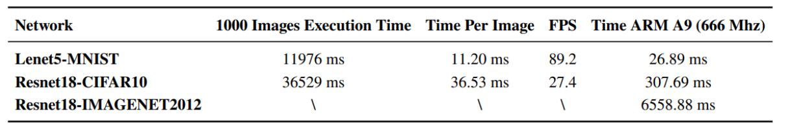

在后续Nvidia推出的边缘计算卡中，Jetson系列、Xavier系列、Orin系列均搭载了不同设计的NVDLA。官方文档中对NVDLA的架构描述如下图所示。

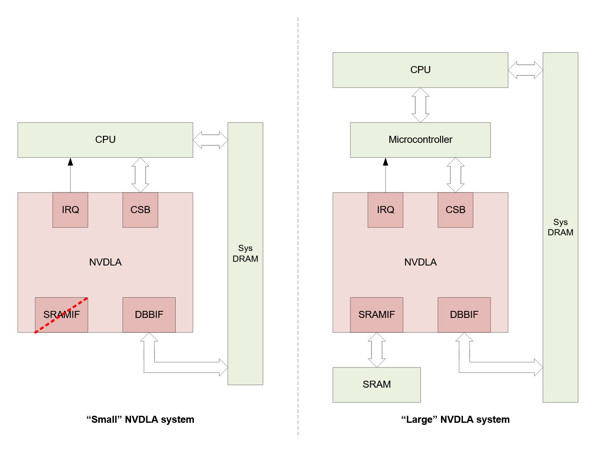

作为可扩展的专用处理器，NVDLA支持“无头”和“有头”两种模式，前者被称为“Small”系统，后者被称为“Large”系统。在开源版本中使用了“Small”系统。二者区别在于：“Large”系统内嵌一个微处理器负责管理加速器内部的数据调度，并接管加速器的中断处理，还在内部增加了一个高带宽SRAM。这个设计和当前大部分其他嵌入式平台的NPU设计类似，有助于增加NPU访存带宽、避免NPU占用系统内存总线带宽、解耦调度和运算流。大部分搭载NPU的嵌入式平台都采用ARM Cortex-A或类似的非实时处理器核，这些核心在没有中断优化情况下的中断响应代价较大，因此引入MCU还能够减少中断开销、避免CPU内核阻塞损耗。

NVDLA支持使用TensorRT进行权重和算子量化、图优化、算子合并、参数稀疏化等操作，同时Nvidia官方为其适配了CUDA支持，使其支持大部分常见算子，具有较高的算子灵活性。但作为代价，NVDLA的能耗比相对较低、片上面积占用大。

### 昇腾DaVinci

以昇腾310、610、910等计算卡为代表的华为的**昇腾NPU**采用特定域优化的**达芬奇**（**DaVinvi**）架构，为神经网络优化。 昇腾AI处理器的计算核心主要由**AI Core**构成，包含三种基础计算资源：矩阵计算单元（Cube Unit）、向量计算单元（Vector Unit）和标量计算单元（Scalar Unit），分别负责执行张量（Tensor）、矢量（Vector）、标量（Scalar）计算。AI Core中的矩阵计算单元支持INT8和FP16的计算，向量计算单元支持FP16和FP32的计算。AI Core基本架构如下图所示

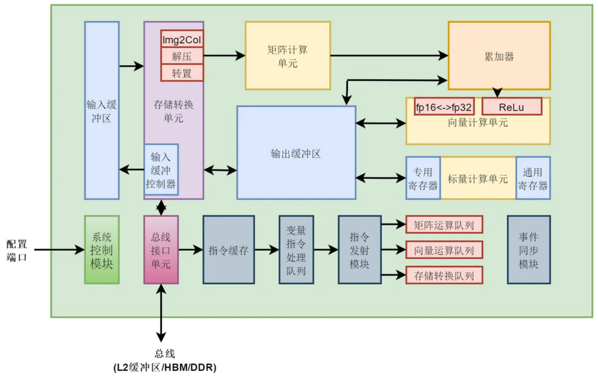

每个NPU核都配备了两层Cache，L0 Cache专用于矩阵运算，分别对应图中的指令缓存、输入缓冲区、输出缓冲区。输入缓冲区的输入张量、输入权重经过存储转换单元进行与GPGPU类似的Img2Col、Permute等操作后输入矩阵计算单元计算GEMM；使用累加器、向量计算单元处理激活、池化等算子。其他难以被专用加速器处理的算子会被标量计算单元执行。最终所有输出张量被存储到输出缓冲区。

指令缓存存储了DaVinci内核的专用指令。管理内核取指后，同时向矩阵计算单元、向量计算单元、标量计算单元派发（Issue），并由对应执行单元完成计算。

目前昇腾支持被称为 `DaVinci OM` 的模型格式，可以通过ONNX、TensorFlow、Caffe、MindSpore等格式的模型基于ATC工具转换出来。对于常用的PyTorch工具，还需要使用ONNX作为中间转换

> 很不幸的是，海思的嵌入式平台NPU并不完全支持上述格式的转换，一般只支持ONNX和Caffe模型转换，这在后面的部署案例中会介绍

昇腾针对端侧量化部署场景提供了AMCT模型小型化工具，这在后面的部署案例中会介绍。在昇腾的SDK中还集成了TVM自动调优的性能优化手段。整个开发过程可以选择使用MindStudio，也可以使用命令行AMCT工具进行。昇腾610、昇腾910加速卡还支持基于PyTorch-NPU的算法部署方式。

昇腾DaVinci内核与NVDLA类似，具有较高的算法灵活性，但其内部采用针对算子优化的三类专用计算单元，能够实现更高的能效比；但其局限性在于部分算子只能使用标量计算单元执行运算，占用片上面积也相对较大。

### RKNPU

目前其他大多数嵌入式平台搭载的NPU结构与瑞芯微RKNPU核心结构更加相似。以RK3588为例，其内置的RKNPU4共搭载3个2T@INT8算力的NPU核，支持多核心并行运算，NPU总算力为6TOPS。每个核心都包含CNA、DPU、PPU三个主要模块，结构如图所示。

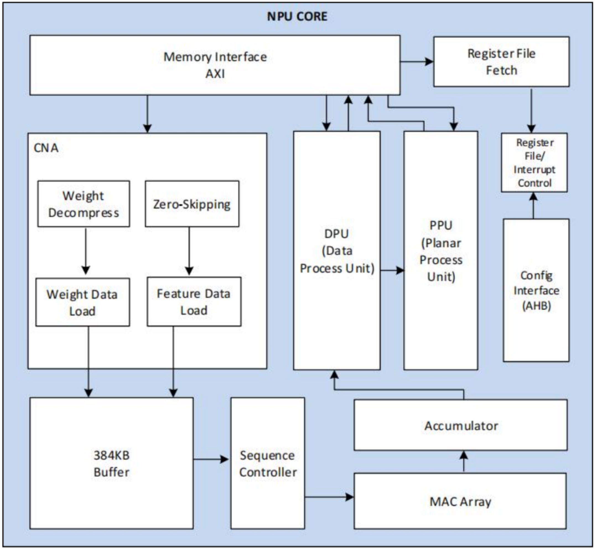

其中，CNA模块即卷积神经网络加速器（Convolution Neural Network Accelerator），专用于处理常见的卷积计算；DPU模块全称数据处理单元（Data Processing Unit），用于对张量数据格式进行变换；PPU表示平面处理单元（Planar Processing Unit），用于Img2Col、Permute等矩阵重排和张量拆分操作。全连接等通用GEMM操作被转移到乘法器阵列（MAC Array）和累加器（Accumulator）执行。

RKNPU支持INT4、INT8、INT16、FP16格式以及混合格式运算，通过RKNN-Toolkit工具进行权重稀疏化后可以在板端执行BF16、TF32运算。瑞芯微提供的RKNN-Toolkit工具能够针对RKNPU专用指令集进行神经网络图优化、权重量化、算子融合、调度优化等操作；RKNN-Toolkit-Lite工具能够直接在板端部署，完成算法在线调试等任务。

NPU内部没有搭载负责通用计算和调度的MCU，因此所有NPU不支持的算子或低计算效率算子都需要转移至CPU执行。同时，RKNPU没有引入指令通路和数据通路解耦机制，导致多核并行运行的调度严重依赖于CPU。RKNPU具有非常高效的矩阵运算加速性能、非常小的片上面积，但其算子兼容性较差。

## 在Hi3519DV500上部署

Hi3519DV500是由华为海思开发的一款高端智能视频（网络摄像头）主控SoC，搭载双核ARM Cortex-A53 CPU，且能够在极小体积内实现2.5TOPS@INT8算力，支持使用昇腾SVP_ACL接口部署

### 背景介绍

海思分为上海海思和华为海思，华为海思的产品仅供华为内部使用，而上海海思的产品在内部使用的同时对外供货，在2020年前，二者各自使用不同的NPU架构。上海海思开发的NPU叫做NNIE（Neural Network Inference Engine，神经网络推理引擎），配套板端SDK为SVP（Smart Vision Platform），而华为海思开发的NPU叫做昇腾Ascend，采用板端SDK为ACL（Advanced Computing Language）。

* 在上海海思的传统平台（如Hi3516DV300）上，使用NNIE核进行推理，板端部署时使用SVP框架，它支持 `.wk` 格式的模型，需要使用RuyiStudio进行转换
* 在华为海思的平台（如昇腾610）上，使用昇腾DaVinci核进行推理，板端部署时使用ACL框架，它支持 `DaVinci OM` 格式的模型，需要使用MindStudio或ATC工具进行转换
* 在上海海思的新平台（如Hi3519DV500）上，使用DaVinci OM核进行推理，板端部署时使用与昇腾DaVinci的ACL相似的框架SVP_ACL，它支持 `DaVinci OM SVP` 格式的模型，需要使用MindStudio或ATC工具进行转换

> 上海海思还提供缝合了昇腾DaVinci核和DaVinci OM核的设备，例如Hi3403V100，双核NPU中一个核采用昇腾DaVinci，另一个采用DaVinci OM

上海海思的**SVP_NPU**为新一代图像分析工具加速器，前端支持开源AI框架（截至目前支持**Caffe**和**ONNX**），后端支持DaVinci OM/CPU的异构计算，提供完整的软硬件计算加速方案。

在海思提供的SDK中，**NPU**表示昇腾DaVinci核对应SDK；**SVP_NPU**表示DaVinci OM核心对应SDK，二者在SDK软件层面是相似的，都具有ACL风格的接口命名和函数原型，但**在实际使用中的表现不完全相同**。

在海思提供的文档中，**NNN**表示昇腾DaVinci，**SVP_NNN**表示DaVinci OM。

本文介绍Hi3519DV500平台上的网络部署，即*采用昇腾工具链和SVP_ACL框架在DaVinci OM核上部署神经网络模型*

**昇腾模型压缩工具**（Ascend Model Compress Toolkit，**AMCT**）是一个专为昇腾芯片设计的深度学习模型压缩工具包。它提供量化、张量分解等多种模型压缩特性，旨在帮助用户高效实现模型的小型化。昇腾模型压缩工具在嵌入式平台使用的压缩方法主要为量化和模型部署优化。**量化**是指对模型的权重（weight）和数据（activation）进行低比特处理，让最终生成的网络模型更加轻量化，从而节省存储空间、提高计算速度。模型部署优化指的是**算子融合**，即通过数学等价，将模型中多个算子运算融合为单算子运算，以减少实际推理过程中的运算量。下图给出了将卷积层和BN层融合为一个卷积层的示例

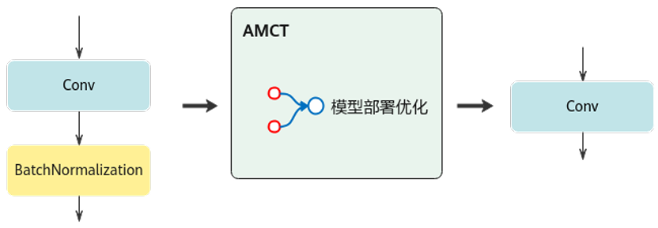

**昇腾张量编译器**（Ascend Tensor Compiler，**ATC**）工具是昇腾CANN架构体系下的模型转换工具，它可以将开源框架的网络模型或Ascend IR定义的单算子描述文件（以json格式描述）转换为NPU支持的om格式离线模型。在模型转换过程中，ATC还会进行**算子调度优化**、**权重数据重排**、**内存使用优化**等操作，对原始网络模型进一步调优，从而满足部署场景下的高性能需求，使其在NPU上高效执行。ATC工具的功能架构如下图所示

> 值得注意：ATC是自带伪量化功能的

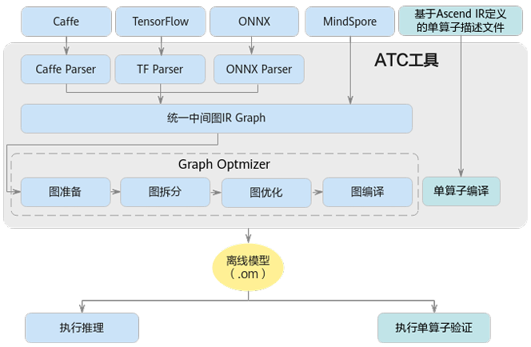

**SVP_ACL**（Smart Vision Processing Advanced Computing Language）是上海海思在旧有NNIE-SVP框架基础上，根据昇腾ACL框架构建的具有相似接口定义的新版DaVinci OM核NPU调度框架。它提供Device管理、Context管理、Stream管理、内存管理、模型加载与执行等C语言API库供用户开发*图像分析*工具应用，用于实现目标识别、图像分类等功能，同时支持时间序列神经网络的部署。

> 昇腾ACL的定义是通用深度学习计算，而SVP_ACL主要对CV领域的深度学习算法更加友好，这也和上海海思主要提供IPC主控有关
>
> 受限于版权因素，这里不便展示SVP_ACL逻辑架构图，读者可参考SVP_ACL的《应用开发指南》

SVP_ACL与ACL的主要接口命名风格差异为：SVP_ACL使用linux风格，宏定义和枚举采用SVP_ACL\_前缀；ACL使用驼峰风格，宏定义和枚举采用ACL\_前缀，例如

```c
aclInit(const char *configPath); // ACL接口
svp_acl_init(const char *config_path); // SVP_ACL接口
```

同理，SVP_ACL的宏定义、枚举、结构体等命名也遵循了linux风格和svp_acl_前缀

此外，**SVP_ACL可以被视为ACL的子集，部分ACL接口在SVP_ACL中并未实现**。同时，部分同名ACL接口和SVP_ACL接口在使用上具有差别，详细信息可参考SVP_ACL的《图像分析引擎使用差异说明》

### 环境配置

SVP_NPU环境包含PC端开发环境和板端开发环境。通用部署流程如下：

1. 使用PyTorch等训练框架完成模型**训练**
2. 使用AMCT工具对模型进行**量化**
3. 将模型**导出**为ONNX或Caffe格式（笔者推荐使用ONNX）
4. 使用ATC工具将模型**转换**为NPU支持的离线模型
5. 将离线模型文件放入板端，基于SVP_ACL搭建算法逻辑，执行**推理**

这就要求在PC端安装有合适的训练框架、AMCT工具、ATC工具（CANN软件包）；在板端安装有SVP_ACL SDK的库文件

板端环境安装需要的前置工作较多，需要开发者根据《Hi35xxVxxx SDK 安装及升级使用说明》文档完成基于Buildroot的设备SDK环境的安装，将官方提供的hi_svp_npu.ko等内核驱动放置到板端，并配置好himpp库。完成后需要将libsvp_acl.so等库文件和对应头文件放置到板端 `/usr/lib` 和 `/usr/include` 目录下。更详细内容不再赘述

PC端需要安装对应的工具，这里以命令行工具ATC和AMCT为例（MindCmd），有关图形工具MindStudio的内容可以参考官方手册

### 模型量化

海思AMCT工具支持**训练后量化**（Post-Training Quantization，PTQ）和**量化感知训练**（Quantization-Aware Training，QAT）两大主要量化方式。量化一般不依赖于硬件，所以用普通CPU来跑量化的过程就可以了，但为了加快量化后验证精度的速度，推荐配置GPU环境。

> AMCT工具还支持自动混合精度量化、高级离线量化的方式，详情参考官方文档《AMCT使用指南》

在Hi3519DV500平台上的量化权重一般采用INT8格式，但并不是所有的算子都会进行量化处理，一些非线性算子（激活函数）就不用量化，因此网络中可能会插入一些额外的 `dequant` 算子用于将数据反量化后输入非线性算子，这些算子一定会和 `quant` 算子成对出现。

### 模型转换

如果使用到amct量化为定点的模型，必须在转换时配置如下参数

```json
--qfog_param_file=<amct输出的quant_param_record.txt>
```


### AIPP

昇腾通过ATC工具和SVP_ACL框架在NPU上提供了被称为**AIPP**的神经网络预处理功能（AI Pre-Process）。AIPP能够提供色域转换、图像归一化、缩放（*Resize*）、补边（*Padding*）、抠图（*Crop*）等基本功能。根据配置方式不同，AIPP可被分成**静态AIPP**和**动态AIPP**。

> 在华为海思的传统平台（如Hi3403V100）上，AIPP被称为AAPP。二者实际上却有不同，如下图所示。AAPP是NPU中的一个模块，基于NPU提供的AA Core完成模型输入数据预处理工作；而AIPP能够以不同形式调用AAPP

*静态AIPP*在模型转换时保存在离线模型中，每次推理过程都会采用写死的AIPP参数来进行处理，并且无法通过业务逻辑来修改。在模型转换时设置使用*动态AIPP*，则每次推理前，可以使用业务逻辑根据需求动态修改参数值，从而在每次推理时选择不同参数（如对不同Sensor采用不同的归一化参数，输入图片格式需要兼容YUV420和RGB等）

> 采用静态AIPP方式，多batch情况下共用同一份参数；采用动态AIPP方式，多batch情况下使用不同的参数

**AIPP在ATC参数中进行配置**，相关指令如下，使用insert_op_conf参数指定AIPP配置

```shell
atc --insert_op_conf=./insert_op_targetdet.cfg
```

使用到的insert_op_targetdet.cfg文件内容参考如下

```json
aipp_op {
related_input_rank : 0
input_format : BGR_PLANAR
model_format : RGB
aipp_mode: static
mean_chn_0 : 0
mean_chn_1 : 0
mean_chn_2 : 0
var_reci_chn_0 : 0.0039062
var_reci_chn_1 : 0.0039062
var_reci_chn_2 : 0.0039062
}
```

其中 `aipp_mode`  决定使用静态AIPP（设置为static）还是动态AIPP（设置为dynamic）

`related_input_rank` 标识对模型的第几个输入做图像预处理，从0开始，默认为0

`input_format` 确定板端运行时输入的图像格式或Feature Map，可用参数包括但不限于YUV420SP、BGR_PLANAR等，一般选用BGR_PLANAR

`model_format` 声明模型运行时的色域格式，需要与input_format相匹配，一般对应BGR_PLANAR选用RGB或BGR

具体配置选项内容和使用规范约束可参考官方文档《ATC工具使用指南》

下面分别介绍AIPP提供的各种功能。

1. **色域转换**

    AIPP能够将输入的图片格式转换为模型需要的图片格式，一旦确认了AIPP处理前与AIPP处理后的图片格式，即可确定色域转换相关的参数值

    使用参数 `csc_switch: true` 来配置开启色域转换，并通过如下CSC矩阵和bias来描述如何执行转换

    ```json 
    csc_switch : true
    rbuv_swap_switch : false
    matrix_r0c0 : 298
    matrix_r0c1 : 0
    matrix_r0c2 : 409
    matrix_r1c0 : 298
    matrix_r1c1 : -100
    matrix_r1c2 : -208
    matrix_r2c0 : 298
    matrix_r2c1 : 516
    matrix_r2c2 : 0
    input_bias_0 : 16
    input_bias_1 : 128
    input_bias_2 : 128
    ```

    上面给出了YUV420SP_U8转换成RGB888的示例

    > 根据官方文档给出的结构图（由于版权信息，本文不便附上），笔者推测色域转换功能与发生在AAPP内的后续功能是不相关的，在数据加载到缓冲区后，NPU内的AICPU或SoC主CPU会使用软件方式完成色域转换；另一种猜测是色域转换功能是直接通过调用IVE来完成的

    具体参数选择和计算可参考官方文档《ATC工具使用指南》

2. **归一化**

    AIPP能通过对每个像素值进行减均值和乘系数的方式对图像进行归一化。考虑到输入NPU的数据一般为INT8类型，NPU中计算的数据一般为FP16类型，通过下面公式描述的归一化算法，可以直接转化数据格式
    $$
    P_{out}(i)= (P_{in}(i) - \mu - P_{min}) \times \frac{1}{\sigma}
    $$
    式中，$\mu$代表每个通道的**均值**，$\sigma$代表每个通道的**方差**，$P_{min}$代表每个通道中所有像素的*最小值*，这三个参量直接描述了如何进行归一化

    其中，均值$\mu$和方差$\sigma$需要预先配置，但$P_{min}$只需要从输入图中读取即可，还要注意这里的运算是针对每个通道进行的，因此对于三通道的图像，必须对每个通道中均值和方差进行配置。这就构成了代码中的

    ```json
    mean_chn_0 : 0 //配置通道0的均值
    mean_chn_1 : 0 //配置通道1的均值
    mean_chn_2 : 0 //配置通道2的均值
    var_reci_chn_0 : 0.0039062 //配置通道0的方差倒数
    var_reci_chn_1 : 0.0039062 //配置通道1的方差倒数
    var_reci_chn_2 : 0.0039062 //配置通道2的方差倒数
    ```

    注意代码中的方差是直接以倒数形式描述

3. 图像裁剪**Crop**

    在AIPP中，Crop、Resize、Padding操作会依次完成，从而实现重构输入图像尺寸的目的。其中图像裁剪Crop是第一步，它会从原始图像中按照抠图起始位置和大小设定裁切其中一片区域，可以使用下列配置指定

    ```json
    crop: true //是否开启抠图
    load_start_pos_w: x0 //抠图起始位置水平坐标
    load_start_pos_h: y0 //抠图起始位置垂直坐标
    crop_size_w: w //抠图后的图像宽度
    crop_size_h: h //抠图后的图像高度
    ```

    要求抠图宽度和抠图高度对应小于原图高度和宽度，要求load_start_pos_w*图像像素位宽为8的倍数（按字节对齐）

    注意：AAPP改变图片尺寸需要遵守顺序，即Crop、Resize和Padding三个操作存在时，一定是先Crop、然后Padding、最后Resize，每个操作仅能执行一次

4. 图像缩放**Resize**

    AIPP支持基于最近邻插值（nearest）或双线性插值（bilinear）的图像缩放形式，实现可以参考OpenCV，通过 `resize_mode` 选项指定

    根据Resize的模式不同，AIPP的执行流程会自行微调：

    * 当Resize的模式是nearest时，流程顺序是Crop、Pad、Resize、色域转换、通道转换、归一化
    * 当Resize的模式是bilinear时，流程顺序是Crop、Pad、色域转换、通道转换、归一化、Resize

    可以使用下列配置指定

    ```json
    resize: true //是否开启缩放
    resize_mode: nearest //缩放算法
    resize_input_w: 1920 //缩放前图像尺寸
    resize_input_h: 1080
    resize_output_w: 640 //缩放后图像尺寸
    resize_output_h: 640
    ```

5. 图像边缘填充**Padding**

    AIPP允许不同方法的图像边缘填充（Padding）

    * const_zero：所有像素填充为常量0值
    * duplicate：复制边沿像素值填充
    * reflection：镜像填充
    * symmetric：对称填充

    注意：对于const_zero模式，当Resize的模式是nearest且垂直方向为下采样（图片高度方向的缩放倍数只能小于1，输出图小于输入图）时，top和bottom的padding只能设置为0（不允许继续padding）

    可以使用下列配置指定，其中可以用 `xxx_padding_size` 选项来确定各个方向的填充行数/列数

    ```json
    padding: true //是否开启边缘填充
    padding_mode: const_zero //填充模式
    left_padding_size: 0 //图像左侧填充尺寸
    right_padding_size: 0 //图像右侧填充尺寸
    top_padding_size: 0 //图像上方填充尺寸
    bottom_padding_size: 0 //图像下方填充尺寸
    ```

6. **通道数据交换**

    AIPP提供了自动处理图片通道排列的功能，支持将RGBA/YUVA四通道图像转换成ARGB/AYUV（将透明通道变换位置）以及将RB通道呼唤/UV通道互换，可通过配置项 `ax_swap_switch` 和 `rbuv_swap_switch`  开关

注意：如果有配置AIPP，无论静态还是动态，最终生成离线模型的输入数据大小input_size均会被Crop、Padding等操作影响。假设模型标准的输入数据尺寸
$$
Size = [Batch=N, H=src\_image\_size\_h, W=src\_image\_size\_w, C=3]
$$
最后模型输入的Size的计算公式如下

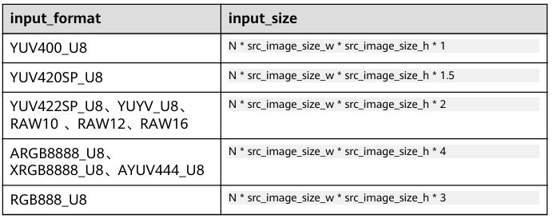

如果采用动态AIPP，在模型转换时，ATC将会新增一个模型输入，用于接收推理阶段中通过 `svp_acl_mdl_set_input_aipp` 传入的参数，相关内容参考官方文档SVP_ACL部分《应用开发指南》

### 模型部署

以机器视觉领域的神经网络模型为例，OM模型在板端推理流程如下：

1. hi_mpi_sys_mmap 映射虚拟内存指针
2. 初始化 svp_acl
3. 加载模型、创建模型输入输出的datasets和buffer
4. 创建推理线程，在推理线程中如下执行
    1. 获取用于推理的图像帧（或执行算法前处理）
    2. 填充图像数据至相关结构体
    3. 将 YUV420SP 图像转换为 RGB888 格式图像（NPU只支持RGB888）
    4. 将图像数据加载到模型输入缓冲区
    5. 执行推理
    6. 从输出缓冲区中读取结果
    7. 执行算法后处理（如NMS等）
    8. 输出结果并执行业务逻辑
    9. 释放当前图像帧

## 在昇腾310上部署

昇腾310（Ascend 310）是华为海思推出的高性能AI推理芯片，基于昇腾DaVinci架构，支持INT8/FP16混合精度计算，提供8T~20TOPS@INT8算力，面向边缘计算场景。官方推出了配套的计算卡Atlas 200，支持使用昇腾ACL和CANN框架部署神经网络模型

昇腾提供了AMCT等量化工具，对模型进行量化可以提高模型在DaVinci核上的运行效率，支持训练后量化（PTQ）和量化感知训练（QAT）。在部署前还需要安装安装ATC工具，用于将开源框架模型（如PyTorch、ONNX）转换为昇腾310支持的 om 格式，从而在板端运行

### 昇腾310硬件规格

搭载8核**Cortex-A55**，其中6个为通用CPU，1个为AICPU，1个为专用任务调度器CPU处理AI Core和AI CPU上的计算数据调度

搭载**DVPP**数字视觉预先处理子系统（对应AIPP和MPP），处理图像编解码和格式转换等

集成2个**AI Core**，DaVinci架构NPU，处理矩阵、向量、标量计算密集型的算子任务

支持PCIE3.0、USB3.0、RGMII接口，提供UART、I2C、SPI等通用低速接口

DieShot如下

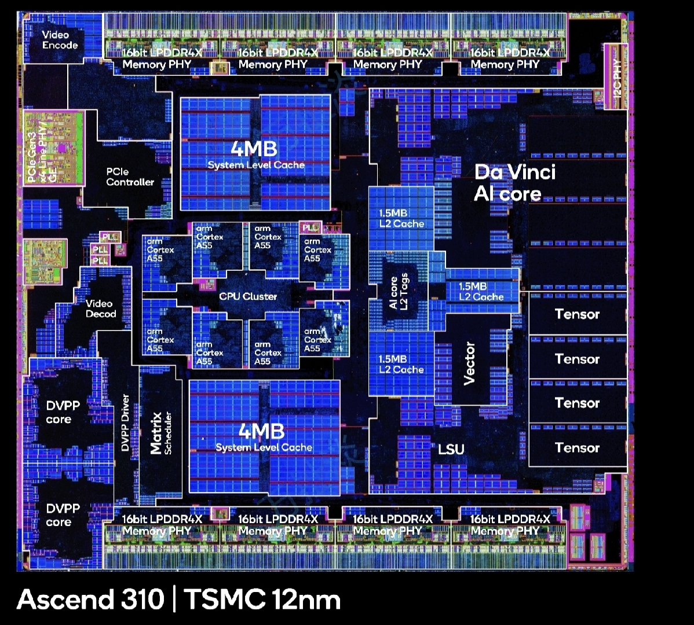

## 在RK3588上部署

RK3588是由瑞芯微开发的一款高性能音视频SoC，其搭载了8核ARM Cortex-A72/A53 CPU以及INT8算力6TOPS的NPU。

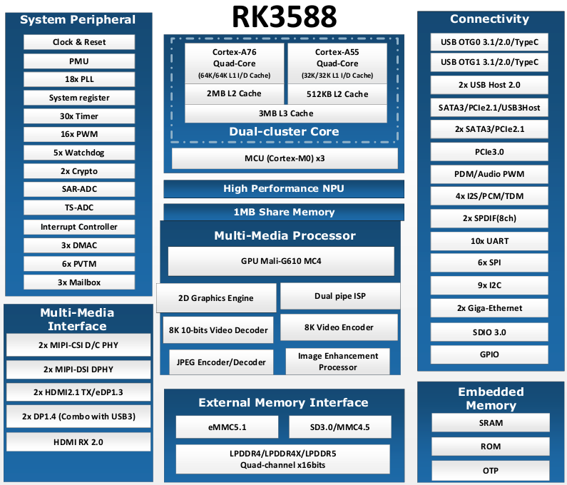

使用官方的RKNN软件栈即可将AI模型部署到RK3588的NPU上进行推理，如下图所示。

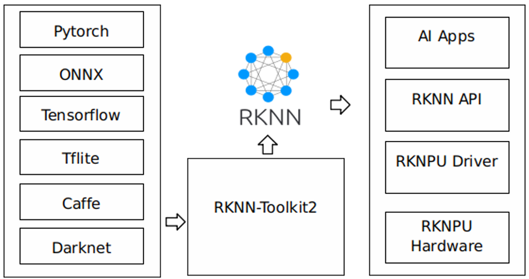

用户需要首先在PC上安装**RKNN-Toolkit2**工具，将训练好的模型转换成RKNN格式，并使用RKNN提供的C或Python API在板端部署推理。在板端，用户还需要移植**RKNN Runtime**软件包及NPU的内核驱动来调用NPU处理模型。即总体流程仍分为**模型转换-模型评估-板端部署**三阶段

### 环境配置

RKNN-Toolkit2是为用户提供在计算机上进行模型转换、推理和性能评估的开发套件，结构框图如下

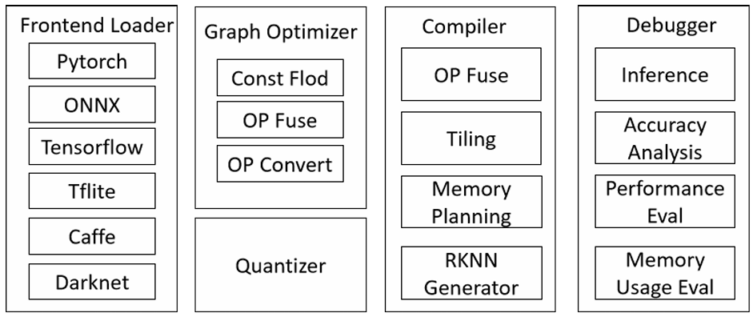

主要包含**模型转换**（支持PyTorch、ONNX、Caffe等模型，相较于海思昇腾ATC支持更广）、**模型量化**（支持感知训练量化和QAT训练后量化）、**模型推理**（可在PC端模拟器仿真推理，也可以将模型分发到指定的NPU设备上进行推理）、**性能和内存占用评估**、**量化精度分析**（可基于余弦距离和欧氏距离）、**模型加密**等功能

此外，还需要在板端安装**RKNN Runtime**包以调用NPU驱动实现在NPU上推理RKNN模型。推理时，包括三项流程：原始数据输入预处理、NPU运行模型、输出后处理，针对不同模型输入格式和量化方式，RKNN Runtime包提供了通用API和零拷贝API两种方式

* **通用API推理**：模型推理在NPU上完成，数据处理在CPU上完成，如下图

    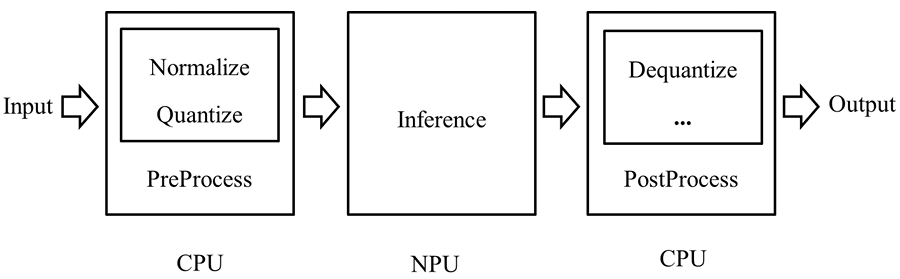

* **零拷贝API推理**：数据归一化、量化、推理均在NPU上完成；输出数据重排、反量化在CPU或NPU上运行，从而提高输入数据流的处理效率，从而减少CPU和DDR消耗，如下图

    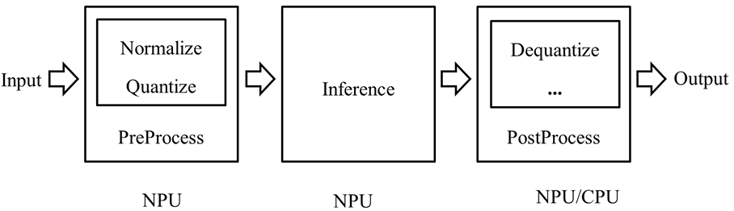

> 昇腾NPU上会出现由于通用推理导致的内存墙问题，而RKNPU通过零拷贝API推理能够较好地缓解该问题

PC端配置比较简单，推荐在Ubuntu20.04以上的Linux系统或WSL中完成配置。RKNN的所有包都托管在github，可以用git指令从以下地址安装，也可以直接下载

```shell
git clone https://github.com/airockchip/rknn-toolkit2
git clone https://github.com/airockchip/rknn_model_zoo

# 以下为RKLLM工具及其依赖包
# 详见下一部分
git clone https://github.com/airockchip/rknn-llm
```


在配置前，可以通过指令

```shell
dmesg | grep -i rknpu #查询RKNPU2驱动版本

```


### 模型转换


### RKNN Runtime框架


### 模型部署


## 在RK3588上部署LLM

瑞芯微为用户提供了**RKLLM-Toolkit**用于将HuggingFace格式的大语言模型转换为RKLLM模型，从而支持LLM在RKNPU上部署运行。在板端，存在一个名为**RKLLM Runtime**的组件用于加载中RKLLM模型，并调用NPU驱动执行模型推理。对于大模型量化，截止rknn-llm-release-*v1.1.1*，RKLLM-Toolkit目前支持**w4a16**、w4a16分组、**w8a8**、w8a8分组共四种模型量化方式。RKLLM-Toolkit框架如下图所示

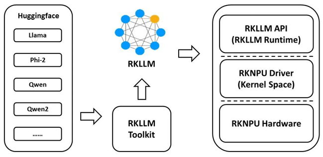

本文使用通义千问[Qwen模型](https://github.com/QwenLM/Qwen)进行测试。

部署方式与正常的神经网络模型部署类似，只不过所有API都需要按照rkllm库的格式调用。

### 环境配置

下载官方给出的[rknn_llm](https://github.com/airockchip/rknn-llm)，所有相关文件和示例都在其中。

也可以根据README文档指引，在[RKLLM_SDK](https://console.zbox.filez.com/l/RJJDmB)下载对应版本的librkllmrt.so（提取码：rkllm）动态库文件

将librkllmrt动态库文件放入开发板文件系统的/usr/lib目录下，并将rkllm.h的目录位置引入环境变量，就可以在后续应用程序中调用了；而rkllm_toolkit需要使用python在PC上安装。如果使用Buildroot SDK自行配置Linux，则需要将rknpu-driver预先放入SDK目录，作为模块编译进内核或直接编译进内核

更多内容可参考RKLLM_SDK仓库中的快速入门手册
