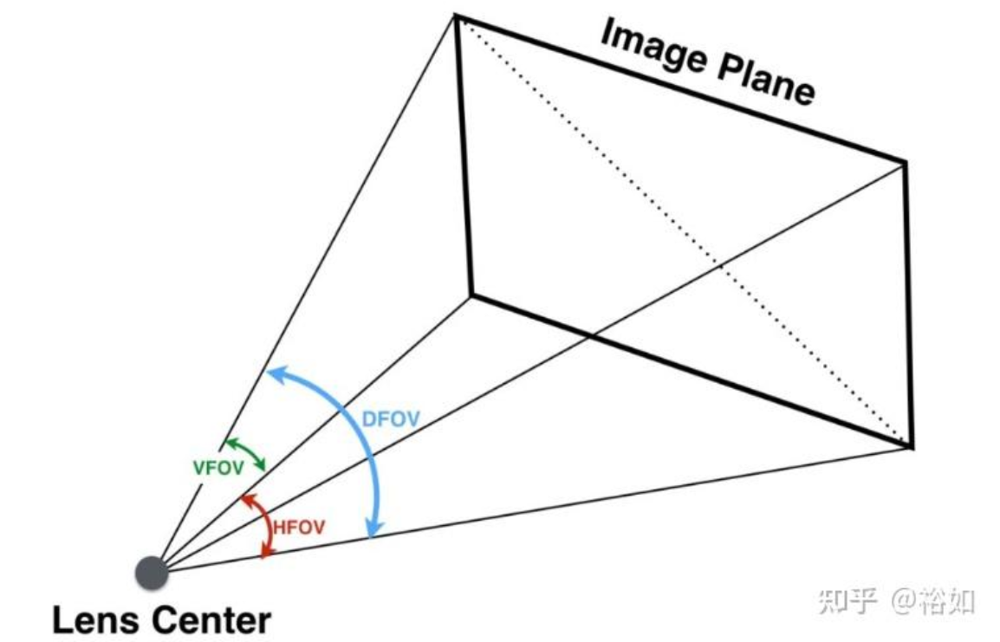
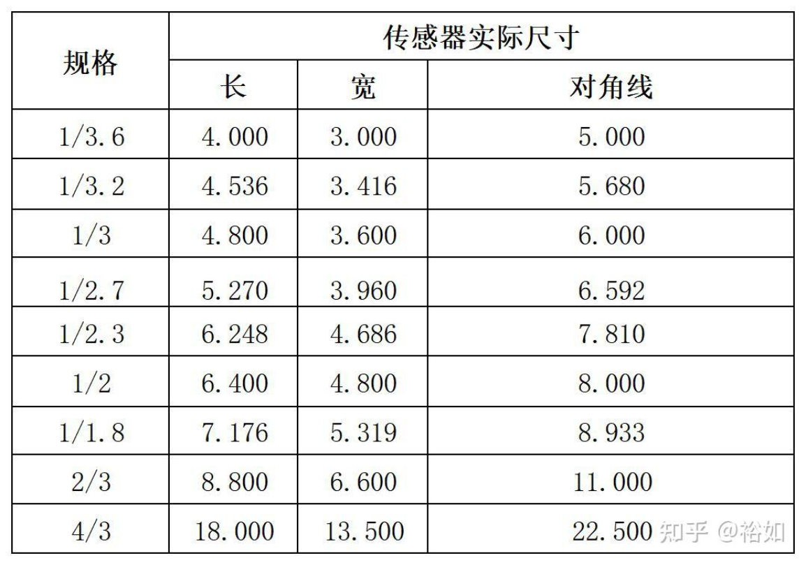
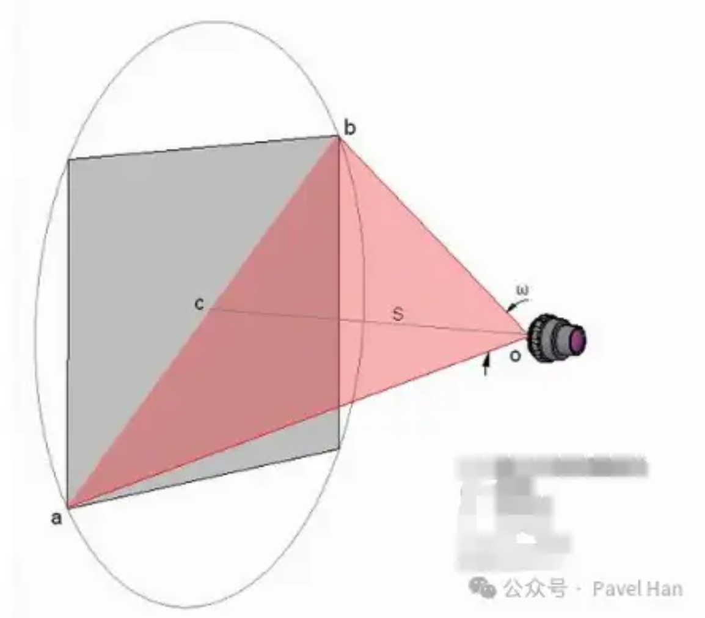
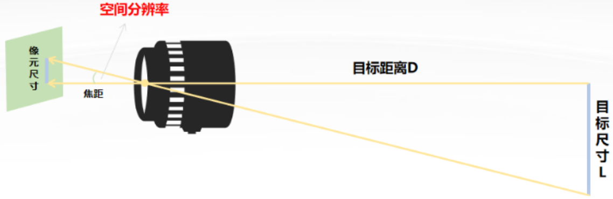

# 智能识别系统相关计算

本文在计算摄影和光学成像基础内容之上，联系实际工程整理智能识别系统中常见的计算

## 经验公式

首先来看工程中常使用的经验公式

### 约翰逊准则

第二次世界大战后，军方对夜视技术、红外热像仪等新型传感器系统的性能评估需求日益增加。急需一种能够量化传感器系统性能并预测人类观察员在不同系统下识别目标的概率的方法。

1958年， 美国陆军夜视与电子传感器局（NVESD）的科学家约翰·约翰逊在“夜视图像增强器研讨会”上发表了题为《图像形成系统分析》的论文，其中包含后来被称为**约翰逊准则（Johnson's Criteria）**的列表。约翰逊把视觉观察分为四大类，即**侦测（Detection）**、**识别（Recognition）**和**辨认（Identification）**，并创新性地将人类观察员的感知阈值以**线对**为指标进行了量化。

定义一条**线对（Line Pairs）**（或一个周期）为目标的最小尺寸上能够被解析的一条黑线和一条白线，约翰逊组织志愿者观察员，在柔和的背景下通过图像增强探测器观察八种军车比例模型和一个士兵比例模型，询问受试者能否完成下列目标任务

* 侦测：看到有目标存在，也就是把目标辐射从背景辐射中区分出来
* 识别：能够区分目标的类型（如区分一辆车和一个人）
* 辨认：能够识别出特定的目标（如区分卡车和轿车，或特定的人）

经该实验，发现了被称为约翰逊准则的**经验模型**：在均匀背景、充足目标对比度、低图像噪声和理想大气条件下，人类观察员有50%概率正确完成上述任务所需**目标最小尺寸上所需的最小线对数**依次为：

* 侦测：1.0±0.25（一般认为是1.0）
* 识别：4.0±0.8（一般认为是4.0）
* 辨认：6.4±1.5（一般认为是8.0）

此后，约翰逊关于侦测、识别和辨认的方法成为了目标观察研究的基础，他所使用的方法被称为**等效条带图案法**。通过这一方法，可以实现光电成像系统探测能力与阈值条带图案分辨率的关联。

> 约翰逊准则表明可以在不考虑目标本质和图像缺陷的情况下，用目标等效条纹的分辨力来确定光学成像系统对目标的识别能力，这一成果在后续的可见光、红外光、多光谱成像探测系统中均有应用

### 现代成像系统下的约翰逊准则

在现代的成像系统中，我们使用CCD/CMOS图像传感器、数字图像处理器、LCD/OLED显示设备组成系统，这与1958年常见的模拟探测与信号链是完全不同的，但约翰逊准则仍具有一定指导意义。将约翰逊准则换算成像素描述，**人类观察员或智能算法**正确完成每项任务所需的目标最小尺寸上所需的**最小像素数**依次为：

* 侦测：≥1
* 识别：≥4，经验公式为6
* 辨认：≥8，经验公式为12

### 约翰逊准则的推论

已知目标尺寸S、目标与成像设备间距离D、空间分辨率IFOV，可得目标图像在成像设备上所占用的像素数
$$
n=\frac{S/D}{IFOV}
$$
其中空间分辨率表示每个像素在世界坐标系所张开的角度，也就是系统所能分辨的最小角度，定义式为
$$
IFOV=\frac{d}{f}
$$
其中d表示成像设备的像元尺寸（在CMOS/CCD图像传感器中就表示传感器的像素间距），f表示成像设备的镜头焦距

因此，代入原式可得
$$
n=\frac{S}{D} \cdot \frac{f}{d}
$$
当S、D、d不变情况下，镜头焦距f直接决定了目标所成的像的大小，也就是在焦平面上占几个像素。根据约翰逊准则可知，**焦距越大，目标像所占用的像素点越多，设备的有效探测距离就更远；但另一方面，焦距越大，视场角越小，往往硬件成本也更高。**

### TTP模型

**目标任务性能（Target Task Performance，TTP）模型**是在约翰逊准则基础上发展而来的更贴近实际场景的模型，其核心在于预测一个成像系统（尤其是热像仪）在给定任务和环境条件下，成功完成任务的概率或作用距离。

TTP模型通过引入**背景杂波（Clutter）**和**有效感知面积（Equivalent Perceived Area）**的量化参数，分别对背景干扰和目标的复杂几何形状进行描述，并给出一个任务完成概率（如 50% 概率、90% 概率）随作用变化的曲线。

## 光学镜头

现代光学成像设备遵循简单的原理：小孔成像。虽然材料学、机加工技术革新带来了更精密的镜头，但其物理原理还是要追溯到17、18世纪牛顿、菲涅尔等科学家研究的基本光学定律。在进入“采样”前，要先回顾一下光学和镜头相关的内容。

### 薄透镜模型

薄透镜模型是一种简化的理想凸透镜镜头模型，遵循两个基本假设：

* **穿过光心的光线不受镜头影响，会直线传输**
* **平行光穿过镜头后，会汇聚到焦平面上的一点上**

基于这两个假设可以得到**放大率**
$$
m=\frac{S}{s}=\frac{D}{D'}=\frac{f}{D'-f}
$$
其中，m就是薄透镜系统的放大率，S表示物体尺寸（可以直观理解为高度），s表示成像的尺寸；D表示物距，D'表示像距；f为薄透镜的焦距。上式解释了物距和像距的基本关系：**距离之比等于尺寸之比**

> 此外，通过凸透镜的理论公式
> $$
> \frac{1}{D'}+\frac{1}{D}=\frac{1}{f}
> $$
> 也可以反向推导得到上述公式，相关证明留给读者

当且仅当D'=f时，存在m趋于无穷大，这说明无穷远处的光线通过透镜后在焦点处成像

更多内容可参考《三维重建》系列文章，很多内容与本文所关心的智能识别系统无关，故不再讲述。

### 镜头视场角

通过镜头能观察到景物的范围称为**视场角（Field of View，FOV）**。一般应用中，由于图像的高度和宽度是不一样的，一般会分为**水平视场角HFOV**、**垂直视场角VFOV**和**对角线视场角DFOV**。如下图所示，对于常见的横屏图像，DFOV最大，HFOV次之，VFOV最小，对于镜头而言，一般所说的视场角就是对角线视场角DFOV。

在薄透镜模型下，恒有
$$
\frac{H}{2f} = \tan{\frac{VFOV}{2}}
$$
以及
$$
\frac{W}{2f} = \tan{\frac{HFOV}{2}}
$$
同时有
$$
\frac{\sqrt{W^2 +H^2}}{2f} = \tan{\frac{DFOV}{2}}
$$
其中W表示传感器的宽度，H表示传感器的高度，这里可以先忽略。对于镜头，我们只讨论最后的DFOV：可以发现DFOV能够只使用镜头在像平面（一般是焦平面）成像圆的直径来计算，即

> 镜头的FOV和光学系统的FOV有一些区别：每个镜头都有自己独立的FOV，对于镜头而言的DFOV就是基于其焦距与在焦平面上成像圆的直径（也就是所谓的弥散圆）来进行计算，跟图像传感器的尺寸无关

$$
\frac{D_c}{2f} = \tan{\frac{DFOV}{2}} \iff DFOV=2\arctan{\frac{D_c}{2f}}
$$

其中Dc表示薄透镜在像平面所成圆的直径。**使用该公式就可以计算镜头的独立视场角**。可以发现*在Dc不变的情况下*，镜头焦距越短，则视场角越大（注意arctan在定义域内单增）；反之亦然。这便是镜头焦距决定视野的核心原理，但在实际应用中，视场角还需要考虑到传感器尺寸（理想薄透镜模型下认为成像圆是无穷大的），这会给挑选镜头带来困扰，因此我们需要引入“等效焦距”，相关概念在后文中说明。

常常用广角、中焦、长焦来描述镜头，它们实际上一般对应短焦距、中焦距、长焦距，短焦距下视场角大、长焦距下视场角小

> 例如，如果把镜头焦距从24mm扩大至72mm时，HFOV会从73.74°缩小到只有28°

### 光圈和快门

**光圈**指的是镜头中控制光线的叶片装置。它就相当于小孔成像中的小孔，只不过实际的光圈通常不是圆形的，而是机械结构导致的多边形。可以调整光圈大小来调节透镜的通光量，光圈中心开口的大小代表光圈的数值，用F系数表示。**光圈数值F越小，孔的开口越大，有更多光能通过镜头，因此曝光量越大**

**光圈的值通常是$\sqrt{2}$的倍数**（公比为1.4的等比数列），比如f1、f1.4、f2、f2.8、f4、f5.6、f8、f11、f16、f22、f32。当光圈半径呈$\sqrt{2}$倍关系时，面积就会呈2倍关系，通光量也呈2倍关系

快门则是镜头中控制传感器曝光的设备，根据开启的方式分为**全局快门**和**卷帘快门**。卷帘快门具有和光圈类似的机械结构，通过快速地从下向上打开来控制传感器的曝光时间（感光单元从上至下逐行曝光）。全局快门不容易使用机械结构制造，一般来说只能通过电路让感光元件上所有的感光小单元同时感光来实现，制作工艺要求高，一般只用在CCD传感器或高端的CMOS传感器上。不过随着近年来半导体技术提升，已经有越来越多的图像传感器可以使用高速全局快门了。

快门参数基于速度标定，如1/4、1/8、1/15、1/30 、1/60、1/125等。它们之间是倍数关系，指的是几分之一秒的曝光时间，因此通过快门的曝光量也呈倍数关系。

镜头中的光圈和快门共同控制了传感器的曝光特性，具有以下功能：

* 其他条件不变，光圈越大，曝光孔径越大，进光量越多，景深越小（需要同时控制焦距才能让成像清晰）
* 其他条件不变，快门越慢，曝光时间越长，进光量越多，越容易引起果冻效应，**运动的景物更容易模糊**

## 传感器

前一节独立给出了智能识别系统中与相机镜头相关的基本信息，本节对传感器的参数作简要介绍

### CMOS图像传感器简介

光学探测设备一般都使用CCD/CMOS图像传感器。CCD是最早一代图像传感器结构，其造价相对高、成像效果相对好。以前高端设备会采用CCD，而中低端产品才会采用CMOS；而现在的CMOS工艺传感器已经和CCD传感器有近似的性能了，同时CMOS工艺的传感器造价低廉，因此大多数消费级和工业摄像机已经采用了CMOS传感器。

CMOS之所以叫CMOS，就是因为它是基于CMOS（互补金属氧化物半导体）工艺制造的。其采集光信号再转变成电荷输出的方式和CCD一样，使用的也是MOS光敏元，但采用被称为**光电二极管**的标准单元设计，因此非常容易加入CMOS大规模集成电路中。

光电二极管由一个栅极和一个N有源区构成。版图上光电二极管的尺寸会做的很小，这就导致每个光敏元产生的电荷都非常微小，还会由于沟道长度和单元间距产生漏电问题，需要搭配外部供电才能很好地工作，因此CMOS的基本像素单位被称为**有源像素传感器**（Active Pixel Sensor，**APS**）。

每个APS产生的电信号都比CCD的MOS光敏元产生的信号更加微小，因此**每个像素都被分配了独立的信号放大器**。这样的结构让像素信号在输出前就被放大到了可以接受的程度（CCD受到结构限制，无法采用类似的方法来减小对精密放大器的依赖）。由于信号被放大，还有多个行列开关同步控制，CMOS图像传感器的**读出速度比CCD快**很多。

> 更多内容可以参考计算摄影基础部分

### 分辨率

对于传统的胶片相机，我们不会考虑“分辨率”；但对于现代数字化的CMOS图像传感器就需要仔细分析其分辨率了。

传感器的分辨率并不是单一指标，实际上一个芯片的分辨率可以有三种：

1. **感光阵列（靶面）分辨率**：芯片中APS的像素总数及其排列方式
2. **有效分辨率**：指定主光线角、指定波长下，厂商保证芯片感光阵列可用于成像的APS像素数。也就是一般在芯片数据手册中给出的标称分辨率
3. **输出分辨率**：传感器读出的实际分辨率。在集成ISP的传感器中，用户可以选择低于有效分辨率的图像作输出，这被称为*降采样*

由于芯片制造工艺良率限制，厂商在生产CMOS图像传感器时往往会预留一些冗余的APS单元，这样如果出现损坏，可以用相邻的单元去替换，原始的APS单元数便是感光阵列分辨率。因此有**感光阵列分辨率≥有效分辨率≥输出分辨率**

后文中所叙述的分辨率均基于输出分辨率。

可以利用传感器的感光阵列物理尺寸与像元的间距来计算理论上的最佳输出分辨率
$$
MP=WP \cdot HP = \frac{d_W}{s_p} \cdot \frac{d_H}{s_p}
$$
其中，MP表述总分辨率，WP、HP分别代表水平和垂直分辨率，dW代表感光阵列（靶面）的有效宽度，dH代表感光阵列（靶面）的有效高度，sp代表像元（像素）物理尺寸。反过来也可以计算传感器的像元尺寸
$$
s_p=\frac{d_W}{WP}
$$
这里回想之前讲述的小孔成像，可以从传感器的角度拓展放大率公式。在传感器和镜头**匹配良好**的情况下，
$$
m=\frac{S}{s}=\frac{S_A}{S_V}
$$
其中SA表示感光阵列（靶面）的物理有效尺寸，SV表示视野的物理尺寸。该式也可用于验证当前成像系统的光电设计是否合理：如果传感器和镜头不匹配，则该公式将不被满足。关于“匹配”，将在下一小节说明。

### 相机画幅与视场角

**传感器感光阵列的物理尺寸**也常常被称为相机的“底”，在部分技术报告中也被称为**光学尺寸**，用更接近相机摄影领域的术语，这就是传感器的**画幅**。习惯上用**英寸**表示其长宽参数，对照表如下所示。

> 对于红外、多光谱探测设备，一般也遵循英寸惯例

由于现代成像系统源于照相机，很多术语也被沿用过来——胶片时代的“全画幅”是指尺寸为36mm*24mm的135胶片的尺寸，过渡到数字时代以后，最开始应用的并不是晶体管传感器，而是真空摄像管（Vidicon Tube），因此CCD/CMOS传感器的“画幅”也分成了两个流派。

* 相机制造商画幅标准：沿用胶片时代的画幅定义，由于产品基本只在相机上使用，这里不再赘述
* **移动设备制造商画幅标准**：沿用真空摄像管的画幅定义，传感器产品常见于手机、移动设备、监控等，也就是上述表格中所含描述的定义。有经验公式：**实际对角线长度约等于画幅尺寸的2/3**

> 需要注意：移动设备制造商采用的画幅标准与实际尺寸严重不符。比如1''传感器的实际对角线长度约为16mm，而不是25.4mm
>
> 这个问题源于真空摄像管的尺寸所描述的是“玻璃真空管的外径”，由于玻璃管有厚度，且成像区域不能贴着管壁，实际能用来感光的矩形区域要远远小于真空管的外径。

在监控以及光学观测设备中比较常见的就是1/1.8''的传感器了，对应其对角线长度约为8.933mm。

前面提到*在Dc不变的情况下*镜头的FOV由焦距决定，而这里的传感器画幅就定义了Dc：如果**传感器靶面的对角线长度刚好与镜头在其焦平面上成像圆的直径相同**，如下图所示，那么成像系统DFOV与镜头DFOV相等，而HFOV、VFOV自然比DFOV稍小，这个情况称为镜头与传感器**尺寸匹配**。容易理解，当传感器靶面的对角线长度小于等于镜头在其焦平面上成像圆的直径时，镜头与传感器**匹配良好**。

但是一些实际的光学成像系统中，镜头在焦平面上的成像圆直径往往大于图像传感器的对角线尺寸。放在上图中理解的话，就是图像传感器（深灰色矩形部分）的对角线小于镜头成像圆的直径。这样就只能使用图像传感器的对角线尺寸来计算系统DFOV了，从而让成像系统的DFOV稍小于镜头DFOV。在不完全匹配的系统中，视场角公式变为
$$
\frac{S_A}{2f} = \tan{\frac{DFOV}{2}} \iff DFOV=2\arctan{\frac{S_A}{2f}}
$$
其中SA代表图像传感器的对角线尺寸

### 等效焦距

在引入上述诸多概念以后，衡量一个成像设备的视场角变得异常复杂，为此各大厂商引入了等效焦距、目标画幅的概念。

每个镜头在设计之初都有一个**目标画幅**，也就是镜头与小于等于该画幅的传感器可以良好匹配——用户可以对适合的传感器进行筛选。同时**厂商在规格表里给出的镜头FOV也是基于这个目标画幅的对角线长度计算出来的**。

> 镜头规格书中给出的FOV指的就是它“满血状态”下的FOV，但如果用户挑选了小于目标画幅的传感器，那么实际系统的FOV将会变小

等效焦距则让用户可以跨越不同画幅，用统一的标准来感知视场角。等效焦距以全画幅的43.3mm对角线尺寸为基准，基于下式得出
$$
f_A =\frac{43.3}{2\tan{\frac{DFOV}{2}}}
$$
其中DFOV为实际的系统FOV，fA表示全画幅传感器要达到该系统DFOV所要搭载的镜头焦距，即**等效焦距**。

> 设备规格书给出的焦距指的就是等效焦距，利用等效焦距可以告知用户设备的视场角等效于全画幅传感器搭配这个焦距的镜头所能达到的视场角

在等效焦距的概念下，我们就可以衡量所谓的长焦、中焦、广角相机了：

1. **长焦**镜头：长焦镜头的焦距比较长，要比一般传感器的对角线大得多，可以把远处的景物拍得较大，但视场角更小。

2. **标准/中焦**镜头：标准镜头的视场角从40°到55°，常见的等效焦距为45mm、50mm、55mm、58mm等。

3. **广角**镜头：广角镜头等效焦距一般大于25mm，视场角在90°以内；超广角镜头的焦距在16至25mm之间，视场角在90°至180°之间

## 智能算法

在介绍完镜头和传感器后，终于能够探讨智能识别系统的核心：智能算法。智能识别系统的性能指标并不仅仅由算法决定，而是由涉及光学镜头、光电传感器以及智能算法软件的复杂系统来决定的。在讨论具体指标时，需要综合考量软硬件的关键参数来给出结论。

### 空间分辨率

**空间分辨率IFOV**用来描述光学成像设备在一定距离下能够识别的两个相邻目标的最小距离，一般用弧度（rad）或**毫弧度**（mrad，对应像元尺寸单位um，焦距单位mm的情况，更适用于实际设备）表示
$$
IFOV=\frac{L}{D}=\frac{d}{f}
$$
其中，L代表相邻目标尺寸，D代表目标距离，d表示像元尺寸，f表示镜头焦距

利用空间分辨率，结合约翰逊准则，我们可以判断在目标距离D下，具有焦距f和传感器像元尺寸d的光学成像设备所能侦测、识别、辨认的目标物理尺寸
$$
L=\frac{d}{f} D
$$
在了解传感器尺寸参数的情况下，有推论
$$
L=\frac{d}{f} D=\frac{d_W}{f \cdot WP} D
$$
其中，dW表示传感器靶面宽度，WP表示传感器有效输出像素宽度尺寸。更进一步地，如果只了解传感器的画幅，则可以查表得到对应传感器靶面的对角线距离Dc，利用
$$
L=\frac{D_c}{f \cdot \sqrt{{WP}^2 +{HP}^2}} D
$$
计算目标物理尺寸

### 从世界坐标系到像素坐标系

上述过程利用空间分辨率作为桥梁沟通了物理世界和像素世界，这个过程在计算摄影中统称为坐标系变换。在应用中，像素坐标总是离散的，因此应该分别在水平横向和垂直纵向应用计算公式，而不应该直接使用对角线计算。

更一般的方法是利用旋转矩阵对世界坐标系下的点进行转换，一一映射到像素坐标系。该过程可以参考两视图几何相关文章，这里不再赘述。

因为算法均工作在像素坐标系下，在进入算法部分后，**所有对系统性能的估算都必须量化为像素坐标进行**。使用世界坐标估计系统算法参数是不符合逻辑的。

### 目标检测算法

### 多目标跟踪算法

### 单目标跟踪算法

## 案例

现有成像系统采用RGB彩色CMOS图像传感器分辨率为**3840Hx2160V**，像素尺寸为**2umx2um**，光学尺寸为**1/1.8''**，输出帧率为**30FPS**。同时给出镜头焦距**f=59.99mm**，视场**5.86°Hx7.32°V**。系统配备了自动光圈和自动白平衡功能。 

输出到目标检测算法的分辨率为**640Hx352V**，在1920Hx1080V输入分辨率下能够识别的最小目标尺寸为**10x10**；单目标跟踪算法在单帧内能够对目标周围**224x224**的区域进行持续搜索。算法以**30FPS**的速率实时运行。

考虑使用目标检测算法和单目标跟踪算法对实际尺寸为**0.5m*0.5m**的无人机目标进行识别、跟踪。理想情况下无人机运动速度**25m/s**，目标与相机之间距离为**200m**。能否能够完成目标？

