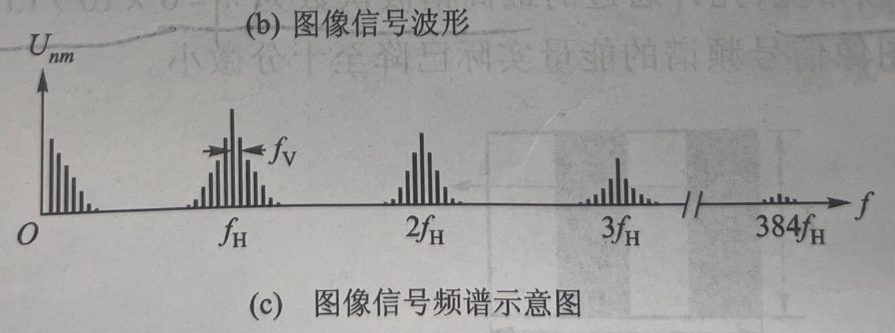

# 闭路电视简史【从模拟到数字】

**闭路电视**（**CCTV**，Closed-Circuit Television）技术自诞生以来，经历了从模拟到数字的深刻变革，当代的闭路电视已经发展为基于智能硬件和人工智能算法的安防监控高级阶段，借助云计算和端侧芯片算力增长，图像采集、分析、显示技术均得到长足进步。模拟时代的 CCTV 系统主要基于 NTSC 和 PAL 等标准，采用 CRT 显示技术和模拟信号传输方式，如 CVBS、S-Video 和分量视频。随着数字技术的兴起，CCTV  系统逐渐向数字化转型，引入了数字视频端口（DVP）和多种数字视频接口标准，如 BT601、BT656。同时，高清模拟技术（如  AHD 和 HD-SDI）以及串行总线多媒体接口（如 DVI、HDMI 和 MIPI）也在 CCTV  领域得到了广泛应用。随后从车规和航空航天领域发展出的超高速数字传输技术（如 LVDS、CameraLink 和 GMSL）进一步推动了 CCTV  系统的性能提升。本文将详细介绍这些技术的发展历程及其在 CCTV 系统中的应用，同时对视频信号处理进行简要探讨。

首先我们要给出闭路电视的定义——**闭路电视是一种专用于特定区域的视频监控系统**，其主要特点在于：视频信号只在固定回路内传输，非公开播出，因此需要保障一定的安全性；系统一般由**影像采集**、**控制分析**、**可靠传输**、**显示存储**四个部分组成。现代社会中，安防监控、交通监控、公共安全等领域均能见到闭路电视的身影。

## 模拟时代的闭路电视

模拟视频技术已经应用几十年了，现在仍在使用。最初且最常见的视频标准包括 **NTSC**（正交平衡调幅制）和 **PAL**（逐行倒相正交平衡调幅制）等。其他现代消费类电子模拟视频传输系统则包括 S-Video、分量视频（Component  Video）等。

数字视频传输也已经出现了若干年，其形式主要表现为串行数字视频（SDI）。但由于成本问题，早期的数字视频传输主要局限于专业广播系统。随着PC、智能手机和家庭影院的普及，DVI 和 HDMI 标准被广泛使用，但低成本的数字传输方案往往受限于传输距离而无法在工业场景中应用；而具有较高可靠性和较远传输距离的数字传输方案均有更高的成本（需要使用复杂的编码和高速编解码器电路）。

因此，传统的模拟视频传输系统还将长期存在于工业环境。 

### CRT

在早期黑白电视时期，因CRT设备处理速度及频带宽的限制，图像采集及传输都是采用交错式方式处理的，也有了**隔行扫描**的概念。

一个动态影像是由一连串的连续的静态影像组成的。其中每一个静态影像称为一**帧**（frame）。动态影像每秒包含的静态影像的数量称为**帧速率**（FPS，Frame per Second）

早期的电视将每一帧图像分割成两部分：奇数行和偶数行，然后把二者分开显示，分成两个**场**（Field），所有的奇数行组合成奇场（Odd），所有的偶数行组合成偶场（Even），CRT显示器轮流扫描完所有的奇数行后再扫描所有的偶数行。人眼存在视觉暂留效应，因此看起来也是一幅完整的画面。

### 彩色时代

随着显示设备的性能进步，彩色电视时代，工程师转向了**逐行扫描**：将每一帧从左到右，从上到下，逐一显示。同时，视频的色彩得到扩展：视频中的色彩信息**线性三原色**（红、绿、蓝）组成。但由于 CRT 显示器技术的局限性，这些基本色彩要使用**伽马校正色**这种非线性形式进行处理。

伽马（Gamma）校正最早可以追溯到1890年的胶片时代。柯达的 Cineon 胶片扫描系统采用 Log 对数函数将胶片物理信息转换为数字信息，转换后的图像拥有更宽广的高光、阴影及色域范围，在普通显示器上呈现低对比度、低饱和度特征。**使用对数函数描述图像是因为人眼对亮度的感知并不遵循线性规律，而是遵循一个近似对数的函数关系**。影视行业中，各个相机厂商会以“画面美感”为核心推出不同风格的Log函数从而让采集到的图像更加符合人眼观感；但在显示领域，工程师追求的是亮度、色调的均衡和标准化，因此采用标准的 Gamma 函数作为图像颜色校正的方式。

CRT显示器的特性是亮度 L 会与电子枪的电压 V 满足
$$
L=k V^{\gamma}+b
$$
关系，其中 γ≈2.5，因此需要一种校正函数来将线性的电压信号反变换回对数亮度，同时模拟人眼对亮度的感知特性。这种矫正函数就被称为**伽马校正**

### 色彩空间

### 分量信号

最重要的信号就是亮度或称之为光亮度。国际照明委员会 (CIE) 规定实际亮度解析度 (Y) 应从线性RGB 得出。由于对 RGB  进行了非线性（伽马校正）处理，因此已经不是实际亮度。这样，我们就用 luma (Y’)  来表示，从技术角度来说该术语也适用于所有消费类电子产品视频系统。 

与此类似，由于采用了非线性的 R’G’B’ 术语，我们还要使用色浓度 (chroma) (C’)  来表示包括饱和与色调等在内的色彩信息，而不是只用色度 (chrominance) (C) 来表示。此外，我们还用 P’B, P’R,  R’ – Y’, 和 B’ – Y’ 来表示色差，以体现非线性伽马校正信号的影响。其他术语还包括 U、V、I 和 Q  等，通常不带上边的一撇，这是因为其反映的是数学方程式的符号，而不用于 CIE  色彩空间。不过，也有人认为这些字母也应当打上一撇，因为它们也代表的是非线性元素。**图 1**所示的简化 RGB 信号流展示了此类视频术语创建的方式，而忽略了同步信息等元素。 

在不同的领域中，对于图像信号在亮度、色度、锐度等方面的侧重点要求不同，由此依据像素点的构成不同将图像数据格式分为 RGB[27,28]和  YUV[29,30]两种大类。RGB（红、绿、蓝）是众类颜色空间最有代表性的一种，利用三个变量表示出每种颜色红、绿、蓝的成分所占比例，在彩色图像的显示记录中，RGB 被广泛应用。RGB 主要面向彩色图像，因为它与黑白图像显示系统的兼容性较差。至此，为了满足黑白图像和彩色图像的兼容性，大多电子电器厂商采用将  RGB 转换成 YUV 颜色空间的方法来维持兼容，再根据需求换回 RGB 格式，以便在显示屏上显示彩色图形。对于 YUV  图像格式，其采用三个分量来表示颜色，“Y”表示亮度Luminance），
  即灰度值；“U”、“V”表示的则是色度（Chrominance），描述影像色彩和饱和度，用于指定像素的颜色。YUV  格式最大的特点在于亮度信号在传输过程中是与色彩信息是分离的，说明即便没有色彩信号时，此图像格式所传输的信息也可以显示完整的图像。这样的形式在很大程度上解决了RGB 无法兼容黑白电视的问题。并且，由于对 YUV 格式在传送信号是否独立上不作要求，故此 YUV 方式在传输信号时所占用带宽极少。

​    YUV 信号的存储格式与传输中所采样的方式密不可分，当前主要的采样方式有三种，YUV4:4:4，YUV4:2:2，YUV4:2:0。

​    1)YUV4:4:4 模式，将每个像素用一个亮度分量、一个红色差分量、一个蓝色差分量共 3 个分量来表示，分量由扫描线上每个连续的点采样所得。

​    2)YUV4:2:2 模式，将每个像素用一个亮度分量、一个红色差分量或一个蓝色差分量共 2 个分量来表示，分量由扫描线上每个连续的点采样所得。

​    3)YUV4:2:0 模式，分别在奇数行扫描线上对每个奇数采样点取一个亮度分量、一个红色差分量、一个蓝色差分量，每个偶数采样点只取一个亮度分量；在偶数行扫描线上，对每个采样点取一个亮度分量即可。

### NTSC和PAL

下面来介绍模拟视频信号如何传输。首先要了解视频信号的频谱结构，下面以灰度视频作为示例。视频信号的频谱指的是将一段由模拟电平表示灰度的视频进行傅里叶变换后得到的幅频特性（信号电压-频率分布）。

一般来说，一帧图像中相邻扫描行的内容是相近的，因此可以近似认为扫描线具有周期性，频谱中一定有按行频率重复的能量分布；而视频中两帧之间也存在相似性，因此我们可以认为视频的频谱会以行频、场频、帧频率为间隔而重复。因此我们可以得到如下图所示梳状的频谱结构示意图。视频信号频谱以行频及其谐波为中心形成一系列波束，每个波束成为一**簇**，一个簇又由大量谱线，这些谱线以场频和帧频为间隔。其中，低频簇具有更高的能量，每一簇中心谱线具有更高的能量。

> 比如一段运动员跑动的视频，上一帧和下一帧中运动员不可能移动太远距离，这是物理约束

可以发现，信号最低频为0，取其上限频率近似为信号带宽。我国规定视频信号的标称带宽为6MHz，上述频谱图384fH处就对应了6MHz频率。

> 特别地，SMPTE（电影与电视工程师协会）的 170M 标准在技术上对 Luma 通道带宽并没有任何限制，只是对 Chroma 或色差信号有所限制

最早的 NTSC 和 PAL 系统采用的单一线路传输系统通常称为复合视频基带信号（CVBS，Composite Video Baseband Signal）。为了满足工业应用的低带宽需要，大多数系统都将信号限制为4.2MHz。在实际应用中，往往会使用一个高频载波对视频基带信号进行调制，从而在长距离同轴电缆或无线电中传输视频。

> 很多时候，视频要和音频同时传输，我国规定声音信号的载波频率要比图像的载波频率高6.5MHz，从而与视频信号带宽错开。携带了音频信号的射频带宽约为8MHz

CVBS 信号的最重要的电压电平 (voltage amplitude) 要求包括 –40 IRE（NTSC 为 –286mV，PAL 为 –300mV）同步信号以及 +100 IRE（NTSC 为 714mV，PAL 为  700mV）视频信号，具体数据在不同标准间有差异，但所示数值都反映了上述信号的一般电压。 

事实上 CVBS 信号在这个 140 IRE 的峰至峰间，具有75%的色彩饱和度。但是，许多人都忘了色彩饱和度可以达到 100%，这会使  CVBS 信号的电压值有可能分别达到 NTSC：286mV + 935mV =1.221Vpp 或 PAL：300mV + 933.5mV =  1.2335Vpp，这超过了任何其他标准视频信号的水平，如果忘了这一点的话，可能就会导致视频信号削波失真。 

CVBS 的最大问题之一在于 Luma 与 Chroma  信号相结合。由于上述信号会占用相同的频谱，因此很难彼此区分却不显露人为处理的痕迹。所以，许多不同视频解码器都采用 2D、3D、3D  自适应等梳状滤波。但即便采用了诸如此类的技术，拆分这两种视频信号时，人为处理的痕迹仍然有可能，或是确实存在。 
  消除上述问题的最好办法就是在一开始就不让 Luma 和 Chroma 信号相结合。S-Video 就是这么做的，且可生成比 CVBS  更好的图像质量。S-Video 的带宽和 CVBS 极为相似，一般低于 6MHz。使用 S-Video 的唯一缺点在于，必须使用两条传输线。 

为了改进 S-Video，我们又推出了分量视频，不再需要调制 Chroma 信号，最终减少了误差。分量模拟视频基本保持相同的 Luma  (Y’) 信息，但色差信息则分开。P’B 代表蓝色差信号，而不是用于数字形式色差的 C’B。与此类似，P’R 代表红色差信号，而 C’R  则表示数字形式的红色差。 

分量 Luma 的 1Vpp 电压电平要求与 CVBS Luma 一样。同步为 –300mV，视频信息为同步电平上的 700mV。色差信号中，如果同步信息位于中点而不像 Luma 那样位于底部，那么就能支持 700mVpp 的信号。 

分量模拟视频 (Y’P’BP’R) 包括几种不同格式，如标清 (SD)、增强清晰度 (ED) 和 高清 (HD) 视频等。SD  视频又包括基于 NTSC 的 480i（即525i）和基于 PAL 的 576i（即 625i）等，其中 i  表示隔行扫描的视频。上述视频系统中，Luma 视频带宽最高为 6.75MHz，而 P’B 和 P’R 信号最高为  3.375MHz。同步信息除了色差信号的中点电平以外与 CVBS 信号一样。 

增强型清晰度 (ED) 视频包括基于 NTSC 480p（即 525p）和基于 PAL 576p（即 625p）。这里的 p 是指*逐行*扫描，因此需要更高的带宽。Luma 信号频率限于 12MHz，而色差信号限于 6MHz。同步电平与 480i 的要求一样，但宽度（2.33us 对 4.7us）和刷新频率较短。 

高清视频 (HD) 包括720p、1080i 和 1080p。Luma 信号 720p 和 1080i 的带宽限于  30MHz，而色差信号限于 15MHz。Luma 信号的1080p 限于 60MHz，而色差信号限于30MHz。SMPTE 标准 274M 和  296M  支持不同的帧速率和采样速率，可改变上述模拟带宽，但大多数系统都采用上述数值。请注意，不同标准的带宽和同步宽度会有差异，也确有差异，而且每个信号都有大量的不同选项（720p 高达 8 种，1080i/1080p 为 11 种）。 

上述 HD 视频信号的电压要求与 480i 和 480p 一样。Luma 通道要求 1Vpp，而色差通道要求为  700mVpp。同步信息的差异在于，HD 信号采用三级同步。不过，最低级电压偏移仍遵从传统的 300mV 单同步脉冲偏移，与 CVBS、480i 和 480p  一样。由于采用三级同步和较快的信号速率，因此 720p 的同步宽度最短需时 0.54us，1080i 则需时  0.59us，1080p 为 0.296us。 

采用计算机的 R’G’B’ 视频信号情况下，像素解析度和刷新率方面又出现了许多新的信号要求，这在很大程度上与视频电子标准协会 (VESA) 制定的标准相关。请注意，在计算机领域，通常采用 RGB 标准，尽管在现实生活中 RGB 也是非线性的伽马校正信号，实际上就是  R’G’B’。消费类电子视频信号和 R’G’B’ 的最大区别在于，所有三个 R’G’B’ 信号都要求相同的信号带宽。 

R’G’B’ 信号的频率要求最高，可超过 148.5MHz (1920 X 1440 @  75Hz)，无疑还会有更高要求。因此，处理功能也要相应提高，以满足信号极大带宽的要求。Y’P’BP’R 等系统的处理要求较低（由于采用  4:2:2 处理技术），这就降低了系统成本。所有三个信号的计时都很重要，否则就会出现色彩偏移。为了生成纯白色，所有三个信号都必须为  100%，而只有一个信号 Luma 作为消费类电子视频信号。一般说来，通过将亮度或 Luma 与色调/饱和相分离，区分 chroma  和色差等信息，就可以简化校准。与 R’G’B’ 不同的是消费类电子视频信号对计时的要求没有那么高。 

计算机 R’G’B’ 的电压要求与 700mVpp 的 Luma  信号很相似，唯一差异在于，同步信息不一定包含在信号中。同步信息可完全分离，本例中需要两个分离的信号——横向和纵向同步线路。有时其又会结合为统一的信号，即 H + V 同步信号。很多情况下，同步信息都包含在绿色信号里，即 R’G’sB’，而有时同步信息则包含在所有三种信号中，即 R’sG’sB’s  或  sR’G’B’。如果同步信息嵌入视频信号，那么电平为 300mVpp，就像传统的 Luma  信号一样。显然，同步时长取决于信号的解析度和刷新率，该同步时长可以为 3.8us (640 X 480 @ 60 Hz)，短的可为 0.74us (1920 X 1200 @  85Hz)，更短的则可为 0.208us，如 1920 X 1200 @ 60Hz 较低的消隐要求。 

最后，在专业和广播系统中，我们采用了 G’B’R’。SMPTE 分量标准要求 Luma  信息位于第一通道中，蓝色差位于第二通道，红色差位于第三通道，这与 Y'P'BP'R 的术语相一致。由于 luma 通道(Y')  包含同步信息，绿色通道 (G') 也包含同步信息，因此比较合理的做法是让 G' 在前。因为蓝色差通道 (P'B) 跟随其后，最后是红色差通道  (P'R)，因此比较合理的做法是将 B' 信号放在第二通道上，将 R' 信号放在第三通道上。这样，就能通过 G'B'R'  改进硬件兼容性，而不是采用 R'G'B'。 

每个 G’B’R’ 信号的视频与同步电平和 Y’ 的以下相对应的各标准要求相同，即 480i/525i、576i/625i、  480p/525p、576p/625p、720p、1080i 和 1080p。请注意，对许多 G'B'R'  系统来说，同步嵌入于所有三个通道，但也并不尽然。对每个 SD、ED 和 HD 标准而言，上述系统的带宽要求基本与此前所述的 Luma  带宽要求相同。就像计算机的 R’G’B’ 信号一样，每个信号的计时对视频信号都非常重要，也关系到显示器的校准。 

**表 1** 列出了视频信号的一些模拟要求。由于每种视频系统存在诸多差异，因此这些数值是我们的基本出发点。对理想的最低转换率数值来说，我们采用通用公式 SR = (2 Pi F 0.707 Vpeak * 2)，这里的 Vpeak 为 1V，假定输出缓冲为最差情况（用的是 0.707），给定  -3dB 频率点上电平为 -3dB 电平乘以 2，以确保安全。在实际系统中，视频信号不必从 0V 变为 1V，很可能是从 0V 变为  700mV（黑到白）。就输入缓冲而言，电平是输出缓冲要求的一半。因此，**表 1** 中的数据只能作为我们参考的起点。 

### CVBS

## 数字化

### DVP

DVP全称Digital Video Port（数字视频端口）是一种用于图像传感器和处理器之间传输视频数据的接口标准，DVP 接口采用并行传输方式，设计上属于低速总线，DVP没有特定的传输协议，它不规定传输协议，它只是一个视频传输接口，一般DVP传输采用的视频编码标准是：BT601/BT656/BT1120，正式名称是 ITU-R BT601/BT656/BT1120。 

值得注意的是DVP可以不使用以上三种`编码标准`，但由于DVP设计上属于是低速总线，它只能传输分辨率较低的视频，这三种编码标准就比较适合传输标准数据。

### BT656

视频由每一帧图片组成，通过扫描方式的不同得到不同的显示效果。由此根据目标需要衍生出众多协议。    

​    BT.656定义了一个并行的硬件接口用来传送一路 4:2:2 的 YUV 的数字视频流方式。BT.656 采用 8、10  位数据线进行传输。传输过程中不需要同步信号，采用内嵌同步码进行时钟同步[33-35]，因此减少了传输线，降低了接口难度，且其传输速率是  BT.601 的 2 倍。BT.656 输入接口包含有一根时钟信号，8 根 YUV 的数据信号，2 根 SVVH、SVHS  垂直水平同步信号。传输过程中先传 Y，后传  UV。一帧图像包含视频有效区，水平消隐区和垂直消隐区。垂直消隐和水平消隐是图像制式中重要的组成部分，是根据电子枪的走势来确定的。电子枪从一帧图像右端移动到左端的那段时间叫做水平消隐，水平消隐是消除电子束作行扫描时的回扫线。在处理完全部的 256 条扫描线后，准备下一次扫描屏幕，这时再次从屏幕右下角移动到左上角，此段时间即为垂直消隐区。BT.656  协议隔行传输一帧图像的结构图见图 2-1。

对于隔行扫描，每一帧一般有顶场（top field）和底场（bottom field）2 场。其中 L3-L4，L9-L10  是有效视频数据部分，L1-L2 顶场垂直辅助数据，L7-L8  底场垂直辅助数据。水平消隐区和垂直消隐区主要传输辅助数据，如音频、文字、数字电视显示所含提示等。一帧图像由多行数据组成，见图 2-2  所示为一行数据的结构图。包含三部分：定时基准信号，辅助信号，视频数据信号。行场同步信号嵌入在数据流中。标准定时基准信号有两个 SAV(Start of ActiveVideo)和 EAV(End of Active  Video)，表示每个视频数据块的开始和每个视频数据块的结束；其中每个定时基准信号都由 4  个字节组成，定时基准信号的具体格式如下（十六进制表示）：FF 00 00 XY  头三个字节是固定前缀，第四个字节包含定义第二场的标识符、场消隐状态和行消隐状态的信息。其中 F 表示标记场信息，传输顶场时为 0，传输底场时为  1。V 表示标记消隐信息，1 代表传输消隐数据，0 代表传输有效视频数据。H 用于表示 EAV 或 SAV，SAV 为0，EAV 为  1。“XY”为控制字，“XY”的 8 个字节含义见下表 2-1。其中 P0-P3 为保护比特，其值取决于 F、H、V，起到校验的作用。对于  10bit 模式，只需要在 8bit模式增加两位为 1  的最高位。通常电视系统的一帧图像是经过解码和奇偶穿插才能显示的。这个过程中，最重要的是根据时基信号 SAV 和 EAV  的变化，过滤消隐数据，将偶数场有效数据和奇数场有效数据提取出来。显示系统只用将捕捉的有效视频进行穿插后放进播放器前端的存储器，方能实现视频显示。

由图 2-2 可知，本行 SAV 和下一行 EAV 之间的数据即有效的视频数据。实际传输过程中就是根据 EAV、SAV  对行、场信息进行检测，筛选出有效视频数据。其中 EAV 和 SAV 的差别只在控制字 XY 数据有别。控制字 XY 与行、场之间存在的关系见表  2-2 和 2-3。在本文实现传输的过程中，BT.656 采用 YCbCr 4:2:2 的传输封包，传输顺序为先传送四个字节的  SAV，然后依序传送 Cb0Y0Cr0Y1，Cb1Y2Cr1Y3......一直到Cb359Y718Cr359Y719，最后在加上四个字节的  EAV，即完成一个画面的传送。

   BT656    主要用于实时视频数据传递。包含三部分 ：   

​       1：视频信号   

​       2：定时基准信号：有两个定时基准信号，一个在每个视频数据块的开始   (Start of ActiveVideo   ，   SAV)， 另一个在每个视频数据块的结束   (End of Active Video   ，   EAV)   ；每个定时基准信号由    4 个字的序列组成， 格式如下：    FF 00 00 XY    （   16    进制）头三个是固定前缀，第    4 个字包含定义第二场标识、场消隐状态 和行消隐状态的信息。   

​       3：辅助信号：辅助数据信号可以以    10    比特形式只在行消隐期间传送，还可以以    8 比特形式只在 场消隐中的行的有效期间传送。  

实际应用中屏幕的Timing示意图如下：

### BT1120

BT1120是高清晰度电视 (HDTV) 演播室信号数字接口

那么下一个问题就是这些数据怎么组织在一起的呢？VESA视频标准中有很多定义，就同一个分辨率它还包括CVT、DMT等类型；BT1120对于这些数据如何区分呢？首先我们站在设计者的角度考虑下，我们怎么区分呢？

举个例子，1920x1080P60格式的时序为例子，BT1120一个时钟传输2个byte，那么传输一幅图像需要多少时钟，一秒钟需要多少个时钟呢？简单的换算下，根据BT1120颜色空间为YUV（YPbPr），Pb、Pr是时分复用模式，那么一个像素就是2个字节；像素的总行数（1125）x像素的总列数（2200）x 每个像素几个字节（2）x 帧率（60）/  BT1120一个时钟传输的字节数（2）=148.5M；VESA中定义的像素时钟也即是148.5M，如图2所示。

我们接着分析怎么设计传输的过程呢，也就是BT1120数据的组织形式？首先我们知道一幅图像分为消隐区、有效数据区；其中消隐区又分什么同步时钟、back porch、front  porch等；其实在BT1120标准中是没有分那么细的，我们从前面的图1也看到了；BT1120就是SAV、EAV后面就是有效数据了，也就是说BT1120标准中水平消隐区就包括了所谓的同步时钟、back porch、front  porch等；而垂直消隐区包括两部分，但是我们从一个连贯的角度看问题的话，它其实也是一部分啊（一副图像的bottom消隐区和下一副图像的top消隐区连接一起的；隔行信号例外，不过原理一样，先理解逐行，再理解隔行的两部分垂直消隐区的意思）。也以1080p60为例，水平的SAV、EAV(即FVH为1、0之间)中间的为1080p的88+44+148个时钟；垂直方向的大家自己计算下看看对不对!

## 迈向高清模拟

### 模拟过滤

为什么模拟视频要使用过滤技术呢？如前所述，将模拟视频信号与数字视频信号相互转换是很常见的。对显示器和 DVD  刻录机等接收机设备来说，这就需要使用模数转换器 (ADC)。对机顶盒和 DVD 播放器来说，这就需要使用数模转换器 (DAC)。ADC 和  DAC 的画质都取决于采样频率。基带对图像也会造成一定的影响，因而会出现画质问题。 

即便 DAC 或 ADC 支持数字过滤，仍然需要转换器以外的模拟过滤技术。不进行过滤，图像就不能在系统中转换。原因很简单，就是因为转换器仍然需要采样，需要图形支持。 

为了满足 SMPTE 过滤技术的要求，整个系统应满足有关标准，不仅局限于滤波器本身。许多 DAC 已经支持数字过滤和隔行滤波器，这可以发挥很大作用。与适当的模拟滤波器相配合，就能满足 SMPTE 要求。 

为了保持较好的图像质量，数据转换器图像必须经过过滤（见**图 2）。**这时我们就要在信号路径上放置模拟滤波器。用滤波器来消除DAC图形（即重构滤波器），这对采用 DAC 的系统而言非常重要。不过，显示器等输入设备也需要滤波器吗？当然需要！ 

由于显示器可连接到几乎任何视频源，而且视频源本身并不支持过滤或者过滤机制不佳，再加上要是有 EMI 干扰问题，我们就需要 ADC 的抗混淆滤波器来减小视觉问题。此外，抗混淆滤波器还有附带的一个好处，就是通过减小带宽来降低信号的噪声底限。 

消除 DAC 和 ADC 图形可提高画质。不过，我们应采用哪种滤波器类型呢？需要多少极性呢？最适合视频信号的截止频率、平坦度和群延迟是什么呢？如果问 10 位工程师这个问题，我们可能会得到 10 个不同的答案。 

如前所述，每个视频信号的截止频率都能相对简单地加以确定。比较好的做法是，尽可能保持带通的平坦度，以及大部分衰减靠近数据转换器采样频率。如果只考虑这个要求的话，我们可以考虑采用椭圆滤波器或契比雪夫滤波器等类型。如果我们只关心电平平坦度和衰减的话，那么这些滤波器会比较理想，使任何系统都能满足 SMPTE 滤波器的特性要求。不过，我们不能忘记群延迟，因为 SMPTE  标准还包括群延迟方面的限制，系统应努力满足上述两种要求，而不是只满足一种要求，不及其余。 

群延迟是指相位变化（弧度/每秒）除以频率变化。群延迟越平坦，相对于频率来说相位变化就越线性化。从时域来说，这对脉冲响应非常重要。我们基本可将模拟视频传输系统看作时间型系统。我们不妨设想一下，视频显示器每个像素从黑变白，再从白变黑，这就是说，对每个像素来说，视频信号电压都应尽快从 0mV 变为 700mV，再变回下个像素的  0mV。如果频带上存在较大群延迟差异，那么就会出现过冲和振铃。椭圆滤波器和契比雪夫滤波器的群延迟差异较大，因此会出现上述振铃响应的问题。在显示器上，这就会显示为重影或毛边，即便衰减不错，但这也是我们不愿看到的情况。 

因此，我们必须在电平平坦度、截止频率、衰减和群延迟差异间取得平衡，以获得合适的视频滤波器，这也正是为什么不同的工程师对同样的问题会有不同的看法。大家一致认为，巴特沃思滤波器对消费类电子视频来说是一种较好的平衡型滤波器，电平响应实现了最大的平坦度，衰减率适当，群延迟也不错。巴特沃思滤波器还说不上是最理想的，但通常对系统而言已经足够好了。 

TI 推出的新型 THS73x3 系列集成滤波器/放大器，采用功能改进型五阶巴特沃思滤波器，此次功能改进主要是略微降低了 Q 或峰值因数，以最小化群延迟差异。其缺点在于，平坦度不像真巴特沃思滤波器那么理想，但衰减性基本相同。 

我们选择了五个极性而不是四个或六个，这是因为奇数阶滤波器有真正的实极点，而不是像偶数阶滤波器那样都提供复极点。有人可能认为实极点没什么关系，不过实际经验证明，实极点对有源滤波器系统会非常有用，特别是在采用 Sallen-Key 架构时尤为有用。Sallen-Key  系统中有高频路径通过，能较方便地通过放大器带宽限制以外的高频。系统中的实极点可将高频信号通过旁路提供给接地，不受放大器带宽限制的影响。因此，这有助于确保滤波器保持高频。 

为了显示群延迟和电平平坦度的影响，我们还可用 TI 网站提供的 Filter Pro 程序来模拟另一种滤波器。我们这里模拟的是一个五极的  0.5dB 契比雪夫滤波器，截止频率（在 –0.5dB 以下时）为10MHz。此外，我们还模拟了五阶功能改进型巴特沃思滤波器，截止频率（以  –3dB以下时）为8.5MHz。我们从**图 3** 中可以看出每个滤波器的电平响应。  与预期的一样，契比雪夫滤波器的纹波为 0.5，不过平坦度为 10MHz，大大超过巴特沃思滤波器的平坦度。此外，在 27MHz  的临界点上，契比雪夫滤波器的衰减率较高，达到了 56dB 的衰减率。在 27MHz 上，巴特沃思滤波器只实现了 46dB  的衰减率。事实上，这对视频系统而言已经足够了。 

使用有源滤波器时，我们要牢记，滤波器的 Q 越高，放大器的带宽就越高。如果使用贝塞尔或巴特沃思滤波器乃至更高阶的版本，我们要把各级的 Q  保持相对较低。设计支持椭圆或契比雪夫响应的滤波器，其 Q  值较高，因此会需要较高带宽的放大器才能适当实施。否则，放大器对滤波器就会造成影响，从而改变我们所需的响应。我们可通过修改组件值来实现上述目标，不过放大器之间的差异会因此变得更大。 

无源滤波器因为其成本较低，所以在目前系统中比较常见。不过，在 PCB  电路板面积、占用、额外组件数量、组装时间过长、带通信号损失、对电感器造成电磁干扰以及容限方面，它又存在一些缺点。电感器和电容通常会存在  +/-10% 个体差异，特别是低成本组件的差异会更大一些。不过，由于不同组件间存在差异，涉及几个极性，因此这种容限会对滤波器响应造成较大影响。 

Monte-Carlo 分析是一种有用的工具，通过它可以了解对无源滤波器的性能影响。通过模拟，我们看到，采用容限在 +/-10% 之间的组件时，截止频率、平坦度、衰减和峰值间会出现较大差异。 

采用有源滤波器可改进无源滤波器的不足。就 THS73x3 器件所采用的 BiCom-3  等半导体工艺而言，元件间的匹配通常非常严格。一般来说，电阻间和电容间的差异不超过1%。要牢记，绝对组件值之间会有较大差异，根据组件的情况和类型，常常会出现 +/-10% 的差异，这会影响滤波器的截止频率和衰减特性等。 

不过，在集成有源滤波器设计中（比如 THS73x3 所采用的单位增益 Sallen-Key  滤波器），平坦度和峰值的差异可以得到严格的控制。我们对单位增益 Sallen-Key  滤波器进行敏感度分析（由于篇幅所限，这里不具体讨论了）可以看出，只要电阻间和电容间与单位增益的匹配比较严格，那么只有截止频率会有所差异，Q  不会出现差异。如果 Q  出现差异，那么就会导致较大的群延迟差异，这是我们所不愿看到的。只要采用高质量电容和电阻，在假定放大器的自然带宽大大高于滤波器的截止频率情况下，有源滤波器的可控特性就必将大大优于无源滤波器。此外，有源滤波器占用的 PCB 电路板面积也要小很多，只需采购一个组件，这样就大大减少了组件数量。 

多极无源滤波器还有一个重要特点，就是其截止频率不能轻易地被修改，若想修改就要花费大量工作，成本也很高。设计支持可选滤波器的有源滤波器就非常容易实施。对于不必改变滤波器频率的 CVBS 和 S-Video 系统来说，这一特性并不怎么吸引人，不过，对分量视频系统或 G’B’R’  系统来说，改变滤波器的频率就非常有用了，这样就能设置为 SD、ED 或 HD (720p/1080i) 乃至 1080p HD 等不同标准。 

上述情况对接受 Y’P’BP’R 或 G’B’R’ 分量视频信号的接收机系统来说尤为重要。举例来说，如果我们用固定的 35MHz  无源滤波器为显示器提供所有分量信号，那么在输入端采用 480i 或 576i SD 分量信号怎么办呢？一般的 DAC 对这种信号的采样频率为  27MHz。如果 DAC 不带重构滤波器的话，那么 27MHz 基本频率两侧出现的图像将直接通过显示器的无源 35MHz  滤波器，造成图像未经衰减，因此显示器上显示的画质通常非常差。 

ED 480p/576p 信号也可能出现这种情况。此类信号通常采样频率为 54MHz，视频带宽为 12MHz。因此，第二 Nyquist  区图像会在 42MHz 时出现。如果无源滤波器为 35MHz 或更高，那么图像的衰减也会很小，同样也会导致画质非常差。 

这就说明了可选滤波器对使用 THS7303 的 DAC 侧和使用 THS7353 的 ADC  侧的重要性。这种集成的滤波器/放大器采用可选的五阶功能改进型巴特沃思滤波器，可设为 9MHz，满足 SD 信号的需要，也可设为 16MHz，满足 ED 信号需要，还可针对 HD 720p/1080i 信号设为 35MHz，针对 1080p 等极快的信号设为大于 150MHz 的旁路模式。**图 7** 显示了有关情况。 

为了提高灵活性，THS73x3 的每个通道必须能实现独立控制。利用这一特性，我们就能选择 35MHz 以支持 Luma 通道，又可选择  16MHz  以支持色差通道，根据模拟信号带宽要求，这都是可行的。不过这也有一个缺点，就是不同滤波器的延迟在相同频率比例下会有差异，如果不通过数字处理加以解决的话，就可能导致计时问题。 

就高端系统而言（其相位偏移和群延迟为非常重要的参数），也能受益于上述特性。这时，我们可用 16MHz 滤波器支持 SD 信号，确保整个  SD 频带内都能实现平稳的平坦响应，时域脉冲响应几乎不会出现过冲。这对支持 ED 信号的 35MH 滤波器以及支持HD信号的旁路模式同样适用。 

最后，无源过滤在不同频率上会造成较大阻抗差异，这会导致 DAC 和 ADC 的交互问题。此外，如果源电阻或端接电阻超出了 75W  的要求，也会导致振铃问题。THS73x3 有源滤波器/放大器缓解了这一问题，其输入阻抗可大于 1MW，而其输出阻抗在 10MHz 时则小于  1W，从而有助于消除 ADC 的反冲问题或解码器输入钳位问题。 

大多数视频系统都采用单电源数据转换器，供电电压为  3.3V。如果该电源可用于视频滤波器/放大器，那么系统使用会比较简单，也有助于减少一到两个电源数量，从而降低成本。THS73x3  部件利用这一特点，采用 2.7V 到 5V 的单电源工作。BiCom-3  工艺根据设计，可以工作在上述电压上，在整个工作范围内都不会产生性能下降的问题。事实上，差动增益和相位等某些规范甚至在较低电源电压情况下也会有所改进。 

功耗是另一个要考虑的因素。类似于 THS73x3 产品的 5V 单电源部件有很多，但大多功耗都达到 500mW 以上，有的甚至高达  1.2W，这就会导致芯片温度非常高，很容易影响长期可靠性。THS73x3 的工作电压为 3.3V，功耗仅为  55mW，这几乎消除了散热和可靠性方面的问题。 

为了节电，每个通道都必须能单独关闭。如果将所有通道都关闭的话，那么电流消耗将低于 1uA。总而言之，在对功耗非常敏感的系统（如便携式或 USB 供电系统）中，都可以采用我们提供的部件。 

如果在电压最低为 2.7V 的单电源上工作，那么我们往往会担心视频信号会不会发生剪切问题，因此，适当的 DC 偏置在设计中非常重要。视频系统和设计类型多种多样，因此 THS73x3 必须具备足够的灵活性，以提供适当的偏移功能。 

如果系统设计中已经采用了 THS7303 或 THS7313 6dB 增益放大器，并采用了参考接地的 DAC  或编码器驱动，那么DC输入模式会很理想。问题在于，DAC 生成的电压有多低？如果同步信号（通常这是视频信号中电压最低的）电压低于 50mV，那么 6dB 放大器的输出就应生成低于 100mV 的电压，由于 CMOS  和双极放大器都存在晶体管饱和方面的限制，因此这对任何放大器来说都是很难做到的。 

为了消除这一限制，所有 THS73x3 产品都支持 DC + Shift 模式，其可以为视频输入信号增加内部 DC 电压偏移。这种偏移只是内置的，不会影响应用信号，这种偏移还将确保即便 THS73x3 的输入为 0V，输出也不会饱和，不会出现视频剪切。 

如果 DAC 输出电压仅为 100mV，那么 DC 输入模式就是非常理想的。这种模式不会给系统增加偏移，因为系统根本不需要偏移。要牢记，任何放大器都存在偏移，对 THS73x3 也一样，偏移电压通常很小，但不同部件之间会存在差异。 

如果 DAC 的参考电压为 3.3V 或 1.8V 或者是外部输入，那么采用 AC 耦合就是最佳模式。AC 耦合使 THS73x3 能忽略 DC 偏置点的来源，并能重新建立自己的 DC 偏置点。AC 耦合选项包括 AC 偏置和 AC 同步端钳位。 

AC 偏置非常简单。THS73x3 有两个电阻，其可在电源和接地间创建分压器。该模式的输入阻抗为  20kW，因此所用的电容应足够大，以尽可能减小倾斜或下垂问题。该模式最适用于 Chroma 或色差信号，也可用于 Luma 信号、G’B’R’  信号或计算机的 R’G’B’ 信号。由于信号为 AC 耦合，且 DC 偏置点与平均信号电平有差异，因此对于带 5V  电源同步信息的信号而言，我们最好用 AC 偏置模式，以确保没有剪切问题发生。 

正在申请专利的 AC 同步端钳位 (STC) 模式（图**9**）最适合视频信号最低点同步的信号，这就是说，Luma (Y’)、带同步功能的 G’B’R’ 或带同步信号的计算机 R’G’B’ 最好都采用 AC-STC 模式。 THS73x3  中的同步端钳位系统具有内部电流汇集 (current-sink)  功能以将耦合电容放电，用滤波器来最小化可能存在的高频干扰信号交互，用放大器来监控输入电压和参考电压的差别，并在信号低于参考电压时用晶体管为电容充电。因此，这是一种动态的系统，根本不依靠计时技术。这种类型的系统通常也称作 DC 恢复系统，而不是二极管钳位系统。二极管钳位系统的问题在于：任何高频信号或过冲都会对其造成影响，从而导致过大 DC  偏置点偏移，并造成信号剪切。 

THS73x3 系列非常灵活，使用户能对 AC-STC 功能进行一定的调节，包括将 STC 滤波器调节为500kHz、2.5MHz 和 5MHz 等。由于横向同步宽度与应用信号标准有差异，因此这一功能比较重要（见**表 1**）。如果 720p Luma 信号采用 500kHz 的滤波器，那么 STC 电路根本不起作用，系统也会出问题。不过，如果信号噪声较大，振铃问题明显，那么就最好采用 500kHz 滤波器，以尽可能减小 THS73x3 内部的 DC 偏置偏移。 

AC-STC 支持放电电流的选择。如果 THS73x3 输入端的电压降至低于参考电压，那么系统充电电流可高达  2mA，以提高电压。如果电压大大超过参考电压，那么情况会如何呢？放电电流将降低电容器上的电压，降速 I/C = dV/dT。该电流可在  2uA、6uA 和 8uA 之间选择。如果放电电流较高，那么系统就能快速捕获信号或提高交流声抑制 (hum  rejection)（50 或  60Hz  的线路信号耦合到系统中时会产生交流声）。其他系统会需要极低的放电速度，以改善线路倾斜或下垂，也就是视频信号在整个线路上保持为常量时的情况。由于  AC 耦合和放电电流的缘故，DC 信号会向下倾斜，如果线路上的倾斜小于  1IRE，通常是可以接受的。这种可选性使系统能连接到几乎任何外部电源上，无需手动改变输入电容器。 

**图 8** 还显示出 2:1 的输入 MUX 特性，以及完全独立于其他通道的用户可配置的输入耦合功能。这些特性使得 THS73x3 能应用于多种不同的系统之中。 

线路驱动器放大器的最常见输出配置就是采用 AC 耦合，以消除任何可能的 DC 偏置电流，使系统更具有通用性。放大器输出通常采用 220uF 到 1000uF 的电容，以降低线路倾斜。 

在某些系统中，DC 偏置电流不是主要问题。相反，成本和 PCB 电路板的尺寸反而更加重要。THS73x3 支持 DC 耦合，不会因为轨至轨输出放大器级而造成问题。输出摆幅在电源和接地的 100mV 范围之内，可驱动高达 80mA 的电流。 

其他系统可能需要 AC 耦合，但 PCB 电路板的尺寸非常重要。THS7303 和 THS7313 具有灵活性可支持 SAG  校正，这是实现上述目标的一种办法。SAG 校正需要两个电容，但电容的体积要较小，额定值仅为 47uF 和 33uF，其可能实现与 330uF  电容相同的倾斜性能。如果分别将其提高到 68uF 和 47uF 的话，那么将能实现相当于 470uF 电容的性能。 

SAG 功能能在频率降低时提高增益，从而实现上述性能。放大器增益抵消了 47uF 电容的下降，从而扩大了可实现的带通。选择 33uF 电容时，可获得较小的峰值或 Q 增强，这会使视频系统实现适当的线路倾斜或低垂，特别是能够支持场方波信号。 

**图 10**  显示了 SAG 在 THS7303 和 THS7313 中的基本配置情况。其他厂商也使用了 SAG 校正技术，但其通常要求较大的电容或电压更高的电源，这样才能满足系统出现较大 DC 增益的要求。 

SAG的工作方式比较容易了解。在 DC 处，由于 878W 反馈电阻串联增加了 675W 电阻，因此增益就会提高。如果在高频率时输出电容和 SAG 反馈电容短路，那么 675W 电阻会与 150W 电阻并联，这样系统增益就为 6dB。如果 DC 增益增强，且电容比例适当，那么  SAG 功能可以模拟更大电容的工作。 

THS7353 输出的配置不同于 THS7303 和 THS7313。THS7353 的额定增益为 0dB，也就是单位增益。这是因为  THS7353 在设计时就是完全作为输入系统设计的，比方说针对显示器或 DVD 刻录机的输入系统。输入前端通常为视频解码器或视频 ADC/换算器 (scaler)。因此，有关转换器可允许的输入范围通常小于 1.3Vpp，从而对单位增益提出要求。此外，ADC 的负载与 150  欧姆的线路大为不同。ADC 前端通常阻抗很高，一般大于 10kW，而且电容为 5 到 10pF，因此，THS7353  为这种负载进行了优化，其补偿机制与视频线路驱动的要求大不相同。 

此外，THS7353 还能通过外部配置增益调节，这使用户能根据自己的需要配置增益。有时用户只需简单的 0.5dB 到 1dB  的平坦增益，有时则需要抵消 DAC 中可能存在的 SinX/X 特性，还有些系统通过长线缆连接，会产生集肤效应损耗，需要采取补偿机制，如**图 13** 所示。 

举例来说，如果我们在 SAG 和接地间放置一个 726W 的外部电阻，就会得到 4V/V 的系统增益，即 12dB。该特性的缺点在于，DC  输出电平也会增加，因此必须注意确保不会产生剪切问题。此外，输出放大器是一款电压反馈放大器 (VFB)，其具有增益带宽 (GBW)  乘积限制。尽管这不会严重影响滤波器的特性，但仍会影响 THS7303 滤波器旁路带宽，不利于增益。例如，如果增益为 4V/V，那么旁路模式的  THS7303 带宽就约为 90MHz。THS7353 也具有 GBW 限制，有着默认的单位增益。如果增益提高，超过 2 或  3V/V，那么就会严重降低带宽。此外，THS7303 的补偿机制完全设计用来驱动视频线路，因此最适合 DAC 缓冲。 

### AHD

### HD-SDI

## 串行总线多媒体

### DVI

### HDMI

### MIPI

## 超高速数字传输

### LVDS

### CameraLink

### GMSL与FPD-Link