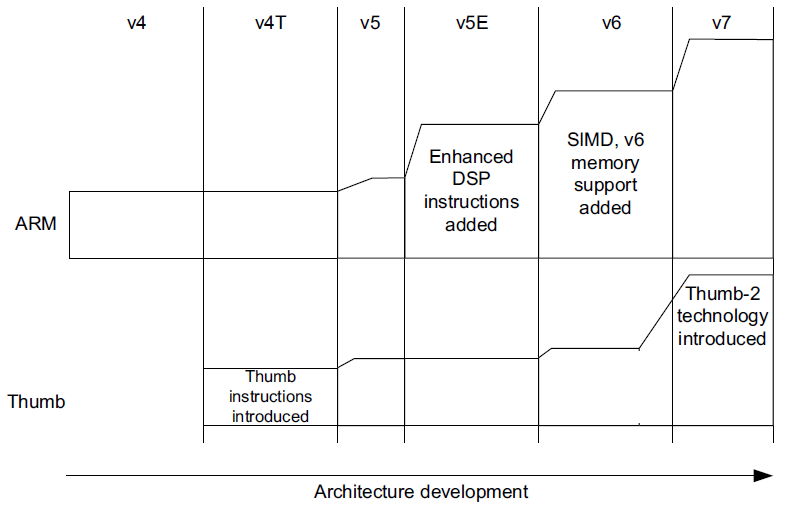

参考资料：https://zh.wikipedia.org/wiki/ARM%E6%9E%B6%E6%A7%8B

# ARM内核学习1【背景知识】

**ARM**，即Advanced RISC Machines，先进的精简指令集架构处理器，它起源于英国剑桥大学。

## ARM的发展历史

1979年，刚从剑桥大学毕业的博士*赫尔曼豪泽*与朋友*克里斯克里*共同成立Acorn电脑公司，实际上这是一次公司重组。1978年，Acorn Computer Ltd的前身CPU公司（Cambridge Processing Unit）在剑桥成立，主营业务为电脑制造。这时候，Acorn首席技术员*苏菲威尔逊*刚刚从剑桥大学数学系本科毕业。

从1978到1985年间，Acorn还只是电脑制造商，用着别家的CPU制造计算机。1983年，为了解决市场上缺乏高性能、低成本芯片的问题，Acorn开始自己设计处理器芯片，而在两年后，*苏菲威尔逊*和传奇工程师*史蒂夫福巴尔*创造了ARM（Advanced RISC Machines）指令集，并以此指令集设计了ARM处理器。

> 根据记载，IBM在1983年推出2B的第二代微型机后，Acorn也想要挤入商业微型机市场——但原用于公司BBC微电脑上的6502处理器难以满足性能要求。威尔逊和福巴尔找遍市场上的所有芯片，相中了Intel的80286芯片，但当他们向英特尔提出合作时，被Intel断然拒绝
>
> 无巧不成书，加州大学伯克利分校的《伯克利精简指令集计划白皮书》刚刚发布，于是二人受此启发，开始开始为新一代的BBC微电脑开发基于RISC的32位微处理器芯片

1985年4月，英国VLSI Technology公司代工生产了ARM1。同年，Intel推出了80386处理器，性能全方位碾压ARM1，恰巧使得后续ARM向低成本、低功耗进发。

1986年，Acorn成立了Advanced RISC Machines Ltd子公司，该公司致力于开发和推广ARM架构处理器。这就是为众人熟知的ARM。同年，Acorn推出了ARM2处理器，仍由Acorn设计、VLSI制造，并于次年应用到Acorn推出PC产品Acorn Archimedes中，在英国市场大获成功

1989年，ARM3处理器诞生，应用到了Acorn Archimedes的后续产品中。但此时Acorn因为经营失误出现大幅亏损，不得不将自己的近一半股权低价转让给意大利Olivetti公司

1990年，Acorn为了ARM更好发展，同时为了减少公司的财务压力，将子公司ARM独立出来，并接受了苹果和VLSI的投资，ARM正式成为一家独立的合资公司。而ARM决定采用一种新的商业模式——不生产芯片，而是以IP授权的方式将芯片设计方案卖给其他公司，收取一次性技术授权费和版税提成。

1992年，在跳过了ARM4和ARM5的情况下，ARM公司发布了ARM6内核，采用了ARMv3指令集架构，大众熟知的ARM历史从此开始。

1993年，ARM与TI、三星、夏普等企业合作，以IP授权的形式推广了他们的CPU IP，诺基亚6110成为第一部采用ARM处理器的GSM手机，由于该型号风靡全球，ARM业务开始腾飞，并于1998年同时在伦敦证交所和纳斯达克上市。这几年后，ARM又连续推出了ARM7、ARM8、ARM9、ARM10、ARM11架构。

### ARM指令集架构从v1到v9

ARMv1：1985年发布，最初版架构

ARMv2：1986年发布，增加32位地址总线和指令集扩展

ARMv3：1992年发布，支持虚拟内存，增加了指令集扩展，支持协处理器

> ARMv3架构是早期ARM指令集和现代ARM指令集的分水岭
>
> 自从ARMv4架构开始，ARM指令集才变成现在大家看到的样子

ARMv4：1994年发布，增加了JVM指令集扩展（能够硬件运行Java字节码）和Thumb指令集（支持16位指令，提高了代码密度）

ARMv5：1997年发布，增加了支持嵌入式Java的指令集扩展（Jazelle-RCT），增加支持浮点运算的指令集扩展（VFP）

ARMv6：2002年发布，增加了Thumb-2指令集，同时也增加了SIMD指令扩展

ARMv7：2004年发布，增加基于TrustZone的安全扩展、NEON指令集扩展，支持了虚拟化技术，支持向量浮点运算（VFPv3）等

ARMv8：2011年发布，增加AArch64架构，支持64位处理器，同时保留AArch32架构

ARMv9：2021年发布，将TrustZone更新为Confidential Compute Architecture（CCA）技术，提高安全性和隔离性，同时引入了AI加速（机器学习ML）、专用加速电路的相关指令

## Thumb的历史

2004年，ARM意识到除了像ARM9这样的高端处理器市场，还有更广阔的低成本、低功耗微控制器市场，着手发布Cortex-M3内核，并且修改产品线名称。ARM放弃了之前ARM6、ARM7这种命名方式，将后续内核分类为高性能（Application）的**Cortex-A**、面向高可靠性实时应用（Realtime）的**Cortex-R**，针对实时控制（Microcontroller）的**Cortex-M**

2007年，第一款iPhone发布，搭载三星生产的S5L8900主控，本芯片基于ARM11内核。此后，苹果公司各产品均使用了ARM指令集架构或者ARM内核，ARM则借此彻底搭上了全球移动应用发展的顺风车

2008年，谷歌推出安卓操作系统，而其Linux内核对ARM指令集做了优化，使得ARM进一步巩固移动市场的领导地位

此后ARM面临多起收购请求，都没有卖出

### Thumb的起源

按照目前ARM官网的说明，ARMv1、v2、v3指令集已经弃置了，而ARMv4也是2000年左右就已经成型的，而Thumb就起源于这个时期。

1994年，ARM正乘移动通信的东风，股价步步高升，同时也看到了移动通信领域低功耗、低成本CPU的蓝海。早期的ARM处理器使用32位指令集，称为**ARM指令**。32位指令集的运行性能较高，有更大的存储空间映射，但也带来了较大功耗，指令空间占用也比较大。

低成本CPU的一个重要需求就是高密度指令——低成本CPU需要更小片上面积，也就意味着片上ROM的空间更少。对指令集而言，指令长度减少才能让指令密度增加，从而适应更低成本的CPU。

因此随着1995年到来，16位**Thumb-1**指令集得到了应用，这是ARM指令集的子集，通过降低性能来换得更短的代码长度。

Thumb-1指令集的官方称呼是**ARMv4T**指令子集；后续还有与ARMv6指令集同步推出的Thumb-2（ARMv6T）指令集。自从Thumb被加进ARM指令集后，就再也没有离开过，成为了ARM指令集的一部分

> ARM通过CPU控制寄存器中的T位（T-bit）来控制是否允许Thumb指令，当T位置1时CPU就会按照Thumb指令来解析下一条指令；与此同理，ARM支持的J指令集也是通过设置控制寄存器中的第24位实现的，当该位（也被称为J-bit）置1时，ARM可以提供硬件译码执行Java字节码的功能

随着越来越多厂商反馈，ARM发现很多嵌入式应用下，CPU都会运行在Thumb模式下不会退出，因此在2005年，ARM推出了叱咤嵌入式领域20年（至今）的Cortex-M3 CPU，它只支持Thumb代码。

Cortex-M3基于ARMv7-M架构，这也是ARMv7-M架构首次出现。ARM将自己的CPU分成三个产品线A、R和M，对应的指令集也分成三个不同的**Profile**，分别冠以-A、-R、-M的后缀。比如ARMv7-A、ARMv7-R和ARMv7-M

2007年，ARM推出了更低性能、低功耗的Cortex-M1，采用ARMv6-M指令集；随后2009年基于ARMv6-M的M0、基于ARMv7-M的M4，2012年基于ARMv6-M的M0+，2014年基于ARMv7-M的M7逐年推进，逐渐形成了一套覆盖低、中、高性能和功耗的嵌入式处理器产品线

后续随着ARMv8指令集的推出，ARM也定义了ARMv8-M指令集，并推出了基于该指令集的Cortex-M23、M33、M55处理器

> 2021年，ARM推出了ARMv9架构，并定义了ARMv9-A Profile，但目前并没有定义其对应的-M指令集

### Profile

ARM架构从ARMv7开始，主要分成三种配置（Profile）：

* -A：使用AXI总线，支持VMSA（MMU）、TrustZone（内核安全），提供多核互联机制
* -R：使用AXI总线，支持PMSA（MPU）、TCM（弱化版Cache），提供多核互联机制
* -M：使用AHB（AHB-Lite）总线或APB总线，支持NVIC，只能运行Thumb指令，部分内核会允许使用嵌入式PMSA（弱化版的MPU）和TCM（简单Cache），官方实现不支持多核互联

其中A和R是比较相近的，而M则与二者差别大一些

### 处理器命名法

ARM使用多种处理器命名机制，导致其早期和现在处理器的命名区别。在20世纪90年代，ARM使用字母**特性后缀**：使用T后缀表示支持Thumb指令，D表示支持调试，I表示嵌入式ICE模块，M表示快速乘法器

> 这就导致处理器名称是“ARM7TDMI”这样

后来很多特性已经成为ARM处理器的标准特性，因此ARM使用数字编号和字母混合的特性后缀：具有Cache和MMU的处理器以26或36为后缀，具有MPU的处理器后缀为46，可综合特性用S表示，Jazelle技术用J后缀表示。这样的命名方法被用在ARMv4T到ARMv6T2之间的处理器上

> 比如ARMv6指令集处理器ARM1136J(F)-S表示具有MMU、DSP，支持Jazelle的处理器

在ARMv7以后，不再使用这些复杂的编号机制，同一系列处理器使用一致的命名，使用Cortex作为整体品牌名称

