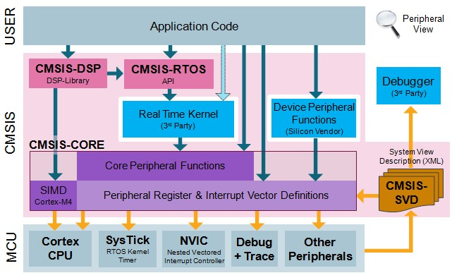
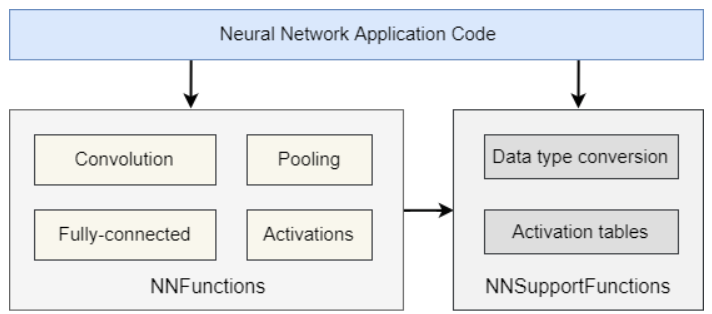

# CMSIS

**CMSIS**是ARM制定的一套**Cortex微控制器软件接口标准**（Cortex Microcontroller Software Interface Standard），ARM和MCU厂商为了统一搭载Cortex-M系列内核的MCU的软件开发API，推出了这样一套标准，于是不同厂商生产的Cortex-M芯片就能在**底层CPU控制API和外设控制API**上达到兼容。

这套标准包括函数命名、芯片初始化流程、启动文件等面向底层硬件寄存器的API规定

说人话就是厂商只要加入了CMSIS联盟，他家的芯片就需要根据这个标准推出整套标准外设库。比如ST家的STM32，它的标准库就是根据CMSIS标准编写的，而HAL库建立在LL库的基础上，LL库也是根据CMSIS标准编写的

> 可以在GitHub上获得CMSIS的最新标准[CMSIS Version 5.8.0](https://github.com/ARM-software/CMSIS_5)
>
> 详细资料也可以在[官网](https://arm-software.github.io/CMSIS_5/General/html/index.html)或者GitHub页面找到

目前，CMSIS标准包括了以下实现：

* CMSIS-Core(M)

  所有Cortex-M内核MCU的外设库标准API

* CMSIS-Core(A)

  部分Cortex-A（A5、A7、A9）的SoC外设库标准API和**系统运行时库**标准API

* CMSIS-Driver

  所有Cortex器件通用驱动中间层，支持文件系统、图形界面等

  

  提供了常见[以太网MAC/PHY驱动程序和Flash驱动程序](https://github.com/arm-software/CMSIS-Driver)

* CMSIS-DSP（Digital Signal Process）

  兼容SIMD的32位DSP协处理器标准API

* CMSIS-NN（Neutral Net）

  能在Cortex-M设备上运行的神经网络库（暂不支持Cortex-A系列）

  

* CMSIS-RTOSv1

  基于RTX实时操作系统的Cortex-M处理器RTOS库

  还提供了一个基于FreeRTOS的[CMSIS-FreeRTOS移植](https://github.com/arm-software/CMSIS-FreeRTOS)

* CMSIS-RTOSv2

  支持Armv8-M指令集、动态对象创建、多核处理器系统、应用二进制接口ABI的CMSIS-RTOSv1升级版

* CMSIS-Pack

  ARM Cortex-M器件和部分A器件的芯片支持包、板级支持包（也就是Keil里面要安装的那些支持包）标准，可以理解成CMSIS标准面向某厂商器件的具体实现

  提供了[面向开源IDE Eclipse的CMSIS-Pack实现](https://github.com/ARM-software/cmsis-pack-eclipse)与[验证工具](https://github.com/ARM-software/CMSIS-Driver_Validation)

  还有一套[基于NXP-PLC微控制器设备的实现](https://github.com/ARM-software/NXP_LPC)

* CMSIS-Build

  开发ARM Cortex-M器件和部分A器件的工具链标准

  

* CMSIS-SVD（System View Description）

  以基于格式化的XML提供了CMSIS标准设备的外设信息和其他设备参数，相当于为IDE、辅助开发工具等提供的芯片datasheet，定义了所有外设寄存器、数据值和说明信息，辅助开发工具可以直接根据CMSIS-SVD生成芯片外设寄存器的头文件定义 

* CMSIS-DAP（Debug Access Port）

  一套针对CMSIS器件的调试器软件和硬件实现

  

  目前应用最广泛的是[DAP-Link](https://github.com/ARMmbed/DAPLink)，提供基于STM32和NXP设备的软硬件实现

* CMSIS-Zone

  包括一套基于硬件分区管理思想的开发流程和一套开发工具的标准，将Cortex-M设备中不同的系统资源根据是否有MPU、MMU等硬件管理器分成不同的区域，并使用专用工具进行管理

  

## CMSIS-Core整体架构

一个不完整的CMSIS家族框架图如下所示



中间的**CMSIS-Core**标准是最关键的，它向下直接控制内核和外设寄存器硬件，向上提供RTOS或裸机应用程序的API

总体上可以分成三个功能层：

* **内核外设访问层**：由ARM提供的Cortex-M/A控制寄存器地址和控制函数
* **中间件访问层**：ARM规定，生产商负责实现的用于中间件（HAL库）进行硬件访问的通用API
* **外设访问层**：生产商自行定义的硬件外设寄存器地址和控制函数

> 举例来讲，STM32F4里面路径`CMSIS\Device\ST\STM32F4xx`下，可以找到Include和Source两个目录，里面就是CMSIS的头文件和启动代码
>
> * core_cm4.h
>
>   这个文件是ARM公司编写的，同一个内核可以共享，包括了内核结构体寄存器定义、内核寄存器的内存映射、位定义，所有关于内核的定义都是在这个文件中完成的
>
> * misc.h和misc.c
>
>   内核应用函数库文件，包含了NVIC、SCB、ITM、MPU、CoreDebug等内核硬件的功能库函数，但是芯片厂商在设计MCU的时候一般会对其进行裁剪，通过更改宏定义来实现需要的功能。其中NVIC则每一个单片机中都会有，因为这是ARM指令集的规定，不过一般都会被裁剪为标准版本的子集；SysTick系统定时器相关的函数也在该文件中定义。这两个文件与上面的core_cm4.h在Cortex-M4内核的MCU中都是可以移植的
>
> * stm32f4xx.h和stm32f407xx.h（这是具体的芯片型号）
>
>   stm32f407xx.h根据不同的芯片定义了其中所有外设的寄存器地址和封装好的内存操作，使用哪个型号的stm32就要包含对应的头文件，之后stm32f4xx.h会根据芯片型号*宏*选择对应的头文件
>
> * system_stm32f4xx.c
>
>   启动文件，在这里进行堆栈初始化、定义中断向量表、定义并export中断服务函数名等。在执行完主要部分后会直接调用SystemInit函数进行系统初始化，并引导进入main函数
>
>   SystemInit函数对系统时钟进行初始化并设置中断向量表偏移量，最后会把SP指向main函数，常见的汇编实现如下
>   
>   ```assembly
>   ;Reset handler
>   ;这里是系统复位服务函数，任何复位信号都会触发该中断并强制执行它调用的函数
>   Reset_Handler PROC
>   EXPORT Reset_Handler [WEAK]
>   ;这里把SystemInit挂到了复位函数里面
>   IMPORT __main
>   ;IMPORT SystemInit
>   ;LDR R0, =SystemInit
>   BLX R0
>   LDR R0, =__main
>   BX R0
>   ENDP
>   ```
>   
>   而在system_stm32f4xx.c中的SystemInit函数比它更复杂一些，除了会把SP移到main函数入口，还会进行各种系统初始化
>
> 于是在移植过程中主要添加Include目录的包含，添加system_stm32f4xx.c、startup_stm32f407xx.c到工程目录，并修改全局宏`STM32F407xx`即可完成对芯片底层和启动流程的配置，无需再手动编写bootloader甚至根据datasheet配置寄存器偏移量

## CMSIS-RTOS整体架构

CMSIS-RTOS是ARM为了降低嵌入式门槛、统一操作系统而发布的操作系统标准软件接口。这个标准将操作系统屏蔽起来，为使用者提供一个统一的API。ARM官方的实现是基于RTX的，不过目前FreeRTOS也支持了这个标准，一些其他的操作系统（比如ThreadX、uCOS等）还没有做完适配。目前分成了两个子版本v1和v2，v1版本主要提供给Cortex-M0、3、4、7这几个嵌入式核，v2版本还提供了Cortex-A5、7、9的移植

> FreeRTOS的CMSIS实现如下，和基于RTX的CMSIS-RTOS一样遵循Apache2.0协议
>
> `https://github.com/ARM-software/CMSIS-FreeRTOS`
>
> CMSIS-RTOS的官方文档如下，可以在Github主目录找到链接
>
> `https://arm-software.github.io/CMSIS_5/General/html/index.html`


上图就是CMSIS-RTOS的架构图，它将RTOS的API分成**线程管理**、**中断服务程序**、**线程事件**这三个主要类型。

* 线程管理（Thread）：定义、创建和控制线程的API

* 中断服务程序（ISR）：用于处理中断这个特殊上下文的API

* 线程事件：用于多线程/ISR之间通信或同步的API，包含**信号**、**消息**和**邮件**

    * 信号Signal：用于向线程指示特定条件的标志，可以在线程或ISR中修改
    * 消息Message：一个32位的值（一般被用于存指针），可以被发送到一个线程或ISR。多个消息会以队列（FIFO）的形式缓存，并且建立一个描述符来管理消息队列
    * 邮件Mail：一个固定大小的内存块，可以被发送到线程或ISR，使用队列作为缓存，提供内存分配功能

    信号量和互斥量都被归为线程事件

CMSIS-RTOS提供超时参数，当指定了超时后，系统会等待，直到有资源可用或有事件发生。和大多数其他操作系统不同，**这个等待过程是非阻塞的**，在等待的过程中，其他线程会被调度器安排执行。

CMSIS-RTOS的实现很像Linux，但是实时性更高，并且为协作式操作系统考虑了对应接口。这里以延时函数为例：`osDelay()`函数将一个线程放入等待状态，等待一段指定的时间。`osWait()`函数等待分配给一个线程的事件，连同`osThreadYield()`函数一起提供了*协作性*而不是抢占式的线程切换，这两个API会根据底层的RTOS不同而具有不同实现，一般来说抢占式RTOS比较难实现这两个API，不过CMSIS还是提供了这两个标准用来兼容协作式RTOS

CMSIS-RTOS还支持多CPU系统（包括AMP和SMP）以及通过内存保护单元MPU进行访问保护。在一些RTOS实现中，线程可能在不同的处理器上执行，因此邮件和消息队列可能位于共享内存资源中。

CMSIS-RTOS还基于现有用宏来定义和访问内核对象的流行方式提供了一些可选功能，包括：

* MPU支持和多CPU系统支持
* 固定时间间隔延迟功能
* 无拷贝的邮件队列
* DMA控制器支持
* 基于顺序的上下文切换和轮询式上下文切换功能
* 避免优先级反转等情况引起的死锁（也就是提供互斥量支持）
* 通过使用Cortex-M3/M4指令LDREX和STREX实现零中断延时

## CMSIS-NN整体架构

CMSIS-NN是ST为了优化Cortex-M处理器内神经网络推理性能和规划同一API而推出的一套**神经网络内核库**（neural network kernels）。这个库分成了很多函数，每个函数都能涵盖神经网络层次结构中的某个特定类别，包括：

* 基本数学函数
* 卷积函数
* 激活函数
* 全连接层函数
* SVDF层函数
* 池化函数
* Softmax函数

这个库提供了基于8位整数（q7_t）和16位整数（q15_t）权重的神经网络推理功能

CMSIS-NN针对Cortex-M处理器的不同算力和计算设备，每个函数通常有三种不同的实现，能够满足（下面三种硬件情况通过后面黑体部分的宏来区分）：

* 没有SIMD功能的处理器（缺少并行处理能力的传统CPU）
* 具有DSP扩展的处理器（ARM_MATH_DSP，硬件自带数字信号处理协处理器）
* 具有MVE扩展的处理器（ARM_MATH_MVEI，硬件支持Cortex-M的向量运算扩展指令集）：可以与ARM_MATH_AUTOVECTORIZE一起使用，以内联汇编方式进行自动矢量运算

这三类处理器的计算加速，还为大端序设备（ARM_MATH_BIG_ENDIAN）和

CMSIS-NN支持**具有INT8对称量化的TensorFlow Lite框架函数**和**ARM内部INT8对称量化的传统函数**的推理。传统函数可以通过其后缀`_q7`或`_q15`来识别；支持TensorFlow Lite框架的函数以`_s8`为后缀，可以从*TFL micro*调用

框架结构如下：



神经网络代码会被分成两类——神经网络推理本身需要的算法（**NNFunctions**）和用于处理（包括预先量化和推理前加载）网络权重的支持（**NNSupportFunctions**）

还支持通过ARM_NN_TRUNCATE宏来启动浮点推理，从而提高网络精度
