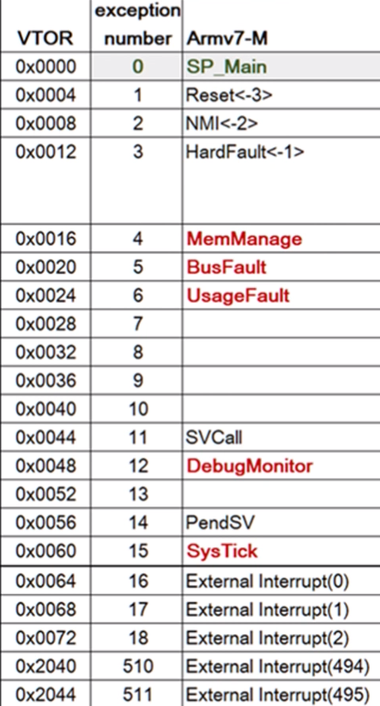
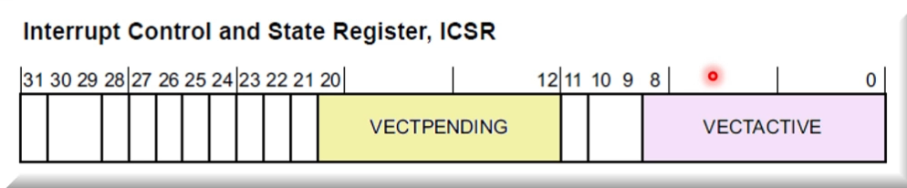
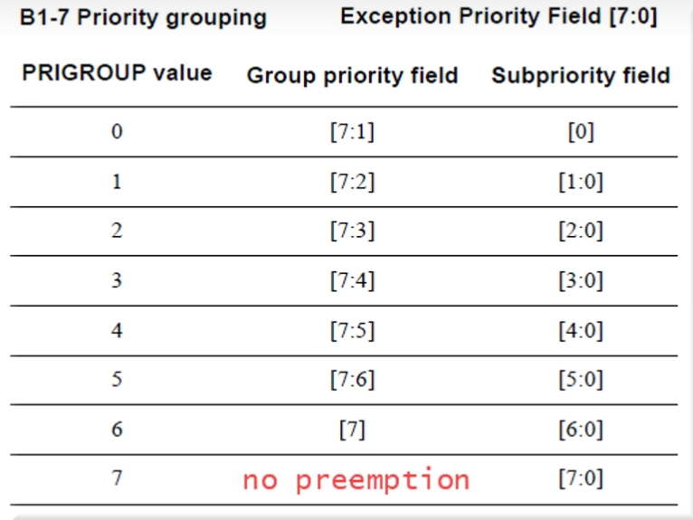

# Cortex-M0解读3【异常处理】

在前面内容里都有意忽略了异常处理部分，本篇将这个重要的模块单独分析。

## NVIC

Cortex-M处理器的中断交由**嵌套向量中断控制器**（Nested Vectored Interrupt Controller，**NVIC**）管理，NVIC的控制寄存器位于系统控制空间SCS内。这个内核外设提供了如下方便的特性

* **统一中断**

    一般来说，处理器内部发生的异常被称为同步异常，一般包括复位、不可屏蔽中断、硬件错误、总线错误等；而处理器外部（SoC外设通过中断线传给NVIC）的异常被称为异步异常，也就是一般意义上的中断。**NVIC将同步异常和异步异常统一为中断**（Interrupt）进行处理，简化了硬件设计

    下文不对异常、中断进行区分。若未加注释，读者可认为二者相同。

* **灵活的中断管理**

    每个外部中断都是可使能/禁止的，并且每个中断都有一个单独的中断请求标志位，可以由软件设置或清除**中断请求标志**。

    NVIC可以识别**异常信号电平**或**异常请求脉冲**，前者由一个锁存器保存到NVIC，在中断请求标志位被清除前会一直保持；后者则是一个长短不一但最小不短于1个时钟周期的脉冲信号。

    NVIC能够适应任何片上外设，只要他们发出的信号满足上面两个情况之一

* **嵌套中断**

    如果处理器正在处理一个中断，而新的中断产生后，NVIC会比较它与当前执行中断的优先级，若新中断优先级较高，那么当前执行的中断会被暂停，处理器转去处理新的高优先级异常，这被称为**抢占**（Preemption）

    更高优先级异常完成后，会恢复原有异常处理环境的上下文，并继续执行低优先级的ISR

    如果两个相同优先级的异常发生，那么NVIC会直接为它们安排“**衔尾中断**”：先发生的异常先执行，当这个异常完成后，无需恢复原有前台程序的上下文，而是直接载入另一个异常的上下文，处理完另一个异常后再恢复到前台程序的运行环境（线程模式），这样就*节约了恢复现场的开销*

* **向量异常入口**

    *NVIC会从存储器的向量表里面自动确定异常处理程序的入口*，从而降低异常产生到异常执行器件的延迟

    > 这个特性是ARM7TMDI等应用处理器所不具备的，目的是为了提高处理器的实时性

* **中断屏蔽**

    NVIC可以根据PRIMASK寄存器来屏蔽全局外部中断，也可以使用控制寄存器内的屏蔽位对单个中断进行控制。ARMv7-M处理器还具有其他控制位，不过这就不是CM0能实现的了

### 中断向量表

众所周知，Cortex-M系列的中断向量表（Interrupt Vector Table）保存了每个异常对应的中断服务函数（ISR）的地址。下图给出了ARMv7-M指令集规定的异常列表



其中红字部分是ARMv6-M没有规定但ARMv7-M引入的中断类型。虽然Cortex-M0处理器采用ARMv6-M指令集，但Cortex-M0的中断遵守ARMv7-M的规则，官方的默认安排如下图所示


需要注意几个关键点：

* ARMv6-M指令集允许最大中断向量表的大小为**2048字节**，因此向量表中最多包含**496**个外部中断（由于0x0位置始终为MSP初值，因此NVIC最大支持2048/4-1=**511**个中断，但预设了**15**个中断的位置，因此留给厂商使用的外部中断数量为511-15=**496**），

* Cortex-M0支持处理器模式（Handler Mode）和线程模式（Thread Mode）。当中断发生后，处理器会陷入（trap）线程模式；当完成中断服务函数回到主应用程序，内核会切换到处理器模式。

* 指令集架构规定向量表的第一个值（0x0地址）不是任何中断向量地址，而应当是MSP的初始值（SP_Main）

* 从第2个值到第16个值是**指令集架构规定**的中断服务函数地址，顺序一定要正确

* 从中断号16开始，ARM允许芯片厂商接入外设中断。为了方便用户使用，ARM提供的CMSIS-Core软件库中给出了终端号的枚举类型，下面以STM32为例

    ```c
    typedef enum
    {
    /* Cortex-M4 Processor Exceptions Numbers */
    NonMaskableInt_IRQn         = -14,    /*!< 2 Non Maskable Interrupt*/
    MemoryManagement_IRQn       = -12,    /*!< 4 Cortex-M4 Memory Management Interrupt*/
    BusFault_IRQn               = -11,    /*!< 5 Cortex-M4 Bus Fault Interrupt*/
    UsageFault_IRQn             = -10,    /*!< 6 Cortex-M4 Usage Fault Interrupt*/
    SVCall_IRQn                 = -5,     /*!< 11 Cortex-M4 SV Call Interrupt*/
    DebugMonitor_IRQn           = -4,     /*!< 12 Cortex-M4 Debug Monitor Interrupt*/
    PendSV_IRQn                 = -2,     /*!< 14 Cortex-M4 Pend SV Interrupt*/
    SysTick_IRQn                = -1,     /*!< 15 Cortex-M4 System Tick Interrupt*/
    /* STM32 specific Interrupt Numbers */
    WWDG_IRQn                   = 0,      /*!< Window WatchDog Interrupt*/
    ...
    };
    ```

    可以发现，芯片厂商的中断号从0开始，而那些ISA规定的中断向量都被设置为负数

* 用户可以通过SCS中的向量表偏置寄存器来重新分配向量表的位置，但0x0处必须有最小的向量表入口——只有向量表被加载完毕，处理器内核才算正常启动。ARM也提供了BootLoader模板，用户可以在其基础上用汇编或者C定义自己的BootLoader，从而实现中断向量表的加载

### NVIC寄存器

正在执行的中断的中断号会被保存在ICSR（Interrupt Control and State Register）的[9:0]位，被暂时挂起的中断会被保存在ICSR[21:12]位





## 异常处理流水线

Cortex-M系列各个处理器的异常处理流水线基本相同，CM0也是一样。

### 异常处理流程

下面是CM0处理器及NVIC设备接收到中断后的异常处理流程

1. 中断线触发，NVIC根据中断优先级遍历中断向量表得到对应得中断服务函数地址
2. 停止执行当前程序流，更改当前处理器运行模式为线程模式
3. 执行硬件入栈，保护现场
4. 执行异常服务程序
5. 执行硬件出栈，恢复现场
6. 恢复为处理器模式，继续执行主应用程序

上述流程可以


在NVIC中，任何中断都被分成了四种状态：

* **Inactive**：中断未激活。在中断信号到达前所处状态
* **Pending**：中断处于等待。当中断信号到达后，若中断服务函数被抢占，则将处于该状态
* **Active**：中断已激活。处于此状态的中断将被按照优先级进行处理
* **Active&Pending**：中断激活同时处于等待。


### 中断抢占

NVIC支持基于优先级和优先级分组机制的中断**抢占（Preemption）**


### 硬件出入栈

CM0的异常过程与函数调用相似，都需要执行保护现场（入栈）和恢复现场（出栈）的过程。但特别地，异常处理中的出入栈交由硬件实现。

处理器在进入中断前，会自动将下列**8个**寄存器入栈：**R0、R1、R2、R3、R12、xPSR、R15（PC）、R14（LR）**；同样，在从中断退出前，会自动将上述寄存器出栈。其中对于PC寄存器，处理器并不会直接将其复制到栈上，而是计算出从中断返回后要执行指令的地址，再将其保存到栈上。这样处理PC是为了中断处理结束后能够直接返回原来的位置继续执行。对于LR寄存器，处理器在硬件处理的过程中会将其配置为特殊的值，如下表所示

| LR寄存器值 | 返回后的处理器模式 | 返回后所使用的SP |
| ---------- | ------------------ | ---------------- |
| 0xFFFFFFF1 | 处理器模式         | MSP              |
| 0xFFFFFFF9 | 线程模式           | MSP              |
| 0xFFFFFFFD | 线程模式           | PSP              |

通过上面三个值，处理器能够在中断和主应用程序之间跳转而无需软件更改处理器模式

> 硬件出入栈能够很好地加快中断处理的速度，上述寄存器的硬件入栈只需要**12个CPU时钟周期**

在入栈的过程中，寄存器在栈上的排列如下表（压栈顺序从R0到Reserve）

| 地址 | 寄存器  |
| ---- | ------- |
| 0x1C | xPSR    |
| 0x18 | R15(PC) |
| 0x14 | R14(LR) |
| 0x10 | R12     |
| 0x0C | R3      |
| 0x08 | R2      |
| 0x04 | R1      |
| 0x00 | R0      |

需要注意：**异常处理中的出入栈流程只会在存在抢占的情况下发生**。例如，当处理器从主应用程序进入中断服务函数A时将发生入栈（保护现场）；若中断A执行过程中，具有更高优先级的中断B到达，则将发生入栈，保存中断服务函数A的上下文；当中断服务函数B执行完成后，硬件自动执行出栈，并恢复中断服务函数A的执行；当中断服务函数A执行完毕，硬件再次执行出栈（恢复现场），回到主应用程序继续执行。

### 特殊执行情况

在异常处理的过程中，还存在两种特殊的执行情况。

举例来说：若中断A执行过程中，与A具有相同优先级的中断B到达，则在中断A执行完毕后，硬件不会重新入栈，中断B将会跳过保存现场的过程得到执行，当中断服务函数B完成后，恢复现场将被执行。这个过程就叫做衔尾中断

**衔尾中断（Tail-chaining）**：低优先级处于pending状态的中断，无需重复入栈操作，即可衔接前一个中断服务程序来执行


**延迟中断（Late-arrival）**：高优先级的中断，只要能在低优先级异常转换为active状态之前到达，就可以不需要额外的执行抢占和保护现场过程，而是等待低优先级异常完成保护现场后直接得到执行。

利用延迟中断机制，可以让高优先级中断获得更高的实时性，并减少栈的使用

在延迟中断生效后，低优先级异常的执行将以衔尾中断的形式处理。


### 临界区保护

支持硬件优先级，寄存器宽度为8（0-255级的优先级配置）。NVIC通过提供优先级分组（Priority Grouping）来支持相同优先级ISR的临界区保护，这样就不需要使用锁机制





主应用程序可以通过PRIMASK、FAULTMASK、BASEPRI等寄存器来实现执行**权限动态提升**（**Priority Boosting**）


