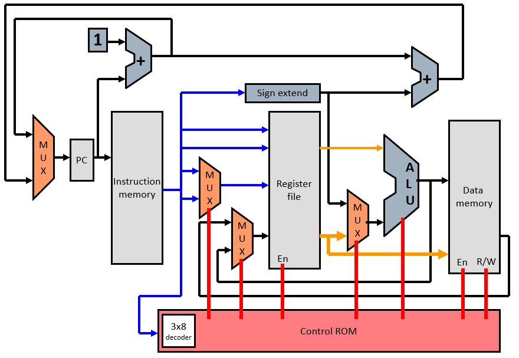
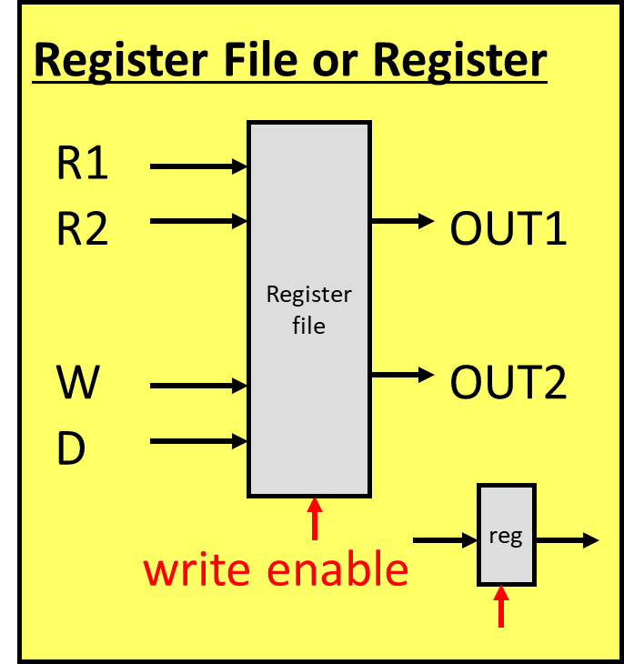
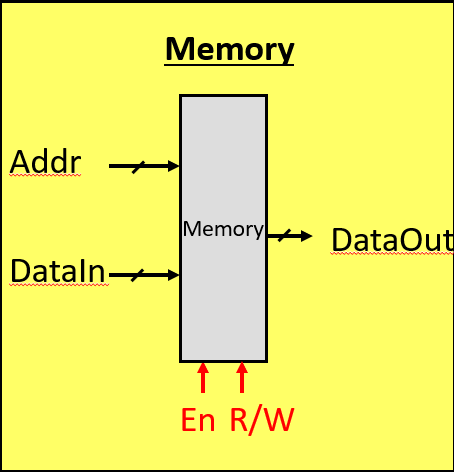

本博文参考胡伟武《计算机体系结构基础》、P-H《计算机组成与设计-硬件/软件接口（RISC-V版）》和Bryant《深入理解计算机系统》写作。笔者系初学，如有错误敬请指正。

# 计算机体系结构笔记2【单周期处理器】

一个CPU需要做的任务就是从内存中取出指令，根据ISA规定进行翻译，得到关键的操作数，送入ALU（算术逻辑单元）中进行计算，将得到数据写回寄存器组，最后由专门的访存指令将结果写回内存。根据指令集不同，这个流程可能会被微调。

> CPU和遥控车是很相似的：遥控车接收摇杆数据，对数据解析后得到车轮的转速，把结果以车轮电机PWM的形式输出；CPU则接收内存中的数据，译码后得到操作数，把结果以访存指令的形式输出

能实现这个功能的最简单CPU，就是用一个时序逻辑完成从内存取出指令的任务，用一个有限状态机来适应各种指令下数据通路的变化，其他所有任务均使用组合逻辑实现，这样的CPU被称为**单周期处理器**（Single-Cycle Processor），其中状态机的状态单元就是**寄存器组**（Regfile）

一个单周期CPU的示意图如下所示



## 单周期处理器的数据通路

单周期处理器的主干是上图中连接各个灰色框的MUX、ALU和走线，即数据通路（Data Path），由红色线表示的指令通路进行整体控制

### 寄存器组

寄存器组（Regfile）是CPU的双手，所有从指令中解析得到的基础数据都被暂存到这里，计算得到的中间结果也会保存到这里。寄存器组的格式是ISA指定的，并且一般与CPU的架构有关（32位CPU一般有16或32个主寄存器，64位CPU会有更多寄存器）



如上图所示，一个寄存器本质上就是一个具有写使能位的触发器（FF），CPU要用的的寄存器组就是由这些寄存器组合出来的。除了写使能位，还加入了写数据和读数据标志位，它们置1的时候就能够进行写入或读取数据操作。在简化的电路中，可以只保留写数据标志位，读数据则是由时钟自行驱动

### 取指

取指部分的任务就是不断地从内存中取出指令，并将其加载到译码部分。我们可以用下面这条代码来简单描述

```c
PC = PC + 4;
```

PC即**程序计数器**（Program Counter，PC），它永远指向下一条代指令的地址。因为一条指令是32位，所以要+4（4Byte即32bit）

### 译码

被输入的指令会按照ISA所规定的方式拆分成不同的几个部分，主要包括

* 识别码：对于每个指令都不一样的二进制代码，用来区分不同的指令
* 操作数：分为源操作数和目标操作数，一般是某个寄存器，也可能是某个内存地址
* 立即数：在指令中掺杂的二进制数，按照ISA规定的格式进行扩展后使用，也可能直接被当作操作数使用

### ALU

**算术逻辑单元**（Algorithm Logic Unit）是负责CPU数据处理的核心，基本的加减、移位和逻辑运算都要在这里完成。一些CPU还会加入FPU来处理浮点数据，加入乘加器来处理乘法，加入硬件除法器来加速除法计算等

### 写回

在数据完成运算后会被直接送回内存，也可能被传回寄存器组，这会通过一个多路选择器完成

如下图所示，内存可以用一个带读写标志位和使能位的寄存器组表示，但内存内部数据不需要每个时钟周期都进行刷新，因此不能引入时钟。我们在写Verilog时往往使用一个reg类型的数组来表示内存。

此外，因为内存（这里指片上CPU紧耦合内存，实际上对应现代CPU中的Cache）一般使用SRAM构建，而且与CPU核心的距离较远存在连线延迟，因此内存的速度是慢于寄存器的。



## 单周期处理器的控制通路

上面提到的数据通路会被一个控制逻辑所操作，这个控制逻辑经常以查找表的形式写入ROM中，只要满足了一些条件，就会触发控制逻辑改变MUX的值，从而起到控制数据通路的作用

由于单周期CPU不需要考虑优化方面的问题，它的运行是由指令驱动的，因此控制逻辑可以根据指令集的要求来分别实现。假设要建立一个RV32I指令集的单周期CPU，我们只需要实现RISC-V的I指令子集里面所有指令的译码，再根据每条指令的功能构建寄存器读写信号，就可以基本完成处理器框架了。详细实现可以参考后面的实际代码

## 单周期处理器的问题

单周期处理器可以完成任务，但它仅仅*能*完成。效率过于低下（CPI=1）且设计中每条指令必须等长，同时处理器中的最长路径成为关键路径（Critical Path），决定着处理器的时钟周期

在目前来说，单周期处理器常常被用作教学，尤其是演示处理器中的关键数据通路

> 事实上有一部分用于芯片内部控制的复杂状态机就是按照单周期处理器实现的。TI、ADI的某些老式数模混合芯片中就使用了这样介于状态机和CPU之间的实现来增加整体可靠性

## 单周期处理器的实例

下面是笔者以中科大Verilog OJ给出RV32I单周期CPU框架补齐的一套单周期处理器实例中的关键代码，供读者参考。处理器的Regfile、取指、译码、执行、写回部分均已给出，内存部分代码较简单，例化一个单口RAM实现。

### Regfile寄存器组

```verilog
module reg_file(
           input clk,
           input [4: 0] A1, A2, A3,
           input [31: 0] WD,
           input WE,
           output [31: 0] RD1, RD2
       );

reg [31: 0] reg_file[0: 31];
//初始化寄存器堆
integer i;
initial begin
    for (i = 0;i < 32;i = i + 1)
        reg_file[i] = 0;
end

//写入寄存器
always@(posedge clk) begin
    if (WE) begin
        if (A3 != 5'b0) begin
            reg_file[A3] <= WD;
        end
        else begin
            reg_file[A3] <= reg_file[A3];
        end
    end
end

//读取寄存器
assign RD1 = (A1 == 5'b0) ? 32'b0 : reg_file[A1];
assign RD2 = reg_file[A2];

endmodule
```

### Fetch&Decode取指和译码

```verilog
module reg_pc(
           input clk,
           input rst,
           input JUMP,
           input [31: 0] JUMP_PC,
           output reg [31: 0] pc
           );

wire [31: 0] pc_plus4;
assign pc_plus4 = pc + 32'h4; //regular

//计算PC
always@(posedge clk or posedge rst) begin //jump
    if(rst) begin
        pc <= 32'h0;
    end
    else begin
        if(JUMP) begin
            pc <= JUMP_PC;
        end
        else begin
            pc <= pc_plus4;
        end
    end
end
endmodule


`define OPC_AUIPC   7'b0010111
`define OPC_LUI     7'b0110111
`define OPC_B       7'b1100011
`define OPC_JAL     7'b1101111
`define OPC_JALR    7'b1001111
`define OPC_I_MEM   7'b0000011
`define OPC_S       7'b0100011
`define OPC_I_LOGIC 7'b0010011


module decode(
           input [31: 0] inst,
           output reg	[31: 0] out
       );

wire	[6: 0] opcode;
assign	opcode = inst[6: 0];

//立即数扩展
always@( * ) begin
    case (opcode)
        `OPC_AUIPC: begin
            out = {inst[31:12], 12'b0};
        end
        `OPC_LUI: begin
            out = {inst[31:12], 12'b0};
        end
        `OPC_B: begin
            out = {{20{inst[31]}}, inst[7], inst[30:25], inst[11:8], 1'b0};
        end
        `OPC_JAL: begin
            out = {{12{inst[31]}}, inst[19:12], inst[20], inst[30:21], 1'b0};
        end
        `OPC_JALR: begin
            out = {{20{inst[31]}}, inst[31:20]};
        end
        `OPC_I_MEM: begin
            out = {{20{inst[31]}}, inst[31:20]};
        end
        `OPC_S: begin
            out = {{20{inst[31]}}, inst[31:25], inst[11:7]};
        end
        `OPC_I_LOGIC: begin
            out = {{20{inst[31]}}, inst[31:20]};
        end  
        default: begin
            out = 32'h0;
        end
    endcase
end

endmodule
```

### ALU算术逻辑单元

```verilog
`define ALU_ADD                 4'b0000
`define ALU_SUB                 4'b1000
`define ALU_LOGIC_SHIFT_LEFT    4'b0001
`define ALU_LOGIC_SHIFT_RIGHT   4'b0101
`define ALU_ARITH_SHIFT_RIGHT   4'b1101
`define ALU_SIGNED_LE           4'b0010
`define ALU_UNSIGNED_LE         4'b0011
`define ALU_XOR                 4'b0100
`define ALU_OR                  4'b0110
`define ALU_AND                 4'b0111

`define ALU_NOP_1               4'b1001
`define ALU_NOP_2               4'b1010
`define ALU_NOP_3               4'b1011
`define ALU_NOP_4               4'b1100
`define ALU_NOP_5               4'b1111
`define ALU_NOP_B               4'b1110


module alu(
           input [31: 0] SrcA, SrcB,
           input [3: 0] func,
           output reg [31: 0] ALUout
       );

wire signed [31: 0] signed_a;
wire signed [31: 0] signed_b;

assign signed_a = SrcA;
assign signed_b = SrcB;

always@( * ) begin
    case (func)
        `ALU_ADD: begin
            ALUout = signed_a + signed_b;
        end
        `ALU_SUB: begin
            ALUout = signed_a - signed_b;
        end
        `ALU_LOGIC_SHIFT_LEFT: begin
            ALUout = signed_a << signed_b[4:0];
        end
        `ALU_LOGIC_SHIFT_RIGHT: begin
            ALUout = signed_a >> signed_b[4:0];
        end
        `ALU_ARITH_SHIFT_RIGHT: begin
            ALUout = signed_a >>> signed_b[4:0];
        end
        `ALU_SIGNED_LE: begin
            ALUout = (signed_a < signed_b)? 32'b1 : 32'b0;
        end
        `ALU_UNSIGNED_LE: begin
            ALUout = (SrcA < SrcB)? 32'b1 : 32'b0;
        end
        `ALU_XOR: begin
            ALUout = signed_a ^ signed_b;
        end
        `ALU_OR: begin
            ALUout = signed_a | signed_b;
        end
        `ALU_AND: begin
            ALUout = signed_a & signed_b;
        end
        `ALU_NOP_1, `ALU_NOP_2, `ALU_NOP_3, `ALU_NOP_4, `ALU_NOP_5: begin
            ALUout = 32'h0;
        end
        `ALU_NOP_B: begin
            ALUout = SrcB;
        end
        default: begin
            ALUout = 32'h0;
        end
    endcase
end
endmodule
```

### TopFrame顶层封装

```verilog
module rv_top(
           input wire clk,
           input wire rst
       );
wire [31: 0] inst;

wire [1: 0] rf_wr_sel;
reg [31: 0] rf_wd;
wire rf_wr_en;
wire [31: 0] rf_rd1, rf_rd2;

wire [31: 0] pc;
wire [31: 0] pc_plus4;
wire do_jump;
wire JUMP;

wire [31: 0] imm_out;

wire [2: 0] comp_ctrl;
wire	BrE;

wire alu_a_sel;
wire alu_b_sel;
wire [31: 0] alu_a, alu_b, alu_out;
wire [3: 0] alu_ctrl;

wire [2: 0] dm_rd_ctrl;
wire [1: 0] dm_wr_ctrl;
wire [31: 0] dm_dout;

always@( * ) begin
    case (rf_wr_sel)
        2'b00:
            rf_wd = 32'h0;
        2'b01:
            rf_wd = pc_plus4;
        2'b10:
            rf_wd = alu_out;
        2'b11:
            rf_wd = dm_dout;
        default:
            rf_wd = 32'h0;
    endcase
end
assign	pc_plus4 = pc + 32'h4;
assign	JUMP = BrE || do_jump;
assign alu_a = alu_a_sel ? rf_rd1 : pc ;
assign alu_b = alu_b_sel ? imm_out : rf_rd2 ;

reg_file reg_file0(
             .clk (clk),
             .A1 (inst[19: 15]),
             .A2 (inst[24: 20]),
             .A3 (inst[11: 7]),
             .WD (rf_wd),
             .WE (rf_wr_en),
             .RD1 (rf_rd1),
             .RD2 (rf_rd2)
         );
reg_pc	reg_pc0(
           .clk (clk),
           .rst	(rst),
           .JUMP	(JUMP),
           .JUMP_PC (alu_out),
           .pc (pc)
       );
decode decode0(
           .inst	(inst),
           .out (imm_out)
       );
jump jump0(
         .REG1	(rf_rd1),
         .REG2	(rf_rd2),
         .Type	(comp_ctrl),
         .BrE	(BrE)
     );
alu alu0(
        .SrcA (alu_a),
        .SrcB (alu_b),
        .func (alu_ctrl),
        .ALUout (alu_out)
    );
memory memory0(
           .clk (clk),
           .im_addr (pc),
           .im_dout (inst),
           .dm_rd_ctrl (dm_rd_ctrl),
           .dm_wr_ctrl (dm_wr_ctrl),
           .dm_addr (inst),
           .dm_din (rf_wd),
           .dm_dout (dm_dout)
       );
ctrl ctrl0(
         .inst (inst),
         .rf_wr_en (rf_wr_en),
         .rf_wr_sel (rf_wr_sel),
         .do_jump (do_jump),
         .BrType	(comp_ctrl),
         .alu_a_sel (alu_a_sel),
         .alu_b_sel (alu_b_sel),
         .alu_ctrl (alu_ctrl),
         .dm_rd_ctrl (dm_rd_ctrl),
         .dm_wr_ctrl (dm_wr_ctrl)
     );

endmodule
```

### Ctrl控制逻辑

```verilog
module ctrl(
           input [31: 0] inst,
           output rf_wr_en,
           output reg [1: 0] rf_wr_sel,
           output do_jump,
           output reg [2: 0] BrType,
           output alu_a_sel,
           output alu_b_sel,
           output reg [3: 0] alu_ctrl,
           output reg [2: 0] dm_rd_ctrl,
           output reg [1: 0] dm_wr_ctrl
       );
wire [6: 0] opcode;
wire [2: 0] funct3;
wire [6: 0] funct7;

wire is_lui;
wire is_auipc;
wire is_jal;
wire is_jalr;
wire is_beq;
wire is_bne;
wire is_blt;
wire is_bge;
wire is_bltu;
wire is_bgeu;
wire is_lb;
wire is_lh;
wire is_lw;
wire is_lbu;
wire is_lhu;
wire is_sb;
wire is_sh;
wire is_sw;
wire is_addi;
wire is_slti;
wire is_sltiu;
wire is_xori;
wire is_ori;
wire is_andi;
wire is_slli;
wire is_srli;
wire is_srai;
wire is_add;
wire is_sub;
wire is_sll;
wire is_slt;
wire is_sltu;
wire is_xor;
wire is_srl;
wire is_sra;
wire is_or;
wire is_and;

wire is_add_type;
wire is_u_type;
wire is_jump_type;
wire is_b_type;
wire is_r_type;
wire is_i_type;
wire is_s_type;

assign opcode = inst[6: 0];
assign funct7 = inst[31: 25];
assign funct3 = inst[14: 12];

assign is_lui = (opcode == 7'h37) ;
assign is_auipc = (opcode == 7'h17) ;
assign is_jal = (opcode == 7'h6F) ;
assign is_jalr = (opcode == 7'h67) && (funct3 == 3'h0) ;
assign is_beq = (opcode == 7'h63) && (funct3 == 3'h0) ;
assign is_bne = (opcode == 7'h63) && (funct3 == 3'h1) ;
assign is_blt = (opcode == 7'h63) && (funct3 == 3'h4) ;
assign is_bge = (opcode == 7'h63) && (funct3 == 3'h5) ;
assign is_bltu = (opcode == 7'h63) && (funct3 == 3'h6) ;
assign is_bgeu = (opcode == 7'h63) && (funct3 == 3'h7) ;
assign is_lb = (opcode == 7'h03) && (funct3 == 3'h0) ;
assign is_lh = (opcode == 7'h03) && (funct3 == 3'h1) ;
assign is_lw = (opcode == 7'h03) && (funct3 == 3'h2) ;
assign is_lbu = (opcode == 7'h03) && (funct3 == 3'h4) ;
assign is_lhu = (opcode == 7'h03) && (funct3 == 3'h5) ;
assign is_sb = (opcode == 7'h23) && (funct3 == 3'h0) ;
assign is_sh = (opcode == 7'h23) && (funct3 == 3'h1) ;
assign is_sw = (opcode == 7'h23) && (funct3 == 3'h2) ;
assign is_addi = (opcode == 7'h13) && (funct3 == 3'h0) ;
assign is_slti = (opcode == 7'h13) && (funct3 == 3'h2) ;
assign is_sltiu = (opcode == 7'h13) && (funct3 == 3'h3) ;
assign is_xori = (opcode == 7'h13) && (funct3 == 3'h4) ;
assign is_ori = (opcode == 7'h13) && (funct3 == 3'h6) ;
assign is_andi = (opcode == 7'h13) && (funct3 == 3'h7) ;
assign is_slli = (opcode == 7'h13) && (funct3 == 3'h1) && (funct7 == 7'h00);
assign is_srli = (opcode == 7'h13) && (funct3 == 3'h5) && (funct7 == 7'h00);
assign is_srai = (opcode == 7'h13) && (funct3 == 3'h5) && (funct7 == 7'h20);
assign is_add = (opcode == 7'h33) && (funct3 == 3'h0) && (funct7 == 7'h00);
assign is_sub = (opcode == 7'h33) && (funct3 == 3'h0) && (funct7 == 7'h20);
assign is_sll = (opcode == 7'h33) && (funct3 == 3'h1) && (funct7 == 7'h00);
assign is_slt = (opcode == 7'h33) && (funct3 == 3'h2) && (funct7 == 7'h00);
assign is_sltu = (opcode == 7'h33) && (funct3 == 3'h3) && (funct7 == 7'h00);
assign is_xor = (opcode == 7'h33) && (funct3 == 3'h4) && (funct7 == 7'h00);
assign is_srl = (opcode == 7'h33) && (funct3 == 3'h5) && (funct7 == 7'h00);
assign is_sra = (opcode == 7'h33) && (funct3 == 3'h5) && (funct7 == 7'h20);
assign is_or = (opcode == 7'h33) && (funct3 == 3'h6) && (funct7 == 7'h00);
assign is_and = (opcode == 7'h33) && (funct3 == 3'h7) && (funct7 == 7'h00);

assign is_add_type = is_auipc | is_jal | is_jalr | is_b_type | is_s_type
       | is_lb | is_lh | is_lw | is_lbu | is_lhu | is_add | is_addi ;
assign is_u_type = is_lui | is_auipc ;
assign is_jump_type = is_jal ;
assign is_b_type = is_beq | is_bne | is_blt | is_bge | is_bltu | is_bgeu ;
assign is_r_type = is_add | is_sub | is_sll | is_slt | is_sltu | is_xor
       | is_srl | is_sra | is_or | is_and ;
assign is_i_type = is_jalr | is_lb | is_lh | is_lw | is_lbu | is_lhu
       | is_addi | is_slti | is_sltiu | is_xori | is_ori | is_andi
       | is_slli | is_srli | is_srai ;
assign is_s_type = is_sb | is_sh | is_sw ;

//rf_wr_en
//需要写寄存器的指令有U型指令，J型指令，I型指令，R型指令
assign rf_wr_en = is_u_type | is_jump_type | is_i_type | is_r_type;

//[1:0]rf_wr_sel
always@( * ) begin
    if (is_jalr | is_jal) begin
        rf_wr_sel = 2'b01;
    end
    else if (is_addi | is_slti | is_sltiu | is_xori | is_ori | is_andi | is_slli | is_srli | is_srai | is_r_type | is_u_type) begin
        rf_wr_sel = 2'b10;
    end
    else if (is_lb | is_lh | is_lw | is_lbu | is_lhu) begin
        rf_wr_sel = 2'b11;
    end
    else begin
        rf_wr_sel = 2'b00;
    end
end

//do_jump
//一位控制信号，当指令为jalr或者jal时为1。当指令为jal或者jalr或者B型指令且满足分支条件时，pc模块的JUMP信号为1
assign do_jump = (is_jalr | is_jal | is_b_type) ? 1'b1 : 1'b0;


//[2:0]BrType
always@( * ) begin
    if (is_beq) begin
        BrType = 3'b010;
    end
    else if (is_bne) begin
        BrType = 3'b011;
    end
    else if (is_blt) begin
        BrType = 3'b100;
    end
    else if (is_bge) begin
        BrType = 3'b101;
    end
    else if (is_bltu) begin
        BrType = 3'b110;
    end
    else if (is_bgeu) begin
        BrType = 3'b111;
    end
    else begin
        BrType = 3'b000;
    end
end


//alu_a_sel
assign alu_a_sel = (is_r_type | is_i_type | is_s_type) ? 1'b1 : 1'b0;

//alu_b_sel
assign alu_b_sel = (is_r_type) ? 1'b0 : 1'b1;

//alu_ctrl
always@( * ) begin
    if (is_auipc | is_jal | is_jalr | is_b_type | is_lb | is_lh | is_lw | is_lbu | is_lhu | is_add | is_addi) begin
        alu_ctrl = 4'b0000;
    end
    else if (is_sub) begin
        alu_ctrl = 4'b1000;
    end
    else if (is_sll | is_slli) begin
        alu_ctrl = 4'b0001;
    end
    else if (is_srl | is_srli) begin
        alu_ctrl = 4'b0101;
    end
    else if (is_sra | is_srai) begin
        alu_ctrl = 4'b1101;
    end
    else if (is_slt | is_slti) begin
        alu_ctrl = 4'b0010;
    end
    else if (is_sltu | is_sltiu) begin
        alu_ctrl = 4'b0011;
    end
    else if (is_xor | is_xori) begin
        alu_ctrl = 4'b0100;
    end
    else if (is_or | is_xori) begin
        alu_ctrl = 4'b0100;
    end
    else if (is_and | is_andi) begin
        alu_ctrl = 4'b0111;
    end
    else if (is_lui) begin
        alu_ctrl = 4'b1110;
    end
end

//[2:0]dm_rd_ctrl
always@( * ) begin
    if (is_lb) begin
        dm_rd_ctrl = 3'b001;
    end
    else if (is_lbu) begin
        dm_rd_ctrl = 3'b010;
    end
    else if (is_lh) begin
        dm_rd_ctrl = 3'b011;
    end
    else if (is_lhu) begin
        dm_rd_ctrl = 3'b100;
    end
    else if (is_lw) begin
        dm_rd_ctrl = 3'b101;
    end
    else begin
        dm_rd_ctrl = 3'b000;
    end
end

//[1:0]dm_wr_ctrl
always@( * ) begin
    if (is_sb) begin
        dm_wr_ctrl = 2'b01;
    end
    else if (is_sh) begin
        dm_wr_ctrl = 2'b10;
    end
    else if (is_sw) begin
        dm_wr_ctrl = 2'b11;
    end
    else begin
        dm_wr_ctrl = 2'b00;
    end
end
endmodule
```