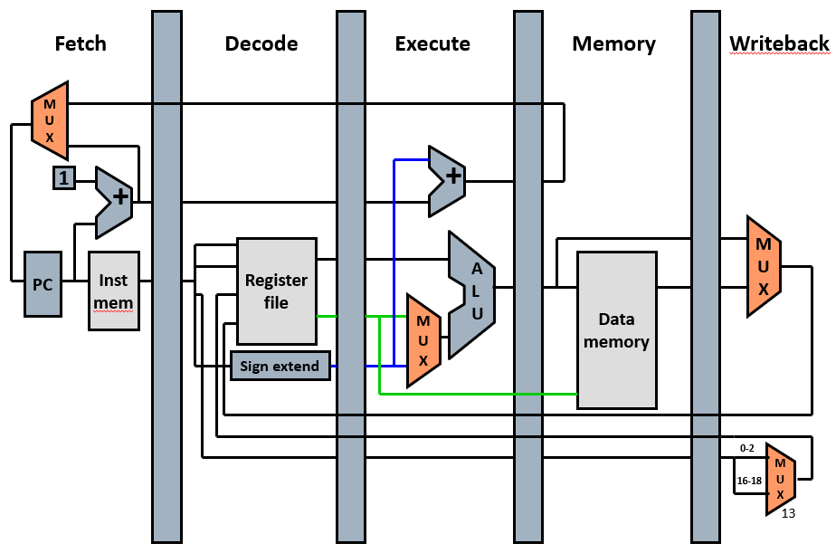
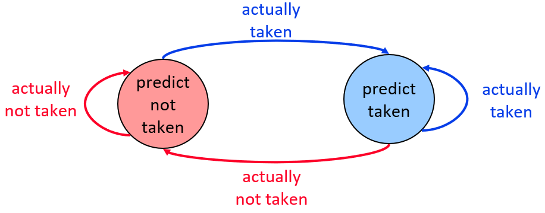
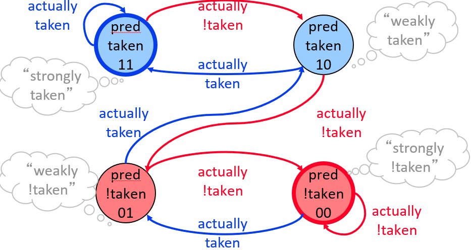
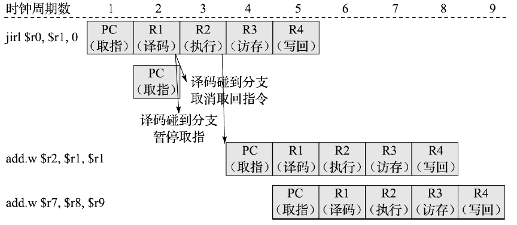

本博文参考胡伟武《计算机体系结构基础》、P-H《计算机组成与设计-硬件/软件接口（RISC-V版）》和Bryant《深入理解计算机系统》写作。笔者系初学，如有错误敬请指正。

# 计算机体系结构笔记4【流水线和冒险】

前两节已经完成了单周期处理器和ALU的介绍，下面我们来引入数字电路设计中最重要的思想：流水线。使用流水线可以增大电路吞吐量从而在宏观上提高处理器的并行度；同时流水线也能够大大提高处理器的工作频率，从而发挥摩尔定律的优势

> 很多时候处理器面对的不是物理问题而是经济问题

## 多周期处理器和流水线改进

组合逻辑需要用并联的CMOS电路实现，当一级电路中包含大量组合逻辑时，前级驱动MOS的扇出就会增大——从驱动方面看，这需要前级电路提供更大的驱动电流；从信号角度看，后级电路的等效电容增大就会显著增加信号传输延迟。单周期处理器中每个时钟周期内必须完成取指、译码、执行、访存、写回，这就相当于存在着大量扇出信号，为了保证下个时钟上升沿之前准备好寄存器组，每个时钟的间隔就要拉长，导致处理器主频很低

如果把取指、译码、执行、访存、写回这五个步骤拆分开，用四个带握手协议的寄存器连接，就可以让每两步电路之间的电路被上一级寄存器驱动，这样拆分既能提高驱动电流又可以减小扇出，从而提高处理器时钟频率

我们得到了如下图所示的**多周期处理器**：增加触发器并采用分频时钟的处理器模型



> 需要注意：多周期处理器可以提高运行频率，但不能降低指令的执行时间——如果考虑到级间寄存器的建立时间和时钟线的延迟，甚至会增加单条指令的执行时间

上图展示了多周期处理器的总体结构，不难发现，每一级电路都是相对解耦的，上一级电路的结果传输给下一级电路后，就不再需要处理当前指令，于是我们就可以让指令“流”进多周期处理器，处理器的时序是像下图一样


每条指令都有自己连续的五步处理流程，但对于电路来说无所谓，指令可以一条接着一条执行。电路中往往会在级间寄存器前添加一个控制逻辑，随着指令的传输，控制逻辑会发生变化从而驱动级间寄存器接收上一级的数据并在时钟到来时向下一级传输数据。到下一个时钟周期后，当前部件和寄存器已经不需要为上条指令服务，于是数据被传输到下一级，上一级的新数据随时钟到来进入组合逻辑电路并被级间寄存器接收，如此循环往复

处理器的工作方式就像一个5人分工合作的加工厂，每个工人只需要管自己手头的活，干完一步就把成品交给下一个人，同时从上一个人手里拿到半成品原料，这样的工作方式被称为**流水线**

> 流水线在数字电路中应用广泛，因为它可以在不增加很多电路（硅片面积）的情况下提高电路吞吐量，从而实现“伪并行”——从理论层面来说流水线和超标量的数学模型是等价的

## 流水线中的阶段

经典五级流水线中的五个阶段（Stage）和单周期处理器中的五个步骤基本一致，每个阶段又被称为一级（Level），下面详细地介绍这五个阶段

### 取指

**每条指令在存储器空间中所处的地址称为它的指令PC**，**取址**是处理器核将指令（按照其指令PC值对应的存储器地址）从存储器中读取出来的过程

取址的目标如下：

* 快速取址
* 连续取址

可能面对的问题如下：

* 指令的编码宽度不相等，导致PC地址与地址边界无法对齐
* 分支跳转指令执行后，可能导致跳转到另一个不连续的PC处，取址时需要从新的PC值对应的存储器地址读出指令
* 处理器会按顺序执行非分支跳转指令，需要按顺序从存储器中读取指令

传统RISC架构处理器的解决方案：

* **固定取指**：连续不断地从存储器中顺序读取出非分支跳转指令，即使是地址不对齐的32位指令，也应该能每个周期读出一条完整指令
* **分支预测**：能够快速判断在分支跳转指令中是否跳转，如果需要跳转，则从新的PC地址处快速取出指令，力求每个周期读出一条完整指令

在流水线中，固定取指的实现非常简单，和单周期处理器保持一致即可；但分支预测具有很大的难度，在预测算法、预测错误处理和优化问题都曾经是计算机科学界的主流难题。这里仅仅介绍一些分支预测的常见形式

### 分支预测

1. 静态分支预测

    不依赖任何执行过的指令信息和历史信息，凭借当前分支指令本身的信息进行预测

    **最简分支预测**：总是预测分支指令不会发生跳转，如果执行阶段发现需要跳转，则冲刷流水线重新取指，会造成两个时钟周期的流水线延迟

    **分支延迟槽**：每一条分支指令后面紧跟的一条或若干条指令不受分支跳转的影响，不管分支是否跳转，后面的指令都一定会被执行。分支延迟槽中的指令永远被执行而不用被丢弃重取，它不会受到冲刷流水线的影响

    **BTFN预测**（Back Taken，Forward Not Taken）：对向后跳转预测为跳，向前跳转预测为不跳，比较常见

2. 动态分支预测

    依赖已经执行过的历史信息和分支指令本身的信息综合进行*方向*预测

    **一比特饱和计数器**：最简单的动态预测器，每次分支指令执行后就会使用此计数器记录上次的方向，采用*下一次分支指令永远采用上次记录的方向*作为本次的预测

    

    **两比特饱和计数器**：最常见的动态预测器，采用FSM的方式进行预测。

    当前状态=强不需要跳转 或 弱不需要跳转，则预测该指令方向为 不需要跳转

    当前状态=弱需要跳转 或 强需要跳转，则预测该指令方向为 需要跳转

    如果预测出错，则反向更改当前状态：从 强需要跳转 要出错连续2次才能变为变为 弱不需要跳转，因此具有一定的切换缓冲，其在复杂程序流中预测精度一般比简单的一比特饱和计数器更高，对应的状态转移图如下
    
    
    
    但是使用该方案可能会导致**别名重合**：使用多个两比特饱和计数器负责不同分支指令的预测，会导致大量空间占用，所以只能采用有限个计数器组成计数器表格，但表项数目有限但指令众多，所以很多不同的分支会不可避免地指向相同的表项
    
    解决这个问题一般采用**动态分支预测算法**：采用不同的表格组织方式（控制表格大小）和索引方式（控制别名重合问题）来提高预测精准率，常见算法如下：
    
    1. 一级预测器
    
        将有限个两比特饱和计数器组织成**一维表格**，称为**预测器表格**。直接使用PC值的一部分进行索引
    
        “一级预测器”指的是其索引仅仅采用指令本身的PC值
    
        优点：简单易行；缺点：索引机制过于简单导致预测精度不高
    
    2. 两级预测器
    
        又称为**相关预测器**
    
        对于每条分支，将有限个两比特饱和计数器组织成PHT（Pattern History Table），使用该分支跳转的历史作为PHT的索引，只需要n个bit就能索引$2^n$个表项
    
        分支历史又可以分为局部历史（每个分支指令自己的跳转历史）和全局历史（所有分支指令的跳转历史）
    
        **局部分支预测器**采用分立的局部历史缓存，每个缓存有自己对应的PHT，对于每条分支指令，会先索引其对应的局部历史缓存，再使用局部历史缓存中的历史值所引导对应的PHT
    
        **全局分支预测器**使用所有分支指令共享的全局历史缓存。这个解决方案节省资源但只有在PHT容量非常大时才能体现出其优势，且PHT容量越大，优势越明显
    
        常见的全局预测算法有：
    
        * **Gshare算法**：将分支指令PC值的一部分和共享的全局历史缓存进行**异或**，使用运算的结果作为PHT的索引
        * **Gselect算法**：将分支指令PC值的一部分和共享的全局历史缓存进行**拼接**，使用运算的结果作为PHT的索引
    
    3. 预测地址
    
        分支目标地址需要在**执行阶段计算后才能得到分支的目标地址**，这些任务无法在一个周期内完成，在连续取下一条指令前，甚至连译码判断当前指令是否属于分支指令都无法及时地在一个周期内完成，因此为了连续不断地取指，需要预测分支的目标地址，常见技术如下
    
        1. **BTB**（Branch Target Buffer**分支目标缓存**）：使用容量有限的**缓存**保存最近执行过的分支指令的PC值及它们的跳转目标地址。对于后续需要取指的每条PC值，将其与BTB中存储的各个PC值进行比较，如果出现匹配则预测这是一条分支指令，使用其对应存储的跳转目标地址作为预测的跳转地址
    
            优点：最简单快捷
    
            缺点：1. BTB容量与时序、面积难以平衡；2. 对于间接跳转/分支指令的预测效果并不理想
    
        2. **RAS**（Return Address Stack**返回堆栈地址**）：使用容量有限的**硬件堆栈**（FIFO）来存储函数调用的返回地址
    
            间接分支/跳转指令多用于函数调用/返回，这两者成对出现，因此可以在函数调用时PC+=4或2，将其顺序执行的下一条指令的PC值压入RAS堆栈，等到函数返回时将其弹出，只要程序正常执行，RAS就能提供较高的预测准确率。不过由于RAS深度有限，出现多次函数嵌套则可能堆栈溢出，影响准确率
    
            优点：正常情况下准确率高
    
            缺点：出现函数嵌套时难以处理
    
        3. Indirect BTB（间接BTB）：专门为间接分支/跳转指令设计的BTB，它通过高级的索引方法进行匹配，结合BTB和动态两级预测器的技术
    
            优点：预测成功率很高
    
            缺点：硬件开销非常大

### 控制相关性简介

分支跳转指令是一类特殊的指令，它们可能带来**控制相关性**：如果两条指令中的一条是分支跳转指令，而另一条指令是否被执行取决于分支跳转的结果，那么错误的预测会让处理器性能大大损失

假设有这样一段程序：

```assembly
# Cortex-M0
beq function
ldr r0, r1, #2

function:
	adds r1, r1, #1
	BX LR
```

不难看出最后两条指令取决于beq是否被执行。

> 这里先不介绍控制相关的概念，读者可以自行理解，后面的*数据相关性*一节中会进行概念解释

如果分支预测成功那么皆大欢喜，我们假设预测结果是跳转，实际也是会发生跳转，那么在beq的译码阶段，adds语句就会被加载，流水线避免了一个时钟周期的空泡

如果使用分支预测失败，这里我们假设预测跳实际不跳，那么beq语句需要在执行阶段才能被发现是不跳，也就是说分支预测直到执行阶段才能够被纠正，这时adds已经被加载到了译码阶段，为了避免错误地执行这段语句，处理器只能暂停取指并进行**流水线冲刷**——把执行阶段之前的所有语句都抛弃，因为在分支跳转语句预测错误的情况下所有后续取得指令都是不可信的；随后重新从ldr语句开始取指执行，这造成了三个时钟周期的流水线空泡（预测错误后的取指占两个时钟周期，流水线冲刷会额外占用一个时钟周期）

在现代的桌面级处理器中，分支预测的准确率已经达到99%以上，但对应流水线级数也高达十几级，并且常常处理着含有数百万条指令的程序，这就导致分支预测的准确性需要尽可能高，预测失败的性能损失是极大的

> 为了提高预测准确率，现代CPU常常会使用数KB的分支预测缓存（比如ARM Cortex-A53具有比译码和ALU加起来还庞大的分支预测电路）

一些RISC指令集引入了**分支延迟槽**（比如经典的MIPS）：在遇到分支跳转指令时，不管是否跳转，总是执行紧跟在该指令后面的一条指令，如果真的需要跳转，只需要忽略该条指令即可，这样分支跳转指令后的指令就不需要等待分支跳转指令译码再被取指

当然，如果不使用分支预测，我们还有一个最简单的处理控制相关性的方法：检测到跳转错误就直接阻塞流水线，如下图所示



当然，这个方法会固定产生2个周期的流水线空泡

### 译码

译码本质上就是硬连线。根据指令集将取得指令拆分成不同的操作数，并将操作码后传到执行部分的运算电路，等待执行。

译码环节是处理器中比较灵活的一个阶段，很多低功耗处理器会把译码和取指放在一起；而高性能处理器会将译码拆分成很多不同电路，同前面的取指、后面的重排序、乱序发射等步骤放在一起形成更细分的流水线

### 执行

经典五级流水线结构中，取指-译码-执行分为三个阶段进行，通过译码让CPU获取指令读取/写回的操作数寄存器索引、指令类型、指令操作信息等。目前高性能超标量处理器普遍采用在每个运算单元前配置*乱序发射队列*的方式，将指令的相关性解除，从发射队列中发射出来时读取通用寄存器组，再送给运算单元进行计算。经典五级流水线架构中的执行需要译码之后，根据指令的具体操作类型将指令分配给不同的运算单元执行，常见的运算单元如下：

* 算术逻辑运算单元（ALU）：负责普通逻辑运算、加减法运算、移位运算等
* 整数乘法单元（MUL）：主要负责有符号数或无符号整数的乘法
* 整数除法单元（DIV）：主要负责有符号数或无符号整数的除法
* 浮点运算单元（FPU）：比较复杂，通常会分成多个不同的独立运算单元

对于其他具有特殊指令的处理器核，会相应增加特殊的运算单元（比如可以在处理器旁挂载DSP等硬件加速电路）

执行阶段中，分支跳转指令和其他需要修改CPU中特殊寄存器的指令会被单独执行，它们往往需要ALU先计算出某个前提条件（比如带条件的分支跳转指令`BEQ`需要先计算两数是否相等）

但对于读写内存的访存指令，执行阶段只会为它们计算出需要访存的地址，真正的执行要在访存阶段去完成。

执行阶段可以说是大部分指令生命周期的结束——除了访存指令外，指令一旦被加载到执行阶段电路，就会产生不可逆转的变化，流水线冲刷或停止取指对执行阶段以后的指令都是无效的

### 数据相关性

很多时候程序中的指令序列存在着各种各样的相关性。比如

```assembly
adds r2, r1, #1
adds r3, r2, #1
```

它相当于

```c
r2 = r1 + 1;
r3 = r2 + 1;
```

如果是单周期处理器，先后顺序是很合理的，并不会引起任何问题，但对于多周期处理器，第一条语句要在写回阶段才能完成对r2的更改，但第二条语句最晚在执行阶段就要用到新的r2值了——如果第二条语句用到了没有+1过的r2值，那么就会导致计算错误。

这个情况和前面说过的控制相关性很类似，并且它的发生频率比控制相关性还要高——代码中的运算量总比CPU的寄存器多，几乎不可能保证前后两条指令之间不会用到同一个寄存器

我们把指令之间的相关分为三类：

* **数据相关性**：两条指令访问了同一个寄存器或内存单元，并且这两条指令中至少有一条是*写*该寄存器或内存单元的指令
* **控制相关性**：两条指令中一条是分支跳转指令，另一条指令是否被执行取决于该分支跳转指令的执行结果
* **结构相关性**：两条指令使用到同一硬件资源

具有相关性的指令连续执行时往往可能导致**冲突**（hazard）

### 数据冲突和冒险

流水线冲突包括资源冲突和数据冲突两类，这两种冲突都会导致流水线阻塞。**数据冲突**顾名思义，就是由于数据相关性引起的冲突。**资源冲突**通常发生在指令派遣给不同的执行单元进行执行的过程中，当一个指令被执行时耗费的时钟周期较长，此后又有其他指令被派发给同一个硬件模块进行处理的情况下便会出现资源冲突的情况——后续的指令需要等待前一个指令完成操作后将硬件模块释放出来后才能得到执行。

控制相关性导致的冲突需要在取指或译码阶段解决来尽可能提升处理器效率；而数据相关性导致的冲突可以采用更“灵活”的处理方式，只要不运行到执行阶段就还来得及修复（一般的寄存器-寄存器型运算指令只要不运行到写回阶段都可以进行冲突修复）；结构相关性比较特殊，一般只在带有硬件加速协处理器（比如FPU、DPU等）的场合会遇到

> 数据相关性也可以看作是CPU内部的结构相关性——两条指令使用到了同一个寄存器或内存单元

具体的冲突和解决方法在后面介绍

### 分支解析和分支预测电路的位置

> 为什么必须在取指阶段甚至之前进行分支预测？

取指阶段的分支预测功能无法直接预测带条件的分支跳转指令，只能使用空间局部性原则进行预测（当然在能够实现复杂算法的情况下可以使用人工智能算法进行模糊预测），由于条件解析需要进行操作数运算，所以需要在执行阶段进行运算并判断该分支指令是否真的需要跳转，并按照之前规定的分支预测算法进行对比执行，如果预测错误很可能需要进行流水线冲刷、造成性能损失

一般会在比较靠前的流水线位置进行分支解析，而不是在靠近执行阶段进行分支解析，这样可以减少性能损失

### 访存

访存阶段说简单简单说复杂也很复杂


### 流水线中的高速缓存


### 写回

写回阶段是所有指令生命周期的结尾，换句话说，写回阶段中的指令是已经完成了的，其结果可以向前传递以满足运行中的其他指令的需要，这对于解决数据相关性非常重要

## 相关性和流水线冲突

这一节补充上面相关性的介绍

### 数据相关性的分类

数据相关性可以分为三类：

* **写后读**（Read After Write，**RAW**）
* **写后写**（Write After Write，**WAW**）
* **读后写**（Write After Read，**WAR**）


### 数据相关性的解决方法


### 流水线前递技术


### 异常处理


## 流水线级间耦合


### 流水线握手


### 级间寄存器控制逻辑


## 中断和异常

一般来说由处理器内部的事件或程序执行中的事件引起的程序跳转称为异常；由处理器外部因素引起的程序跳转称为中断。广义上来说中断和异常都被处理器视为**异常**，在硬件层次将其分为**同步异常**和**异步异常**

### 同步异常和异步异常

**同步异常**：由于执行程序指令流或者试图执行程序指令流而造成的异常

表现：CPU外部环境一定，多次执行时每次能够精确复现

常见的同步异常包括但不限于：

* 取指令访问到非法的地址区间
* 读写数据访问地址属性出错
* 取指令地址非对齐错误
* 非法指令错误
* 执行调试断点指令

**异步异常**：产生原因不能被精确定位于某条指令的异常

表现：CPU外部环境一定，但是每次发生异常的指令PC都可能会不一样

最常见的异步异常就是*外部中断*。外部中断的发生和中断请求到达时处理器执行的指令都是不确定的，这就导致很难出现反复执行同一条指令时恰好发生外部中断。==外部中断也因此常常被直接用“异步异常中断”指代==

根据处理器响应异常后的状态，可以分为精确异步异常和非精确异步异常

响应异常后处理器状态能精确反映为某一条指令的边界的情况称为**精确异步异常**

> 外部中断狭义来讲就是一种精确异步异常：执行完以后还会返回到原来断开的指令处继续执行

响应异常后处理器状态不能精确反映为某一条指令的边界的情况称为**非精确异步异常**

> 读写存储器出错是一种最常见的非精确异步异常
>
> 访问存储器时处理器还会接着执行指令，如果在此期间出现了访问错误进而触发异常，处理器会在处理到之后的某条指令时进入异常服务程序，难以预测当前执行到了哪个指令
>
> 写入缓存行时，也可能发生类似的错误，具体的原理与访问情况类似

在只考虑指令集的情况下，我们可以将异常广泛地分成：

* **外部中断**：精确异步异常，触发后交由中断服务程序处理，并根据指令集规定完成恢复现场
* **指令执行中的错误**：若指令的操作码或操作数不符合指令集规范，导致指令无法被执行，一定会触发同步异常
* **数据完整性问题**：当使用ECC等硬件校验方式的存储器发生校验错误时会产生非精确异步异常
* **系统调用和指令集规定的功能性异常**：指令集会为顶层的操作系统提供一定支持，最重要的就是提供一套供线程上下文切换的异常，并为更上层运行在用户态的应用程序提供一个进入内核态的方法，也就是系统调用异常；一些指令集也会提供预留的异常指令，执行到对应指令后会执行异常服务。这些异常都是同步异常
* **地址转换异常**：使用虚拟内存的系统需要对内存页进行地址转换，当转换表中没有有效的对应项可用时会产生该非精确异步异常
* **需要软件修正的运算**：指令集中会规定一些特定场景由软件处理，比如操作系统的线程调度、浮点运算、向量运算、除0运算等，一旦发生这些运算，就会触发精确异步异常

### 异常服务

异常从触发到被CPU响应再到完成处理的过程被称为**异常服务**（Exception Handler），用于处理异常的软件程序被称为异常服务程序或异常服务函数

一般来说异常服务过程由以下四步构成

1. CPU接收到异常信号

    首先阻塞取指，接收到异常前的所有指令都应该被执行完；被异常打断的指令（被称为**EPTR**）和以后的所有指令都被停止执行，如果是已经加载到流水线内，那么需要执行流水线冲刷以防止产生数据相关性。EPTR会被存储在特殊寄存器中，根据指令集不同，如果处理器微架构支持精确异步异常，那么可以忽略由EPTR带来的相关性问题

2. 确定异常源

    一般指令集会规定一个异常向量表（Exception Vector Table），写在存储器的某一区域，里面规定了异常代号和其对应异常服务程序的函数指针（入口地址）。处理器一旦接收到异常信号，就会去查找该表，获得当前需要跳转到的异常服务程序地址

3. 保存现场

    处理器确定异常源后会将当前寄存器压栈，根据需要关闭或保留部分中断，防止异常处理过程中产生新的中断影响到程序执行；完成保存现场的同时，会将异常向量表中对应的异常服务程序地址加载到PC，完成跳转

4. 执行异常服务程序

5. 恢复现场

    异常处理结束后，首先从栈恢复通用寄存器的值，并执行异常返回指令，从而到EPTR处继续执行。

特别地，如果异常服务过程中，还有新的异常产生，就会导致**异常嵌套**，各个指令集会采用不同的思路解决异常嵌套问题，包括迭代异常服务、嵌套中断服务等。这些解决方法大都需要保存被打断的异常处理程序状态，这就会消耗一定栈资源，因此不可能实现无限异常嵌套。系统会使用一个优先级系统，让高优先级异常能够打断低优先级异常，同级别异常只能够依次执行，这样**系统支持的优先级级数就是异常嵌套的最大层数**。

当然，优先级会带来硬件资源损耗和可能的软件延迟，处理器架构中会采用*衔尾中断*来尽可能减小损耗

> 衔尾中断可以参考ARM Cortex-M3内核的微架构实现

### 外部中断

对于桌面级和更高性能的处理器来说，缺页异常是非常常见的；对于MCU和大吞吐量的服务器处理器，外部中断是非常常见的；对搭载了操作系统的处理器，系统调用异常是非常常见的；这三种异常出现的概率远远高于其他任何异常。

特别地，系统调用异常是同步异常，可以被很好地处理；但缺页异常和外部中断都是异步异常，难以被定位，

一般的现代指令集包含两类中断：**可屏蔽中断**（Interrupt，**INT**）和**不可屏蔽中断**（Non-Maskable Interrupt，**NMI**）。INT用于表达外设的中断请求，可以通过特殊寄存器来屏蔽接收；NMI则用于处理致命的硬件错误，无法被屏蔽

传统的RISC处理器中，不使用中断向量表（也就是异常向量表，不过是指其中涉及到中断的部分），而使用一个固定的入口地址，由软件区分中断源。而现代处理器往往引入一个动态的中断向量表，每种中断的服务函数都有自己的入口地址，硬件完成异常来源溯源工作，这大大优化了处理器的实时性，该策略被称为**向量化中断**

中断从外设传递到处理器的方式主要有两种：中断线和消息中断。每个外设直接将中断信号连接到处理器端口，若信号较多，则先引入**中断控制器**（Interrupt Controller，IC），中断控制器处理信号的优先级关系和屏蔽中断，最后通过一组窄位宽中断信号线引入处理器。在高性能处理器中，常常使用消息中断，尤其是具有多核互联结构的处理器中，中断被编码为一组数据，在系统总线上传输，具有更高的扩展性——牺牲了一定实时性。在NoC（Net on Chip，片上网络）结构中，消息中断可以实现更高速的核间互联

### 缺页异常

现代桌面CPU都会采用虚拟内存（Virtual Memory），具体内容会在后续介绍。

虚拟内存是将硬盘这种缓慢的非易失性存储器中的数据动态映射到内存这种较快的易失性存储器中的技术，主要目的是*提供更大的内存空间*和*保障内核安全隔离*（安全虚拟化）。使用了虚拟内存技术的处理器会使用到**虚拟内存地址**和**物理内存地址**两套东西——处理器内部产生的是虚拟内存地址，由MMU将其转换成物理内存地址，这样就能够实现物理内存的虚拟化；操作系统再将内存空间划分成若干个固定大小的**页**，并维护了一套记录了虚拟页和物理页地址的**页表**，这样处理器只需要查表就可以完成虚拟内存地址和物理内存地址的转换。为了更快进行转换，MMU还会实现一个**转换后援缓存**（Translation Lookaside Buffer，**TLB**）来存储当前最常访问页的页表，处理器会优先访问TLB来进行虚拟内存转换。

了解过基础情况后，不难理解如果处理器没能在TLB中找到要访问的地址，就会产生**TLB缺页异常**，这时需要寻找到目标页表并将页表从内存中取出并填入TLB，这个过程称为**TLB充填**。这个过程可以由软件完成也可以由硬件完成——如果使用硬件完成则不会触发异常

此外，TLB还经常发生无效（要访问的物理页不在内存中）、修改（试图写只读页）等异常，具体异常种类与指令集有关