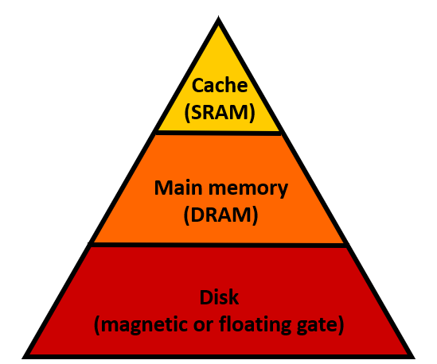
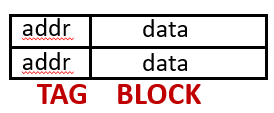
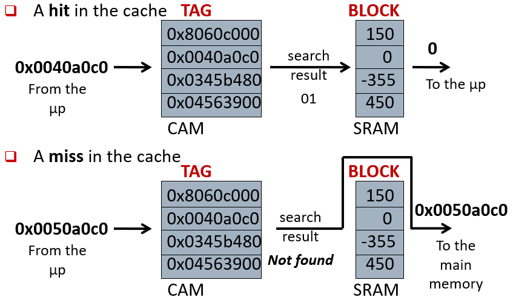
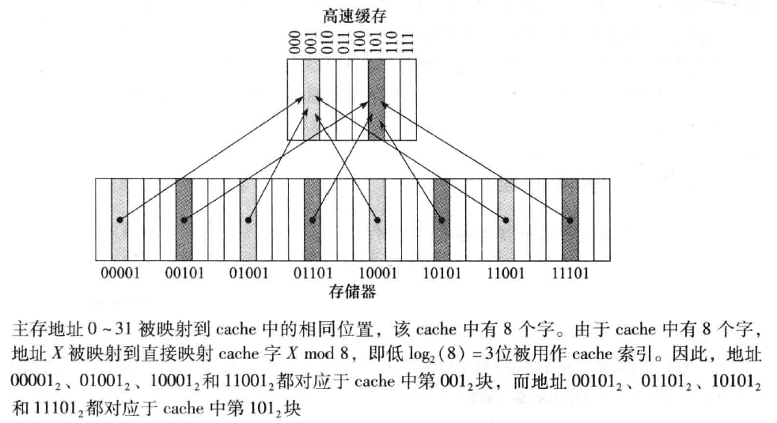
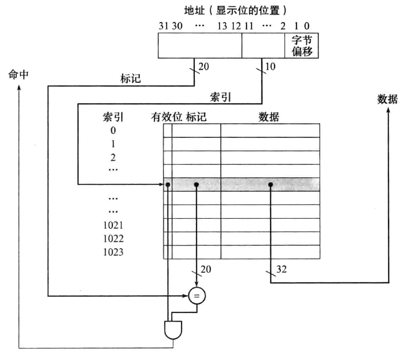
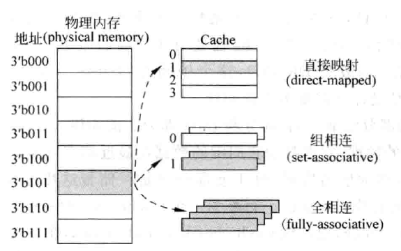
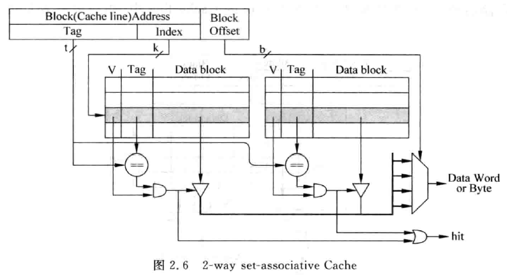
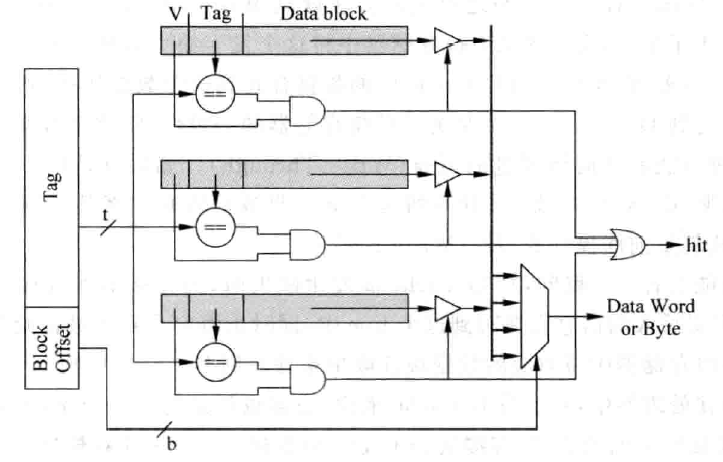

本博文参考胡伟武《计算机体系结构基础》、P-H《计算机组成与设计-硬件/软件接口（RISC-V版）》和Bryant《深入理解计算机系统》写作。笔者系初学，如有错误敬请指正。

# 计算机体系结构笔记5【Cache】

计算机中的存储系统呈一个金字塔型：最顶端的存储器是在CPU内的寄存器，它们的存储更新速率最快；下一层是最靠近CPU的**Cache**，即**高速缓存**，根据处理器用途和成本不同，常常会配备无缓存到3级缓存不等层次的Cache，它们一般与CPU集成在同一硅片上，使用SRAM技术制作，因此能够实现和寄存器近似的存储速率（不过由于连线长度更长、扇出更多，一般速率要低于CPU内部寄存器）；更下一层被称为TCM（紧耦合存储器），这在SoC中较常见，但不一定所有架构的CPU上都会集成，它有介于内存和Cache之间的存储速率；下面是内存；最后则是速率最慢的外存。这些存储器的速率从高到低依次降低，但容量依次增大。与处理器的距离越远，存储容量越大，但访问速度越慢。

> 存储速度越快，价格越贵，容量越小

## 层次化存储

回忆计算机中的两种局部性原理：

* 时间局部性：最近访问过的内容可能会在短期内被再次访问
* 空间局部性：地址相互临近的项目很可能会在短时间内被涌动

**存储器层次结构**（Memory Hierarchy）可以看作基于局部性原理发展而来的：加速具有局部性的数据存储可以提高计算机性能。这样的结构可以通过加速常用数据的存取来让用户获得大容量存储的同时把访问速度提高到接近最高层存储的水平

层次化存储的构造有三个基本原则：

* 每一层都是其下一层的高速缓存（Cache）

    Cache是一个比较广义的概念，DRAM可以看作硬盘或闪存的Cache，处理器片上集成的Cache也可以看成DRAM的Cache，L1 Cache可以看作L2 Cache的Cache。**抽象的Cache技术本身可以视为硬件无关**，技术中的关键部分是相通的

* 数据只能在相邻层次之间进行复制

    这是显然的，因为上一层使用了成本更高的工艺，可获得的容量比下一层更小，速度提升则介于上一层和下一层之间，如果跨越两个甚至更多层次进行数据复制，两种设备间过大的存储速度差距令Cache作用形同虚设

* 数据先在下一层出现后，才能在上一层出现

    计算机启动后，如果没有外界输入，那么一切数据都来自非易失性存储器，而它们的速度都不快，也就是说有用的数据不可能凭空出现在内存或是CPU紧耦合的Cache中

我们说Cache的出现是一种无奈的妥协——如果存储器技术的发展速度能比处理器技术的发展速度快，或者一个大容量存储器的访问速度能和处理器的速度不相上下，那么Cache就不复存在了。然而又大又快的存储器工艺到目前为止也没有出现，或许量子计算或者存算一体是未来的发展方向，但距离实际应用还存在很大一段距离。因此现在我们还是要研究缓存技术

> DDR5的频率已经提高到和处理器主频不相上下，但现代超标量CPU在同样时钟频率下会将多得多的数据传送到DDR，传输带宽变成了一个重要瓶颈，因此CPU中还是需要增加缓存

在相邻两层中，进行信息交换的最小单元称为**块**（Block）或**行**（Line）。上一层的每个块都选择性地复制了下一层的一部分数据，从而起到加速作用。如果处理器所需的数据在本层的存储中找到，称为**命中**（hit）；如果没有找到，则成为**失效**（miss）。后文中会提到**命中率**，指的是在访问本层存储时命中的次数占总访问次数的比例；**失效率**等于`1-命中率`，即访问本层存储时失效的次数占总访问次数的比例。对应存在**命中时间**：访问本层存储，直到命中所需时间；**失效损失**：将目标数据块从下层存储替换到上层存储中的时间。由于上层存储容量小而速度快，因此命中时间总比下层存储的访问时间短；访问下层存储总是被视为失效损失的重要组成部分

我们可以发现：存储层次节省的时间主要是处理器访问下层存储所花费的那一部分，因此一套最理想的存储层次结构应该保证处理器总是“心想事成”：直接从Cache中以最快的速度获得需要的数据，而金字塔的底层负责把大量数据组织起来，动态地向上层更新，以*预测*的形式为Cache提供CPU需要的那些数据

越高层的Cache，越要保证命中率高，这样才能让CPU快速拿到数据，而更底层的Cache并不需要有太高的命中率，因为底层之间的速率差距已经不是很大了，高命中率对于存取速率提升起到的作用按照边际收益递减规律而变化（Amdahl定律的推论）。一般来说，L1（在现代超标量处理器中一般分为I-Cache和D-Cache两部分）和L2两个层次的Cache要保证非常高的命中率，L3 Cache的命中率就不是很关键了（现在的发展方向是尽可能扩大L3 Cache的存储容量，这有助于进一步增加L2 Cache的命中率）

事实上，**L1缓存偏向命中率更高，L2缓存偏向命中时间更少，L3缓存偏向容量更大**

> 听起来有点像分支预测？实际上最简单的Cache和分支预测器BTB采用同样的思路，后文中会提到

下面我们将从单端口Cache的角度切入，理解Cache实现的基本原理

## 高速缓存Cache

这里我们只讨论单层Cache的情况，存储层次如下：

一个简单的Cache由**标签**（Tag）和**块**（Block）组成。Cache利用了程序中的局部性：一个被访问的数据，它本身和周围的数据在最近都可能被访问到，因此**块部分存储着来自主存的一大片连续数据**；**标签部分保存了这片连续数据的公共地址**。一个Tag和它对应的所有数据组成的一行（line）被称为一个**缓存行**（Cache Line）

**一条Cache Line可以被CPU按TAG访问，同时它可以向CPU提供一条或以上的内存数据，具体取决于Cache架构**。一条缓存行能映射的内存数据条数也就是缓存行的数据块数量

> 有的Cache架构中，一个数据可以存储在Cache的多个地方，这些被同一个地址找到的多个Cache Line被称为Cache Set。
>
> 这种特性会在之后说明的直接映射、组相联和全相联实现中介绍到：对于物理内存中的一个数据，如果在Cache中只有一个地方可以容纳它，那么就是**直接映射Cache**；如果Cache中有多个地方可以放置这个数据，那么就是**组相联Cache**；如果Cache中任何地方都可以放置这个数据，那么就是**全相联Cache**
>
> 现代处理器已经很少使用直接映射Cache了，更常用的是组相联和全相联架构，在后文中介绍。

访问Cache的方式就是：**比较CPU要访问的内存地址和Tag**，如果CPU要访问的地址和Tag符合，那么就可以从Tag对应的Block中取出数据；如果不符合，那就只能访问主存来获取数据了，如下图所示：

由于Cache容量有限，总会有很多CPU需要的数据不在Cache中的缓存失效情况，我们可以将其分类：

* **Compulsory Miss**必要失效：由于Cache只缓存以前访问过的内容，因此第一次被访问的指令或数据肯定不在Cache中。我们只能尽量降低这种失效发生的频率，一般来说采用**预取**（Prefetching）算法来预测CPU想要什么数据
* **Capcity Miss**容量不足失效：Cache容量越大，就能缓存更多数据，面积越大、成本越高，同时失效率越小
* **Conflict Miss**冲突失效：同一个Tag可能会对应内存中的多个数据，这就导致很多数据可能会映射到Cache中同一个Block。我们可以通过提高Cache的相联度来让一个数据能够映射到Cache中的不同位置，从而让数据保存位置冲突的情况减少

以上三种Cache Miss的情况合称**3C定理**，即无法从根本上消除缓存失效，只能尽可能减小它发生的频率

### 直接映射Cache

**直接映射**架构（direct-mapped）是Cache实现的最简单方法，不需要任何替换算法，但它的执行效率也是所有主流架构中最低的。

基于数据在主存中存储的地址来分配Cache中的位置——主存中每个存储地址都被直接映射到Cache中的确定位置，这样的高速缓存架构被称为**直接映射**架构。

几乎所有直接映射Cache都使用下列映射来找到对应的数据块
$$
(块地址)mod(Cache中的数据块数量)
$$
如果Cache中的数据块数（缓存行Cache Line 数）是2的幂，那么只需要取地址的低N位即可，其中
$$
N=log_2(Cache中的数据块数量)
$$

### 直接映射Cache的缓存行结构

在直接映射Cache中，一个缓存行（Cache Line）中包含五个主要部分，每个部分称为一个**字段**，如下面所述。需要注意：前面说的Tag+Block的组合结构仍然成立，只不过实际结构中往往把内存地址拆成三个部分（标签Tag、索引index、偏移量Offset）

* **索引Index**

    处理器使用索引来从Cache中找到某个特定的缓存行。假设有N位索引，那么Cache中缓存行的数量$2^n$。

    > **索引个数同时还对应了内存数据地址的某几位，传统上使用内存地址低X位来表示X位索引**
    >
    > 假设有3位Index，那么具体的排列就会是从0x0（3'b000）到0x7（3'b111），正好可以对应内存中最低三位为3'b000到3'b111的单元。于是所有地址低三位为000\~111的数据就可以被固定地映射到Cache中Index为000\~111的Cache Line。如下图所示
    >
    > 
    >
    > **可以理解这个Index指的就是Cache Line的标号，索引字段是Cache本身的地址**

* **标签Tag**

    Tag部分用来和内存中地址进行比较，只有他们是相等的，才表示这个缓存行存储了CPU需要的数据。直接映射Cache中，我们要从Cache访问一个数据，首先要找到对应Index，然后根据Tag判断数据是否在这个Cache Line中

    > 由于一个缓存行往往不止映射了一条内存数据，因此需要使用Tag来标记数据对应的内存地址
    >
    > **Tag本质上就是当前缓存行中每一条数据的内存地址去掉Index对应的那几位后剩下的部分**，也就是内存地址的高位

* **偏移量Offset**

    Offset部分是对Tag的补充，当一个缓存行映射了多条内存数据时候，CPU能使用Tag来根据数据的具体内存地址获取数据；这时Cache中的数据却无法被访问到——Index+Tag=内存地址，但Index只能够指明缓存行的基地址，这时候偏移量Offset就派上用场了。Offset+Index就可以指明缓存行的具体地址

* **数据块Block/Data**

    对应每个数据。**数据块数目就等于Cache的容量**

* **有效位Valid**

    每个缓存行还包含一个有效位（Valid），用来标记这个行是否保存着有效的数据，只有在之前被访问过的缓存行对应的有效位才设置为1，否则默认为0

Tag是一种**内容寻址存储器**（Content Addressable Memory，**CAM**），不像一般的存储器，我们在读存储时会向其传递数据的索引（地址），存储器返回对应位置的数据；CAM的读取逻辑是：CPU向CAM传递数据的索引（地址），而CAM会将其视为一串数据，如果找到对应数据，就向CPU返回对应的索引，并传递是否找到索引的标志位。

> 这种逻辑在前面分支跳转部分提到的分支目标缓存（BTB）中也有提及。

对所有Index相同的内存地址，都会寻址到同一个缓存行，这就导致直接映射结构Cache的最大缺点——**如果两个Index相同的存储器地址交互地访问Cache，就会一直导致*冲突失效*（Conflict Miss），严重降低Cache的效率**

### 直接映射Cache的实例

假设主存容量为4GB，也就是32位地址线能够寻址的最大长度。假设Cache是直接映射架构的，每个Cache Line可以缓存N个Byte，我们说它的偏移量就是$Offset=log_2(N)$。

假设Cache的容量为2KB，根据上面的条件，我们可以得到这个Cache有$2KB / N$个缓存行（缓存行数=Cache总容量/每个缓存行可缓存数据大小）；这样我们还能够得到$Index=log_2(缓存行数)$，有了Offset、Index和地址线长度32，也就可以推算出$Tag位数=32-Index-Offset$。最后再加上每个缓存行都有一个的Valid位（等于缓存行数）。这样就推算出了直接映射缓存的所有要素

一套直接映射Cache可以用下面的电路结构来实现

CPU访问Cache时，首先向Cache传入Index，找到对应Cache Line后，找到其Tag，与需要数据的Tag位进行比较，如果二者一致，且根据Valid判断本条数据是已经经过映射的（Valid=1），那么说明缓存命中，于是CPU可以直接从Cache中取出需要的数据；如果以上过程有任何问题，说明缓存失效，取出的数据不可靠

当然，上面的图片只展示了一个缓存行只包含一条数据的情况，如果一个缓存行保存了多个数据，那就需要使用到Offset偏移量了，如下图所示

这个结构相比上面多了一个由Offset控制的数据选择器。图里展示了一个缓存行包含四个数据块的情况，Offset取值从2'b00到2'b11，从而实现四个数据块的选择，正好也对应了前面这张图片的情形

## Cache的性能评估

下面简单给出Cache性能的评估公式

### Cache性能公式

$$
平均延迟=Cache延时*命中率 + 主存延迟*失效率=Cache延时*命中率 + 主存延迟*(1-命中率)
$$

$$
读操作带来的停顿周期=\frac{读操作数目}{程序}\times 读失效率 \times 读失效时间
$$

$$
每条指令平均访存时间AMAT=命中时间+失效率*失效时间
$$

## Cache写入

上面我们只讨论了如何读Cache，下面来说写Cache的情况。

### 缓存一致性

Cache的写操作和读操作有所不同，因为这涉及到数据依赖和缓存-内存中数据是否一致的问题。当CPU执行到store指令时，如果只向Cache中写入数据而不改变内存中的数据，就会导致内存和缓存中数据的**不一致**（non-consistent），store指令应该以什么为准？

有两种方法用于维护缓存一致性，分别是**写通**和**写回**

### 写通Write-Through

总是将数据写回内存和Cache的写策略称为**写通**。这种情况下，写操作会同时更新Cache和内存，保证二者的数据一致性。

肉眼可见的性能低下！它大量访问内存而不是缓存！

通过**写缓冲**的方式可以改善一些性能。开辟一个写缓冲（Write Buffer，WB）区域，该区域中保存了等待写回主存的数据，数据同时写入Cache和WB，WB会自行将数据写入内存对应区域；当写入主存的操作完成后，写缓冲中的数据会被释放。

> WB本质上就是一个从Cache到内存的异步FIFO。可想而知，当输入速度大于输出速度时，写缓冲无济于事

如果WB满了，那么处理器必须停顿流水线直到WB中出现空闲项

当然，写缓存也会出现缓存失效。针对写失效的情况，常见的策略是在Cache中位其分配一个数据块，

### 写回Write-Back

当发生写操作时，只更新Cache中对应数据块的数值，当且仅当该数据块被替换时，再将更新后的数据块写入下一级缓存，这被称为**写回**策略。

写回能够显著改善性能，尤其是处理器写操作速度大于等于主存速度时；不过相应的实现也更复杂

> 当然，写回策略也可以搭配写缓冲。当Cache失效时，写缓冲可以用来减少失效损失——从主存读取所需数据块时，修改过的数据块会被放入Cache的**写回缓冲区**（Write-Back Buffer，WBB），再由写回缓冲区写入内存。

为了处理写回所需要的*标记已经被修改过的缓存数据*功能，我们要在直接映射Cache中加入一个标志位，当其被设置为1时，表示对应Cache Line被修改过，在本次更新时要同步写入内存；如果标志位为0，就表示这个Cache Line没有被修改过，不需要写入内存。这个标志位被称为**脏位（Dirty）**

至此，我们得到了直接映射Cache缓存行的基本结构

| 结构               | Valid标志位      | Dirty标志位      | Index索引                                            | Tag标签                            | Offset偏移量                       | Data Block数据块         |
| ------------------ | ---------------- | ---------------- | ---------------------------------------------------- | ---------------------------------- | ---------------------------------- | ------------------------ |
| 功能               | 指示是否被访问过 | 指示是否被写入过 | 指示当前缓存行的缓存地址和行内数据的公用内存地址部分 | 指示当前缓存行中数据的具体内存地址 | 指示当前缓存行中每条数据的缓存地址 | 存储从内存映射而来的数据 |
| 每个缓存行中的位宽 | 1bit             | 1bit             | $log_2(X/Y)$，等于缓存行数目取2的对数                | 32 - Offset - Index                | $log_2(X)$                         | 跟随Cache块大小而变化    |

上面表格中假设内存地址线为32bit，Cache大小为X Byte，每个块大小为Y Byte

在这中间，**除了数据块以外的所有位都是内存中不具备的，它们也被称为Cache的开销（Overhead）**。如果是特殊结构的Cache，还会引入更多位的Overhead

## 更高级的Cache

为了解决直接映射Cache的种种问题，组相联（也被称为**部分相关**）和全相联架构被提出，并得到广泛应用

### 组相联

对于一个组相联结构的Cache，如果一个数据可以放在n个位置，则称这个Cache是**n路组相联**（n-way set-associative）

常见2路组相联Cache电路结构图如下

首先使用Index对Cache寻址，但会得到一个包含了两个Cache Line的**Cache Set**；之后通过比较Tag来确定哪个Cache Line是最终需要的，如果两个Cache Line内都发生了缓存失效，则称发生了组相联的Cache失效

这种Cache仍然存在问题：由于需要在多个缓存行匹配结果，这种结构的Cache会有更大的扇出和走线，因此延迟会更大。现代处理器中通过**流水线组相联Cache**优化，将Cache和CPU流水线连在一起，可以有效减小延迟，同时组相联Cache的面积较小，目前各种超标量处理器中应用很广泛。

### 更新策略

不像在组相联和全相联Cache中，引入常常引入**LRU策略**或*随机替换策略*

1. **近期最少使用**（Least Recently Used，**LRU**）算法

    这是最符合加速常见情形原则的Cache更新算法。算法内容很简单：为每个缓存行设置一个年龄寄存器来追踪每个缓存行的使用情况，每当一个缓存行被访问时，其对应年龄部分就会增加，或者减少其他没有被访问缓存行的年龄值。替换时选择年龄值最小的那个缓存行，它是被使用次数最少的，从而完成LRU策略。

    随着Cache相关度增加，way数量会增大，对应实现精确的LRU就很困难（大大增加Overhead）。因此会选用**伪LRU算法**

    下图给出了一个伪LRU算法的实现，对于一个8way的组关联Cache，需要$log_2(8)=3$位LRU位。

    对于每个LRU位，为0表示编号较小的那些way没有被使用；为1则表示编号较大的那些way没有被使用，这样就形成了一系列“*最近未被使用箭头*”

    上电以后一段时间，Cache中映射的数据不多，因此大部分LRU位都是0，这时就可以正常地把新访问到的内存数据映射到Cache中；随着时间推移，越来越多的way会被访问到，此时只需要顺着指向未被使用wey的箭头就可以找到哪个way最近没有被使用过，从而将其替换掉

    

2. **随机替换**（Random Replacement，RR）算法

    为了方便硬件实现，一部分Cache在映射新内存数据时会使用随机替换一个Cache Line的算法，这种算法不需要额外的LRU标志位来记录每个缓存行的年龄信息。相比LRU来说发生失效的频率更大，不过确实可以很好实现硬件简化——随着Cache容量的增大，损失会逐渐变小。实际设计中很难实现严格的随激，因此一般采用时钟算法技术，利用一个每周期自增1的计数器，使用替换时刻计数器的值作为要被替换缓存行的Index，就可以近似实现随机替换，同时取得很低的硬件复杂度

> **直接映射Cache需要LRU吗？**
>
> **不需要**。因为直接映射Cache不存在替换问题——每个内存数据只有一个Cache Line可以映射，替换时只需要考虑Index对应的内存数据，将统一缓存行中的数据成批替换就可以了

### 全相联

全相联结构删除了Index部分，直接在整个Cache中使用Tag进行比较，就相当于CAM（内容寻址存储器）。全相联Cache具有最大的灵活度，其**缓存失效率是三种架构中最低的**。不过由于有大量内容需要比较，其延迟也比较大，因此这种结构的Cache不会有很大的容量

对全相联映射而言，内存数据可以保存到任意数据块中，并进行动态的更新。

### I-Cache失效

在读指令缓存I-Cache失效的情况下，简单五级流水线CPU将受到巨大的性能打击：需要将预取的指令退回，也就是当前PC-4发送到内存，对主存进行读操作，等待完成本次访问；随后正常写入Cache，并重启指令执行，本次取指将会在Cache命中。

这样不仅会导致Cache失效，而且必须要让处理器暂停才能够恢复原位，正常执行执行。性能损失非常大，因此现代超标量处理器会采用更高级的I-Cache
