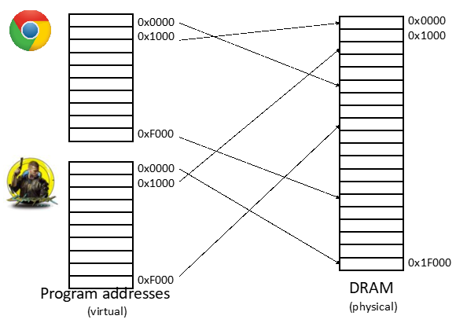
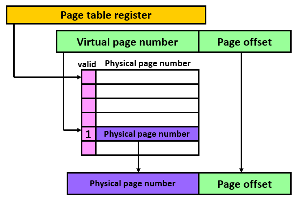
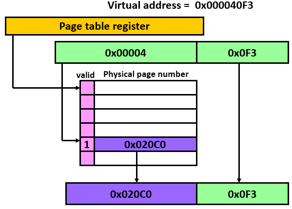
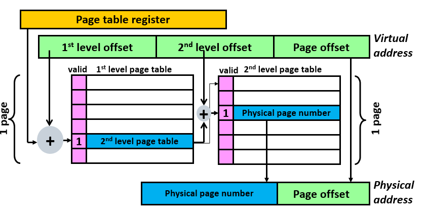
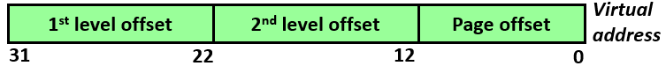
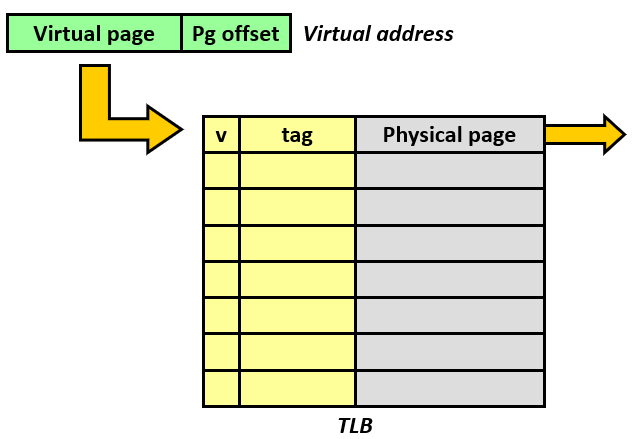
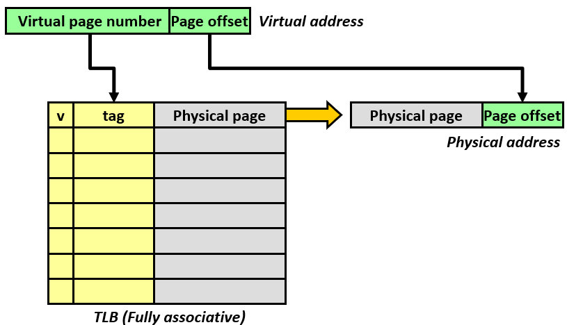

本博文参考胡伟武《计算机体系结构基础》、P-H《计算机组成与设计-硬件/软件接口（RISC-V版）》和Bryant《深入理解计算机系统》写作。笔者系初学，如有错误敬请指正。

# 计算机体系结构笔记6【虚拟存储】

> 层次化存储的构造基本原则：
>
> * 每一层都是其下一层的高速缓存（Cache）
> * 数据只能在相邻层次之间进行复制
> * 数据先在下一层出现后，才能在上一层出现

根据上一部分的内容，不难想到：既然CPU紧耦合的高速缓存可以为内存提供Cache，那么内存也应该可以为更慢的非易失性存储设备充当Cache。这种技术被称为**虚拟存储**或者说**虚拟存储器**（Virtual Memory，VM）

> 虚拟化技术是在计算机中广泛存在的。而虚拟机就是一个虚拟化最明显的例子。
>
> 所谓虚拟化，指的就是底层运行逻辑是一回事，而上层用户所看到的是另一回事。即用底层逻辑模拟出一个能完美应对上层需求的系统，实现两个层级之间的隔离
>
> 现代计算机程序运行在一层套一层的虚拟机中，很多CPU为了加速在软件层面构建的虚拟机，还提供硬件虚拟化指令集。这是因为虚拟机同时满足了分层和抽象两个计算机中的重要需求

### 虚拟存储的历史由来

虚拟存储最早并不是有人嫌弃硬盘太慢，而是为了解决下面两个难题：

* **允许多个程序之间高效安全地共享内存**
* **消除小而受限的主存容量对程序设计造成影响**

目前来看，应用虚拟存储技术主要是为了解决第一个问题。

> 在远古时代，程序规模很小，小物理内存也完全可以容下当时的程序；随着应用程序规模越来越大，物理内存开始难以容纳下这样的程序，于是开发者选择把程序分割成许多片段，每个片段执行完以后再调用下一个片段。虽然操作系统可以完成片段调度，但程序员还是需要费时费力地完成片段切割。虚拟存储就是为了满足这样的需求出现的

为了允许多个虚拟机共享内存，必须保护虚拟机免受其他虚拟机影响，确保程序只读写分配给它的那部分主存——主存只需要存储虚拟机中活跃（Active）的那部分，就像Cache只存储一个程序的活跃部分一样

虚拟存储在内存中维护了数片专用于对应程序的地址空间，在独立的程序调用数据时，将程序地址空间的**虚拟地址**（Virtual Address，**VA**）转换成主存中的**物理地址**（Physical Address，**PA**），从而加强各程序地址空间之间的保护

虚拟存储技术的最常见用途就是**将操作系统进程和多种多样的用户进程隔离开**。操作系统运行在处理器内核态，拥有最高的操作权限，可以直接访问内存物理地址；而每个用户进程都会被“包裹”在虚拟化的内存空间中，它会认为自己在访问内存物理地址，但实际上是由虚拟存储专门映射一片虚拟地址给它，这样保证用户进程无法干涉操作系统所用到的任何数据，用户进程之间也无法相互干涉。现代处理器上运行了多种程序，它们使用操作系统进行调度，由于虚拟内存技术、操作系统的内核隔离（内核虚拟化）技术和进程调度技术，这些程序都认为自己是独占CPU和内存的，于是程序员的工作被大大解放，编写程序时能够任意使用处理器的内存资源。实际执行时，操作系统负责调度，将物理存储器动态分配给各个程序

不过，虚拟内存的第二个应用也很重要：**允许用户程序使用超出实际内存容量的内存**。虚拟存储会自动管理由主存（内存）和辅助存储（硬盘）所代表的两级存储层次。处理器能寻址的内存是比较大的，但我们并不一定能在主板上插那么多DDR。虚拟内存会**重定位**程序载入：应用地址访问存储前，重定位算法将程序使用的虚拟地址映射到不同的物理地址，并且允许程序载入主存中的任何位置，从而让进程使用的内存空间和真实物理内存空间无关

## 页表

虚拟地址的范围是由处理器位数决定的。32位处理器使用32位虚拟地址，，虚拟地址范围就是`0~2^32(4GB)`；对于64位处理器，虚拟地址范围就是`0~2^64`，地址宽度是64位。使用虚拟存储以后，处理器访存的地址会被设置成虚拟地址，这个地址不会被直接送到物理存储器，而是会先进行地址转换，负责地址转换的部件被称为**内存管理单元**（Memory Manage Unit，**MMU**）。

> 举一个不太恰当但直白的例子：电脑中有游戏赛博朋克2077和浏览器Chrome，众所周知这两个东西都会占用非常多的内存空间；更糟糕的是它们各自占用了一个进程（Process），这要求它们的内存空间要实现物理层面的隔离——Chrome不应访问到2077的内存空间，不然游戏就要出bug了。于是我们使用虚拟内存技术，当CPU在处理Chrome的内存数据时，会向MMU（内存管理单元，Memory Management Unit）发送虚拟地址，MMU将其转换成物理地址，这样进程所接触到的内存地址就只有虚拟地址，更底层的物理地址已经被MMU规定好，如果出现越界的访问，MMU完全可以返回一个页错误，告诉进程“你访问的地址不存在”，从而避免有意或无意的访问。同时，两个进程需要的总内存可能很大，会超过内存容量，虚拟内存技术还可以把进程所需的数据暂存到页，页上数据使用的虚拟地址要比内存的物理地址大很多，因此可以存储更多数据；再把这些数据成批写入硬盘，然后把这些数据直接从内存中删掉，等到需要用到时再从硬盘映射回内存
>
> 
>
> 页的概念会在后文中详细说明

最简单的虚拟内存实现机制就是使用一个查找表，把物理内存和虚拟内存的映射方式记录在表内，处理器发出的虚拟地址被传入这个**查找表**（Look-up Table，LUT），得到物理地址，这就是**单级页表**

下面我们介绍基于分页的虚拟存储器，这也是目前主流的机制。

### 单级页表

与Cache不同，虚拟存储数据块被称为**页**（Page），虚拟存储失效被称为**缺页失效**（**Page Fault**，*PA*。表示被访问的页不在主存中的事件）。虚拟存储中，处理器会产生一个虚拟地址VA，该地址会被从软件（CPU操作系统处理）或硬件（硬件MMU处理）上转换成一个物理地址PA，只有使用物理地址才能访问主存，这个过程称为**地址映射**或**地址转换**。

虚拟地址VA被分成**虚拟页号**（Virtual Page Number，**VPN**）和**页内偏移**（Page Offset，PO）两部分

> 一般来说，32/64位CPU经常使用4KB大小的页，对应2^12。因此偏移量Offset一般是VA的低12位VA[11:0]，VPN则是VA的剩余部分

VPN类似Cache中的Index，它指明了虚拟存储中页的序号，即虚拟内存基地址，经过转换后可以得到物理地址的高位部分。

物理地址的低位部分，即物理内存偏移量，直接被设置为页内偏移。**页内偏移的位数决定了每个页的大小**。**为了创造没有容量限制的虚拟存储环境，虚拟页往往比物理页更多**

对应于虚拟存储，物理存储也会被划分成**物理页号**（Physical Page Number，PPN）或物理帧号（Physical Frame Number，**PFN**，这是PPN的另一种称呼，带有历史遗留色彩）。由于VA和PA是同等大小的，其中一片地址空间也具有相同容量，因此在寻址过程中，偏移量不需要转换，MMU**只需要把VA转换成PA即可**

> 对于物理存储，我们经常使用*帧*（Frame）来对应*页*（Page）表示其中一片地址空间

需要注意：*虚拟地址是大于等于物理地址的，那么多出来的数据要存到哪里？*我们会使用存储层次结构的下一层：硬盘/闪存来对这些数据进行存储，这便是上面说到的“用内存作为硬盘的Cache”——*超过内存大小的数据实际存储在硬盘上，而其中需要被用到的数据会按页动态映射到物理内存中*。

像Cache一样，由于不是所有数据都被存储到物理内存里，因此会出现Miss的情况，这就是上面提到的**缺页失效**。

**缺页失效的代价是非常大的**。Cache失效，那么CPU需要直接访问内存，这通常导致数百倍于Cache的延迟；缺页失效更为致命，CPU访问硬盘或Flash的延迟很可能是访问内存延迟的数万倍（某些机械硬盘甚至需要毫秒级的延迟）。

设计人员通过优化页的放置来降低缺页失效的频率：由于可以使用操作系统完成页的组织工作，而且内存容量相比Cache大得多，所以**虚拟页都采用全相联**。

全相联结构会导致每个页的定位困难，因此引入了**虚拟页表**（Virtual Page Table，**VPT**，也简称**页表**，**PT**）：这是一个存在主存中的软件查找表。**使用一个索引主存的表来定位页，页表使用虚拟页号作为索引，找到对应的物理页号**。表中的每一项被称为**表项**（**entry**）

> **页表**是在虚拟存储系统中保存虚拟地址和物理地址之间转换关系的查找表，保存在物理内存中。**每个进程都会维护一个自己的页表**
>
> 为了方便表明页表在内存中的位置，硬件通常包含一个指向页表首地址的**页表寄存器**（Page Table Register，**PTR**）。由于每个程序都会维护一个自己的页表，PTR也会根据当前运行的程序来进行更新

一个页表的最基本结构如下所示

页表在物理内存中的起始地址用PTR来指示。假设一个表项能映射4KB，为了满足32位CPU的寻址能力，那么虚拟页表需要包含4GB/4KB=1M个页表，这是2^20，需要使用VA的高20位作为VPN，VA的低12位就正好作为Offset了。所以说真正用于寻址页表的就只是VPN，Offset对于虚拟地址和物理地址都是一样的，这也是VPT不同于Cache的一点：**直接使用VPN对页表寻址，而不需要使用Tag或Index**

一个简单单级页表的实例如下图

其中低12位（0x0F3）表示Offset，高20位表示VPN，虚拟页表中还包含一个Valid位用于识别缺页失效。转换过程中，CPU发送PA到MMU，MMU根据对应关系译码得到VPN后向页表发送（也可能是CPU直接向内存发送VPN），根据PTR提供的页表首地址访存即可得到PFN，与Offset合并后就能获得PA了。

上面的流程非常完美，下面我们来看一下缺页失效发生时该怎么应对

### 缺页失效

对CPU来说，当它需要的页不在物理内存中时，就发生了缺页失效，它需要访问更低一层存储，将页数据搬运回内存。

当某个VA对应的entry位是1时，就表示这个VA所在的页已经被映射进了物理内存，可以在物理内存中直接找到这个VA对应的数据；相反如果valid位是0，表示这个VA对应的页还没有被映射到物理内存，于是会产生缺页失效异常，让Page Fault异常服务程序从下一级存储器中把对应页的数据搬运到物理内存中。

处理缺页失效的步骤（Page Fault中断服务函数中需要做的）：

1. 停止访问虚拟内存，切换到中断服务函数
2. 写入当前页未写回的数据
3. 写回虚拟内存数据到物理内存
4. 访问物理内存，获取被引用的页
5. 更新页表
6. 重新执行进程中访问虚拟内存的程序，这次不会发生缺页失效

上面的步骤都是使用软件执行，因为访问硬盘的速度非常慢，完全没有必要使用硬件执行。

对于写入过程中的缺页失效，页表不像Cache那样有两种处理方式（写通和写回），而是只采用写回，这样有助于避免CPU直接访问二级存储

> 实际上写通的方式只适用于L1和L2缓存之间使用，因为这样可以降低Cache一致性的管理难度；随着下层存储器所需的访问时间越来越长，只有写回才是可以接受的方法

由于操作系统需要软件实现物理内存的页替换，操作系统就要使用类似LRU（最近使用）的算法来记录物理内存中哪些页最近被使用过，这样的代价是很大的：每次访存后操作系统都要更新这个算法的数据结构。为了减少操作系统开销，一般通过硬件来提供支持

页表的每个PTE中都会增加一个**使用位U**（used，使用过），*类似于Cache中的伪LRU算法使用到的LRU位，只不过它的更新是用软件执行的*

操作系统会周期性清零这一位，然后过一段时间再去查看它，就能知道最近哪些位没有被使用到了

### 单级页表的问题

在少数几个程序同时运行的情况下，页表的Overhead是很小的；但如果同时运行上百个进程的计算机使用单级页表策略，那么每个进程都需要耗费大量物理内存来存储自己的页表，这样开销就会变得非常大。

事实上，一个进程很难用完整个4GB的虚拟内存空间，这就导致页表中很大部分内容都是空的，并没有实际使用，内存都被消耗在了页表本身的存储。

> 根据加速常见情形的原则，一般来说不会有程序会同时用到所有虚拟页表，因此让页表按需存储是最佳的

针对这个问题，后人开发出来**多级页表**（Hierarchical Page Table，HPT）结构来减少页表对物理存储的占用，并且非常容易用硬件实现

> 多级页表使用**树**而非线性表的数据结构实现，因此拥有更高的灵活性

本部分讲述的单级页表（Single Page Table，SPT）也被称为线性页表

## 多级页表

将一个单级页表划分成若干个小的子页表，处理器根据程序需求逐步放入这些子页表，这些子页表不需要占用连续的内存空间，但还需要使用一个表格来记录每个子页表在物理内存中的存储位置，这个表格称为**一级页表**（Level1 Page Table），子页表称为**二级页表**（Level2 Page Table）

**一级页表时始终存储在物理内存中，二级页表只有在需要的时候才会被创建**

这样，要得到一个VA对应的PA中的数据，需要先使用PTR的基地址加上一级页表偏移量Offset1访问第一级页表，得到这个VA所属二级页表的基地址，这个一级页表表项被称为**页表入口**（Page Table Entry，**PTE**）。进入二级页表以后，还需要使用二级页表的偏移量Offset2加上得到的基地址来找到这个VA对应的PA

这样，原本分成VPN+Offset两部分的VA就需要再分出一部分，变成Offset1+Offset2+Offset的结构

由于二级页表通过一个PTE与一级页表建立连接，**二级页表也就不需要顺序存储**，可以直接离散地分布在内存中，可以很好实现内存空间高利用率

下图展示了一个二级页表的结构

当操作系统中创建一个进程时，就在物理内存中为这个进程找到一片空间存放一级页表（一般是4KB），随着进程的执行，操作系统会在物理内存中创建二级页表，并将它的起始地址放到一级页表的表项中

对于32位CPU，二级页表结构的VA是如下图安排的

10位的1、2级页表偏移量，还有最后12位的页偏移量。CPU并不需要关心最后12位，只要最后寻址的时候加入即可，CPU只需要先按level1 offset找到二级页表的物理地址，再按level2 offset找到数据的物理地址即可

于是，整个页表本身的大小就是
$$
第一级页表的大小+第二级页表的大小*一级页表的表项数（物理内存中存在的二级页表的数目）
$$
在本例（32位CPU）的情境下，就是
$$
4K+n*4K
$$
其中n是一级页表中已经被从硬盘中映射过来的valid=1的表项数目

其中**一级页表的内存开销是不可避免的，二级页表是否存在物理内存中则根据第一个程序中虚拟地址的值决定，伴随着一个页被放入物理内存，必然会有一级页表中的一个PTE被建立**

### 更高级页表

使用树状结构，更高层多级页表也是可以实现的，只要**不断把前一个页表中的表项entry改成页表入口PTE**，然后在这个树后面挂更多叶节点即可

对于每个进程来说，需要访问两次物理内存才能得到VA对应的PA，然后还需要访问一次内存来获得数据。*对于高级页表，这种访存所需次数还会更多*

> 不觉得这很慢吗？

## TLB

对于二级页表，需要访问两次物理内存才能得到VA对应的PA，而物理内存相对处理器本身有数十倍乃至上百倍的差距，因此在处理器执行时会严重拖累性能。于是可以考虑设置一个PTE缓存

> 根据局部性原理，由于程序本身的串行性，一般会顺序地从一个页内取数据或指令，所以缓存PTE是一个性能不错的选项

这种缓存我们一般称为**TLB**（Translation Lookaside Buffer，**转换后援缓存**）。需要注意：看起来TLB是页表的Cache，但它又不同于一般的Cache，因为**它只有时间相关性**（Temporal Locality）。TLB并没有明显的规律，因此TLB并不能够使用Cache设计中的一部分优化方法（比如预取prefetching）

一般为了减少TLB失效率，会使用全相联的方式，不过这样会导致TLB容量不大，所以一些设计中会采用组相联设计。现代处理器中也常常使用两级TLB，第一级TLB采用哈佛架构，分成I-TLB和D-TLB，采用全相联结构；第二级TLB则采用冯诺依曼架构，组相联结构，和超标量CPU常用的多级Cache是一样的

一个简单的TLB结构如下所示

熟悉的Valid、Tag字段，只不过Data Block字段被换成了Physical Page，存储着来自一级页表的物理地址（其实是物理页号PFN）

当然，TLB也可以拓展出Dirty位、Use位（LRU位），不过这些位是完全来自于页表的。

