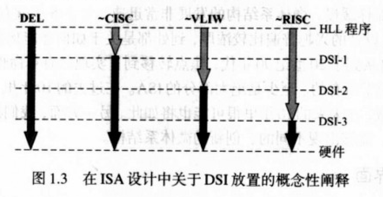
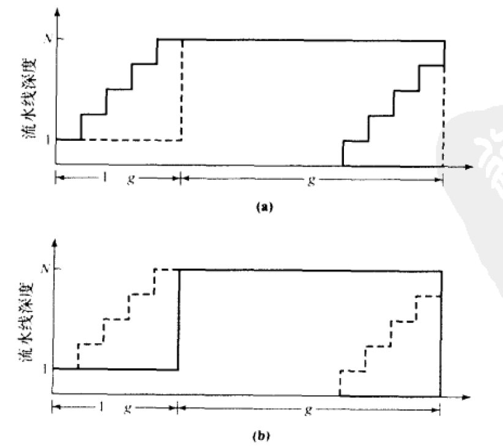

> 参考教材《现代处理器设计——超标量处理器基础》2004版和姚永斌《超标量处理器设计》

# 超标量理论基础

**ISA**即**指令集体系结构**，提供了三个基本功能：

* **提供硬件和软件之间的约定**，也就是起到了软件/硬件隔离的作用，这将机器（处理器）和软件分离开

    ISA以下的部分就是计算机硬件，包括处理器的具体实现；以上的部分则是软件，包括用于驱动处理器的操作系统和用于生产软件的编译器

* **作为微处理器设计的规范**，也就是起到了软件/硬件接口的作用，这将处理器执行程序和软件开发联系起来

    比如arm64的cpu就必须实现x86指令集里面规定的各个基础指令，否则为x86开发的软件就没办法跑在它上面，rv32i的cpu就必须实现risc-v规定的i指令子集里面所有指令才能让gcc编译出的risc-v程序跑在它上面

* **实现动态-静态接口**（**DSI**，Dynamic-Static Interface），也就是区分哪些任务是基于软件和编译器静态优化的，哪些任务是通过cpu设计和外围硬件进行动态完成的。

    比如比较直观的概念就是分支预测器，它将原来需要软件优化才能使用的分支跳转预测变成了一个由硬件实现的功能，这样编译器的开发者就不需要再操心该怎么帮助上层开发者优化if和while了，这些东西都会由硬件帮助完成

ISA设计中最关键的问题之一就是DSI的位置，这个位置决定了高级语言编写的应用程序与底层机器实际硬件处在哪种抽象层次。DSI之上的任务可以通过优化编译器或者程序来提高性能，DSI之下的任务则需要使用特定的微体系结构和硬件设计来提高性能。

对于超标量处理器的设计，重点在于如何根据ISA确定的DSI位置来编排硬件，进而达到更高的效率。

> 远古时期的x86是典型的CISC，由于时代局限，它选择将硬件优化作为提高性能的主要手段，因此x86以及后面64位总线的amd64都有着很高的DSI。后期intel和amd都采用了一些奇技淫巧（微码）来适配更低一些的DSI。
>
> RISC处理器具有更低的DSI。更低DSI的一个优点就是硬件设计更简单，同制造成本下就能有更多的晶圆面积来处理总线带宽、缓存、硬件算法等同样棘手的问题。x86采用硬堆（用大量面积堆硬件）性能，arm则选择堆流水线和频率——由于指令很短且译码难度较低（指令规整），硬件可以设计得很简单，流水线冲刷的负面影响也很低，这对处理器的性能提升很关键。以至于现在的x86也使用微码机制来堆频率，甚至比arm还能堆
>
> 
>
> 虽然大家常说x86这样的CISC由于硬件优化能执行更高性能的任务，但实际上RISC处理器由于具有更高的处理器速率，理论上能够达到和x86持平的性能极限——也许intel成为cpu霸主的原因更多在于提供向前兼容，以及和微软组成联盟。
>
> VLIW是一类DSI介于RISC和CISC之间的ISA，它的特点是既依赖编译器处理也依赖硬件加速——硅片上放着向量化的计算电路，编译器负责处理代码里面的数据依赖。编译好的程序就像印刷机一样成批计算数据。听起来很好，但对软件开发者和硬件开发者都是一种折磨。
>
> 最近RISC-V受欢迎的一个原因就是它有着和arm差不多甚至更低的DSI，于是造CPU就变成了一个很亲民的事（以前的MIPS虽然也是RISC，但是比RISC-V要复杂不少）。硬件可以变得非常简单，还能塞进去一些简单的加速器来支持更多扩展指令（前提是编译器也对扩展指令有不错的支持）

对于超标量处理器设计，首先要基于ISA明确下面几个基本理论

## 处理器性能公式

我们将处理器的性能描述为：执行某段代码所需要的时间

对于早期的标量处理器，可以有
$$
\frac{1}{性能}=\frac{时间}{程序}=执行程序需要执行的指令数目 \times 平均执行一条指令花费的时钟周期 \times 每个时钟周期需要花费多少时间
$$
其中第一条描述为`指令数`
$$
指令数=\frac{指令}{程序}
$$
第二条即`CPI`（Cycles Per Instruction）
$$
CPI = \frac{周期数}{指令}
$$
第三条是CPU的时钟周期时间
$$
时钟周期时间= \frac{时间}{周期}
$$
通过减小三条中的一条或几条可以提高处理器性能。但他们并不是相互独立的，其中一个量变化都会导致另外两个量的变化

在现代的超标量处理器中，我们往往使用更直接的处理器性能公式：
$$
性能=\frac{1}{指令数} \times \frac{指令}{周期} \times \frac{1}{周期时间}
$$
其中每个周期完成的指令数，即$\frac{指令}{周期}$，可以描述为IPC（IPC=1/CPI，也就是每个周期完成的指令数），于是可以用下式改写：
$$
性能 = \frac{IPC \times 频率}{指令数}
$$
这样就得到了一个超标量处理器的性能模型。其中指令数由ISA、编译器和操作系统三大件共同决定；IPC指平均IPC，反映了处理器达到的平均指令吞吐量。传统的标量处理器设计目标就是达到尽可能接近1的CPI，也就是一个机器周期能执行一条指令，但进入超标量时代，处理器的性能目标就变成获得大于1的IPC，也就是平均一个机器周期能执行**超过**一条指令。大多数微体系结构技术都是以提高IPC为目标的。时钟频率则取决于生产工艺和电路设计，通过减少流水线中每一段的逻辑门级数，增加流水线深度，就能提高时钟频率。但是深度流水线不仅增加硬件复杂度，还会导致流水线冲刷的代价变高，这对超标量结构来说是很致命的。

## 为什么引入超标量

在谈超标量之前先说一下最传统的提高处理器性能的办法：**并行**。

并行处理器常用于超级计算机，通过让多个处理其并行处理数据，可以加速运算，但是并行后多处理器的效率和并行前单处理器的效率之比（**加速比**）受到`Amdahl定律`的限制

并行计算机的效率E是N个处理器总的利用率（处于工作状态的时间）。用h表示机器进行*标量*运算的时间片；1-h就表示机器进行*向量*运算的时间片
$$
E=1-h \times (1-\frac{1}{N})
$$
当N很大，也就是有很多处理器时，效率E趋近于1-h，也就是*接近于机器处理向量运算的时间片*。但当N变大时，机器在向量计算上所花的时间越来越少，最终当N很大时效率会接近于0，也就意味着标量计算成为了系统性能的瓶颈。

换一个应用场景，想象一个计算机要并行化计算向量，f代表向量计算中并行执行的时间片，1-f代表程序必须串行执行的时间片。那么加速比
$$
S=\frac{1}{(1-f)+\frac{f}{N}}
$$
当N变大时，1/N会接近0，而总执行时间$T=\frac1S$就取决于1-f也就是程序的串行执行时间，这被称为**串行瓶颈**

也就是说Amdahl定律描述了一个计算中的木桶效应：**计算的加速受到串行计算时间的制约**

在超标量处理器中，一个最基本提高性能的方式就是流水线，而Amdahl定律恰恰对流水线适用。

流水线中，并行计算的并行度可以等效为流水线深度。想象一个不断执行流水计算的CPU，其执行过程中往往会出现流水线断流，也就是流水线冲刷的情况，这会导致流水线整条切断，需要重新取指建立流水线。那么一个完整的流水线可以看成一个“平行四边形”，如下图所示

图（a）表示实际情况中流水线断流，我们把左边那段斜边切下来放到右边，就能得到理论上流水线的充分执行时间。用g表示N级流水线都在执行的时间片，而1-g表示N级流水线因为断流而不得不串行执行的时间。

不难发现，这和上面讲过的并行计算的N参数和f参数如出一辙，我们就可以把加速比公式改写成
$$
S=\frac{1}{(1-g)+\frac{g}{N}}
$$
也就是说串行瓶颈变成了1-g，也就是流水线断流的几个周期时间。当g从100%略微下降一点，那么流水线的加速比将会飞速下降

> 著名的奔腾4，他采用了超深的流水线，与此同时就相当于带来了超高的并行度，流水线断流的负担就更加不可承受，最终造成了他的“高频低能”

停顿周期构成了流水线处理器中的串行瓶颈。

我们对这个公式加以概括，就得到通用并行处理器的加速比公式
$$
S=\frac{1}{(1-f)+\frac{f}{N}}
$$
f反映程序中可以并行执行的部分，这里的程序指的可以是传统意义上的程序，也可以是运行在CPU上的连续执行片段。N代表系统的并行度

利用Amdahl公式，我们可以知道：**如果程序中的非向量化部分可以得到一定程度（即使非常低）的并行度，那么程序的串行瓶颈可以显著得到缓解**

# 高性能计算理论

 

### 流水线计数

### 超标量技术

### 数据流技术

### 超线程技术

