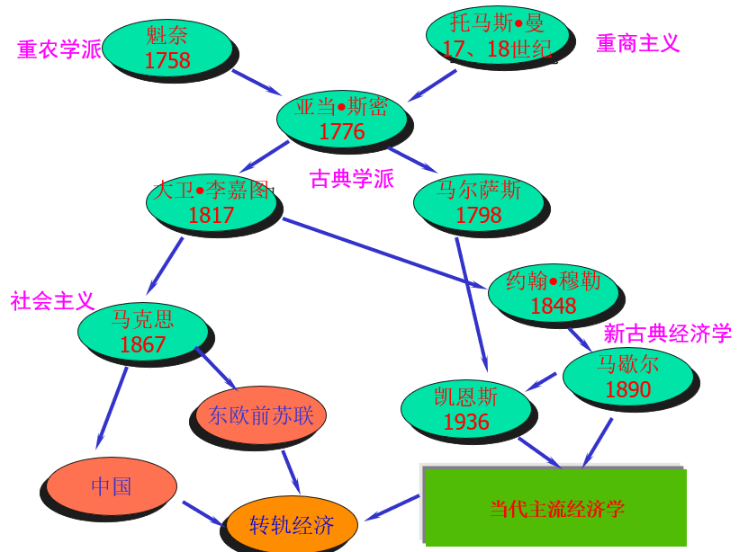

# 西方经济学基础1【概论】

经济学研究的**核心问题**是**人与人之间因资源稀缺性所导致的冲突及其协调**。经济学的**研究对象**是**稀缺资源的有效配置与利用**，即它研究的是人和社会的行为，因此属于**社会科学**的范畴。**它采用了科学的研究方法**（使用数学工具分析）

经济资源包括人力资源和非人力资源，人力资源构成了*劳动力*生产要素；非人力资源包含了*土地*和*资本*两大生产要素，这三个生产要素决定了生产力，但经济资源还具有稀缺性，因此会产生个体、群体之间的冲突

> 生产可能性边界：在资源既定的情况下，一个社会所能生产的产品的最大产量的组合
>
> 解决社会生产问题的关键就是要找到生产可能性边界上的一个点，让矛盾得到最大的缓解

经济资源稀缺性体现在两个方面：  **社会资源是有限的**——在短期内，社会能够生产的汽车和巧克力是一定的；**人类的物质需求是无限的**——人们总是追求更好的生活水平

经济学研究包含四个层次：

* **环境描述**
* **个人决策**：基于收益与成本权衡个人对资源的安排
* **个体间交互**
* **经济规则**：制度的经济内涵，以**经济由谁决策**的问题为核心

包含两个基本对象：

* 个人决策
* 社会决策

决策需要考虑效率最优原则，尽可能让个人或社会得到的利益最大化，这就要综合考量机会成本和沉没成本

> 名词解释
>
> 1. **机会成本**：作出一项决策时所放弃的其他可选方案能获得的最大好处
>
>     即选择最优方案时所需要放弃的次优方案的价值。**除非别无选择，否则任何选择都会有机会成本**
>
> 2. **沉没成本**：决策以往发生的，但与当前决策无关的费用
>
> 3. *帕累托改善**：在不损害别人福利的前提下，某个人的福利得到改善***
>
>     **帕累托效率**：在不损害别人经济福利的前提下，如果已不可能找到资源使用的其他方法来增加任何一个人的福利，此时资源配置效率最高，称为帕累托效率；或者说达到*帕累托最优*

根据帕累托效率的逻辑，当社会中所有人都达到帕累托最优，整个社会也达到了帕累托最优，此时的社会生产是最高效的

经济规则包含了三个分支：

**市场经济**（Market economy）：由私人部门决策——老百姓（企业和家庭）说了算，自下而上

**计划经济**（Planned economy）：由政府（公共部门）决策——政府说了算，自上而下

**混合经济**（Mixed economy）

## 经济学基本研究方法

### 解释与预测

经济学的预测通常是随条件变动的预测，不是条件不变的预报，更不是无条件预言。比起常见的自然科学预测，经济学模型会一直处于大量变量干扰的混沌状态

### 理论和模型

经济学利用**理论**和理想**模型**解释经济现象，理论或模型是对经济现象及其关系的简化描述。

经济学理论遵循奥卡姆剃刀原理：省略无用信息，保留有用信息，精简表述

### 假说和检验

提出假说-检验假说-修正假说-再验证，这是经济学中建立假说的通用方法。与自然科学类似，理论首先要满足可证伪性：理论陈述必须在逻辑上有可能被经验证明是不真实的。因而在提出科学理论（假说）时，必须同时说明在什么条件下，该理论将不再成立

**计量经济学**和**实验经济学**为检验假说提供了理论工具

### 实证与规范

**实证**：回答“是什么”的问题。超脱价值判断，只研究经济学本身的内在规律，并根据这些规律解释和预测人们的经济行为。可以理解成从更高的经济学理论维度解释实际的经济学现象

> 类似于量子理论从数学推导，再从数学物理角度提出潜在规律的思路。这是对经济规律这个混沌黑箱的“无奈之举”。也可以理解成从以往的历史经验里面得到经济学模型的参数，从而反推这个黑箱在输入A（某个固定的值）时输出的是什么

**规范**：回答“应该是什么”的问题。以一定的价值判断为基础，提出某些标准作为分析处理经济问题的标准，作为制定经济政策的依据，并研究如何才能符合这些标准。可以理解成“我们先想办法让人们做某件事，问题就会得到解决”

> 更贴近工程学的解决思路，不考虑问题的原理，只要想办法解决问题

从这两个思路中发展出了实证经济学和规范经济学，二者作为矛盾对立统一。

实证经济学在什么是经济的恰当模型方面存在分歧（实质是所作假设的差异）；即使不同学说对恰当的理论模型意见一致，在数量问题上也可能存在分歧

规范经济学则存在价值判断的差异

## 经济学的主要内容

### 西方经济学的发展历史简述

**亚当·斯密**（1723-1790）：古典学派卓越的创始人，现代经济学的开山鼻祖。《国富论》《国民财富的性质和原因的研究》

**大卫·李嘉图**（1772-1823）：亚当斯密之后古典学派的领袖。《政治经济学及赋税原理》

**约翰·斯图亚特·穆勒**（1806-1873）：古典经济学派最后一位重要的经济学家。《政治经济学原理》

**阿尔弗雷德·马歇尔**（1842-1924）：新古典主义的一代宗师。《经济学原理》《产业与贸易》《货币信用与商业》

**约翰·梅纳德·凯恩斯**（1883-1946）：宏观经济学的创始人。《就业、利息与货币通论》

**保罗·萨缪尔森**（1915-2009）：大量经济数学原理的提出者。《经济学》

### 宏观经济学

**宏观经济学**以整个国民经济为研究对象，通过研究经济总量的决定及其变化，来说明资源如何才能得到充分利用

**研究对象**：国民经济整体

**研究目的**：资源充分利用

**理论核心**：国民收入决定理论

主要内容如下：

* **国民收入理论**

* **通货膨胀**

* **失业**

* **经济增长与波动**

* **宏观经济政策**

### 微观经济学

**微观经济学**通过研究单个经济单位的经济行为和相应的经济变量单项数值的决定，说明价格机制如何解决社会的资源配置问题

**研究对象**：单个经济单位

> 对于不同的经济单位有不同的目标。
>
> 比如家庭（household）以效用最大化为目标，出售生产要素、购买商品；厂商（firm）以利润最大化为目标，购买生产要素，出售商品

**研究目的**：资源有效配置

**理论核心**：价格理论

主要内容如下：

* **价格理论**

* **消费理论**

* **生产理论**

* **分配理论**

* **市场失灵与微观经济政策**