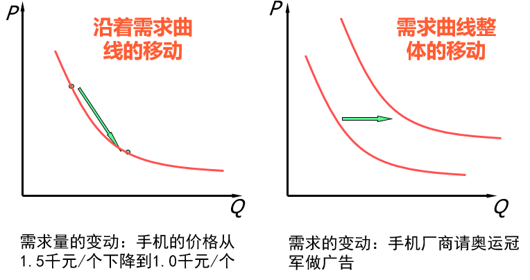
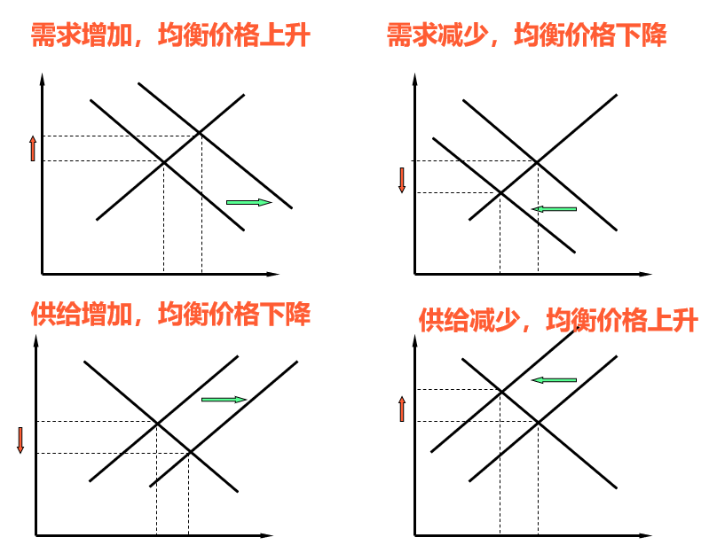
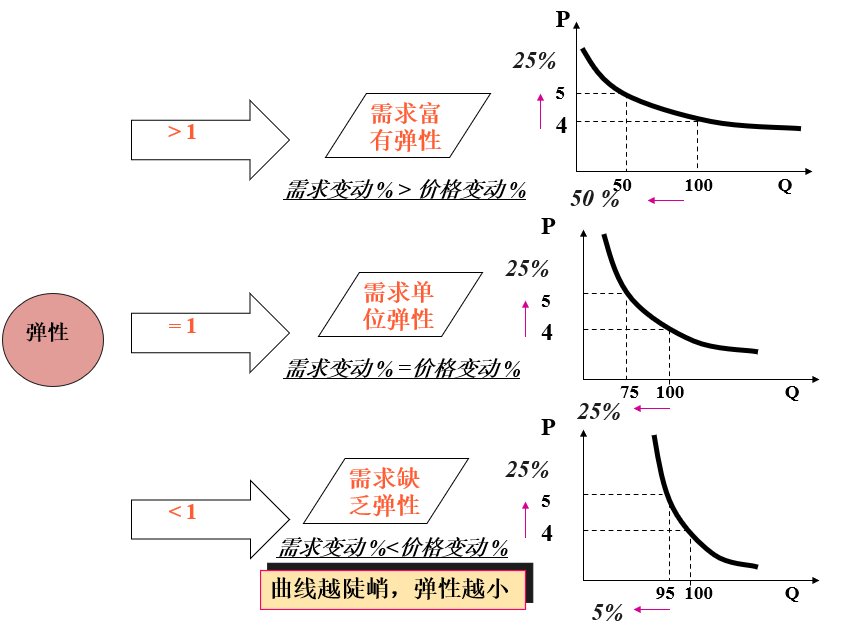
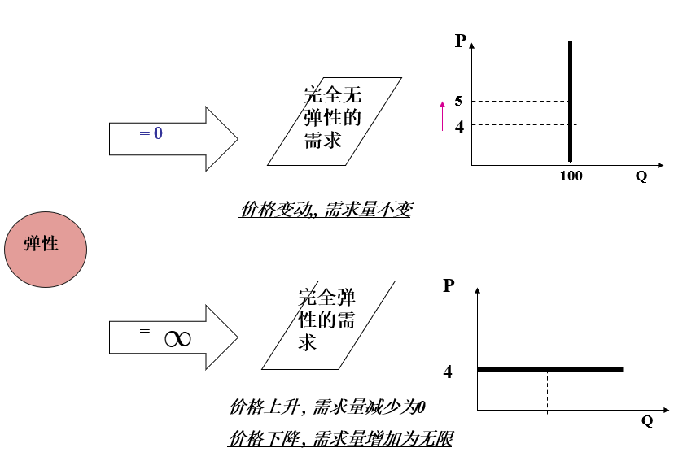
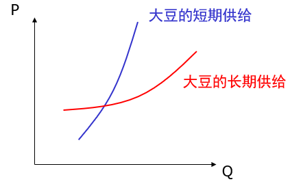
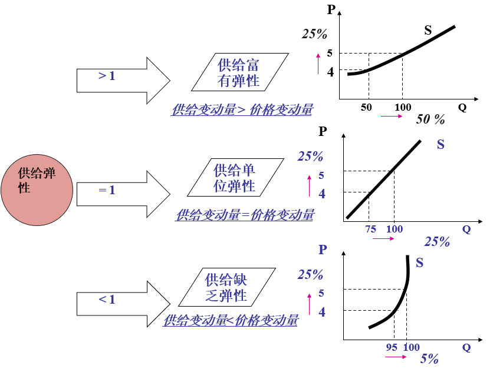
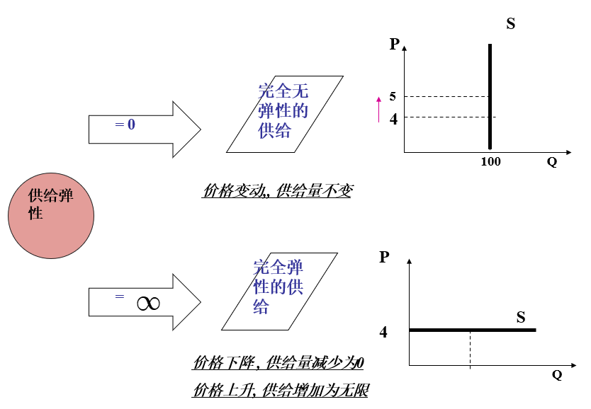

# 西方经济学基础2【供给和市场】

## 需求

**需求**：居民在某一特定时期内，在每一价格水平下愿意而且能够购买的商品量

需求是购买欲望与支付能力的统一

**需要!=欲望!=需求**

### 影响需求的因素

1. 商品本身的价格

    **价格与需求成负相关**

2. 其他相关商品的价格

    存在替代品和互补品概念

    > **替代品**：能满足同一种欲望的商品
    >
    > **互补品**：共同满足同一种欲望的商品

    **替代品价格上升，与他替代的其他产品需求增加；替代品价格下降，与他替代的其他产品需求减少**

    **互补品价格上升，需求减少；互补品价格下降，需求增加**

3. 消费者收入（社会收入水平与贫富差距）

    **收入水平提高，需求增加；收入水平下降，需求减少**

4. 消费者嗜好

5. 人口数量

6. 政府消费政策

7. 消费者对未来的预期

8. 其他（广告、气候、时尚与突发事件等）

### 需求的定量描述

**需求函数**：若把影响需求的各种因素作为自变量，把需求作为因变量，则可用函数关系来表示影响需求的因素和需求之间的关系，这种函数称为需求函数

下面是一个需求函数的表述，实际中的需求函数往往具有更多自变量，更加复杂
$$
D = f(P,P_x,P_y,I,A, O)
$$
其中自变量依次为：收入、替代品价格、互补品价格、广告效应、其他

如果只考虑需求量与价格之间的关系，把商品本身的价格作为影响需求的唯一因素（也就是把其它变量当作常数），可以把需求函数改写为
$$
D=f(P)
$$
对于这样的需求函数，存在**需求定律**：其他条件不变的情况下，某商品的需求量与价格之间成反方向变动，即需求量随商品本身价格的上升而减少，随商品本身价格的下降而增加。

> 需求量和需求的变动需要解释一下：
>
> 需求量的变动：其他因素不变的情况下，商品本身价格变动所引起的需求量的变动
>
> 需求的变动：商品本身价格不变的情况下，其他因素变动所引起的需求的变动
>
> 

**需求增加：曲线向右移动**

**需求减少：曲线向左移动**

## 供给

**供给**：在某一特定时期内，卖者愿意出售且能够出售的一种物品的数量

供给是供给意愿和供给能力的统一

### 影响供给的因素

1. 商品本身的价格

    **供给量与商品价格成正相关**

2. 生产要素的价格

    **生产要素价格升高，供给量降低**

3. 预期的未来价格

    **预期未来价格升高，供给量升高**

4. 供给者的数量

    **供给者数量与供给量正相关**

5. 技术

    **科学技术提高会带来供给量的提高**

供给也可以定量分析

存在**供给函数**：若把影响供给的各种因素作为自变量，把供给作为因变量，则可用函数关系来表示影响供给的因素和供给之间的关系，这种函数称为供给函数，用**S**表示

 因为供给的影响因素很多，因此同样可以只考虑价格这一个因素，将供给函数写为：
$$
S=f(P)
$$
有**供给定律**：在其他条件不变的情况下，某商品的供给量与价格之间成同方向变动，即供给量随商品本身价格的上升而增加，随商品本身价格的下降而减少

> 供给量的变动：其他因素不变的情况下，商品本身价格变动所引起的供给量的变动
>
> 供给的变动：商品本身价格不变的情况下，其他因素变动所引起的供给的变动

## 市场均衡

**商品的需求价格等于供给价格，商品的需求数量等于供给数量**，则称市场达到**均衡**，这时的市场价格称为**均衡价格**，交易数量称为**均衡数量**

市场均衡是一种动态平衡，经济中各种对立的、不断变动的力量，处于一种势均力敌、相对静止、不再变动的状态。每种力量独自都可能变化或暂时静止，但总体上平衡

均衡是经济学中的核心概念，一般来说，它兼有“**稳定、最优**”的含义

**当且仅当供给曲线与需求曲线达到交点时，市场均衡**

供给>需求会导致供过于求，供给量-需求量=超额供给

供给<需求会导致供不应求，需求量-供给量=超额需求

均衡价格（以及均衡数量）是由需求和供给决定的，因此需求和供给任何一方的变动都会引起均衡价格的变动，

上图揭示了价格与供给-需求之间的关系，可以发现**价格是资源稀缺程度的信号**

由于价格为供给提供*正激励*，为需求提供了*负激励*，这就有助于产生一个周期：

供给过多-价格下降-需求增多-趋于平衡

需求过多-价格上升-供给增多-趋于平衡

可以发现实质上价格为市场提供了一个**负反馈**机制，可以让市场进行**自发调节**，这也正是价格市场调节的特点

政府调节（宏观调控）往往会导致腐败问题和黑社会问题，完全放任的市场调节则必定导致致命的经济危机，而适当的市场调节有助于经济运行

## 弹性理论

使用供给-需求函数的导数来描述**需求/供给对价格的灵敏程度**，这就是弹性理论的核心

**需求弹性**（需求价格弹性）：衡量需求量对价格变动的反应程度

**供给弹性**（供给价格弹性）：衡量供给量对价格变动的反应程度

### 需求弹性

$$
需求弹性=\frac{需求量变动的百分比}{价格变动的百分比}
$$
用公式描述即为：
$$
E_d=\frac{\frac{\Delta Q}{Q}}{\frac{\Delta P}{P}}=\frac{dQ}{dP}\frac{P}{Q}
$$
价格上涨（ΔP>0）引起需求量下跌（ΔQ<0），因此需求弹性为负，实际中**取其绝对值**

> 需要注意：弹性没有单位且恒为正

弹性理论可以用来解释涨价是否能增加销售收入问题：需求弹性大于1时，表示价格增加1%，需求量会对应减少2%，相当于收入降低；需求弹性小于1时，价格增长1%，则需求量减少0.5%，可以增加收入；需求弹性等于1时表示价格增长和需求量减少比例等同，收入不变

需求弹性存在两个极限

* $E_d =0$：价格变动，需求量不变
* $E_d = \infin$：价格一旦变动，需求量不是变为无限就是变为0

这两种情况在实际生活中不存在

### 供给弹性

供给弹性的数学表述如下：
$$
供给弹性=\frac{供给量变动的百分比}{价格变动的百分比}
$$
即
$$
E_s=\frac{\frac{\Delta Q}{Q}}{\frac{\Delta P}{P}}=\frac{dQ}{dP}\frac{P}{Q}
$$
与需求弹性类似，他也没有单位且恒为正

生产时期的长短、生产的难易程度、生产所采用的技术类会影响供给弹性

* 长期供给弹性大于短期供给弹性（长期供给曲线较平缓）

    以大豆供给为例，长期供给过程中，供给量可以通过调整种植结构、改善种植技术等方式与市场需求进行配合调节

    

同样具有和需求弹性一样的图像表征

### 商品性质的弹性理论表述

替代品与互补品可以用**需求交叉弹性**描述

> 需求变化幅度与替代品（互补品）价格变化幅度的比值

**需求交叉弹性大于零，替代品**

**需求交叉弹性小于零，互补品**

必需品、奢侈品可以用**需求收入弹性**（需求变化幅度与收入变动幅度的比值）表述

**需求收入弹性大：高档品/奢侈品**

**需求收入弹性小：必需品**

**需求收入弹性为负：低档品/劣等品**

### 影响弹性的市场因素

1. **相近替代品的可获得性**

    低档品容易获得，其弹性较小；高档品不容易获得，其弹性较大

2. **时间的长短**

    价格变动后持续时间越长，弹性越大（消费者有足够的时间调整消费习惯）

3. **用于物品的支出在收入中所占的比重**

4. **必需品与奢侈品**

    必需品的弹性很小，需求几乎不会随价格变化；奢侈品的弹性则较大

5. **市场的范围**

    小市场中的供给和需求弹性一般较小
