# 西方经济学基础3【消费生产决策】

## 消费决策

### 边际效用递减规律

**效用**是从消费某种物品中所得到的满足程度，满足程度越高，效用越大；满足程度越低，效用越小

这是一种心理感受，来源于消费者对商品的偏好，不同的人消费同一种物品往往会产生不同的效用；同一个人在不同的情形下有不同的效用

存在**总效用**（Total Utility）：消费一定量某种物品中所得到的总满足程度

和**边际效用**（Marginal Utility）：某种物品的消费量增加一单位所增加的满足程度

由于**生理或心理原因**，**随着消费者对某种物品消费量的增加，他（她）从该物品连续增加的消费单位中所得到的边际效用递减**

这就是边际效用递减规律

### 消费者均衡理论

有如下基本假设：

* **消费者理性**：假设一个决策者面临几种可供选择方案时，会选择其中使他的效用达到最大的那个方案
* **消费者知道自己的效用**
* **消费者的行为与目标具有一致性**

在消费者偏好稳定、收入一定（资源稀缺）、商品价格不变的情况下，消费者的目标应当是：**面临各种商品，以自己有限的收入，获取最大的效用**，这称为**消费者决策问题**

**消费者均衡**（consumer equilibrium）：消费者以使总效用最大化的方式来配置其收入的状态

**消费者决策问题的最优解就是消费者均衡**

在决策中，**两种消费产生的边际效用相等时，总效用最大**。可以用数学证明：对于目标函数$TU=U(X,Y)$，有约束条件$P_X Q_X+P_Y Q_Y = I$，以拉格朗日乘数法解得总效用TU达到极大值的必要条件为
$$
\frac{U_x}{P_x}=\frac{U_y}{P_y}=\lambda
$$
实际上往往存在系数M和N，使得
$$
\frac{MU_x}{P_x}=\frac{NU_y}{P_y}=\lambda
$$
也可以通过*无差异曲线*与*等收入曲线*来证明消费者均衡理论

> **无差异曲线**：用来表示两种商品的不同数量的组合给消费者所带来的效用完全相同的一条曲线，其斜率等于边际效用之比
>
> 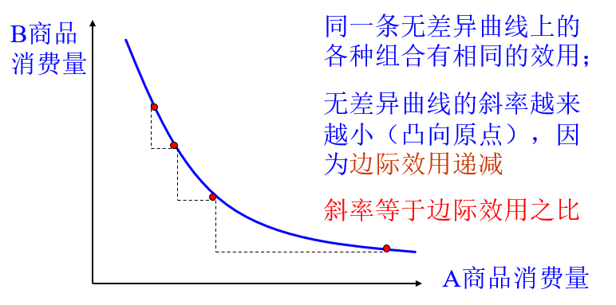
>
> 在同一平面图上有无数条无差异曲线，不同的无差异曲线代表不同的效用水平；距原点越远，效用越大
>
> 在同一平面上，任意两条无差异曲线不能相交
>
> 无差异曲线的斜率恒为负值（曲线单减）
>
> 表示用一种商品 去交换另一种商品的比率，称为**边际替代率**，表示为
> $$
> MRS=\frac{\Delta Y}{\Delta X}=\frac{dy}{dx}=-\frac{MU_X}{MU_Y}
> $$
> 存在完全替代品、完全不可替代品、不完全替代品，其边际替代率曲线如下所示
>
> 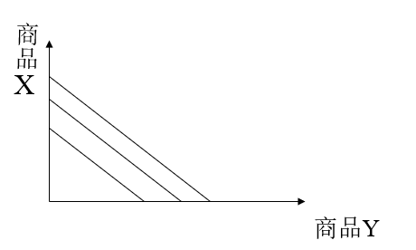
>
> 完全替代品
>
> 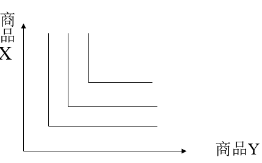
>
> 完全不可替代品
>
> 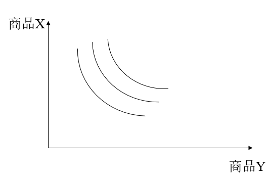
>
> 不完全替代品
>
> **等收入曲线**：表明在消费者收入与商品价格既定的条件下，消费者所能购买到的两种商品数量最大组合的线。也可以成为等支出线、家庭预算线或消费可能线。该曲线说明了消费者行为的限制条件
>
> 斜率表示价格比$-\frac{P_x}{P_y}$

当且仅当无差异曲线与等收入曲线相切时，切点斜率相等，价格比等于边际效用比，从而有
$$
-\frac{MU_X}{MU_Y}=-\frac{P_X}{P_Y}
$$
化简为
$$
\frac{MU_X}{P_X}=\frac{MU_Y}{P_Y}
$$
M=N时上式成立

存在下图

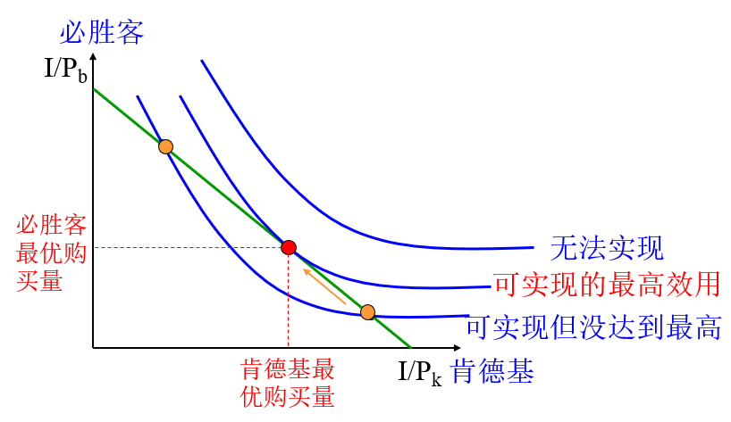

### 替代效应与收入效应

**替代效应**：在总效用水平保持不变的情况下，价格变化对需求量的影响

**收入效应**：在相对价格保持不变情况下，购买力变化对需求量的影响

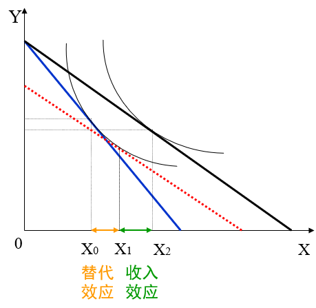

**个人需求曲线**：消费者均衡点随价格变化的曲线

如下图所示，随商品价格降低，等收入线与横轴的交点右移（斜率绝对值减小），于是等收入线和无差别线的交点（均衡点）也右移，等效于个人购买商品数量增加，于是构成了个人需求曲线

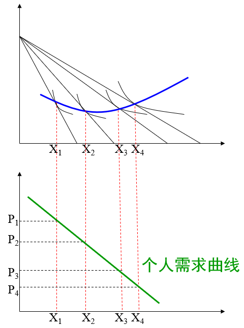

**市场需求曲线**：市场上所有消费者需求曲线的横向叠加

### 非理性消费

1. 交易效用

    **获得效用**：取决于该商品为消费者带来的实际价值

    **交易效用**：取决于消费者购买该商品所付出的价格与参考价格之间的差异，如果商品价格比参考价格低，消费者就得到了优惠，就能感受到交易效用

    交易效用的存在使消费者购物的理由不再是产品的实际价值，而是产品的优惠价格。也就说，**占便宜成为购买的理由**，从而引起冲动的非理性消费

2. 从众心理

3. 边际效应递减的心理影响

    边际效应递减规律也意味着**额外损失1元的痛苦大于额外获得1元的快乐**，这种厌恶损失的心理同样会引起非理性消费。

4. 框架效应

    损失和收益的标准，不是固定的，而是可以通过语言的表述发生变化的，在适当的措辞和表达方式的影响下，人们意识中的损失可以变成收益，收益也可以变成损失，这就是卡尼曼和特沃斯基的**框架效应**

5. 心理账户理论

    不同来源的钱会被赋予一个“心理账户”，其“重要性”往往不同

6. 锚定效应

    **人们在对商品的价格进行预估的时候，很容易被之前的数字所锚定**

7. 对价格差异的感受

    消费者对价格差异的感受与基础价格的水平有关，消费者对价格变化的感受更多取决于相对价格，即取决于价格变化的百分比，而不是变化的绝对值

    > 原价300，现价200；原价10000，现价9900，人们往往倾向于前者，而感觉后者的降价幅度小。实质上两者的降价是相同的

8. 消费者自我升级

    有时候，消费者购买产品或服务，并不是因为这些产品或服务与现实自我相一致，而是因为这些产品或服务与理想自我相一致，消费者希望通过这些消费提升自我价值，达到理想自我的标准

9. 社会取向与地位竞争

    本质上就是攀比消费和炫耀消费——看别人如何生活，自己也想要获得这样的生活从而引起消费；抑或是炫耀自己的财力，购买不需要的东西（豪车豪宅等）

## 生产决策

生产决策的目的是让**利润最大化**，主要通过选择一个*最佳产量*来实现

### 生产函数

**生产函数**：表明在一定技术水平下，生产要素的数量与某种组合和他所能生产出来的最大产量之间依存关系的函数

生产函数以生产要素的投入量作为自变量，在技术不变的情况下描述产量

在投入要素为一种时，表现为函数$Q=f(x)$；在n种要素投入的情况下，表现为多元函数$Q=f(x_1,x_2,...,x_n)$

> **总产量**（TP）：一定量的某种生产要素所生产出来的全部产量
>
> **平均产量**（AP）：平均每单位要素所生产出来的产量（总产量/生产要素的数量）
>
> **边际产量**（MP）：生产要素增加一个单位所增加的产量

### 边际产量递减规律

**在技术不变的情况下，某种生产要素的增加（其他生产要素的投入不变）最初使产量增加，但它的增加超过一定限度时，增加的产量将要递减，最终还会使产量绝对降低**

边际产量递减规律由客观因素决定

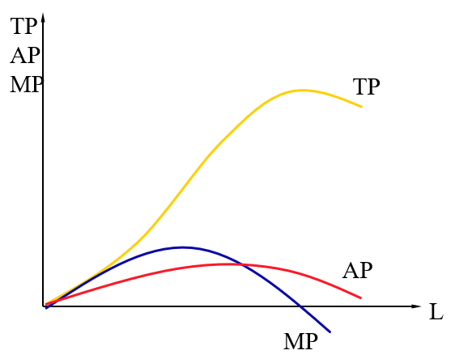

边际产量递减规律又称为**边际收益递减规律**，其生效范围时短期，在中长期，技术进步会让要素的产出不断增加

要证明该规律需要了解几个基本知识：

**等产量线**：某种商品的产量随生产要素投入的变化曲线

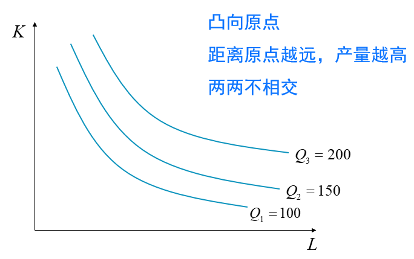

**边际技术替代率**：维持产量不变时，用一种生产要素替代另一种生产要素的比率。数学表达式为
$$
MRTS_{LK}=\frac{dK}{dL}=-\frac{MP_L}{MP_K}
$$
边际技术替代率等于等产量线上某点的斜率

**等成本线**：令$C=\omega L + r K$，将等产量线变换为斜率式，其中$\omega$表示工资，r表示利率，得到的曲线称为等成本线

斜率恒为
$$
-\frac{\omega}{r}=-\frac{P_L}{P_K}
$$

要素最佳组合：**等产量线与等成本线相切时，两种生产要素组合的比例最佳**

要素最佳组合的条件为
$$
\frac{MP_L}{MP_K}=\frac{P_L}{P_K}
$$

### 成本函数

**成本**（Cost）又称费用，是生产中所使用的各种生产要素的支出

经济学中的生产成本指的是**机会成本**，即某（几）种生产要素用于生产某种特定产品时，所放弃的所有收益

企业生产中的机会成本包含两部分：用于购买原材料和支付工人报酬的**显性成本**和支付经营者自身才能报酬与自有资金利息（资本成本）的**隐性成本**

用**成本函数**描述一定技术水平下厂商使用一组生产要素生产所花费的货币投入与最大实物产量之间的关系

成本由两部分组成：

* **固定成本**（Fixed Costs）：厂商在短期内必须支付的不能调整的生产要素的费用，**与当前产量无关**

    厂房和设备的折旧、管理人员的工资都属于固定成本

* **可变成本**（Variable Costs）：厂商在短期内必须支付的可以调整的生产要素的费用，**随产量的变动而变动**

    原材料、燃料支出、生产工人的工资属于可变成本

> 企业生产的利润来自于工人的剩余价值，因此用于支付给工人的工资就属于成本

根据成本的类型还能分成：

* **短期总成本**：短期内生产一定量产品所需要的成本总和，用STC表示

    短期总成本等于**固定成本（FC）与变动（VC）成本之和**

    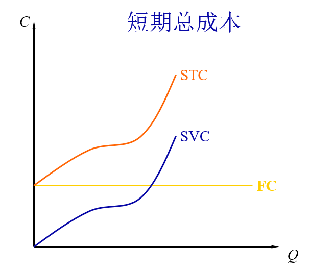

* **短期平均成本**：短期内生产每一单位产品所需要的成本（包括短期平均固定成本和短期平均变动成本），用SAC表示

    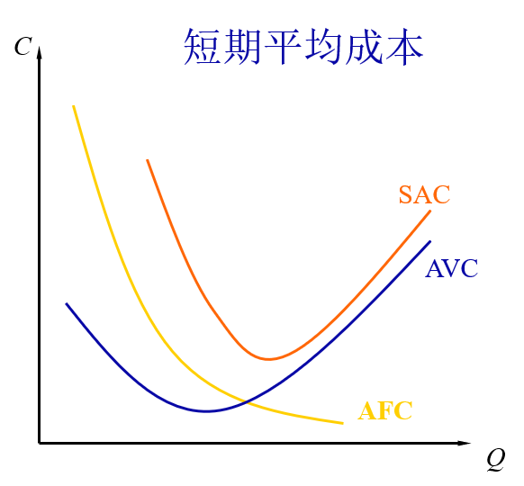

* **短期边际成本**：在短期内厂商每增加一单位产量所增加的总成本量，用MC表示

    > 从上面的内容中可以看出“边际”指的是*参数的增量*

    

### 利润与收益

经济学中只讨论**经济利润**：企业的总收益减去生产销售物品与劳务的所有机会成本；除此之外还有**会计利润**：企业的总收益减去企业的显性成本

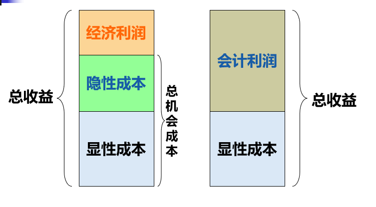

收益可以分成三类：

* **总收益**（TR）：厂商出售产品所得到的全部收入，等于价格乘以产量（假设以销量定产量）

* **平均收益**（AR）：销售每一单位的产品平均得到的收入，等于总收益除以产量

* **边际收益**（MR）：每增加一单位产量所增加的收入

    如果增加销量价格不变，边际收益就等于价格，保持不变；如果增加销量会降低市场价格，边际收益递减

一般地，企业需要根据边际收益和边际成本之间的关系规划生产策略：边际收益大于边际成本，扩大产量；边际收益小于边际成本，降低产量；边际收益等于边际成本，利润最大，产量最佳

也就是说**利润最大化条件是边际收益=边际成本**

> 这与消费者均衡理论对偶

与需求曲线对应，生产也有**市场供给曲线**：市场上所有企业供给曲线的横向叠加