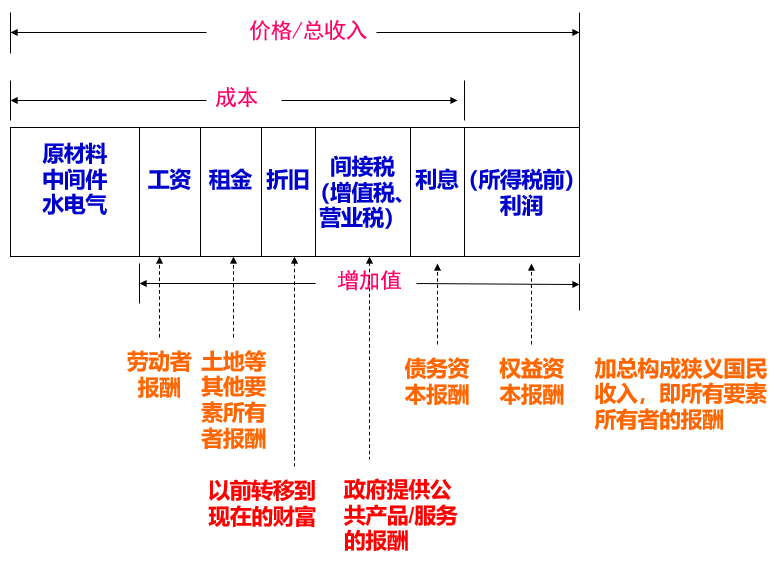
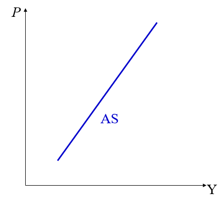
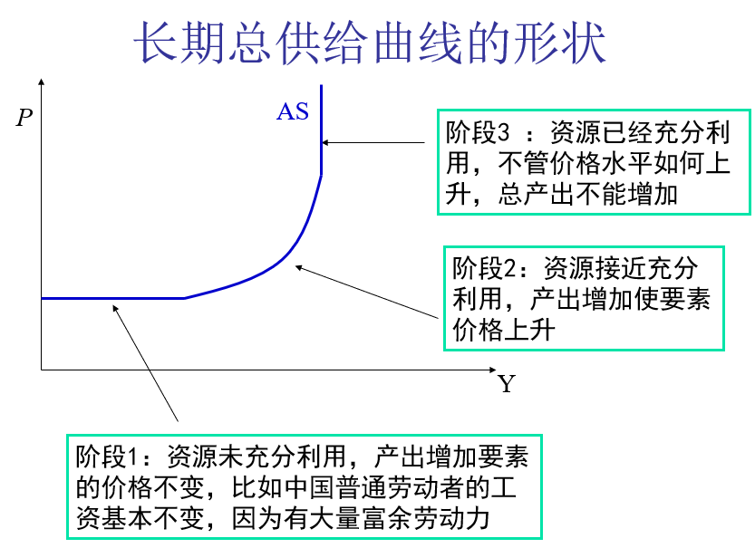
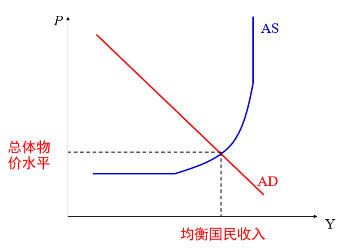
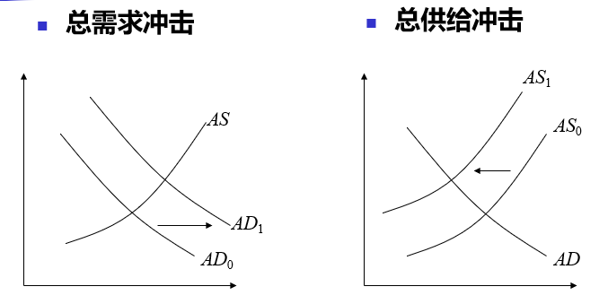

# 西方经济学基础5【国民收入理论】

宏观经济学的基本问题——四个问题

1. 经济增长
2. 就业与失业
3. 通货膨胀
4. 国际收支

宏观经济学的分析框架——三个市场

1. 产品市场

    决定了国民收入

2. 货币市场

    决定了通货膨胀问题

3. 劳动市场

    决定了失业问题

这六个点就是宏观经济学主要探讨的问题，下面几章将分点讨论

## 国民收入理论

国民收入理论是基于国民收入讨论商品市场的一种理论。其中的核心就是**国民收入核算**，也就是**用总产出衡量一国创造的财富**。

对于一个国家，应该有**总收入=总产出**，也就是兼顾收入和产出两个视角，做到收支平衡，在这一条件下利用经济指标衡量国民收入

衡量国民收入的指标主要有以下几点：

* **国民生产总值GNP**：一国在一年内所生产的最终产品（包括产品和服务）的市场价值的总和

    计算中需要注意：

    1. 衡量前一年内所创造的财富，不包括以前年度的
    2. 计算最终产品与成本之间的差价作为利润
    3. 需要包括有形和无形的所有产品与服务

* **国内生产总值GDP**：在一国范围内一年所生产的最终产品（包括产品和劳务）的市场价值的总和

    GDP可以被理解为不强调经济实体国别的GNP概念

    计算中需要注意：

    1. 从地域角度，考虑的是一国经济领土内经济产出总量
    2. 从身份角度，统计利用一国国民（常驻单位）拥有的劳动和资本等要素所提供的产出总量。海外公司在本国创造的经济应当被记入本国的GDP

    随着国际经济联系加强，强调身份区别的GNP相对重要性下降，重视地域范围的GDP相对重要性上升，GDP成为越来越重要的总产出指标

    > **名义GDP**：未调整过的GDP(当年价格水平衡量的GDP)
    >
    > **实际GDP**：名义GDP除以价格水平
    >
    > **潜在GDP**：如果劳动和机器都得到充分利用，一个经济能实现的总产出

* **国内生产净值NDP**：国内生产总值减去固定资产折旧

    由于固定资产折旧不是新创造的价值，而是以前创造价值在生产过程中发生的价值转移，因而从理论上讲，NDP是更为可取的反映一定时期生产活动最终成果的总量指标。然而，由于折旧占GDP或GDP比例一般来说相对稳定，用GDP（GNP）与NDP在表示经济活动总量变动意义上差别不大，人们一般更为习惯采用GNP或GDP概念

* **国民收入NI**：广义的国民收入泛指GDP、GNP等经济活动总量；狭义国民收入指一国一年用于生产的各种生产要素得到的全部收入，即工资、利润、利息和租金的总和

    国民收入要加上折旧、间接税等才形成GDP

    **宏观经济学中国民收入核算、国民收入决定都指广义国民收入**

* **个人收入PI**：个人从各种来源得到的收入总和

    资本收益构成个人收入，但国民收入账户不包括资本收益；企业的未分配利润包括在国民收入中，但不看作个人收入

* **个人可支配收入PDI**：个人可实际使用的全部收入，指个人收入中进行各项社会性扣除之后（如税收，养老保险等）剩下的部分

**一般情况下使用GDP衡量国民收入**

> 存量：衡量一个时间点上的项目，比如资本存量——构成一个经济体生产潜力的全部建筑物与机器价格的总价值
>
> 流量:一个时期内存量的变化
>
> 对存量求导就可以得到流量

我们一般使用**国民收入账户**作为国民收入核算的工具。

存在下面三种方法进行具体的国民收入核算：

1. **产品支出法**（expenditure approach）

    又称最终产品法。从最终产品的使用出发，把一年内购买的各项最终产品支出加总，计算该年内生产的产品和劳务的市场价值

    > 基本思路就是“我不想知道我是怎么来的，我只想知道我是怎么没的”，通过核算支出项来确定收入项
    >
    > 也就是利用总收入=总支出的右边推导左边

    包含几个关键概念：

    * 消费（consumption）：即居民支出，一般占到GDP一半以上
    * 投资（investment）：包括可长期存在和使用的固定投资（重置投资与净投资之和）和不代表产品和劳务实际支出，而是企业持有存货数量变化展现的存货投资（产量超过实际销售量的存货积累）
    * 政府购买（government purchase）：政府购买的产品与劳务总和
    * 净出口（net exports）：出口减去进口得到的差额，表示本国最终产品有多少通过外国人支出而实现其市场价值

    需要注意：*居民购买耐用品属于消费*，虽然具有投资性质；*居民支付教育费用属于消费*；*居民购买住房属投资*；*居民租房支出属于消费*；*家庭存货不予考虑*；*企业存货增加或减少相应地使投资增加或减少*

    西方用C表示居民消费，I表示私人部门投资。而我国国民经济统计中的“最终消费”包括居民消费、政府消费。

    公共部门投资和私人部门投资都被称为“资本形成过程”

2. **收入法**（income approach）

    又称要素支付法，从收入角度计算GDP。我国依据收入法统计GDP分为四项：

    1. 劳动者报酬：包括货币工资、实物工资和社会保险费等三部分
    2. 生产税净额：生产税费减去生产补贴后的差额
    3. 固定资产折旧：为了弥补固定资产在生产过程中的价值损耗而提取的价值
    4. 营业盈余：经济活动增加值在扣除了劳动者报酬，生产税净额和固定资产折旧之后的余额，等于企业利润

3. **部门法**（sector approach）

    又称生产法或增加值法，依据提供产品与劳务各部门增加值计算GDP。也就是所谓的从源头计算

    其中*政府部门劳务按其收入计算*

核算总收入如下所示：

存在两个特征：**在支出法GDP中，消费占主要部分；在收入法GDP中，工资占主要部分**

### 总供求模型

这是国民收入的决定理论

首先定义两个概念：

* **总需求：整个社会对产品与劳务需求的总和**
* **总供给：用货币衡量的全部产品与服务供给/销售的总和**

总需求由*消费、投资、政府支出和净出口*四部分共同决定
$$
AD=Consume+Investment+GovernmentPayout+X-M
$$
**总需求曲线随价格水平上升而下降**

> 存在
>
> **实际资产效应**：价格水平升高，人们持有的资产的实际购买力下降，支出下降
>
> **跨期替代效应**：价格水平升高，当前消费不合算，人们将增加储蓄，转而增加未来的消费
>
> **开放替代效应**：价格水平上升，购买外国商品更便宜，出口减少，进口增加
>
> 三种效应，共同影响下决定了总需求曲线随价格的变化

总需求曲线也会随着外界条件变化，原因包括三点：**预期**、**政府政策**和**世界经济**

总供给曲线比总需求曲线更复杂一些

总供给一方面决定于社会拥有的资源，另一方面决定于要素的所有者是否愿意将这些要素投入经济

资源越多，总供给就越大；价格决定要素所有者将要素投入经济的意愿

**短期来讲，总供给曲线向上倾斜**

> 社会产出增加，对要素的需求增加，导致价格上升（这里的价格包括劳动力的价格和资本的价格）
>
> 因此利用这些要素生产出来的产品价格就上升

短期总供给曲线会随要素价格和决策者预期的变化而变化

长期来讲，总供给曲线呈现三个阶段

如果结合总供给和总需求曲线，可以发现**存在一个总供给=总需求的平衡点**

这一点的价格称为**总体物价水平**；这一点的国民收入称为**均衡国民收入**

在这个平衡点，存在**国民经济均衡**状态：总体上供求平衡，物价稳定

如果发生下面的情况

> 总需求大于总供给：总体上供不应求，导致物价上升
>
> 总需求小于总供给：总体上供过于求，社会上有大量产品积压

说明国民经济不均衡，这就需要政府进行宏观调控了

平衡点变动的原因包含*总需求冲击*和*总供给冲击*

