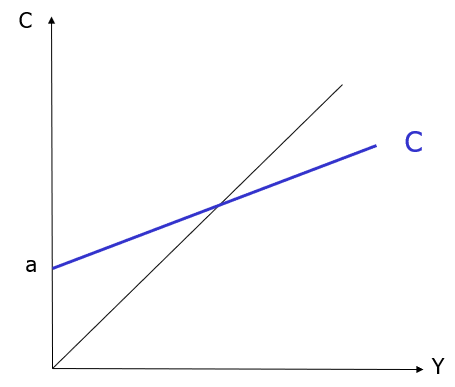
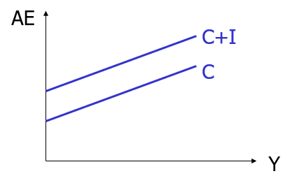
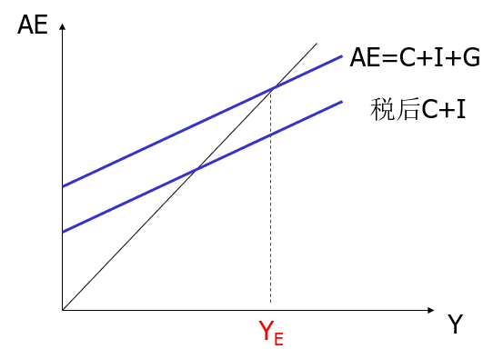
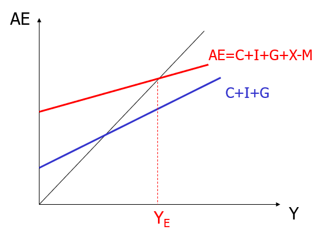
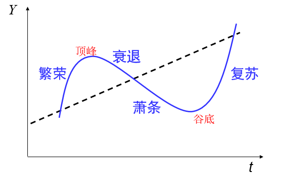

# 西方经济学基础6【总供给和总需求】

## 经济周期理论

在一国资源未充分利用的条件下，均衡国民收入主要决定于总需求，所谓**简单国民收入决定理论**，就是总需求决定国民收入的理论，该理论是有适用范围的

下面通过对消费与需求的分析解释经济周期理论

### 总消费

首先定义**消费函数**：描述居民消费与收入之间关系的函数

**总消费函数**：一国总消费与总收入之间的关系，用C表示

总消费与国民收入总是呈**正相关**，存在
$$
C= MPC \cdot Y+AC
$$
**自主消费（AC）**：可支配收入为零时的消费除以与收入水平无关的消费

**边际消费倾向（MPC）**：收入增加1元时消费增加的量

边际消费倾向就是消费曲线的斜率

>边际就是指对函数求导

### 边际消费与消费函数

消费函数总存在以下特征：

* MPC>0，消费函数曲线向上倾斜——与收入正相关
* MPC<1，效率低于1——边际消费倾向总小于1
* A>0，消费函数曲线截距为正——存在自主消费

因此消费函数曲线总像下面这样：

> 除了边际消费以外，还存在一些相关的概念
>
> 边际储蓄倾向：收入增加1元时储蓄的增加量
>
> 总有$边际消费倾向+边际储蓄倾向=1$
>
> 可支配收入（Yd）：可实际用于消费和储蓄的收入，等于收入减去税收
>
> 总有$Y_d=Y-T$，其中T表示税收
>
> 从反面讲，**消费是可支配收入的函数**，有$C=a+mY_d$

下面考虑一些客观因素深入分析

**投资**决定于利率、对未来经济前景的预期，主要不受当前国民收入水平的影响。投资使总支出曲线向上平移，斜率不变，依旧是边际消费倾向

投资相当于在整体曲线上加入了一个偏移量I

在有政府支出的情况下，存在下面的曲线，其中G表示政府支出，但是这个支出带来的偏移可以用税收来抵消

**进口**：本国居民购买的外国产品与服务，是本国可支配收入的函数

**出口**：外国从本国购买的产品与服务，取决于外国的收入，与本国收入无关

**净出口（贸易余额）**：出口减进口

**进口函数**：描述不同收入水平对应的进口水平

**边际进口倾向**：1元额外收入用于进口的数量

**边际进口倾向就是进口函数的斜率**

从国际贸易角度出发，进口相当于一个负偏移，如下图所示

### 乘数

假设社会没有投资，没有政府，社会所有的支出都用于消费，恒有
$$
总支出AE=C
$$
也就是**对整个社会来说，总收入=总支出**

这就是宏观经济学的最核心理念之一

在这一框架下，根据公式$C=mY+A$，其中m<1恒成立，则有下面的定理：

自发消费增加1元，国民收入增加不止1元，这种特征被称为**消费乘数**

由于这个乘数，勤俭节约对于个人或家庭来说是美德；然而对整个社会来说，节约意味着减少支出，均衡国民收入下降，迫使厂商削减产量，解雇工人，阻碍经济发展和就业增加——**社会需要消费**

### 总需求

要分析总需求，需要从两方面看，一个是*消费*，另一个则是*投资*

绝对收入假说：**消费由当前的可支配收入决定，边际消费倾向较高，在一定时期内是不变的；从长期看，收入增高时，边际消费倾向变小**

绝对收入假说就是凯恩斯理论的核心

消费随收入波动，具有不稳定性与敏感性。**收入增长，消费增长；收入下降，消费下降**。需要注意，这个理论**只对宏观经济政策有效**，因为**它需要乘数效应作为前提**

相对收入假说：**消费者的消费不仅受到个人目前收入的影响，还受到示范效应和棘轮效应因素影响**

> 示范效应：周围人，特别是相同社会阶层的人的收入和消费
>
> 棘轮效应：过去最高收入和最高消费
>
> 也就是“跟风消费”和“由奢入俭难”

**按照相对收入假设，消费具有稳定性，即消费的波动会小于收入的波动**，这会降低宏观经济政策的有效性

生命周期假说：**消费者根据一生的收入，安排一生中各个时期的消费，使一生的效用最大**

按照这个假设，当前收入对消费的影响很小，而**财富存量**是影响消费的重要因素

生命周期假说暗示：

* 消费比收入稳定，因为个人会在一生中大致维持稳定的消费水平
* 政府政策有效性很低，因为暂时性的收入产生的边际消费倾向几乎为零，不存在乘数效应

持久收入假说：**消费与持久性收入成正比**

> 持久性收入：能够在有生之年维持稳定的消费水平的收入

持久收入假说暗示：

* 持久性收入决定持久性的消费
* 暂时性的收入产生暂时性的消费
* 暂时性收入对持久性消费不产生影响

这几种假说看似矛盾，但都是对宏观消费情况的正确解释，只不过描述的方向不同

投资由企业固定投资、住宅投资、存货投资三部分构成

企业固定投资的决定因素包括：

* **企业收益**：企业收益越高，越倾向于投资
* **资本成本**：投资的成本越低，越倾向于投资
* **资金来源**（留存收益、信贷配给问题）：如果资金留存，无法变成流动资金，或是存在信贷配给低，企业就会考虑投资

住宅投资的需求则决定于用于**住宅的净收益**

> 净收益=总收益-成本-税收
>
> 其中总收益由
>
> * 租金
> * 业主居住所获得的隐含收益
> * 住宅增值产生的收益
>
> 构成
>
> 而拥有住宅的成本则由
>
> * 利息成本（抵押贷款利率）
> * 不动产缴纳的税金与折旧
>
> 构成

**住宅投资对实际利率和名义利率都很敏感**

存货投资包含两部分：**预期不到的存货投资**、**预期到的意愿投资**

> 存货：原材料、在制品（半成品）、尚未售出的产成品
>
> 企业往往为了下面几点持有存货：
>
> * 满足未来的商品需求
> * 降低订货成本
> * 技术原因

存货投资一般是因为销售量出乎意料（的小）而导致*产品积压*；意愿投资一般是出于企业积累存货

可以发现**存货投资的波动幅度一般大于国民收入的波动幅度**，这就是市场经济的滞后性表现

我们可以结合总供给中的消费和需求得出经济周期理论

### 经济周期

经济周期指**国民收入与经济活动的周期性波动**，以国民收入及增长率的周期性变化，并引起失业率、物价水平、利率、对外贸易等宏观经济变量的波动为表现

社会经济总体上会存在如上图的变化，不过根据时间长短还有不同分类的周期，如下所示

* 短周期：英国经济学家基钦研究了1890-1922年间英美的经济指标，发现存在一个3-4年的短周期
* 中周期：法国经济学家朱格拉最早（1860年）提出经济周期的思想，指出资本主义经济存在一个9-10年的周期；美国经济学家汉森计算出美国1795-1937年共有17各中周期，平均长度8.35年
* 库兹涅茨周期：库兹涅茨研究了英、美、法、德、比利时等国19世纪初叶到20世纪初叶的统计资料，指出存在一种与建筑业相关的经济周期，长度在15-25年之间，平均长度20年左右，这种长周期称为库兹涅茨周期或建筑业周期。
* 长周期：俄国经济学家康德拉季耶夫研究了英、美、法和其他一些国家的统计资料，认为资本主义有一种50-60年，平均长度为54年的长周期（长波）

熊彼得周期理论指出：每一个长周期包括6个中周期，每一个中周期包括3个短周期。短周期约为40个月，中周期为9-10年，长周期为48-60年

对于经济周期，众说纷纭，这里主要介绍现代经济周期理论的解释。现代经济周期理论认为**内生经济因素在经济的周期波动中起关键作用，外生因素通过内生因素起作用**。主要有以下流派：

* 凯恩斯主义：乘数加速原理

    > **乘数原理**：支出（消费、投资、政府支出、净出口）增加会使国民收入成倍增加
    >
    > **加速原理**：国民收入的变动会引起投资的急剧变动
    >
    > 这就是从上面的分析中得到的结论，由于乘数原理，经济会始终呈现上升趋势，但是由于加速原理，投资急剧变动又会带来消费的不稳定，从而导致一个螺旋上升的经济周期

* 货币主义

* 理性预期学派

* 实际经济（RBC）周期理论

## 经济增长

**经济增长（Economic Growth）**：国民收入的增加，既可指短期，也可指长期

**经济发展（Economic Development）**：伴随国民收入增加发生的社会经济结构等的变化，针对一国经济的长期变化过程，与经济增长相比具有更多的内涵

某个变量年增长率为X%，则该变量在$\frac{70}{X}$年内翻一番，因而称作“**70规则**”。从这一规则看，如果甲国经济增长率为1%，它的GDP翻一番需要年70，而乙国经济增长率为3%，翻一番时间仅为23年。也就是说，即便甲乙两国人均收入起点水平大体相同，2个百分点增长率差别在100年后会导致3-4倍的巨大收入差别。复利式增长可能会在较长时期导致极为惊人的结果

经济长期增长的影响因素包括：

* **自然条件**
* **劳动力**
* **资本积累**
* **人力资本**
* **技术进步**
* **对外开放**
* **制度条件**

> *历史经验表明，计划经济扼制经济活力，并存在难以克服的信息处理和协调困难，因而长期绩效普遍不如市场经济制度。充分发挥市场机制作用是谋求长期经济增长的前提性制度条件。*
>
> 个人并不同意该观点，但这段内容在教材中有重点提及，故在此加以注释。列宁时期的新经济政策本质上还是以计划经济为主体，斯大林时期建立在剥削农民上的高速工业化证明了计划经济的长期绩效能与市场经济达到类似乃至更高的水平，苏联后期的OGAS、智利的赛博协同系统计划都是对使用先进信息技术协调生产计划的探索，只是受限于时代条件而未能得到实践。作为马克思主义政治经济学的实践结果，计划经济无疑比市场经济更具有前瞻性——计划经济影响了近代经济学理论（尤其是通过政府宏观调控来实现的宏观经济学）更是一大铁证。
>
> 个人认为计划经济最大的问题在于难以找到一个稳定的外部条件（政治条件），非常容易由于”修正主义“、”错误管理“等进入急于求成/腐败/分配混乱的歧途。我国的中国特色社会主义经济制度旨在尝试结合市场经济和计划经济，不失为一个好的突破点，但近些年来出现的贫富差距等问题就说明了这条路也不是一条坦途。坏的市场败坏道德，坏的计划导致腐败，如何平衡二者还应待更多经济学家探讨

中国改革开放以来的实践证明，**制度改革是推动经济发展的决定性因素**

经济长期增长中的困难因素包括：

* **资源短缺与环境压力**
* **不平衡发展**
* **内需、外需**
* **地区差距**
* **收入差距与城乡差距**
* **产业结构失衡**
* **不充分发展**（教育、医疗、养老等各项民生事业发展不均衡、不充分）
