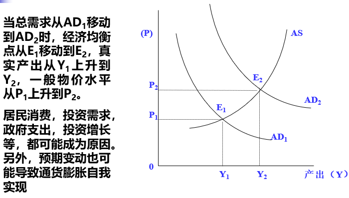
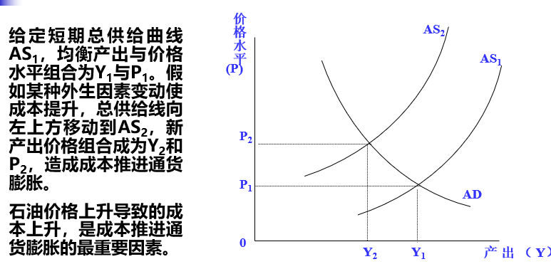
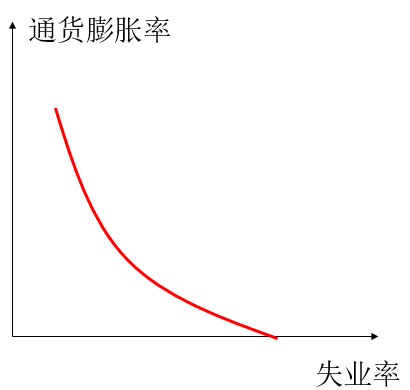

# 西方经济学基础7【通货膨胀】

## 通货膨胀

### 货币

**货币**：是一种交换媒介，是经济中人们经常用来向其他人购买物品和劳务的一组资产

货币是经济中的血液，具有以下三大职能：

* **交换媒介**：买者在买东西时向卖者支付的东西
* **价值尺度**：人们普遍认可的用来表示价格和记录债务的标准
* **价值储藏**：人们可以用来把现在的购买力转变为未来购买力的物品

从古至今，货币的形态一直在发生变化，最早使用的货币是**商品货币**，一般由**贵金属**担任，具有商品货币的天然属性——**本身有功用，物理度量标准，坚固耐久，匀质性**；随后出现了**纸币（法定货币）**和**支票货币（私人债务货币）**，**纸币突出交换媒介的职能，便于携带和贮存，本身无价值**（或者说相对于其代表的价值来说，货币本身的价值极小），所以**需要控制数量来保证稀缺性**，支票货币则代表了银行系统中的信用关系；随着互联网发展，**电子货币**开始占据主流，它能够更好履行货币的职能

### 货币的本质特征：流动性

**变现**：把一种资产变成普遍接受的支付手段

流动性是指**一种资产转变为社会普遍接受的交换媒介形态的难易程度**，**容易变现的资产流动性高，难以变现的资产流动性低**，货币是具有完全流动性的资产，其他资产也具有高低程度不一的流动性，因此具有不同等级的货币性。

**货币存量**：**经济中流通的货币量**

使用M0、M1、M2、M3等级来衡量货币存量

M0：通货+现金

M1：M0+各种机构的存款

M2：M1+居民储蓄存款+企业中带有定期性质的存款+外币存款+信托类存款

M3：M2+债券+商业票据+大额可转让定期存款

### 商业银行

**商业银行**是银行系统的主体，其**目的是盈利**，虽然也经营证券交易、保险甚至房地产等，但**基本业务是存款与贷款**，商业银行必须将大部分存款（以及自有资产）尽量以贷款的形式发放出去，才能实现盈利

其面临**挤兑**和**破产**的风险

为控制银行风险，商业银行必须保留部分存款，作为**准备金**（储备金），准备金占存款的比例称为**准备金率**

> 假设银行中的初始存款有100元，银行将其中90%贷款出去，另外10%作为准备金，现在银行准备金率为10%，如果贷款出去的90元被存给另一个银行，另一个银行产生90元存款并将其90%即81元贷款出去，这样又产生了81元的银行债务，于是最终会产生比原有100元更多的货币
>
> 其中经济中货币的供给量从最初的100元变成了$\alpha * 100$，商业银行的贷款创造了货币，扩大的倍数称为**货币乘数**

**货币乘数=1/法定准备金率**

**准备金率越低，货币乘数越大**

**商业银行创造货币增加了经济的流动性，但并没有增加实际财富**

### 中央银行

**中央银行是政府的银行，不以盈利为目的，不经营商业银行和金融机构的业务，而是具有服务机构和管理机构的双重性质**

其主要职能包括：

* 发行货币，控制现进发行量
* 管制商业银行：为商业银行保存准备金、规定法定准备金率、作为商业银行最后的融资者（当商业银行资金周转不灵时为商业银行提供贷款来防止出现经济问题）
* 集中保管黄金和外汇储备
* 制定货币政策，干预经济

从中央银行的角度上，可以定义两个概念

* **基础货币**：现金+银行准备金
* **货币乘数**：货币总量与基础货币之间的倍数关系

由于中央银行可以控制现金发行量和准备金率，因而中央银行对于基础货币具有相当程度的控制力，从而间接控制货币供给量

总的来说，中央银行控制了基础货币，是货币供给的决定力量，也就是政府控制了货币供给；商业银行创造货币，这是货币供给中的关键环节，但并不是决定力量

### 通货膨胀

**通货膨胀**：物价水平的**普遍持续上升**

使用**物价指数**衡量通货膨胀情况：现期某些物品的价值与基期同样物品价值的比率，并乘以100
$$
物价指数=\frac{现期物价}{基期物价} * 100
$$
**通货膨胀率**：现期价格较前期变动的百分比

物价指数主要分为两类，分别从供给和需求侧描述：

* **消费物价指数（CPI）**：根据普通居民的*消费*物品组合计算的物价指数
* **生产物价指数/工业品出厂价格指数（PPI）**：衡量*生产*者出售的物品的价格水平

还有从GDP角度描述的**GDP缩减指数**：用来计算实际GDP的物价指数，是名义GDP和实际GDP的比值

通货膨胀可以分成三种：

* **温和通货膨胀**：年度物价上涨幅度不超过10%的通货膨胀
* **严重通货膨胀**：物价年上涨百分比超过两位数的通货膨胀
* 超速通货膨胀（**恶性通货膨胀**）：物价年上涨幅度达到三位数或更高

通货膨胀总是存在的，政府需要遏制出现恶性通货膨胀的情况

使用**货币数量论**可以解释长期通货膨胀：经济中存在的货币供应量决定了货币价值和物价水平，因而货币量增长是通货膨胀的主要原因。

用公式表述如下
$$
M\bar{V}=PY
$$
对于短期通货膨胀一般使用**总供求模型**解释

总需求上升或总供给下降都导致物价水平上升，总需求曲线移动引起 “需求拉动的通货膨胀”；总供给曲线移动引起 “成本推动的通货膨胀”

## 通货膨胀的影响

通货膨胀会导致收入再分配效应——钱不值钱了

这对债务方有利，对债权方不利；对雇主有利，对工人不利（若工资不变）；对政府有利，对公众不利；对依靠固定收入维持生活的人不利

企业在通货膨胀时，需要付出**菜单成本**，也就是为调整价格所支付的成本。大多数企业并不每天调整其产品的价格，因为改变价格需要支付菜单成本，而在短期通货膨胀时不得不付出这一成本来保证周转

### 失业

**失业指在某个年龄以上，在特定考察期内没有工作而又有工作能力，并且正在寻找工作的人**，需要满足三个条件：

* 一定年龄以上，有工作能力
* 没有工作
* 正在寻找工作

三个条件需要同时成立才能满足定义的失业要求

**失业率：失业人数占劳动力的比例**

**劳动力参与率：愿意工作者占劳动力的比率**

这两个比率不是一样的，失业人也不等同于不愿工作的人

工资可调整时，劳动的需求量等于供给量，劳动市场均衡；工资高于均衡工资，并且不可往下调整（*工资刚性*）时，劳动力供给量大于需求量，产生失业

工资刚性由于**合同、工会力量、政府最低工资限制、效率工资理论、隐含合同与终身雇佣制**导致，因此在小尺度上这些力量有利有弊，能够保障工人权益，也可能导致企业因为过高的人力成本而解雇员工导致失业

失业可以分为以下几种：

1. **摩擦性失业**

    摩擦性失业（frictional unemployment）与劳动力市场短期变动相联系，人们可能会“跳槽”或主动辞职，在离职和找到新职位的中间就会出现摩擦性失业

2. **结构性失业**

    结构性失业（structural unemployment）与劳动力市场较长期变动相联系，随着技术和经济发展，不同地区，行业，工种的劳动力供求不断发生结构变动，夕阳部门和朝阳行业此消彼长，可能由于产业的劳动力供求结构不一致导致失业

3. **需求不足导致的失业**

    需求不足导致的失业（Demand-deficient unemployment）与宏观经济运行周期相联系，在宏观经济繁荣高涨时期，对产品和劳务费总需求上升，对劳动派生需求量也上升，失业率比较低；在经济衰退和萧条阶段，对产品和劳务总需求萎缩，劳动力派生需求量下降，因而失业率比较高。这种失业就是指由于总需求相对不足而使劳动力引致需求减少所导致的失业

4. 隐性失业

存在**奥肯定理**解释失业率和GDP增长率之间的数量关系：
$$
失业率变动=-\frac12 (实际GDP增长率 - 3 \% )
$$
GDP增长率为3%时，失业率不变。增长率高于3%时，失业率下降幅度等于增长率超过3%部分的一半；增长率低于3%时，失业率上升幅度等于增长率不足3%部分的一半

### 失业的代价和危害

**经济代价：造成人力资源浪费**

**社会代价：给失业者及其家庭带来精神和心理伤害**

**政治影响：过高失业率还可能影响政治稳定**

失业和通货膨胀之间存在取舍关系，这个关系被称为**菲利普斯曲线**

失业率高时，工资上升压力小，产品成本从而产品的价格上升缓慢

也就是说**失业率越高，通货膨胀率越低**，高失业和高通胀是“并发症”

菲利普斯曲线会随着经济预期上涨，这种现象称为**通货膨胀惯性**

通货膨胀预期会导致经济增长停滞，通货膨胀严重，也就是**滞涨**

这是一种非常严峻的经济情况，需要政府进行调节，否则会导致经济崩溃、社会混乱等