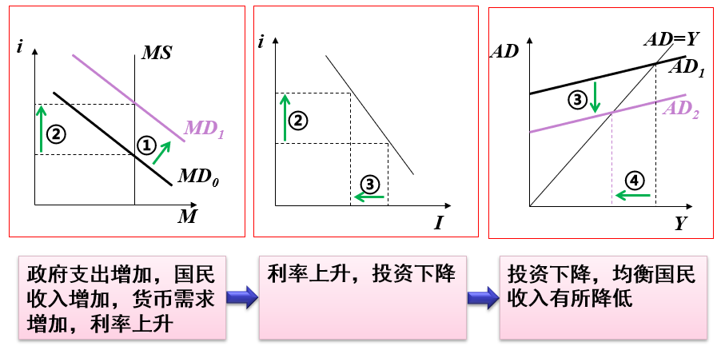
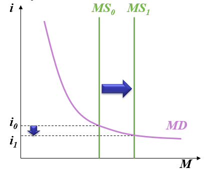
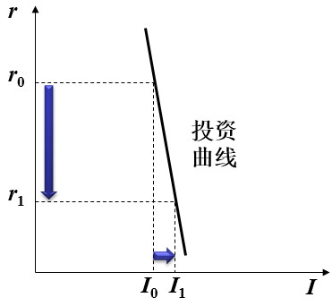
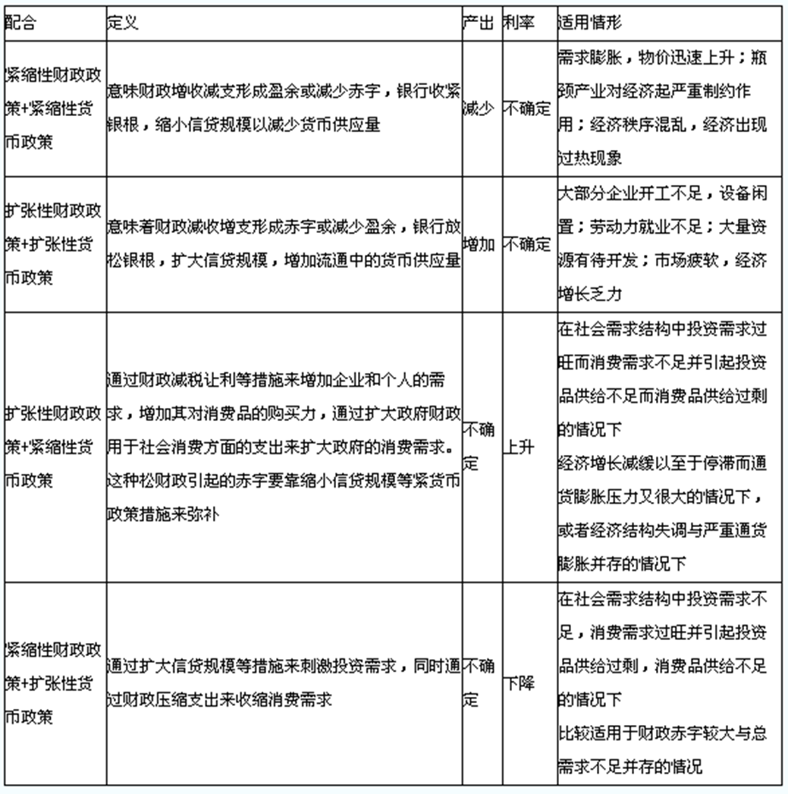

# 西方经济学基础8【宏观经济政策】

宏观经济政策的目标：**充分就业、物价稳定、经济增长、国际收支均衡**

宏观经济政策的工具：**需求管理政策**和**供给管理政策**

需求管理政策：通过调节总需求来达到一定政策目标的宏观经济政策工具，包括**财政政策**和**货币政策**

供给管理政策：通过调节总供给来达到一定政策目标的宏观经济政策工具，包括对**劳动力、价格、工资、产量增长等的管理和调节**

## 财政政策

财政政策指政府对政府购买和税收总水平的选择

**扩张性财政政策**：**经济萧条时，增加政府开支，降低税收，可以促进居民消费和投资，从而刺激总需求或总支出，促进国民收入增长**

**紧缩性财政政策**：**经济过热时，缩减政府开支，增加税收，可以抑制总需求，减少国民收入，实现平稳“着陆”**

运用财政政策有利于维持宏观经济稳定

财政政策也会出现问题，比如：

* 财政赤字：财政支出大于财政收入形成的差额
    $$
    财政赤字率=\frac{财政赤字}{GDP} * 100 \%
    $$

* 挤出效应

    当**政府支出增加或税收减少时，货币需求会增加**；在**货币供给既定情况下，利率会升高，私人投资受到抑制**，产生**政府支出挤出私人投资的现象**

    如果不加平衡，扩张性财政政策会导致很大的挤出效应，影响市场

    挤出效应会降低财政政策的有效应，这是扩张性财政政策内禀的“负反馈”

    

    当资源充分利用（充分就业）时，财政政策存在**完全的挤出效应**——**政府支出增加使价格水平上升，消费下降，国民收入并没有增加**

* 时滞

    财政政策的制定需要一段时间，从颁布到执行（一直到资金真正下达到经济实体）的确需要很长时间。不像货币政策，利率调整一夜之间就可以完成。财政政策，尤其是支出政策时滞比较长，甚至能达到1年以上。

    如果决策者可以找到一种避免某些时滞的方法，经济就会较为稳定

### 自动稳定器

自动稳定器指在**经济进入衰退时，决策者不必采取任何有意的行动就可以刺激总需求的财政政策变动**

最重要的自动稳定器是**税收**。经济萧条时，税收自动减少，可支配收入下降比收入下降的幅度小，从而消费支出下降的幅度也会小一些

**政府支出**也可以作为自动稳定器发挥作用。经济萧条时，失业人数增加，有条件领取失业救济金和其他福利费的人数增加，这可以抑制人们可支配收入下降，进而抑制消费需求下降

但是**仅靠自动稳定器不能完全防止衰退，还需要政府的干预**

## 货币政策

**货币政策**指中央银行通过**控制货币供应量**来调节利率进而影响投资和整个经济以达到一定经济目标的经济政策

央行 三大武器：**公开市场业务、再贴现率、法定准备金率**

**扩张性货币政策**：央行买进有价证券（增加货币供给）、调低再贴现率（促进商业银行向央行贷款）、降低法定准备金率（商业银行可以更多放贷以增加货币供给）

**紧缩性货币政策**：央行卖出有价证券（减少货币供给）、调高再贴现率（减少商业银行向央行的贷款）、提高法定准备金率（减少商业银行的可放贷资金）

扩张性货币政策思路是增加货币供给，从而让市场利率降低，促进消费和投资，扩大总需求来增加国民收入，用于经济萧条时；紧缩性货币政策思路是减少货币供给，提高市场利率，抑制消费和投资，降低总需求来减少国民收入

**当存在过剩生产能力时，货币供给增加一般会刺激经济，使产出水平提高**

和财政政策一样，只有在资源未充分利用、存在失业，或者说有效需求不足时，需求管理政策才能起作用

### 货币政策的有效性

货币政策有效性的决定性因素包括：**货币需求弹性、投资对利率多少敏感性、乘数的大小**

当货币需求曲线弹性很大时（比较平坦），货币供给增加对利率的影响很小，这被称为**流动性陷阱**

当投资曲线弹性很小时（比较陡峭），利率下降对投资的影响很小

## 财政政策和货币政策的搭配

需求管理政策包括财政政策和货币政策

**一般我们说“宏观调控”，指的主要就是财政政策和货币政策**

其特性包括：可操作性强、起效快；但是绝大多数情况下治标不治本，效力短，只能在短期内刺激和稳定经济，不能解决长期经济增长问题

现在推出供给管理政策，强调从供给角度，通过税收政策、人力政策、技术发展政策、中小企业扶持政策、产业结构调整政策等方式使经济自身增加供给

**促进长期经济增长才是经济发展的治本之道**

不过这个方式也有缺点：*存在滞后效应，只能解决远虑，不能解近忧*